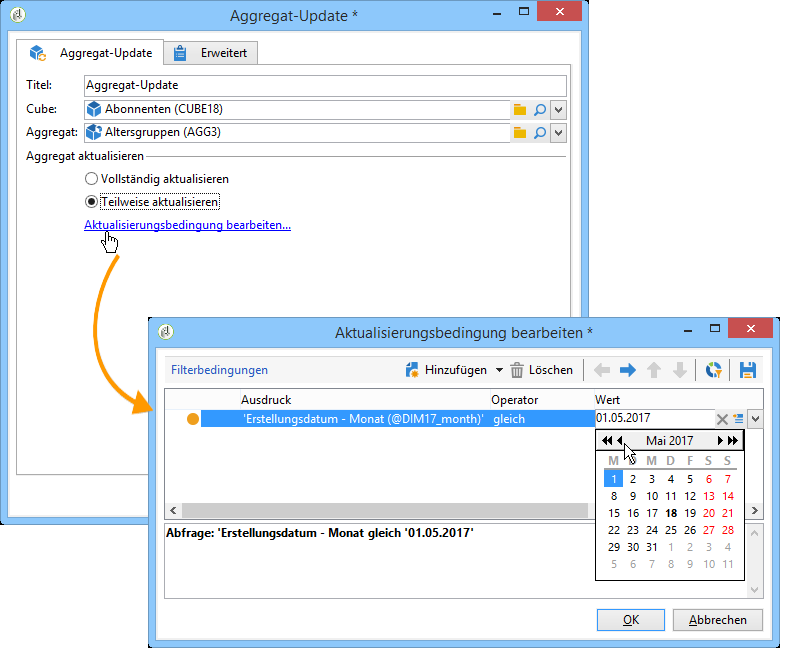
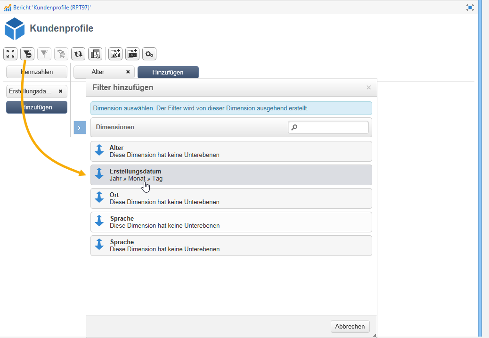

# Bewährte Verfahren für Würfel{#concepts-and-methodology}

## Daten klassieren {#data-binning}

Eine Klassierung ermöglicht die Vereinfachung der Datenanzeige, indem die Werte nach bestimmten Kriterien gruppiert werden. Entsprechend den zur Verfügung stehenden Informationen können Sie Altersgruppen definieren, E-Mail-Domains gruppieren, auf eine Werteauflistung beschränken, die anzuzeigenden Werte explizit beschränken und alle anderen in einer dedizierten Spalte oder Zeile gruppieren etc.

Insgesamt sind drei Klassierungstypen möglich:

1. Verwenden von manuell definierten Wertebereichen. z. B. Alter, durchschnittlicher Warenkorb, Anzahl der geöffneten Lieferungen usw.). For more on this, refer to [Defining each bin](#defining-each-bin).
1. Dynamisch, abhängig von den Werten einer Aufzählung: nur die in der Aufzählung enthaltenen Werte anzeigen, werden alle anderen Werte in &quot;Sonstige&quot;gruppiert. Weitere Informationen finden Sie unter [Dynamisches Verwalten von Ablagen](#dynamically-managing-bins).
1. Mithilfe von Wertebereichen werden alle anderen Bereiche gruppiert. Zum Beispiel 18- bis 25-Jährige, 26- bis 59-Jährige und die anderen. For more on this, refer to [Creating value ranges](#creating-value-ranges).

Um die Klassierung zu aktivieren, kreuzen Sie die entsprechende Option bei der Erstellung der Dimension an.

Sie können jede Klasse manuell erstellen oder sie mit einer existierenden Auflistung verknüpfen.

Adobe Campaign bietet zudem einen Assistenten, um die Klassen automatisch zu erzeugen: Die Werte können in n Klassen verteilt oder nach den am häufigsten in der Datenbank vertretenen Werten gruppiert werden.

### Klassen manuell definieren {#defining-each-bin}

To create each bin individually, select the **[!UICONTROL Define each bin]** option and use the table to create the various bins.

Click the **[!UICONTROL Add]** button to create a new bin and list the values which will be grouped into the bin.

Im unten stehenden Beispiel werden Sprachen in drei Gruppen verteilt: Englisch-Deutsch-Niederländisch, Französisch-Italienisch-Spanisch und Sonstige.

Sie können eine SQL-Maske verwenden, um mehrere Werte zu einem Filter zu kombinieren. Markieren Sie dazu **[!UICONTROL Yes]** die **[!UICONTROL Use an SQL mask]** Spalte und geben Sie den SQL-Filter ein, der in der **[!UICONTROL Value or expression]** Spalte angewendet werden soll.

Im unten stehenden Beispiel werden alle mit **yahoo** (yahoo.de, yahoo.com, yahoo.co.uk etc.) oder **ymail** (ymail.com, ymail.eu etc.) beginnenden Domains unter dem Titel **YAHOO!** gruppiert, ebenso wie Adressen der Domain **rocketmail.com**.

### Klassen dynamisch verwalten {#dynamically-managing-bins}

Die Werte können über Auflistungen dynamisch verwaltet werden. So werden nur die in der Auflistung enthaltenen Werte angezeigt. Bei Änderung der Auflistungswerte wird der Cube-Inhalt automatisch angepasst.

Gehen Sie wie folgt vor, um diesen Klassierungstyp zu erstellen:

1. Erstellen Sie eine neue Dimension und aktivieren Sie die Klassierung.
1. Wählen Sie die **[!UICONTROL Dynamically link the values to an enumeration]** Option und dann die entsprechende Aufzählung aus.

   

   Bei Aktualisierung der Auflistungswerte werden die Klassen automatisch angepasst, ohne benutzerseitige Intervention.

### Wertebereiche anzeigen {#creating-value-ranges}

Sie können die Werte nach benutzerdefinierten Intervallen gruppieren.

Um Bereiche manuell zu definieren, klicken Sie auf die **[!UICONTROL Add]** Schaltfläche und wählen Sie **[!UICONTROL Define a range]** :

Geben Sie anschließend die oberen und unteren Grenzwerte an und klicken Sie zur Bestätigung auf **[!UICONTROL Ok]**.

### Klassen automatisch erzeugen {#generating-bins-automatically}

Es ist auch möglich, Ablagen automatisch zu generieren. To do this, click the **[!UICONTROL Generate bins...]** link.

Sie können

* die am häufigsten vertretenen Werte abrufen:

   Im oben stehenden Beispiel werden die am häufigsten vertretenen Werte angezeigt. Die übrigen Werte werden gezählt und unter dem Titel &#39;Sonstige&#39; zusammengefasst.

* Klassen in Form von Bereichen erzeugen:

   Im oben stehenden Beispiel erstellt Adobe Campaign zur Anzeige der Datenbank-Werte automatisch vier Wertebereiche der gleichen Größe.

In diesem Fall wird der im Faktenschema gewählte Filter ignoriert.

### Auflistungen {#enumerations}

Zur Erhöhung der Lesbarkeit und Relevanz von Berichten bietet Adobe Campaign die Möglichkeit, spezifische Auflistungen zu erstellen, um unterschiedliche Werte in ein und derselben Klasse zu gruppieren. Diese der Klassierung vorbehaltenen Auflistungen können in Cubes referenziert und in Berichten angezeigt werden.

Auf diese Weise bietet Adobe Campaign eine Auflistung von Domains, mithilfe derer sich die Liste der nach ISP gruppierten E-Mail-Domains von allen Datenbankkontakten wie im unten stehenden Beispiel anzeigen lässt:

Diese Auflistung ist nach folgendem Modell gestaltet:

Um einen Bericht mit dieser Aufzählung zu erstellen, erstellen Sie einen Würfel mit der **[!UICONTROL Email domain]** Dimension. Wählen Sie dann die **[!UICONTROL Enable binning]** Option **[!UICONTROL Dynamically link the values to an enumeration]**. Wählen Sie dann wie oben gezeigt die **Domänenaufzählung** aus. Alle Werte ohne angegebenen Alias werden unter der **Beschriftung &quot;Sonstige** &quot;gruppiert.

Erstellen Sie anschließend einen auf diesem Cube basierenden Bericht, um die Werte anzuzeigen.

Dabei genügt es, die Auflistung abzuändern, um den entsprechenden Bericht zu aktualisieren. Erstellen Sie beispielsweise den Wert **Adobe** und fügen Sie auf Auflistungsniveau den Alias **adobe.com** hinzu: Der Bericht wird automatisch mit dem Wert Adobe aktualisiert.

Die **[!UICONTROL Domains]** Aufzählung wird verwendet, um integrierte Berichte zu generieren, die die Liste der Domänen anzeigen. Um den Inhalt dieser Berichte anzupassen, können Sie diese Liste bearbeiten.

Sie können weitere, der Klassierung vorbehaltene Auflistungen erstellen und diese in anderen Cubes verwenden: Alle Alias-Werte werden in den im ersten Tab der Auflistung definierten Klassen gruppiert.

## Aggregate berechnen und verwenden {#calculating-and-using-aggregates}

Cubes bieten die Möglichkeit, Daten vor der eigentlichen Verwendung zu aggregieren.

Diese Vorgehensweise empfiehlt sich insbesondere bei der Verarbeitung von großen Datenvolumen. Aggregate werden automatisch entsprechend den in der dedizierten Workflow-Aktivität definierten Parametern aktualisiert, damit neu abgerufene Daten bei der Kennzahlenberechnung berücksichtigt werden können.

Aggregate werden im entsprechenden Tab des Cubes definiert.

>[!NOTE]
>
>Der Workflow zur Aggregat-Aktualisierung kann im Aggregat selbst konfiguriert werden. Es besteht jedoch auch die Möglichkeit, das Aggregat über einen externen Workflow zu aktualisieren, in welchem der entsprechende Cube referenziert wird.

Gehen Sie wie folgt vor, um ein neues Aggregat zu erstellen:

1. Click the **[!UICONTROL Aggregates]** tab of the cube, then click the **[!UICONTROL Add]** button.

   

1. Benennen Sie das Aggregat und fügen Sie die zu berechnenden Dimensionen hinzu.

   

1. Wählen Sie die Dimension sowie deren Ebene aus. Wiederholen Sie diesen Vorgang für alle zu berechnenden Dimensionen und Ebenen.
1. Gehen Sie in den Tab **[!UICONTROL Workflow]**, um den Aggregations-Workflow zu erstellen.

   

   * The **[!UICONTROL Scheduler]** activity lets you define the frequency of calculation updates. Der Zeitplan ist in [diesem Abschnitt](../../workflow/using/scheduler.md)ausführlich beschrieben.
   * The **[!UICONTROL Aggregate update]** activity lets you select the update mode which you want to apply: full or partial.

      Standardmäßig wird das Aggregat bei jeder Ausführung vollständig aktualisiert. Bei Auswahl der teilweisen Aktualisierung sind mithilfe des entsprechenden Links die Aktualisierungsbedingungen zu definieren.

      

## Kennzahlen definieren {#defining-measures}

Die Arten von Maßnahmen werden auf der **[!UICONTROL Measures]** Registerkarte des Würfels definiert. Sie können Summen, Durchschnittswerte, Abweichungen usw. berechnen.

Sie können so viele Maßnahmen wie nötig erstellen: wählen Sie dann den Maßstab aus, den Sie in der Tabelle ein- oder ausblenden möchten. Weitere Informationen finden Sie unter [Kennzahlen anzeigen](#displaying-measures).

Gehen Sie wie folgt vor, um eine neue Kennzahl zu definieren:

1. Click the **[!UICONTROL Add]** button above the list of measures and select the type of measure and the formula to be calculated.

   

1. Wählen Sie je nach gewählter Funktion den Ausdruck aus, auf den sich die Berechnung bezieht.

   Über die **[!UICONTROL Advanced selection]** Schaltfläche können Sie komplexe Berechnungsformeln erstellen. Weiterführende Informationen hierzu finden Sie in [diesem Abschnitt](../../platform/using/about-queries-in-campaign.md).

   

1. The **[!UICONTROL Filter the measure data...]** link lets you restrict the calculation field and only apply it to specific data in the database.

   

1. Enter the label of the measure and add a description, then click **[!UICONTROL Finish]** to create it.

## Kennzahlen anzeigen {#displaying-measures}

Die Anzeige der Kennzahlen in der Tabelle kann nach Bedarf konfiguriert werden. Folgende Parameter sind verfügbar:

* the display sequence of measures (refer to [Display sequence](#display-sequence)),
* the information to show/hide in the report (refer to [Configuring the display](#configuring-the-display))
* welche Maßnahmen angezeigt werden: Prozent, insgesamt, Anzahl der Dezimalstellen usw. (siehe [Ändern des angezeigten](#changing-the-type-of-measure-displayed)Maßtyps).

### Anzeigereihenfolge {#display-sequence}

The measures calculated in the cube are configured via the **[!UICONTROL Measures]** button.

Ihre Anzeigereihenfolge kann durch Verschieben der Zeilen geändert werden. Im nachstehenden Beispiel werden die auf Deutschland bezogenen Daten nach unten verschoben: Sie werden nun in der letzten Spalte angezeigt.

### Anzeige konfigurieren {#configuring-the-display}

Die Konfiguration der angezeigten Kennzahlen, Zeilen und Spalten kann für jede Kennzahl einzeln oder global durchgeführt werden. Ein spezifisches Symbol ermöglicht den Zugriff auf die Auswahl der Anzeigemodi.

* Klicken Sie auf das **[!UICONTROL Edit the configuration of the pivot table]** Symbol, um das Konfigurationsfenster aufzurufen.

   Sie können bestimmen, ob die Kennzahlen in Zeilen oder Spalten angezeigt und ob ihre Titel ein- oder ausgeblendet werden sollen.

Mithilfe der Farbwahl können die wichtigsten Werte visuell hervorgehoben werden, um die Lesbarkeit der Daten zu verbessern.

### Änderung des angezeigten Kennzahlentyps {#changing-the-type-of-measure-displayed}

Sie können für jede Kennzahl die anzuwendende Einheit und Formatierung festlegen.

## Berichte freigeben {#sharing-a-report}

Nach der Konfiguration des Berichts können Sie diesen beibehalten und gegebenenfalls mit anderen Benutzern teilen.

Klicken Sie dazu auf das **[!UICONTROL Show the report properties]** Symbol und aktivieren Sie die **[!UICONTROL Share this report]** Option.

Geben Sie die Kategorie, der der Bericht angehört, und seine Relevanz an. Weiterführende Informationen dazu finden Sie auf [dieser Seite](../../reporting/using/configuring-access-to-the-report.md#report-display-context) in den Abschnitten **Anzeigereihenfolge** und **Filteroptionen definieren**.

Um die Änderungen zu bestätigen, muss der Bericht gespeichert werden.

## Filter erstellen {#creating-filters}

Sie können Filter erstellen, um nur einen Teil der Daten anzuzeigen.

Gehen Sie dazu wie folgt vor:

1. Click the **[!UICONTROL Add a filter]** icon.

   

1. Wählen Sie die Dimension, auf die sich der Filter bezieht.

   

1. Wählen Sie den anzuwendenden Filtertyp und geben Sie seine Genauigkeit an.

   

1. Nach seiner Erstellung steht der Filter oberhalb des Berichts zur Verfügung.

   

   Klicken Sie auf den Filter, um ihn zu bearbeiten.

   Klicken Sie auf das Kreuz, um den Filter zu löschen.

   Alle Filter werden nebeneinander angezeigt. Ihre Anzahl ist unbegrenzt.

   

Klicken Sie nach jeder Hinzufügung, Änderung oder Löschung von Filtern auf den Pfeil, um die Berechnung neu zu starten.

Filter können auch basierend auf einer Auswahl erstellt werden. Wählen Sie dazu die Quellzellen, Linien und Spalten aus und klicken Sie dann auf das **[!UICONTROL Add a filter]** Symbol.

Um eine Zeile, Spalte oder Zelle auszuwählen, klicken Sie diese mit der linken Maustaste an. Klicken Sie ein zweites Mal, um sie wieder abzuwählen.

Der Filter wird automatisch angewendet und in der Filterzone oberhalb des Berichts hinzugefügt.

