# Konfigurieren des Zugriffs auf den Bericht{#configuring-access-to-the-report}

## Anzeigekontext von Berichten {#report-display-context}

Definieren Sie den Anzeigekontext des Berichts mithilfe der Registerkarte **[!UICONTROL Anzeige]** in der Adobe Campaign-Plattform.Der Zugriff auf einen Bericht hängt von Auswahltyp, Anzeigebedingungen und Zugriffsberechtigungen ab.

### Auswahltyp {#selection-type}

Der Zugriff auf den Bericht kann auf einen bestimmten Kontext oder eine bestimmte Platzierung beschränkt werden, beispielsweise einen Versand, eine Empfängerin bzw. einen Empfänger, eine Auswahl an Empfangenden usw. Dieser Zugriff wird im Abschnitt **[!UICONTROL Auswahltyp]** auf der Registerkarte **[!UICONTROL Anzeige]** konfiguriert.

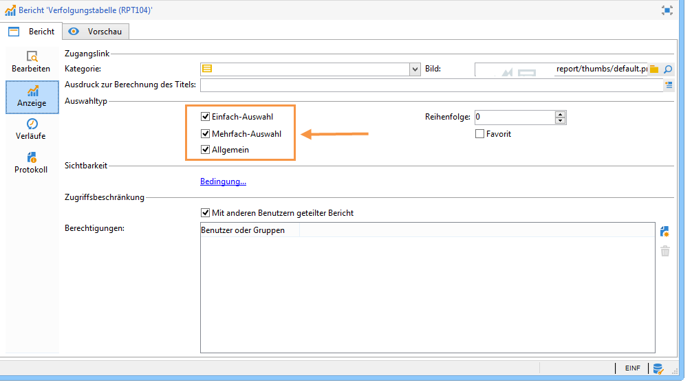

* **[!UICONTROL Einfach-Auswahl]**: Der Bericht ist nur bei Auswahl einer bestimmten Entität zugänglich.
* **[!UICONTROL Mehrfach-Auswahl]**: Der Bericht ist bei Auswahl mehrerer Entitäten zugänglich.
* **[!UICONTROL Allgemein]**: Der Bericht ist über die Liste der verfügbaren Berichte im Tab **[!UICONTROL Berichte]** zugänglich.

### Anzeigereihenfolge {#display-sequence}

Das Feld **[!UICONTROL Reihenfolge]** ermöglicht die Auswahl eines numerischen Wertes, der die Anzeigereihenfolge des Berichts in der Liste festlegt.

Die Berichte werden standardmäßig anhand dieses Feldes nach Relevanz geordnet. Der Bericht mit dem höchsten Wert gilt als am relevantesten.

Sie können eine beliebige Skala verwenden, zum Beispiel von 1 bis 10, von 0 bis 100 oder von -10 bis 10.

### Anzeigebedingungen {#display-conditions}

Die Anzeige des Berichts kann auch mittels einer Abfrage an Bedingungen geknüpft werden.

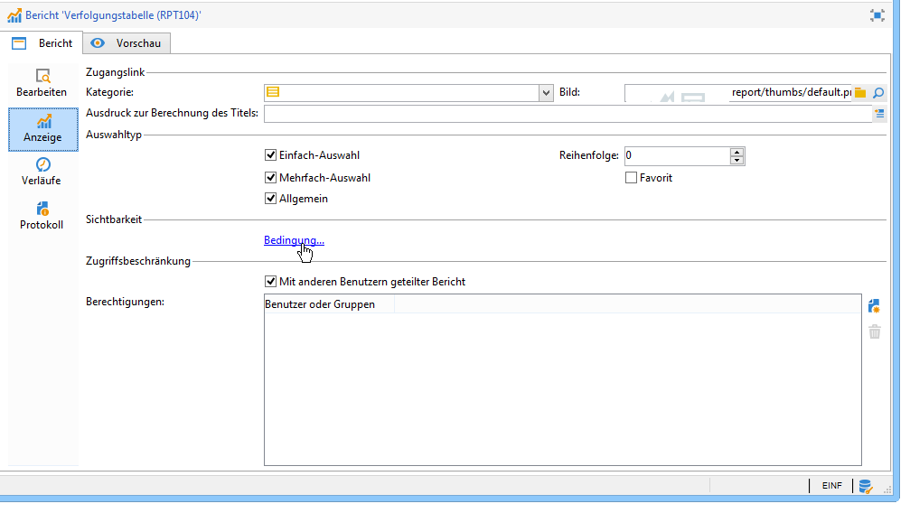

Im unten stehenden Beispiel ist die Anzeigebedingung, dass der Hauptkanal der Kampagne E-Mail ist.

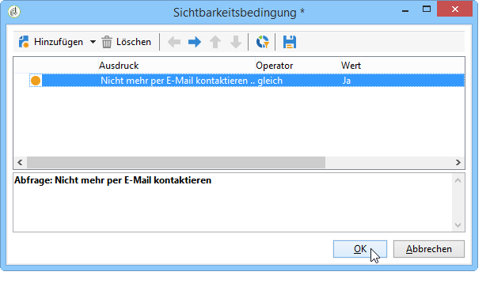

Wenn es sich beim Hauptkanal der Kampagne um Briefpost handelt, wird der Bericht nicht in den Berichten der Kampagne verfügbar sein.

### Zugriffsberechtigung {#access-authorization}

Es besteht die Möglichkeit, den Bericht mit anderen Benutzern zu teilen.

Um den Zugriff auf einen Bericht zu ermöglichen, wählen Sie die Option **[!UICONTROL Mit anderen Benutzern geteilter Bericht]** aus. Wenn diese Option nicht ausgewählt ist, kann nur die Erstellerin bzw. der Ersteller des Berichts auf diesen zugreifen.

Der Bericht kann auch mit bestimmten Benutzern oder Benutzergruppen geteilt werden, indem sie im Bereich der Berechtigungen hinzugefügt werden.

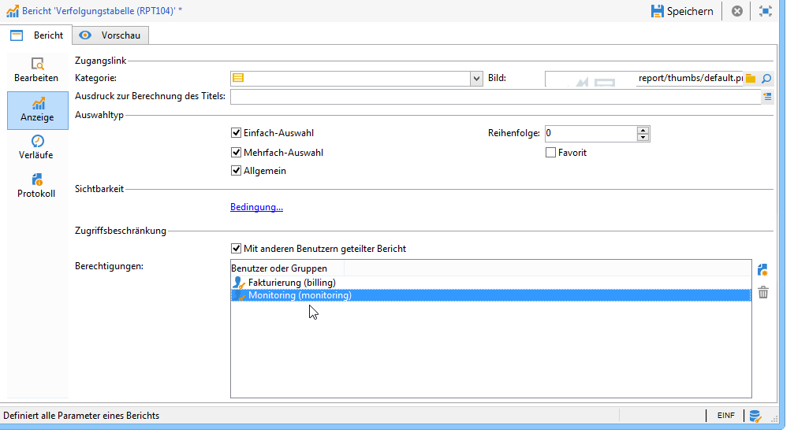

### Definieren der Filteroptionen {#defining-the-filtering-options}

Im Tab **[!UICONTROL Berichte]** werden alle in der Plattform verfügbaren Berichte anzeigt, auf die der angemeldete Benutzer Zugriff hat.

Sie werden standardmäßig nach Relevanz sortiert, es stehen jedoch andere Filtertypen zur Verfügung: nach Alphabet, Alter etc.

Sie können die Anzeige auch nach den Berichtkategorien filtern:

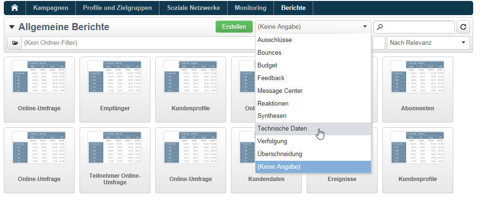

Um einen Bericht einer Kategorie zuzuordnen, wählen Sie diese im Tab **[!UICONTROL Anzeige]** wie im nachstehenden Beispiel aus:

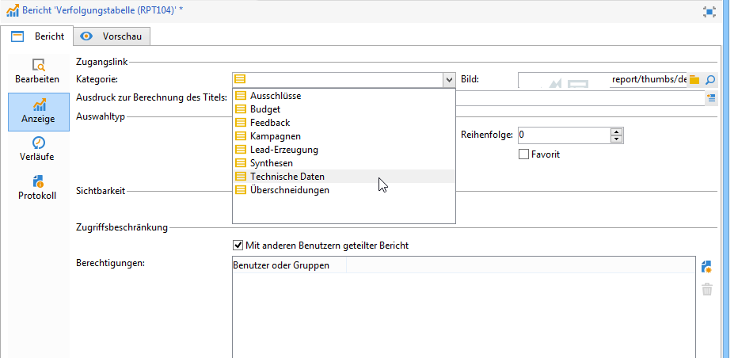

Sie können hier eine neue Kategorie eingeben und sie zur Liste der verfügbaren Kategorien hinzufügen. Die entsprechende Auflistung wird automatisch aktualisiert.

## Erstellen eines Links zu einem Bericht {#creating-a-link-to-a-report-}

Sie können einen Bericht über einen spezifischen Knoten im Navigationsbaum wie eine Liste, einen Empfänger, einen Versand o. Ä. zugänglich machen. Erstellen Sie hierzu einfach eine Verknüpfung zum betreffenden Bericht und geben Sie die Entität an, in der dieser verfügbar gemacht werden soll.

Als Beispiel wird im Folgenden eine Verknüpfung eines Berichts zu einer Empfängerliste erstellt.

1. Klicken Sie auf **[!UICONTROL Neu]** und wählen Sie **[!UICONTROL Existierenden Bericht verknüpfen]** im Berichterstellungs-Assistenten aus.

   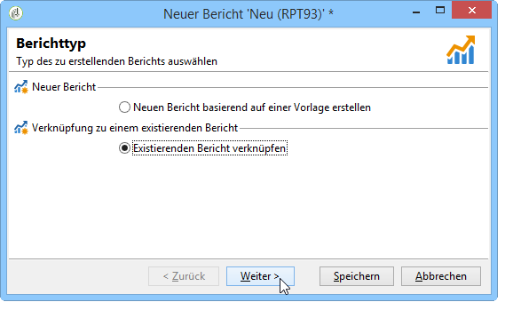

1. Wählen Sie mithilfe der Dropdown-Liste den Bericht aus, für den Sie eine Verknüpfung erstellen möchten. Im vorliegenden Beispiel wird der Bericht **Kunden/Interessenten pro Land** gewählt.

   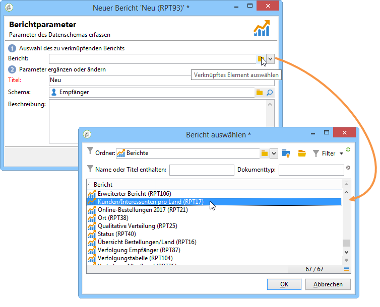

1. Geben Sie einen Titel ein und wählen Sie das Schema aus. In diesem Beispiel wählen wir die Tabelle mit der Liste der Empfängerinnen und Empfänger aus.

   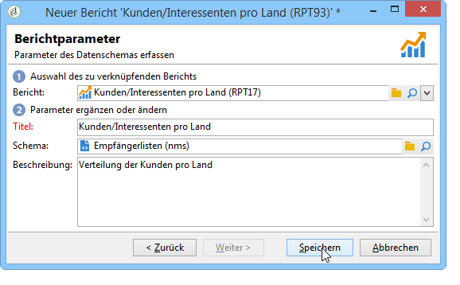

   Dies bedeutet, dass der Bericht von jeder Empfängerliste aus zugänglich sein wird und die Statistiken basierend auf den in der markierten Liste enthaltenen Empfängern berechnet werden.

1. Speichern Sie den Bericht und öffnen Sie ihn.
1. Geben Sie den Verbindungsschlüssel ein. In diesem Fall handelt es sich um den Fremdschlüssel der Verbindung „Ordner“.

   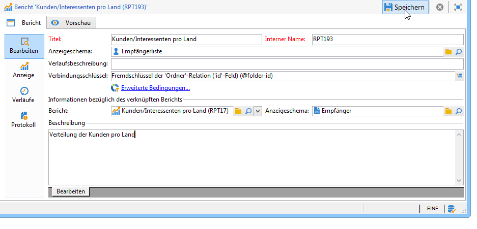

1. Veröffentlichen Sie Ihren Bericht.
1. Öffnen Sie eine Ihrer Listen und klicken Sie auf den Tab **[!UICONTROL Berichte]**: Der zuvor erstellte Bericht ist nun verfügbar.

   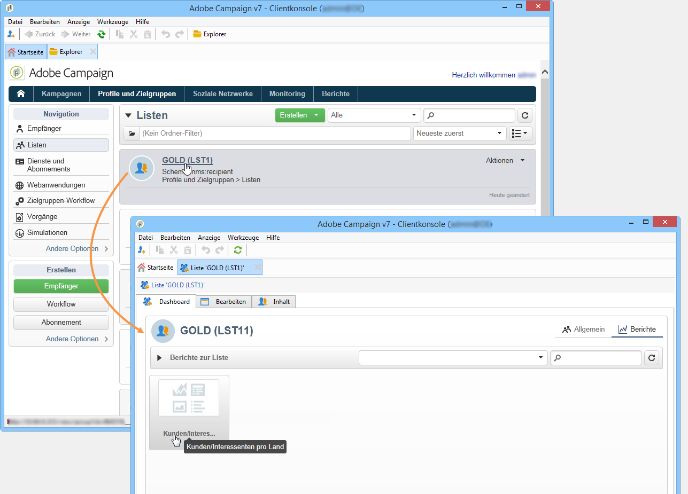

## Berichtvorschau {#preview-of-the-report}

Bevor Sie Ihren Bericht veröffentlichen, stellen Sie im Tab **[!UICONTROL Vorschau]** sicher, dass er korrekt angezeigt wird.

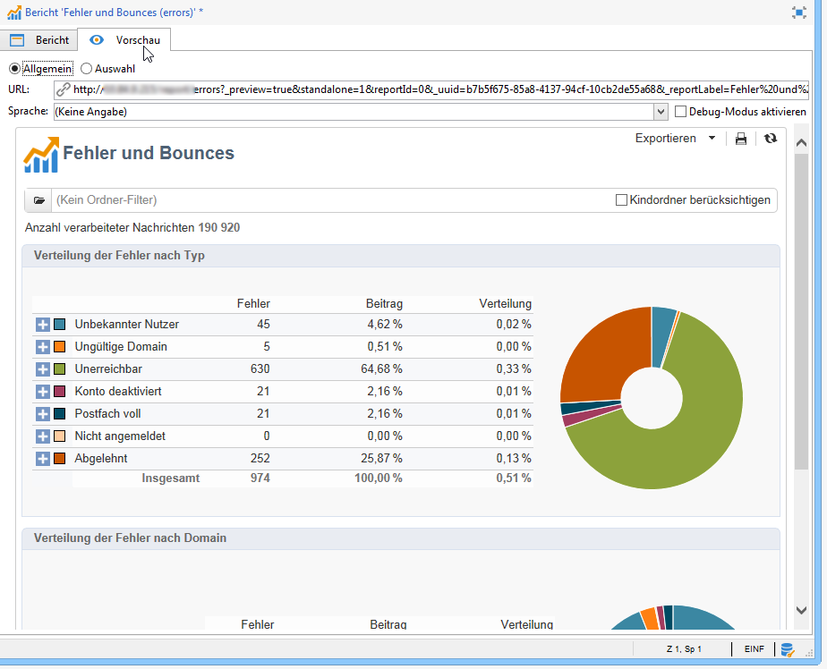

Wählen Sie entsprechend den Anzeigeparametern des Berichts zwischen den Optionen **[!UICONTROL Global]** und **[!UICONTROL Auswahl]**.

Diese beiden Optionen werden entsprechend den Anzeigeeinstellungen des Berichts ausgewählt. Wenn der gewählte Anzeigeparameter **[!UICONTROL Global]** ist, wählen Sie die gleichnamige Vorschauoption.**** Wenn die Anzeigeeinstellungen **[!UICONTROL Einzelauswahl]** oder **[!UICONTROL Mehrfachauswahl]**, die **[!UICONTROL Auswahl]** Die Vorschauoption muss ausgewählt sein.

Weitere Informationen hierzu finden Sie unter [Anzeigekontext von Berichten](#report-display-context).

Es stehen zudem Parameter zur Verfügung, die eine Kontrolle der Fehler ermöglicht. Der Parameter **_uuid** ist Teil der URL des Berichts. Sie können ihm die Parameter **&amp;_preview** oder **&amp;_debug** hinzufügen.

Die Funktionsweise dieser Parameter wird im Abschnitt zur Definition von **Webformular-Eigenschaften** des Kapitels [Webformulare](../../web/using/about-web-forms.md) beschrieben.

## Veröffentlichen des Berichts {#publishing-the-report}

Das Veröffentlichen des Berichts ist obligatorisch, wenn Sie ihn mit anderen Benutzern teilen und in der Liste der verfügbaren Berichte anzeigen möchten (siehe auch [Anzeigekontext von Berichten](#report-display-context)). Dieser Vorgang muss bei jeder Änderung des Berichts erneut durchgeführt werden.

1. Öffnen Sie den Publikationsassistenten durch Klicken auf **[!UICONTROL Publizieren]** in der Symbolleiste.

   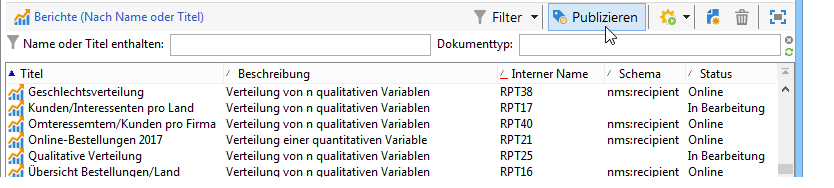

1. Klicken Sie auf **[!UICONTROL Starten]**, um die Veröffentlichung zu beginnen.

   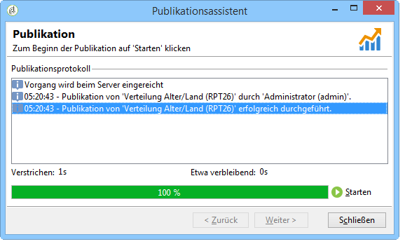

1. Der Bericht wird daraufhin in der Rubrik **[!UICONTROL Berichte]** verfügbar.
