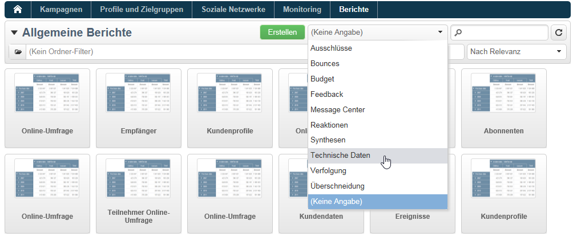

# Berichtanzeige konfigurieren{#configuring-access-to-the-report}

## Anzeigekontext von Berichten {#report-display-context}

Legen Sie im Tab **[!UICONTROL Anzeige]** den Anzeigekontext des Berichts in der Adobe-Campaign-Plattform fest. Der Zugriff auf den Bericht hängt von seinem Auswahltyp, seinen Anzeigebedingungen und den Zugriffsberechtigungen ab.

### Auswahltyp {#selection-type}

Der Zugriff auf den Bericht kann auf einen bestimmten Kontext oder eine Platzierung beschränkt werden, zum Beispiel einen Versand, einen einzelnen oder eine Auswahl von Empfängern etc. Dieser Zugriff wird im Abschnitt **[!UICONTROL Auswahltyp]** des **[!UICONTROL Anzeige]**-Tabs konfiguriert.

* **[!UICONTROL Einfach-Auswahl]**: Der Bericht ist nur bei Auswahl einer bestimmten Entität zugänglich.
* **[!UICONTROL Mehrfach-Auswahl]**: Der Bericht ist bei Auswahl mehrerer Entitäten zugänglich.
* **[!UICONTROL Allgemein]**: Der Bericht ist über die Liste der verfügbaren Berichte in der Berichte-Rubrik zugänglich.

### Anzeigereihenfolge {#display-sequence}

Das Feld **[!UICONTROL Reihenfolge]** ermöglicht die Auswahl eines numerischen Wertes, der die Anzeigereihenfolge des Berichts in der Liste festlegt.

Die Berichte werden standardmäßig anhand dieses Feldes nach Relevanz geordnet. Der Bericht mit dem höchsten Wert gilt als am relevantesten.

Sie können eine beliebige Skala verwenden, zum Beispiel von 1 bis 10, von 0 bis 100 oder von -10 bis 10.

### Anzeigebedingungen {#display-conditions}

Die Anzeige des Berichts kann auch mittels einer Abfrage an Bedingungen geknüpft werden.

Im unten stehenden Beispiel ist die Anzeigebedingung, dass der Hauptkanal der Kampagne E-Mail ist.

Wenn es sich beim Hauptkanal der Kampagne um Briefpost handelt, wird der Bericht nicht in den Berichten der Kampagne verfügbar sein.

### Zugriffsberechtigung {#access-authorization}

Es besteht die Möglichkeit, den Bericht mit anderen Benutzern zu teilen.

Aktivieren Sie die Option **[!UICONTROL Mit anderen Benutzern geteilter Bericht]**, um den Bericht zugänglich zu machen. Bei Nicht-Aktivieren der Option kann nur der Benutzer, der den Bericht erstellt hat, auf den Bericht zugreifen.

Der Bericht kann auch mit bestimmten Benutzern oder Benutzergruppen geteilt werden, indem sie im Bereich der Berechtigungen hinzugefügt werden.

### Filteroptionen definieren {#defining-the-filtering-options}

In der Rubrik **[!UICONTROL Berichte]** der Startseite werden alle in der Plattform verfügbaren Berichte anzeigt, auf die der angemeldete Benutzer Zugriff hat.

Sie werden standardmäßig nach Relevanz sortiert, es stehen jedoch andere Filtertypen zur Verfügung: nach Alphabet, Alter etc.

Sie können die Anzeige auch nach den Berichtkategorien filtern:

Um einen Bericht einer Kategorie zuzuordnen, wählen Sie diese im Tab **[!UICONTROL Anzeige]** wie im nachstehenden Beispiel aus:

Sie können eine neue Kategorie erfassen, die dann in die Liste der verfügbaren Kategorien aufgenommen wird. Die entsprechende Auflistung wird automatisch aktualisiert.

## Verknüpfung zu einem Bericht erstellen {#creating-a-link-to-a-report-}

Sie können einen Bericht über einen spezifischen Knoten im Navigationsbaum wie eine Liste, einen Empfänger, einen Versand o. Ä. zugänglich machen. Erstellen Sie hierzu einfach eine Verknüpfung zum betreffenden Bericht und geben Sie die Entität an, in der dieser verfügbar gemacht werden soll.

Als Beispiel wird im Folgenden eine Verknüpfung eines Berichts zu einer Empfängerliste erstellt.

1. Klicken Sie auf **[!UICONTROL Neu]** und wählen Sie **[!UICONTROL Existierenden Bericht verknüpfen]** im Berichterstellungs-Assistenten aus.

   

1. Wählen Sie mithilfe der Dropdown-Liste den Bericht aus, für den Sie eine Verknüpfung erstellen möchten. Im vorliegenden Beispiel wird der Bericht **Kunden/Interessenten pro Land** gewählt.

   

1. Geben Sie den Titel an und wählen Sie das Schema aus. Im Beispiel wird die Tabelle der Empfängerlisten gewählt.

   

   Dies bedeutet, dass der Bericht von jeder Empfängerliste aus zugänglich sein wird und die Statistiken basierend auf den in der markierten Liste enthaltenen Empfängern berechnet werden.

1. Speichern Sie den Bericht und öffnen Sie ihn.
1. Geben Sie den Verbindungsschlüssel an. Im Beispiel handelt es sich um den Fremdschlüssel der &#39;Ordner&#39;-Relation.

   

1. Publizieren Sie Ihren Bericht.
1. Öffnen Sie eine Ihrer Listen und klicken Sie auf den Tab **[!UICONTROL Berichte]**: Der zuvor erstellte Bericht ist nun verfügbar.

   

## Berichtvorschau {#preview-of-the-report}

Bevor Sie Ihren Bericht veröffentlichen, stellen Sie im Tab **[!UICONTROL Vorschau]** sicher, dass er korrekt angezeigt wird.

Wählen Sie entsprechend den Anzeigeparametern des Berichts zwischen den Optionen **[!UICONTROL Global]** und **[!UICONTROL Auswahl]**.

Wenn der gewählte Anzeigeparameter **[!UICONTROL Global]** ist, wählen Sie die gleichnamige Vorschauoption. Wenn der Anzeigeparameter **[!UICONTROL Einfach-Auswahl]** oder **[!UICONTROL Mehrfach-Auswahl]** ist, muss die Vorschauoption **[!UICONTROL Auswahl]** gewählt werden.****

Weitere Informationen hierzu finden Sie unter [Anzeigekontext von Berichten](#report-display-context).

Es stehen zudem Parameter zur Verfügung, die eine Kontrolle der Fehler ermöglicht. Der Parameter **_uuid** ist Teil der URL des Berichts. Sie können ihm die Parameter **&amp;_preview** oder **&amp;_debug** hinzufügen.

Die Funktionsweise dieser Parameter wird im Abschnitt zur Definition von **Webformular-Eigenschaften** des Kapitels [Webformulare](../../web/using/about-web-forms.md) beschrieben.

## Berichtpublikation {#publishing-the-report}

Das Publizieren des Berichts ist obligatorisch, wenn Sie ihn mit anderen Benutzern teilen und in der Liste der verfügbaren Berichte anzeigen möchten (siehe auch [Anzeigekontext von Berichten](#report-display-context)). Dieser Vorgang muss bei jeder Änderung des Berichts erneut durchgeführt werden.

1. Öffnen Sie den Publikationsassistenten durch Klick auf **[!UICONTROL Publizieren]** in der Symbolleiste.

   

1. Klicken Sie auf **[!UICONTROL Starten]**, um die Publikation zu beginnen.

   

1. Der Bericht wird daraufhin in der Rubrik **[!UICONTROL Berichte]** verfügbar.

