# Grafiken erstellen{#creating-a-chart}

Adobe Campaign bietet die Möglichkeit, in der Datenbank verfügbare Daten abzurufen und in Form verschiedener Grafiken darzustellen. Die grundlegenden Konfigurationen hierzu werden im Folgenden beschrieben.

Grafiken werden wie Tabellen direkt in eine Berichtseite eingefügt, über das Kontextmenü oder die Symbolleiste.

## Erstellungsetappen {#creation-steps}

Gehen Sie wie folgt vor, um eine Grafik in einem Bericht zu erstellen:

1. Öffnen Sie die Seite, in der die Grafik angezeigt werden soll, und wählen Sie den Grafiktyp in der Symbolleiste aus.

   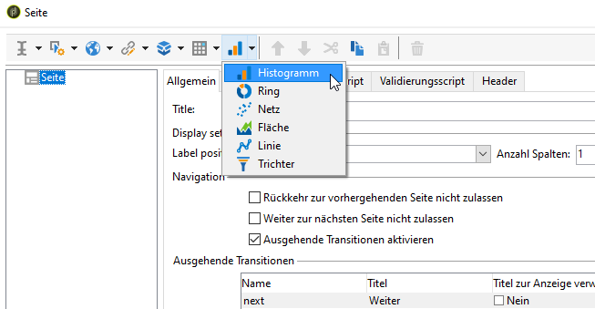

1. Geben Sie den Namen der Grafik sowie die zugeordnete Legende an. Bei Bedarf können Sie die Position der Legende über die entsprechende Dropdown-Liste verändern.

   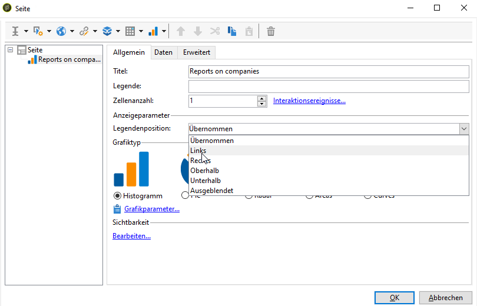

1. Klicken Sie auf den Tab **[!UICONTROL Daten]**, um die Datenquelle sowie die zu berechnenden Serien zu bestimmen.

   Die in der Grafik anzuzeigenden Statistiken können über eine Abfrage oder über Kontextdaten, d. h. die von der eingehenden Transition der betreffenden Seite übertragenen Daten, berechnet werden. Lesen Sie hierzu den Abschnitt [Kontextdaten verwenden](../../reporting/using/using-the-context.md#using-context-data).

   * Klicken Sie auf den Link **[!UICONTROL Daten filtern...]**, um die Kriterien zur Filterung der Daten zu bestimmen.

      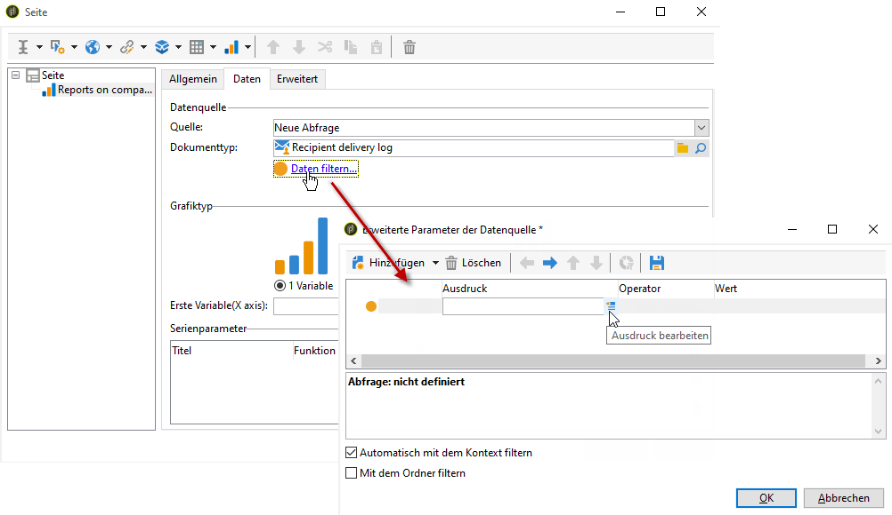

   * Zur Verwendung der Kontextdaten aktivieren Sie die entsprechende Option und klicken Sie auf den Link **[!UICONTROL Erweiterte Parameter...]**. Wählen Sie anschließend die Daten aus, auf die sich die Statistiken beziehen werden.

      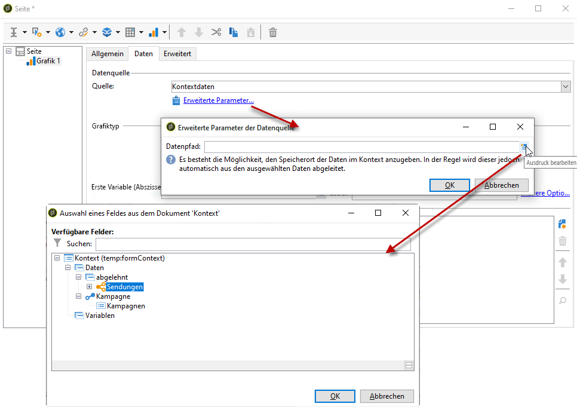

      Sie haben nun auf die Kontextdaten Zugriff, um die in der Grafik anzuzeigenden Werte zu bestimmen:

      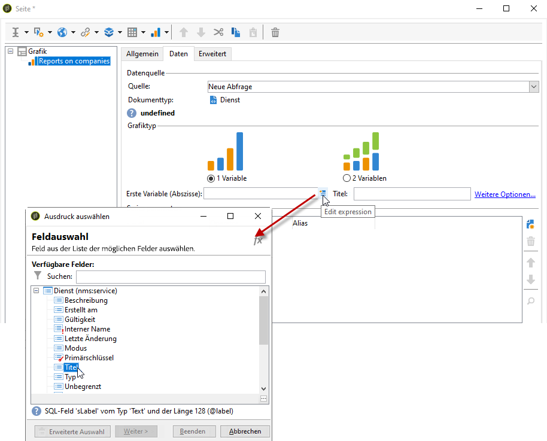

## Grafiktypen und ihre Parameter {#chart-types-and-variants}

Adobe Campaign bietet drei verschiedene grafische Darstellungstypen, die im Nachstehenden vorgestellt werden.

Der Grafiktyp wird beim Einfügen in die Seite ausgewählt.

Er kann im Abschnitt **[!UICONTROL Grafiktyp]** des Tabs **[!UICONTROL Allgemein]** der Grafik geändert werden.

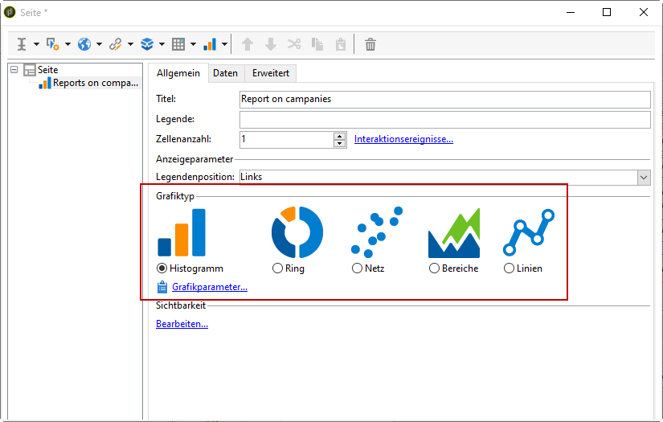

Darüber hinaus stehen je Grafiktyp verschiedene Parameter zur Verfügung. Diese werden über den Link **[!UICONTROL Grafikparameter...]** ausgewählt.

### Verteilung: Kreisdiagramm {#breakdown--pie-charts}

Diese Darstellungsform bietet eine Übersicht der jeweiligen Anteile der gemessenen Elemente.

Die Anzeige in Form von Sektoren beschränkt die Analyse auf eine Variable.

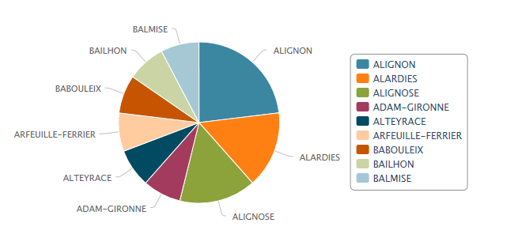

Über den Link **[!UICONTROL Grafikparameter...]** kann das Rendering der Grafik angepasst werden.

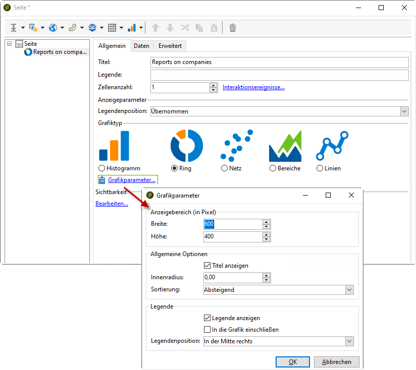

Für eine Darstellung in Form von Sektoren muss zunächst der Wert des inneren Radius im entsprechenden Feld eingegeben werden.

Beispiel:

Ein Wert von 0,00 zeichnet einen ganzen Kreis.

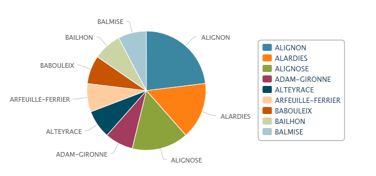

Ein Wert von 0,40 zeichnet einen Kreis mit einem Radius von 40 %.

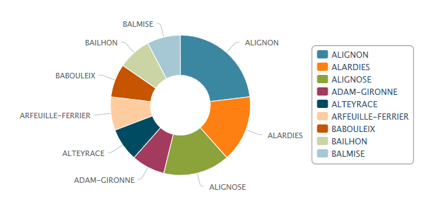

Ein Wert von 1,00 zeichnet nur den äußeren Ring des Kreises.

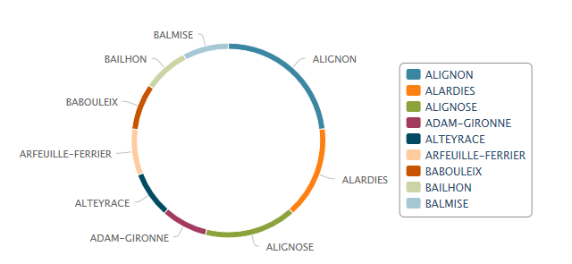

### Entwicklung: Kurven und Flächen {#evolution--curves-and-areas}

Diese grafische Darstellungsform zeigt die Entwicklung einer oder mehrerer Messungen über einen Zeitraum hinweg.

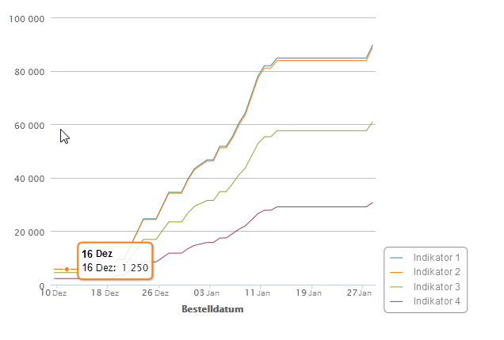

### Vergleich: Histogramme {#comparison--histograms}

Histogramme ermöglichen den Vergleich unterschiedlicher Werte von einer oder zwei Variablen.

Für diese Art von Grafik stehen folgende Optionen im Fenster **[!UICONTROL Grafikparameter]** zur Verfügung:

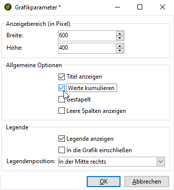

Aktivieren Sie die Option **[!UICONTROL Legende anzeigen]**, damit die Legende mit der Grafik angezeigt wird. Daraufhin kann ihre Position bestimmt werden:

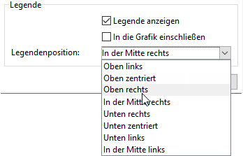

Wenn sich die Werte dazu eignen, können Sie sie stapeln.

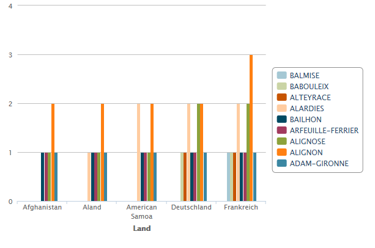

Bei Bedarf können Sie die Anzeigereihenfolge der Werte umkehren. Aktivieren Sie hierzu die Option **[!UICONTROL Umgekehrte Stapelung]**.

### Konversion: Trichter {#conversion--funnel}

Diese Art von Grafik zeigt die Konversionsrate der gemessenen Elemente.

### Fortschritt: Tacho {#progress--gauge}

Diese Art von Grafik ermöglicht die Anzeige des Fortschritts eines Wertes in Bezug auf einen festgelegten Zielwert. Im unten stehenden Beispiel stellt der schwarze Pfeil die Anzahl an erfolgreich versendeten Sendungen (76) bei einem Zielwert von 100 Sendungen dar. Der Tacho ist in drei Wertebereiche unterteilt, die jeweils einem in der Konfiguration festgelegten Status entsprechen.

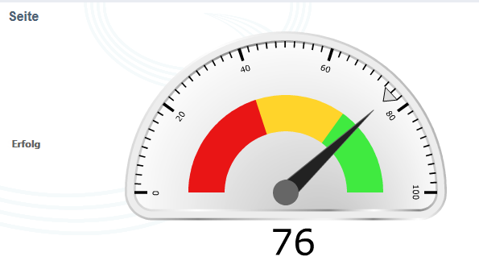

Diese Elemente werden in den Grafikparametern definiert.

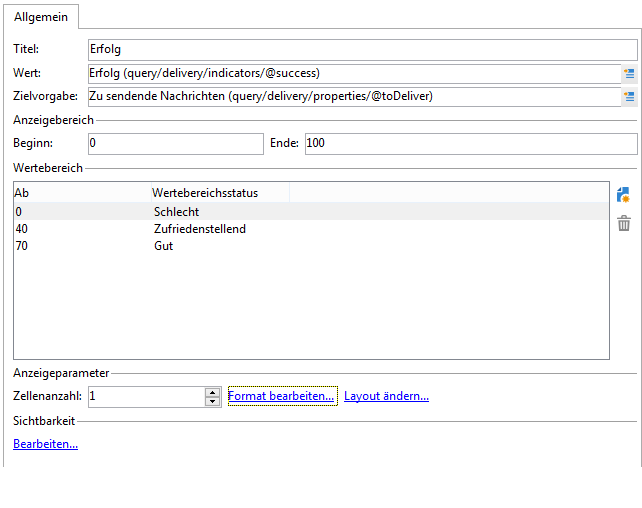

* Das Feld **[!UICONTROL Wert]** wird in der Grafik als schwarzer Pfeil dargestellt. Es legt das Element fest, dessen Fortschritt berechnet werden soll. Der zu definierende Wert muss vor-gespeichert werden, bevor er verwendet werden kann.
* Im Feld **[!UICONTROL Zielvorgabe]** wird der zu erreichende Maximalwert angegeben.
* Im Feld **[!UICONTROL Andere Markierung]** kann der Grafik ein zweiter Indikator hinzugefügt werden.
* In den **[!UICONTROL Anzeigebereich]**-Feldern werden die zu berechnenden Intervalle bestimmt.
* Die **[!UICONTROL Wertebereiche]** ermöglichen es, verschiedene Status (Ohne, Schlecht, Zufriedenstellend, Gut) an Wertegruppen zu vergeben, um den Fortschritt besser zu veranschaulichen.

Über den Link **[!UICONTROL Layout ändern...]** im Bereich **[!UICONTROL Anzeigeparameter]** kann die Anzeige der Grafik konfiguriert werden.

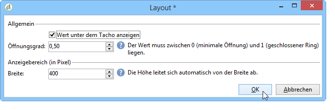

Durch Aktivierung der Option **[!UICONTROL Wert unter dem Tacho anzeigen]** wird der erreichte Wert unter der Grafik angegeben.

Das Feld **[!UICONTROL Öffnungsgrad]** muss zwischen 0 und 1 definiert werden und ermöglicht die Anzeige des Berichts in Form eines mehr oder weniger vollständig ausgefüllten Kreises. Im oben stehenden Beispiel entspricht der Wert 0,5 einem halboffenen Kreis.

Über das Feld **[!UICONTROL Breite]** kann die Größe der Grafik eingestellt werden.

## Interaktion mit der Grafik {#interaction-with-the-chart}

Im Fenster **[!UICONTROL Interaktionsereignisse]** können Sie bestimmen, welche Aktion durch einen Klick auf die Grafik ausgelöst wird.

Die möglichen Interaktionstypen und ihre jeweilige Konfiguration werden in [diesem Abschnitt](../../web/using/static-elements-in-a-web-form.md#inserting-html-content) beschrieben.

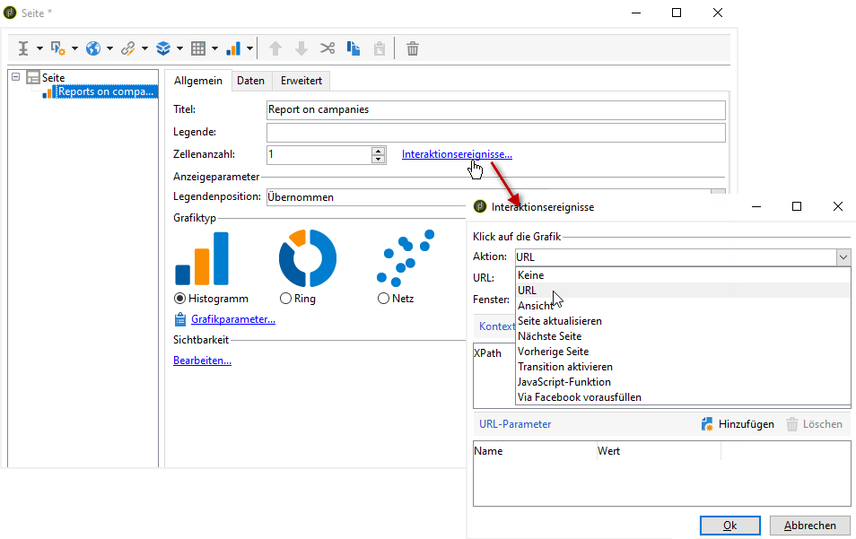

## Statistiken berechnen {#calculating-statistics}

Sie können in den Grafiken Statistiken über die abgerufenen Daten anzeigen.

Diese Statistiken werden im Bereich **[!UICONTROL Serienparameter]** des Tabs **[!UICONTROL Daten]** definiert.

Um eine neue Statistik zu erstellen, klicken Sie auf das Symbol **[!UICONTROL Hinzufügen]** und konfigurieren Sie das entsprechende Fenster. In der folgenden Grafik werden die möglichen Berechnungsarten abgebildet:

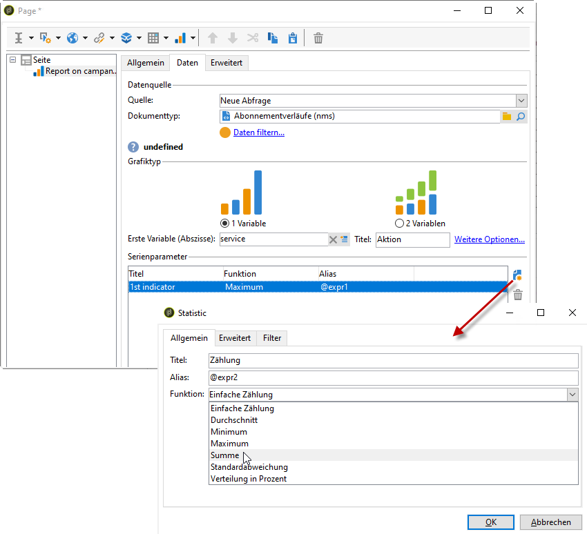

Weiterführende Informationen hierzu finden Sie in [diesem Abschnitt](../../reporting/using/using-the-descriptive-analysis-wizard.md#statistics-calculation).
