# Erstellen eines Diagramms{#creating-a-chart}

Die Daten in der Datenbank können auch erfasst und in einem Diagramm angezeigt werden. Adobe Campaign bietet eine Reihe grafischer Darstellungen. Ihre Konfiguration wird unten beschrieben.

Grafiken werden wie Tabellen direkt in eine Berichtseite eingefügt, über das Kontextmenü oder die Symbolleiste.

## Erstellungsetappen {#creation-steps}

Gehen Sie wie folgt vor, um eine Grafik in einem Bericht zu erstellen:

1. Öffnen Sie die Seite, in der die Grafik angezeigt werden soll, und wählen Sie den Grafiktyp in der Symbolleiste aus.

   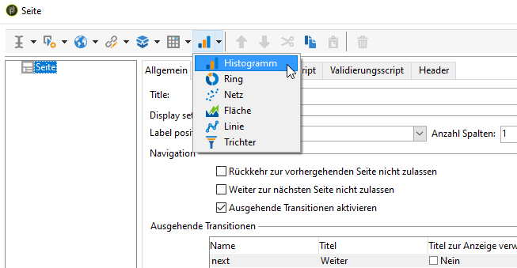

1. Geben Sie einen Namen und eine Beschriftung ein. Bei Bedarf können Sie die Position der Beschriftung mithilfe der Dropdown-Liste ändern.

   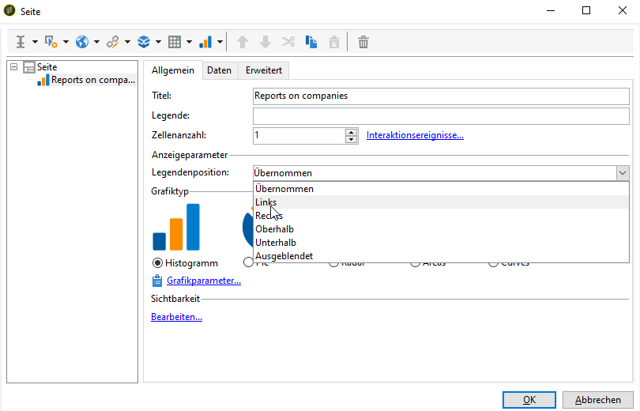

1. Klicken Sie auf den Tab **[!UICONTROL Daten]**, um die Datenquelle sowie die zu berechnenden Serien zu bestimmen.

   Die in der Grafik anzuzeigenden Statistiken können über eine Abfrage oder über Kontextdaten, d. h. die von der eingehenden Transition der betreffenden Seite übertragenen Daten, berechnet werden. Lesen Sie hierzu den Abschnitt [Kontextdaten verwenden](../../reporting/using/using-the-context.md#using-context-data).

   * Klicken Sie auf den Link **[!UICONTROL Daten filtern...]**, um die Kriterien zur Filterung der Daten zu bestimmen.

     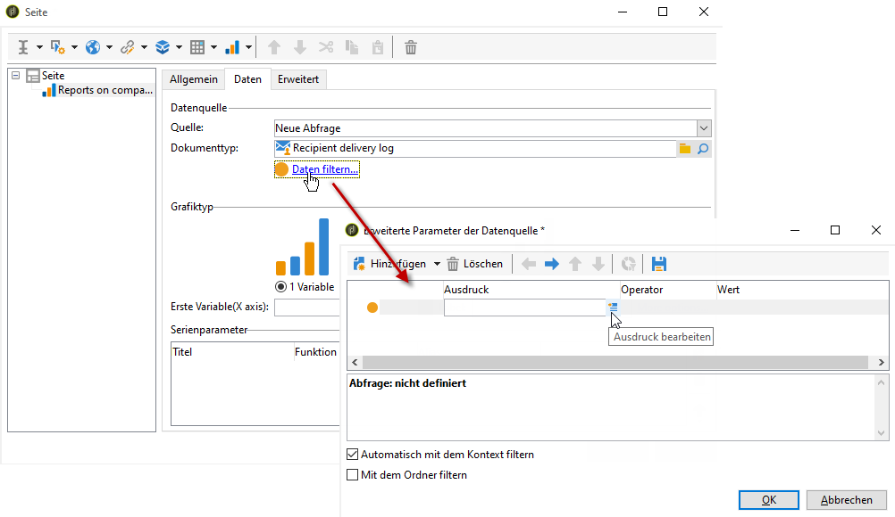

   * Um kontextuelle Daten zu verwenden, wählen Sie **[!UICONTROL Kontextuelle Daten]** aus der Dropdown-Liste **[!UICONTROL Quelle]** aus und klicken Sie auf den Link **[!UICONTROL Erweiterte Einstellungen...]**. Wählen Sie dann die Daten aus, auf die sich die Statistiken beziehen sollen.

     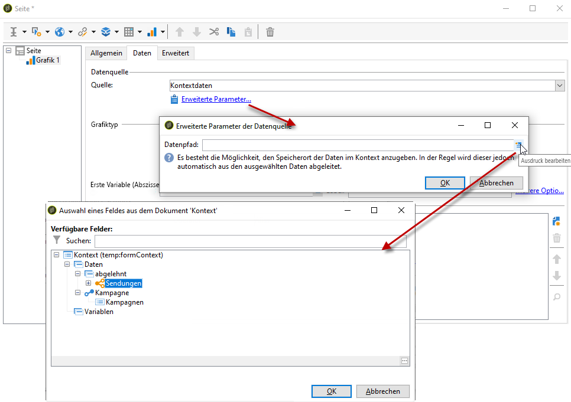

     Sie haben nun auf die kontextuellen Daten Zugriff, um die in der Grafik anzuzeigenden Werte zu bestimmen:

     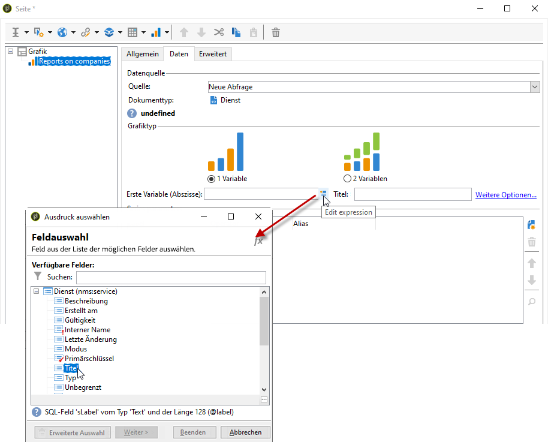

## Grafiktypen und ihre Parameter {#chart-types-and-variants}

Adobe Campaign bietet verschiedene Arten von grafischen Darstellungen. Sie werden im Folgenden beschrieben.

Der Grafiktyp wird beim Einfügen in die Seite ausgewählt.

Er kann im Abschnitt **[!UICONTROL Grafiktyp]** des Tabs **[!UICONTROL Allgemein]** der Grafik geändert werden.

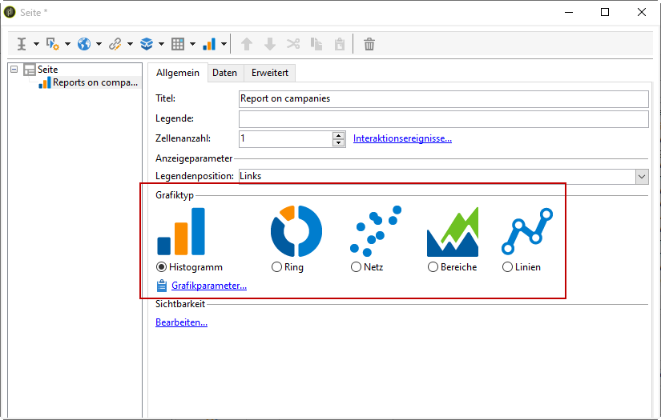

Die Varianten hängen vom gewählten Diagrammtyp ab. Diese werden über den Link **[!UICONTROL Varianten…]** ausgewählt.

### Aufschlüsselung: Kreisdiagramm {#breakdown--pie-charts}

Diese Darstellungsform bietet eine Übersicht der jeweiligen Anteile der gemessenen Elemente.

Die Anzeige in Form von Sektoren beschränkt die Analyse auf eine Variable.

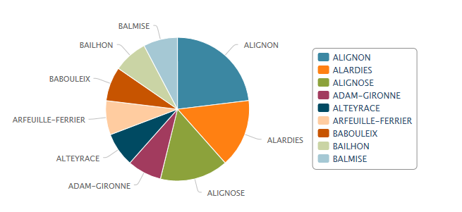

Über den Link **[!UICONTROL Grafikparameter...]** kann das Rendering der Grafik angepasst werden.

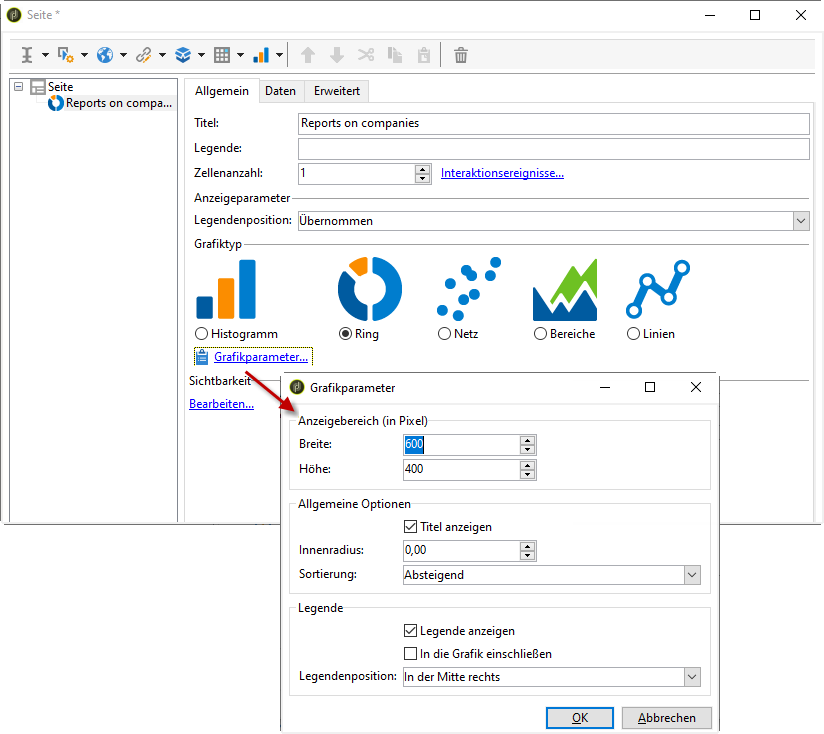

Für eine Darstellung in Form von Sektoren muss zunächst der Wert des inneren Radius im entsprechenden Feld eingegeben werden.

Beispiel:

Ein Wert von 0,00 zeichnet einen ganzen Kreis.

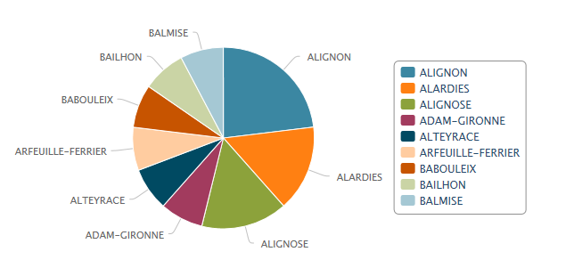

Ein Wert von 0,40 zeichnet einen Kreis mit einem Radius von 40 %.

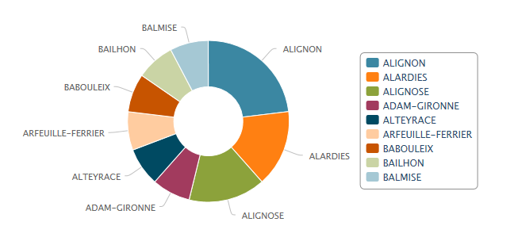

Ein Wert von 1,00 zeichnet nur den äußeren Ring des Kreises.

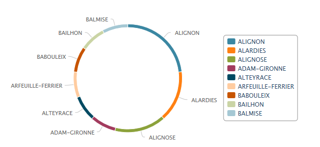

### Entwicklung: Kurven und Flächen {#evolution--curves-and-areas}

Diese grafische Darstellungsform zeigt die Entwicklung einer oder mehrerer Messungen über einen Zeitraum hinweg.

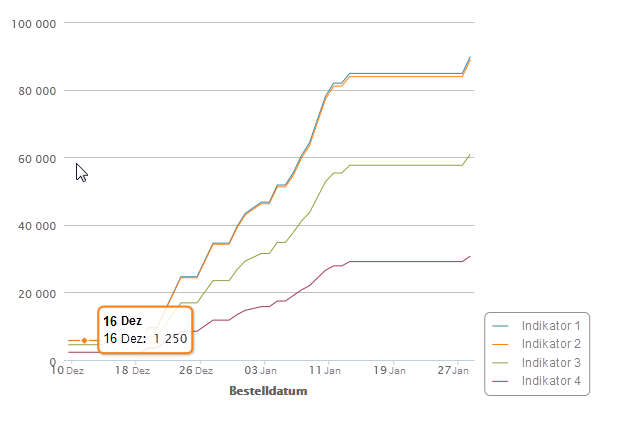

### Vergleich: Histogramme {#comparison--histograms}

Histogramme ermöglichen den Vergleich unterschiedlicher Werte von einer oder zwei Variablen.

Für diese Art von Grafik stehen folgende Optionen im Fenster **[!UICONTROL Grafikparameter]** zur Verfügung:

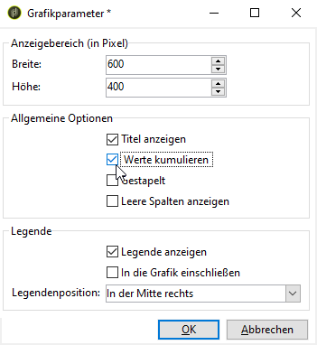

Aktivieren Sie die Option **[!UICONTROL Legende anzeigen]**, damit die Legende mit der Grafik angezeigt wird. Daraufhin kann ihre Position bestimmt werden:

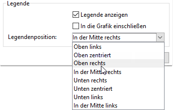

Wenn sich die Werte dazu eignen, können Sie sie stapeln.

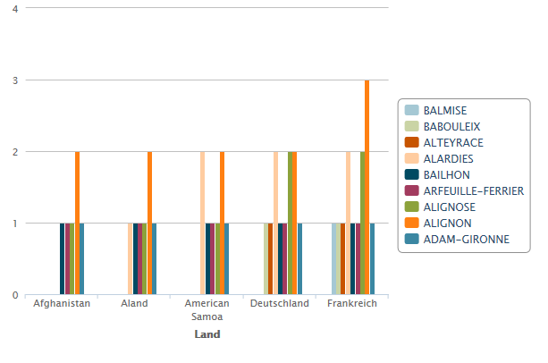

Bei Bedarf können Sie die Anzeigereihenfolge der Werte umkehren. Aktivieren Sie hierzu die Option **[!UICONTROL Umgekehrte Stapelung]**.

### Konversion: Trichter {#conversion--funnel}

Diese Art von Grafik zeigt die Konversionsrate der gemessenen Elemente.

## Interaktion mit der Grafik {#interaction-with-the-chart}

Sie können eine Aktion definieren, wenn der Benutzer auf das Diagramm klickt. Öffnen Sie das Fenster **[!UICONTROL Interaktionsereignisse]** und wählen Sie die Aktion aus, die Sie ausführen möchten.

Die möglichen Interaktionstypen und ihre jeweilige Konfiguration werden in [diesem Abschnitt](../../web/using/static-elements-in-a-web-form.md#inserting-html-content) beschrieben.

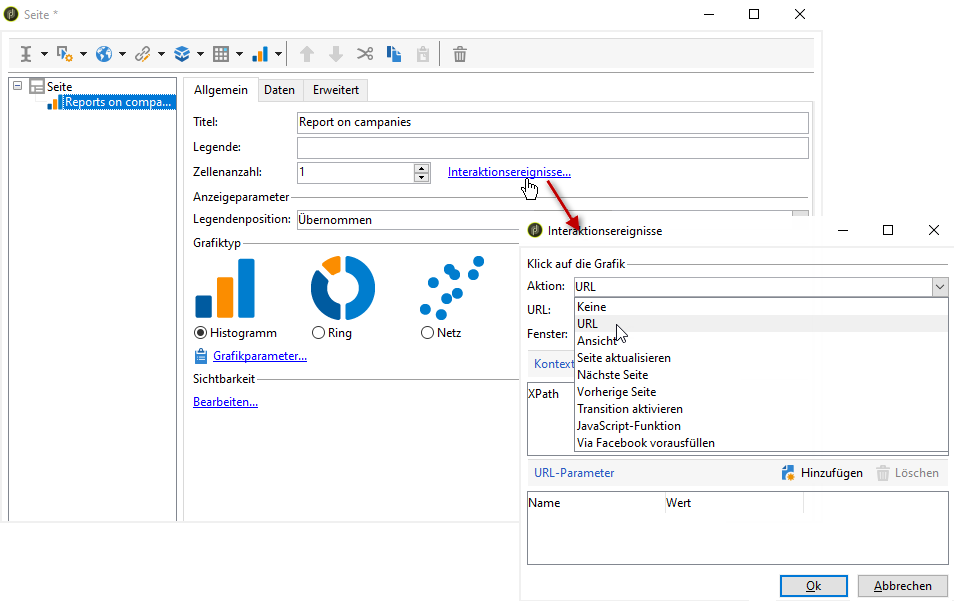

## Berechnen von Statistiken {#calculating-statistics}

Sie können in den Grafiken Statistiken über die abgerufenen Daten anzeigen.

Diese Statistiken werden im Bereich **[!UICONTROL Serienparameter]** des Tabs **[!UICONTROL Daten]** definiert.

Um eine neue Statistik zu erstellen, klicken Sie auf das Symbol **[!UICONTROL Hinzufügen]** und konfigurieren Sie das entsprechende Fenster. Die verfügbaren Berechnungstypen werden im Folgenden beschrieben.

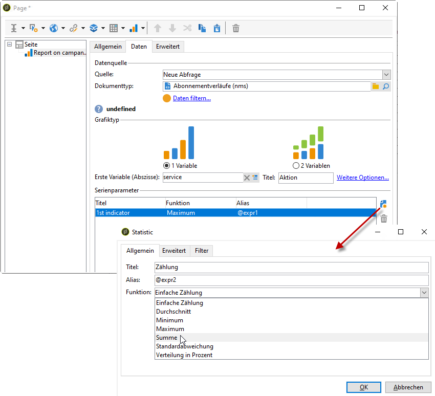

Weiterführende Informationen hierzu finden Sie in [diesem Abschnitt](../../reporting/using/using-the-descriptive-analysis-wizard.md#statistics-calculation).
