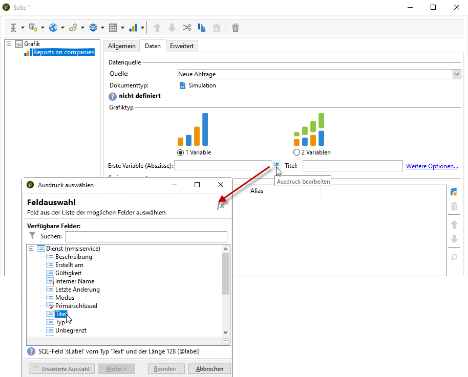

# Grafiken erstellen{#creating-a-chart}

Adobe Campaign bietet die Möglichkeit, in der Datenbank verfügbare Daten abzurufen und in Form verschiedener Grafiken darzustellen. Die grundlegenden Konfigurationen hierzu werden im Folgenden beschrieben.

Grafiken werden wie Tabellen direkt in eine Berichtseite eingefügt, über das Kontextmenü oder die Symbolleiste.

## Erstellungsetappen {#creation-steps}

Gehen Sie wie folgt vor, um eine Grafik in einem Bericht zu erstellen:

1. Öffnen Sie die Seite, in der die Grafik angezeigt werden soll, und wählen Sie den Grafiktyp in der Symbolleiste aus.

   

1. Geben Sie den Namen der Grafik sowie die zugeordnete Legende an. Bei Bedarf können Sie die Position der Legende über die entsprechende Dropdown-Liste verändern.

   

1. Click the **[!UICONTROL Data]** tab to define the data source and the series to be calculated.

   The statistics to be displayed in the chart can be calculated based on a query or on the context data, i.e. the data provided by the inbound transition of the current page (for more on this, refer to [Using context data](../../reporting/using/using-the-context.md#using-context-data)).

   * Click the **[!UICONTROL Filter data...]** link to define filtering criteria for the data in the database.

      

   * Um Kontextdaten zu verwenden, wählen Sie diese Option und klicken Sie auf den **[!UICONTROL Advanced settings...]** Link. Wählen Sie dann die Daten aus, die die Statistiken betreffen.

      

      Sie haben nun auf die Kontextdaten Zugriff, um die in der Grafik anzuzeigenden Werte zu bestimmen:

      

## Grafiktypen und ihre Parameter {#chart-types-and-variants}

Adobe Campaign bietet drei verschiedene grafische Darstellungstypen, die im Nachstehenden vorgestellt werden.

Der Grafiktyp wird beim Einfügen in die Seite ausgewählt.

It can also be altered via the **[!UICONTROL Chart type]** section of the **[!UICONTROL General]** tab in the chart.

Die Varianten hängen vom ausgewählten Diagrammtyp ab. Sie werden über den **[!UICONTROL Variants...]** Link ausgewählt.

### Verteilung: Kreisdiagramm {#breakdown--pie-charts}

Diese Darstellungsform bietet eine Übersicht der jeweiligen Anteile der gemessenen Elemente.

Die Anzeige in Form von Sektoren beschränkt die Analyse auf eine Variable.

The **[!UICONTROL Variants]** link lets you personalize the overall rendering of the chart.

Für eine Darstellung in Form von Sektoren muss zunächst der Wert des inneren Radius im entsprechenden Feld eingegeben werden.

Beispiel:

Ein Wert von 0,00 zeichnet einen ganzen Kreis.

Ein Wert von 0,40 zeichnet einen Kreis mit einem Radius von 40 %.

Ein Wert von 1,00 zeichnet nur den äußeren Ring des Kreises.

### Entwicklung: Kurven und Flächen {#evolution--curves-and-areas}

Diese grafische Darstellungsform zeigt die Entwicklung einer oder mehrerer Messungen über einen Zeitraum hinweg.

### Vergleich: Histogramme {#comparison--histograms}

Histogramme ermöglichen den Vergleich unterschiedlicher Werte von einer oder zwei Variablen.

For these types of charts, the following options are offered in the **[!UICONTROL Variants]** window:

Check the **[!UICONTROL Display caption]** option to show the caption with the chart and choose its position:

Wenn sich die Werte dazu eignen, können Sie sie stapeln.

Bei Bedarf können Sie die Wertanzeigesequenz umkehren. To do this, select the **[!UICONTROL Reverse stacking]** option.

### Konversion: Trichter {#conversion--funnel}

Diese Art von Grafik zeigt die Konversionsrate der gemessenen Elemente.

### Fortschritt: Tacho {#progress--gauge}

Diese Art von Grafik ermöglicht die Anzeige des Fortschritts eines Wertes in Bezug auf einen festgelegten Zielwert. Im unten stehenden Beispiel stellt der schwarze Pfeil die Anzahl an erfolgreich versendeten Sendungen (76) bei einem Zielwert von 100 Sendungen dar. Der Tacho ist in drei Wertebereiche unterteilt, die jeweils einem in der Konfiguration festgelegten Status entsprechen.

Diese Elemente werden in den Grafikparametern definiert.

* Das **[!UICONTROL Value]** Feld wird durch ein schwarzes Zifferblatt im Diagramm dargestellt. Es stellt das Element dar, dessen Fortschritt Sie berechnen möchten. Der zu repräsentierende Wert muss bereits gespeichert sein, damit er verwendet werden kann.
* The **[!UICONTROL Goal]** field represents the maximum value to achieve.
* Using the **[!UICONTROL Other mark]** field you can add a second indicator to the chart.
* The **[!UICONTROL Display range]** fields let you specify the values between which the report is calculated.
* The **[!UICONTROL Value ranges]** field lets you attribute statuses (None, Bad, Acceptable, Good) to a set of values to better illustrate the progress.

In the **[!UICONTROL Display settings]** section, the **[!UICONTROL Change appearance...]** lets you configure the way the chart is displayed.

Mit der **[!UICONTROL Display the value below the gauge]** Option können Sie den Werterfolg unterhalb des Diagramms anzeigen.

Im **[!UICONTROL Aperture ratio]** Feld, das zwischen 0 und 1 liegen muss, können Sie die Blende des Berichts in einem mehr oder weniger vollständigen Kreis bearbeiten. Im obigen Beispiel entspricht der Wert 0,50 einem Halbkreis.

The **[!UICONTROL Width]** field lets you edit the chart size.

## Interaktion mit der Grafik {#interaction-with-the-chart}

Sie können eine Aktion definieren, wenn der Benutzer auf das Diagramm klickt. Öffnen Sie das **[!UICONTROL Interaction events]** Fenster und wählen Sie die gewünschte Aktion aus.

Die möglichen Interaktionstypen und ihre jeweilige Konfiguration werden in [diesem Abschnitt](../../web/using/static-elements-in-a-web-form.md#inserting-html-content) beschrieben.

## Statistiken berechnen {#calculating-statistics}

Sie können in den Grafiken Statistiken über die abgerufenen Daten anzeigen.

These statistics are defined via the **[!UICONTROL Series parameters]** section of the **[!UICONTROL Data]** tab.

Um eine neue Statistik zu erstellen, klicken Sie auf das **[!UICONTROL Add]** Symbol und konfigurieren Sie das entsprechende Fenster. Die verfügbaren Berechnungsarten sind nachfolgend beschrieben.

Weiterführende Informationen hierzu finden Sie in [diesem Abschnitt](../../reporting/using/using-the-descriptive-analysis-wizard.md#statistics-calculation).
