# Erstellen eines neuen Berichts{#creating-a-new-report}

Gehen Sie wie folgt vor, um einen Bericht zu erstellen:

1. Öffnen Sie den Adobe Campaign-Explorer und wählen Sie im Knoten **[!UICONTROL Administration > Konfiguration]** den Ordner **[!UICONTROL Berichte]** aus.
1. Klicken Sie auf die Schaltfläche **[!UICONTROL Neu]** rechts oberhalb der Liste der Berichte.
1. Wählen Sie **[!UICONTROL Neuen Bericht basierend auf einer Vorlage erstellen]** aus und klicken Sie auf **[!UICONTROL Weiter]**.

   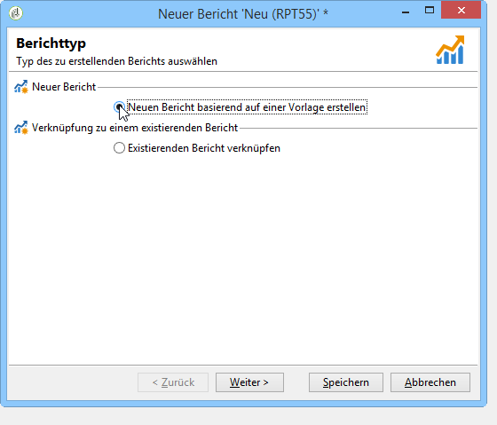

1. Wählen Sie die Berichtvorlage in der Dropdown-Liste aus.

   * Anhand der Vorlage **[!UICONTROL Erweiterter Bericht]** kann ein mithilfe eines Diagramms konfigurierter Bericht erstellt werden.
   * Der Bericht **[!UICONTROL Qualitative Verteilung]** ermöglicht die Erzeugung von Statistiken über alle Datentypen (z. B. Firmennamen, E-Mail-Domains etc.).
   * Der Bericht **[!UICONTROL Quantitative Verteilung]** ermöglicht Statistiken über Daten, die gemessen oder gezählt werden können (Rechnungsbetrag, Alter der Empfänger etc.).

   Nähere Informationen über diese Berichtvorlagen erhalten Sie in [diesem Abschnitt](../../reporting/using/about-descriptive-analysis.md).

1. Erfassen Sie den Namen des Berichts und seine Beschreibung in den entsprechenden Feldern. Geben Sie das **[!UICONTROL Schema]** an, auf das sich der Bericht beziehen soll.

   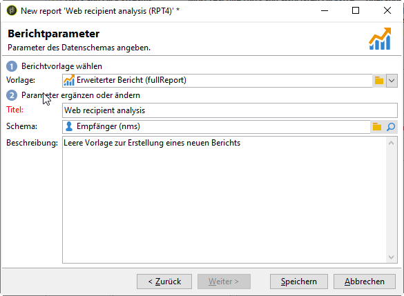

1. Speichern Sie den Bericht.

## Modellieren des Diagramms {#modelizing-the-chart}

Nach dem Speichern des Berichts sollte dies angezeigt werden. Jetzt können Sie das Diagramm Ihres Berichts erstellen.

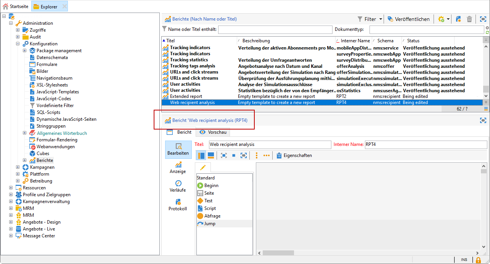

Das Berichtdiagramm besteht aus einer linearen Aneinanderreihung von Aktivitäten.

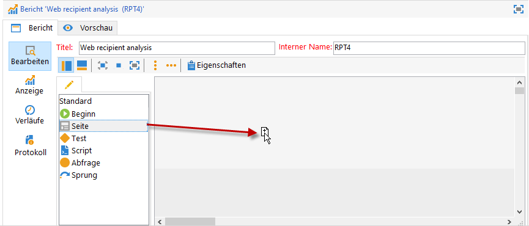

Diese werden untereinander durch Pfeile - sogenannte Transitionen - verbunden.

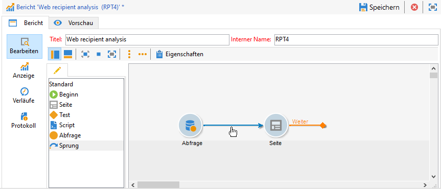

Um den Bericht entsprechend seiner Art und seines Verwendungskontexts zu konstruieren, müssen zunächst die nützlichen Elemente und ihre logische Aneinanderreihung identifiziert werden.

1. Verwenden Sie die Aktivität **[!UICONTROL Start]**, um den ersten auszuführenden Prozess für das Erstellen Ihres Berichts festzulegen. Pro Bericht kann nur eine dieser Aktivitäten verwendet werden.

   Wenn das Diagramm eine Schleife enthält, ist die &quot;Beginn&quot;-Aktivität obligatorisch.

1. Fügen Sie eine oder mehrere Aktivitäten des Typs **[!UICONTROL Abfrage]** hinzu, um Daten zu erfassen, die für die Erstellung des Berichts nützlich sind. Die Daten können entweder direkt über eine Abfrage eines Schemas der Datenbank oder über eine importierte Liste oder einen vorhandenen Cube erfasst werden.

   Weitere Informationen finden Sie unter [Erfassen der zu analysierenden Daten](../../reporting/using/collecting-data-to-analyze.md).

   Diese Daten werden je nach Seitenkonfiguration im Bericht angezeigt oder nicht.

1. Platzieren Sie eine oder mehrere Aktivitäten des Typs **[!UICONTROL Seite]**, um die grafische Darstellung der erfassten Daten zu definieren. Sie können Tabellen, Diagramme sowie Eingabefelder einfügen und die Anzeige von einer oder mehrerer Seiten bzw. Elementen der Seite an Bedingungen knüpfen. Der angezeigte Inhalt ist vollständig konfigurierbar.

   Weitere Informationen finden Sie unter [Statische Elemente](#static-elements).

1. Verwenden Sie die **[!UICONTROL Test]**-Aktivität, um Anzeige- oder Zugriffsbedingungen für bestimmte Daten zu definieren.

   Weitere Informationen finden Sie unter [Bedingungen zur Anzeige von Seiten definieren](../../reporting/using/defining-a-conditional-content.md#conditioning-page-display).

1. Fügen Sie bei Bedarf mithilfe der **[!UICONTROL Script]**-Aktivität benutzerdefinierte Scripts hinzu, beispielsweise um den Namen eines Berichts zu berechnen, die Anzeige der Ergebnisse in einem bestimmten Kontext zu filtern etc.

   Weitere Informationen finden Sie unter [Script-Aktivität](../../reporting/using/advanced-functionalities.md#script-activity).

1. Schließlich können Sie zur Verbesserung der Lesbarkeit komplexer Berichte eine oder mehrere Aktivitäten des Typs **[!UICONTROL Sprung]** einfügen.Auf diese Weise können Sie von einer Aktivität zur anderen wechseln, ohne die Transition im Bericht zu materialisieren. Die **[!UICONTROL Sprung]**-Aktivität kann auch genutzt werden, um einen anderen Bericht anzuzeigen.

   Weitere Informationen finden Sie unter [Sprung-Aktivität](../../reporting/using/advanced-functionalities.md#jump-activity).

Der Ausführungsmodus eines Berichts entspricht nicht dem eines Workflows. Beispielsweise können nicht mehrere Zweige parallel ausgeführt werden. Ein wie folgt konstruierter Bericht ist daher nicht ausführbar:

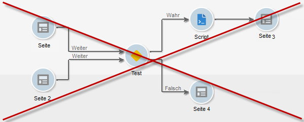

Sie können jedoch mehrere Verzweigungen platzieren. Nur einer von ihnen wird ausgeführt:

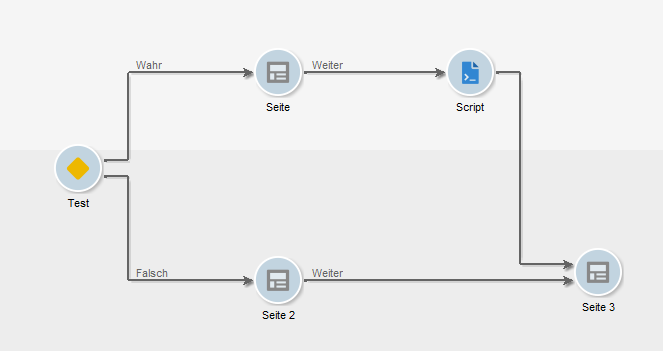

## Erstellen einer Seite {#creating-a-page}

Der Inhalt wird über die im Diagramm platzierten Aktivitäten konfiguriert. Weitere Informationen finden Sie unter [Modellieren des Diagramms](#modelizing-the-chart).

Doppelklicken Sie auf das Symbol einer Aktivität, um sie zu konfigurieren.

Der angezeigte Inhalt wird in Aktivitäten vom Typ **Seite** bestimmt.

Ein Bericht kann eine oder mehrere Seiten enthalten. Seiten können über einen dedizierten Editor erstellt werden, mit dem Sie Eingabefelder, Auswahlfelder, statische Elemente, Diagramme oder Tabellen in eine Baustruktur einfügen können. Mithilfe von Containern können Sie das Layout definieren. Weitere Informationen finden Sie unter [Elemente anordnen](../../reporting/using/element-layout.md).

Über die Schaltfläche &quot;Auswahldialog&quot; lassen sich verschiedene Komponenten (Radiobutton, Checkbox etc.) in die Seite einfügen.

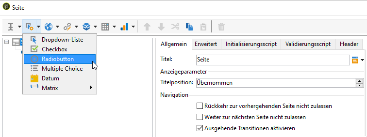

Alternativ können Sie einen Rechtsklick auf den Knoten machen, um eine der verfügbaren Komponenten einzufügen.

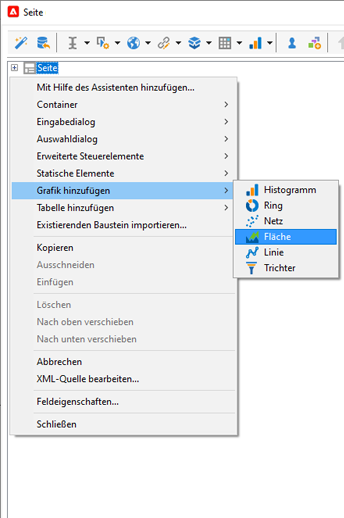

>[!CAUTION]
>
>Wenn der Bericht für den Export im Excel-Format vorgesehen ist, sollten Sie keine komplexe HTML-Formatierung verwenden. Weitere Informationen finden Sie unter [Exportieren eines Berichts](../../reporting/using/actions-on-reports.md#exporting-a-report).

Eine **[!UICONTROL Seite]** kann folgende Elemente enthalten:

* **[!UICONTROL Grafiken]** vom Typ Histogramm, Kreis- oder Kurvendiagramm etc.
* **[!UICONTROL Tabellen]** vom Typ Pivot, Gruppierungsliste oder Aufschlüsselung.
* **[!UICONTROL Eingabedialoge]** vom Typ Text oder Zahl.
* **[!UICONTROL Auswahldialoge]** vom Typ Dropdown-Liste, Checkbox, Radiobutton, Multiple Choice, Datum oder Matrix.
* **[!UICONTROL Erweiterte Dialoge]** vom Typ Link-Editor, Konstante, Ordnerauswahl.
* Wert, Link, HTML, Bild usw. **[!UICONTROL Statische Elemente]**.
* **[!UICONTROL Container]** zur Anordnung der Komponenten.

Die Konfiguration einer Seite und ihrer Elemente wird in [diesem Abschnitt](../../web/using/about-web-forms.md) erläutert.

Mithilfe der Symbolleiste können Sie Dialoge hinzufügen, löschen und so anordnen, wie sie auf den Seiten Ihres Berichts angezeigt werden sollen.

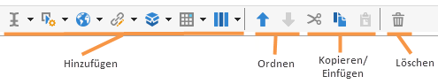

### Statische Elemente {#static-elements}

Statische Elemente ermöglichen die Anzeige von Informationen, grafischen Elementen oder Scripts im Bericht, mit denen der Benutzer nicht interagiert. Weitere Informationen finden Sie in [diesem Abschnitt](../../web/using/static-elements-in-a-web-form.md#inserting-html-content).

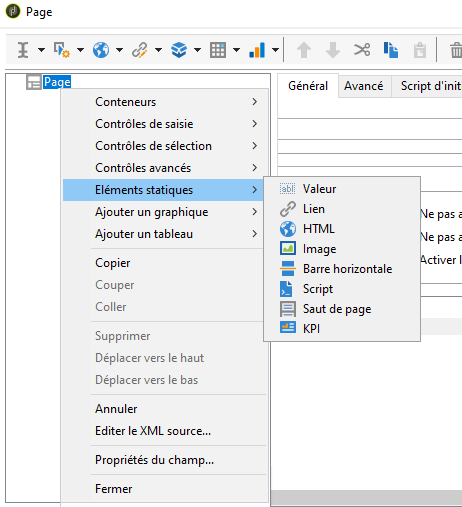

### Filtern von Informationen in einem Bericht {#filtering-information-in-a-report}

Anhand von Eingabe- und Auswahldialogen können die im Bericht angezeigten Informationen gefiltert werden. Weitere Informationen zur Implementierung dieses Filtertyps finden Sie unter [Filteroptionen in Abfragen](../../reporting/using/collecting-data-to-analyze.md#filtering-options-in-the-queries).

Die Erstellung und Konfiguration von Eingabe- und Auswahlfeldern werden in [diesem Abschnitt](../../web/using/about-web-forms.md) beschrieben.

Sie können ein oder mehrere Eingabesteuerelemente in Ihre Berichte integrieren. Mit dieser Art von Steuerung können Sie die angezeigten Informationen nach einem eingegebenen Wert filtern.

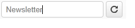

Sie können auch ein oder mehrere Auswahlsteuerelemente in Ihre Berichte integrieren. Mit dieser Art von Steuerung können Sie die im Bericht enthaltenen Informationen basierend auf den ausgewählten Werten filtern, beispielsweise:

* über Radiobuttons und Checkboxen:

  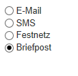

* über eine Dropdown-Liste:

  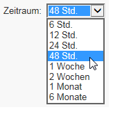

* über einen Kalender:

  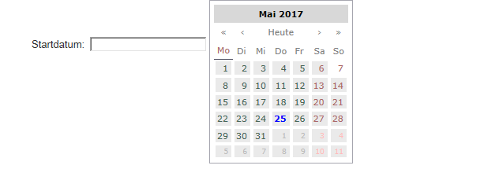

Schließlich können Sie ein oder mehrere erweiterte Steuerelemente in Ihre Berichte integrieren. Mit dieser Art von Steuerung können Sie einen Link oder eine Konstante einfügen oder einen Ordner auswählen.

Im folgenden Beispiel wird der Bericht dahingehend konfiguriert, dass nur die Daten eines bestimmten Ordners des Navigationsbaums angezeigt werden:

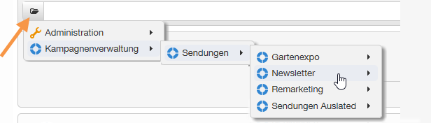
