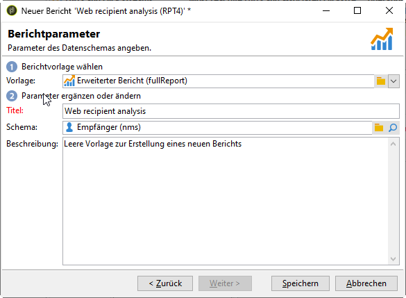
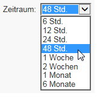
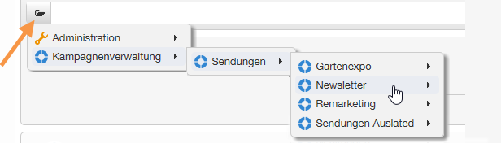

# Neue Berichte erstellen{#creating-a-new-report}

Gehen Sie wie folgt vor, um einen Bericht zu erstellen:

1. Open the Adobe Campaign Explorer and from the **[!UICONTROL Administration > Configuration]** node, then select the **[!UICONTROL Reports]** folder.
1. Click the **[!UICONTROL New]** button above the list of reports.
1. Wählen Sie **[!UICONTROL Create a new report from a template]** und klicken Sie auf **[!UICONTROL Next]**.

   

1. Wählen Sie die Berichtvorlage in der Dropdown-Liste aus.

   * The **[!UICONTROL Extended report]** lets you create a report configured using a chart.
   * The **[!UICONTROL Qualitative distribution]** report lets you create statistics based on all types of data (company name, email domain, etc.).
   * The **[!UICONTROL Quantitative distribution]** report lets you create statistics on data that can be measured or counted (invoice amount, recipient age, etc.).
   Nähere Informationen über diese Berichtvorlagen erhalten Sie in [diesem Abschnitt](../../reporting/using/about-descriptive-analysis.md).

1. Geben Sie den Berichtsnamen und seine Beschreibung in die entsprechenden Felder ein. Geben Sie an, **[!UICONTROL schema]** auf welchen Bericht der Bericht angewendet werden soll.

   

1. Speichern Sie den Bericht.

## Gestaltung des Diagramms {#modelizing-the-chart}

Nach der Speicherung des Berichts wird dieser angezeigt. Sie können nun das Diagramm Ihres Berichts erstellen.

Das Berichtdiagramm besteht aus einer linearen Aneinanderreihung von Aktivitäten.

Diese werden untereinander durch Pfeile - sogenannte Transitionen - verbunden.

Um den Bericht entsprechend seiner Art und seines Verwendungskontexts zu konstruieren, müssen zunächst die nützlichen Elemente und ihre logische Aneinanderreihung identifiziert werden.

1. Nutzen Sie die &#39;Beginn&#39;-Aktivität, um den ersten, zur Erstellung des Berichts auszuführenden Vorgang darzustellen. Diese Aktivität kann in jedem Bericht nur einmal verwendet werden.

   Wenn das Diagramm eine Schleife enthält, ist die &#39;Beginn&#39;-Aktivität obligatorisch.

1. Fügen Sie eine oder mehrere &#39;Abfrage&#39;-Aktivitäten hinzu, um die für die Erstellung des Berichts nützlichen Daten abzurufen. Die Daten können direkt über eine Abfrage eines Schemas der Datenbank, eine importierte Liste oder einen existierenden Cube abgerufen werden.

   Weitere Informationen finden Sie unter [Zu analysierende Daten abrufen](../../reporting/using/collecting-data-to-analyze.md).

   Diese Daten werden je nach Seitenkonfiguration im Bericht angezeigt oder nicht.

1. Positionieren Sie eine oder mehrere &#39;Seiten&#39;-Aktivitäten im Diagramm, um die grafische Darstellung der abgerufenen Daten zu konfigurieren. Sie können Tabellen, Grafiken sowie Eingabefelder einfügen und die Anzeige einer oder mehrerer Seiten oder bestimmter Seitenelemente an Bedingungen knüpfen. Der angezeigte Inhalt ist vollständig konfigurierbar.

   Weitere Informationen finden Sie unter [Statische Elemente](#static-elements).

1. Verwenden Sie die &#39;Test&#39;-Aktivität, um Anzeige- oder Zugriffsbedingungen für bestimmte Daten zu definieren.

   Weitere Informationen finden Sie unter [Bedingungen zur Anzeige von Seiten definieren](../../reporting/using/defining-a-conditional-content.md#conditioning-page-display).

1. Fügen Sie bei Bedarf mithilfe der &#39;Script&#39;-Aktivität benutzerdefinierte Scripts hinzu, beispielsweise um den Namen eines Berichts zu berechnen, die Anzeige der Ergebnisse in einem bestimmten Kontext zu filtern etc.

   Weitere Informationen finden Sie unter [Script-Aktivität](../../reporting/using/advanced-functionalities.md#script-activity).

1. Schließlich haben Sie die Möglichkeit, die Lesbarkeit komplexer Berichte durch das Einfügen einer oder mehrerer &#39;Sprung&#39;-Aktivitäten zu verbessern: Sie ermöglichen den Übergang von einer Aktivität zur anderen, ohne die Transition im Bericht zu materialisieren. Der &#39;Sprung&#39; kann auch dazu dienen, einen anderen Bericht anzuzeigen.

   Weitere Informationen finden Sie unter [Sprung-Aktivität](../../reporting/using/advanced-functionalities.md#jump-activity).

Der Ausführungsmodus eines Berichts entspricht nicht dem eines Workflows. Beispielsweise können nicht mehrere Zweige parallel ausgeführt werden. Ein wie folgt konstruierter Bericht ist daher nicht ausführbar:

Es ist jedoch möglich, mehrere Zweige zu positionieren, wobei nur einer von ihnen ausgeführt wird:

## Seiten erstellen {#creating-a-page}

Der Inhalt wird über die im Diagramm platzierten Aktivitäten konfiguriert. Weitere Informationen finden Sie unter [Gestaltung des Diagramms](#modelizing-the-chart).

Doppelklicken Sie auf das Symbol einer Aktivität, um sie zu konfigurieren.

Der angezeigte Inhalt wird in Aktivitäten vom Typ **Seite** bestimmt.

Ein Bericht kann eine oder mehrere Seiten enthalten. Die Seiten werden mithilfe eines dedizierten Editors erstellt, über den ein Navigationsbaum, Eingabefelder, Auswahlfelder, statische Elemente, Diagramme oder Tabellen eingefügt werden können. Die Anordnung der Elemente erfolgt anhand von Containern. Weitere Informationen finden Sie unter [Elemente anordnen](../../reporting/using/element-layout.md).

Über die Schaltfläche &quot;Auswahldialog&quot; lassen sich verschiedene Komponenten (Radiobutton, Checkbox etc.) in die Seite einfügen.

Alternativ können Sie einen Rechtsklick auf den Knoten machen, um eine der verfügbaren Komponenten einzufügen.

>[!CAUTION]
>
>Wenn der Bericht für den Export im Excel-Format vorgesehen ist, sollten Sie keine komplexe HTML-Formatierung verwenden. Weitere Informationen finden Sie unter [Berichtexport](../../reporting/using/actions-on-reports.md#exporting-a-report).

A **[!UICONTROL Page]** can include the following elements:

* Bar, pie, curve type **[!UICONTROL charts]**, etc.
* Pivot; List with group, or Breakdown **[!UICONTROL tables]**.
* Text- oder Zahlentyp **[!UICONTROL Input controls]**.
* Drop-down list, checkbox, radio button, multiple choice, date, or Matrix type **[!UICONTROL Selection controls]**.
* Link editor, Constant, Folder selection type **[!UICONTROL Advanced controls]**.
* Wert, Link, HTML, Bild usw. **[!UICONTROL Static elements]**.
* **[!UICONTROL Containers]** , mit denen Sie das Komponentenlayout steuern können.

Die Konfiguration einer Seite und ihrer Elemente wird in [diesem Abschnitt](../../web/using/about-web-forms.md) erläutert.

Mithilfe der Symbolleiste können Sie Dialoge hinzufügen, löschen und so anordnen, wie sie auf den Seiten Ihres Berichts angezeigt werden sollen.

### Statische Elemente {#static-elements}

Statische Elemente ermöglichen die Anzeige von Informationen, grafischen Elementen oder Scripts im Bericht, mit denen der Benutzer nicht interagiert. Weitere Informationen finden Sie in [diesem Abschnitt](../../web/using/static-elements-in-a-web-form.md#inserting-html-content).

### Informationen in einem Bericht filtern {#filtering-information-in-a-report}

Anhand von Eingabe- und Auswahldialogen können die im Bericht angezeigten Informationen gefiltert werden. Weitere Informationen zur Implementierung dieses Filtertyps finden Sie unter [Filteroptionen in Abfragen](../../reporting/using/collecting-data-to-analyze.md#filtering-options-in-the-queries).

Die Erstellung und Konfiguration von Eingabe- und Auswahlfeldern werden in [diesem Abschnitt](../../web/using/about-web-forms.md) beschrieben.

Sie können ein oder mehrere Eingabedialoge in Ihre Berichte integrieren. Dieser Dialogtyp ermöglicht es Ihnen beispielsweise, die angezeigten Informationen nach einem eingegebenen Wert zu filtern.

Sie können auch eine oder mehrere Auswahldialoge in Ihre Berichte integrieren. Dieser Dialogtyp ermöglicht es Ihnen, die angezeigten Informationen nach einem oder mehreren Werten zu filtern, zum Beispiel:

* über Radiobuttons und Checkboxen:

   

* über eine Dropdown-Liste:

   

* über einen Kalender:

   

Sie können einen oder mehrere erweiterte Dialoge in Ihre Berichte integrieren. Dieser Dialogtyp bietet die Möglichkeit, einen Link oder eine Konstante einzufügen oder einen Ordner auszuwählen.

Im folgenden Beispiel wird der Bericht dahingehend konfiguriert, dass nur die Daten eines bestimmten Ordners des Navigationsbaums angezeigt werden:

