# Tabellen erstellen{#creating-a-table}

Sie haben die Möglichkeit, in Berichten je nach anzuzeigenden Daten verschiedene Tabellenarten zu verwenden. Es kann sich dabei um eine Liste mit Gruppierung, eine Tabelle mit Werteverteilung oder um eine über Cube-Messungen erstellte Pivot-Tabelle handeln.

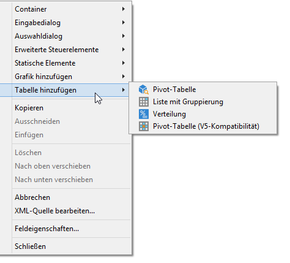

## Liste mit Gruppierung erstellen {#creating-a-list-with-group}

Eine **[!UICONTROL Liste mit Gruppierung]** ermöglicht es, bestimmte Daten in der Tabelle zusammenzufassen und Statistiken über die enthaltenen Daten zu erzeugen. Sie können beispielsweise Summen und Zwischensummen erstellen. Jede Gruppierung enthält eine Header-, Detail- und Footer-Zeile.

>[!CAUTION]
>
>Der die Tabelle enthaltenden **[!UICONTROL Seite]**-Aktivität muss eine **[!UICONTROL Abfrage]**- oder **[!UICONTROL Script]**-Aktivität vorangehen, um die Daten abzurufen, die im Bericht analysiert werden sollen. Weitere Informationen zu diesen Aktivitäten finden Sie unter [Zu analysierende Daten abrufen](../../reporting/using/collecting-data-to-analyze.md) und [Script-Aktivität](../../reporting/using/advanced-functionalities.md#script-activity).

### Grundprinzip {#operating-principle}

Es besteht die Möglichkeit, dass Sie mehrere Datenkategorien gleichzeitig zu analysieren haben. Eine Liste mit Gruppierung ermöglicht es Ihnen, bestimmte Daten zusammenzufassen und Statistiken über unterschiedliche Gruppen in der gleichen Tabelle zu erzeugen. Erstellen Sie hierzu eine Gruppierung in der Tabelle.

Im unten stehenden Beispiel werden mithilfe der Gruppierung die Gesamtheit aller Kampagnen der Datenbank, die Sendungen und die Anzahl der pro Versand und pro Kampagne versendeten Nachrichten angezeigt.

Sie ermöglicht es, die Liste der Kampagnen (**[!UICONTROL Titel (Kampagne)]**) und die Liste der zur Kampagne gehörenden Sendungen (**[!UICONTROL Titel]**) zu verzeichnen sowie die Anzahl an pro Versand versendeten Nachrichten zu zählen (**[!UICONTROL Verarbeitet]**) und sie für jede Kampagne zu addieren (**[!UICONTROL Sum(@processed)]** ).

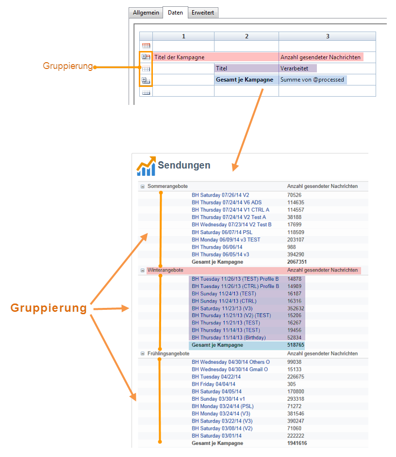

### Umsetzung {#implementation-steps}

Ein Beispiel für die vollständige Implementierung finden Sie hier: [Anwendungsbeispiel: Bericht mit einer Liste mit Gruppierung erstellen](#use-case--create-a-report-with-a-group-list).

Im Folgenden werden die Etappen zur Erstellung einer Tabelle vom Typ &quot;Liste mit Gruppierung&quot; kurz zusammengefasst:

1. Gehen Sie zur Grafik des Berichts und platzieren Sie eine **[!UICONTROL Abfrageaktivität]**. Siehe [Zu analysierende Daten abrufen](../../reporting/using/collecting-data-to-analyze.md).
1. Geben Sie die Quelltabelle an und wählen Sie die Felder der Tabelle aus, auf die sich die Statistiken beziehen sollen.
1. Platzieren Sie eine **[!UICONTROL Seitenaktivität]** in der Grafik. Weitere Informationen finden Sie unter [Statische Elemente](../../reporting/using/creating-a-new-report.md#static-elements).
1. Fügen Sie ein Diagramm vom Typ **[!UICONTROL Liste mit Gruppierung]** in die Seite ein.
1. Geben Sie den Pfad der Daten an, also die als Datenquelle in der Abfrage gewählte Tabelle.

   Diese Etappe ist zwingend erforderlich, um die Felder der Quelltabelle zu finden und sie in die Zellen der Tabelle einzufügen.

1. Erstellen Sie die Tabelle und Ihren Inhalt.
1. Überprüfen Sie im Tab **[!UICONTROL Vorschau]** den erstellten Bericht. Er kann nun publiziert und bei Bedarf in einem anderen Format exportiert werden. Weitere Informationen finden Sie unter [Berichtexport](../../reporting/using/actions-on-reports.md#exporting-a-report).

### Zeilen und Spalten hinzufügen {#adding-lines-and-columns}

Eine Tabelle vom Typ **[!UICONTROL Liste mit Gruppierung]** besteht standardmäßig aus einer Header-, einer Detail- und einer Footer-Zeile.

Eine Gruppierung enthält selbst ebenfalls eine Header-, eine Detail- und eine Footer-Zeile.

* **Header**: erlaubt die Angabe von Spaltentiteln.

   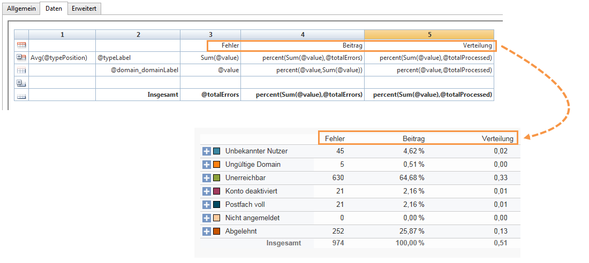

* **Detail**: enthält die Werte der Statistiken.

   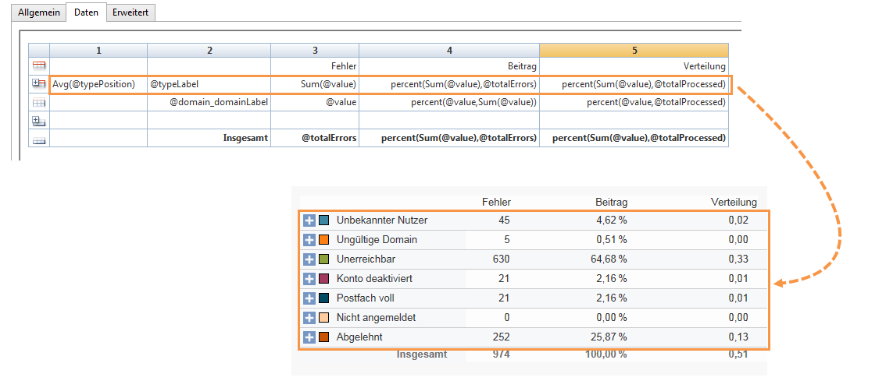

* **Footer**: erlaubt die Anzeige der Summen der Statistiken.

   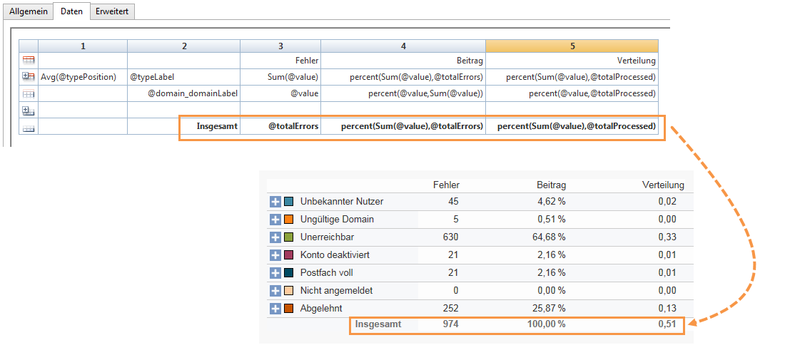

Sie können beliebig viele Spalten und Zeilen hinzufügen.

Die Gruppierung kann in einer beliebigen Zeile der Tabelle positioniert werden. Sie besteht selbst aus einer Header-, einer Detail- und einer Footer-Zeile.

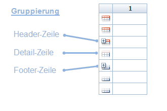

**Um eine Zeile oder eine Spalte hinzuzufügen, markieren Sie eine existierende Zeile oder Spalte und nutzen Sie die jeweiligen Kontextmenüs.**

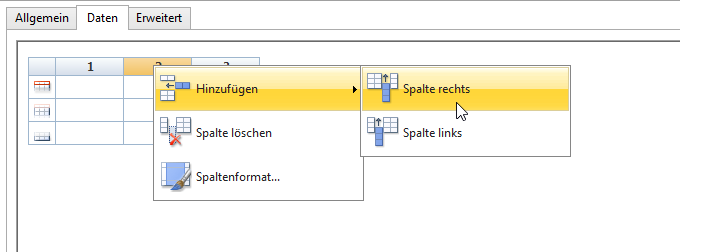

Um zum Beispiel eine Header-Zeile hinzuzufügen, muss der Mauszeiger auf einem Header positioniert und auf **[!UICONTROL Hinzufügen > Zeile oberhalb/unterhalb]** geklickt werden.

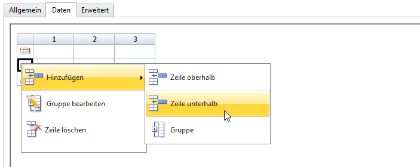

Die Breite der Spalten kann über den Menüpunkt **[!UICONTROL Spaltenformat]** geändert werden.

**Gruppierung**: Um eine Gruppierung hinzuzufügen, klicken Sie ebenfalls in eine Zeile und wählen Sie den entsprechenden Punkt im Kontextmenü aus.

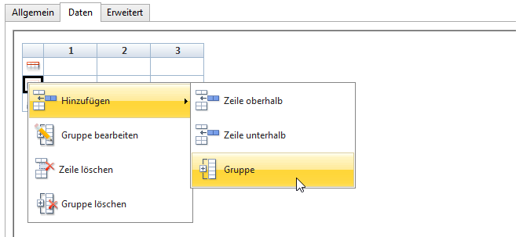

### Zelleninhalt bestimmen {#defining-cell-content}

Um eine Zeile der Tabelle zu bearbeiten und Inhalt und Format zu definieren, klicken Sie in die Zelle und nutzen Sie das Kontextmenü.

Wählen Sie den Menüpunkt **[!UICONTROL Ausdruck]**, um die anzuzeigenden Werte zu bestimmen.

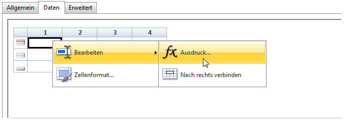

* Wenn Sie die zu analysierenden Werte direkt in die Tabelle einfügen möchten, wählen Sie sie unter den verfügbaren Feldern aus.

   Die Liste der verfügbaren Felder entspricht dem Inhalt der Abfrage, die der Tabelle im Berichtdiagramm vorausgeht.

   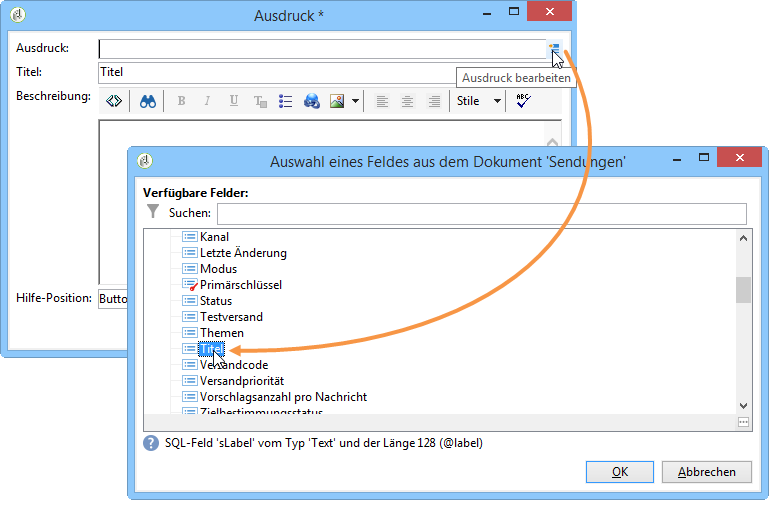

* Erfassen Sie einen Titel, zum Beispiel in einer Header-Zelle.

   Gehen Sie hierzu vor wie beim Einfügen eines Datenbank-Felds, aber wählen Sie keinen Ausdruck aus. Erfassen Sie den Titel im Feld **[!UICONTROL Titel]**: Er wird genau so angezeigt.

* Berechnen Sie ein Aggregat (Durchschnitt, Summe etc.) und lassen Sie es in einer Zelle anzeigen.

   Nutzen Sie hierzu den Menüpunkt **[!UICONTROL Aggregate]** und wählen Sie die gewünschte Funktion aus.

   

### Zellenformat bestimmen {#defining-cell-format}

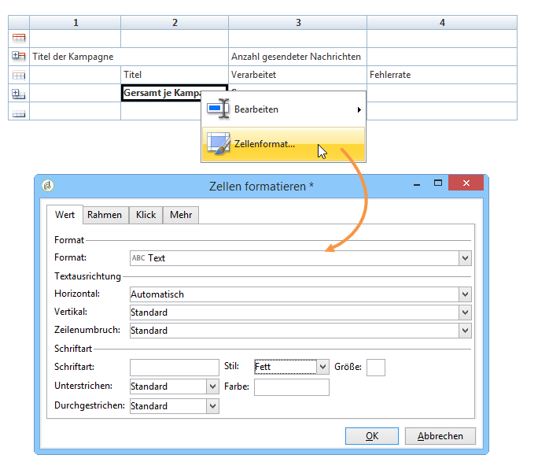

Um das Zellenformat zu definieren, ermöglicht der Menüpunkt **[!UICONTROL Zellenformat...]** Zugriff auf alle für die gewählte Zelle verfügbaren Formatierungsoptionen.

Diese Optionen erlauben es, die spätere Darstellung des Berichts anzupassen und die Lesbarkeit der enthaltenen Informationen zu optimieren.

Das Feld **[!UICONTROL Zeilenumbruch]** ist im Rahmen eines Datenexports im Excel-Format von Nutzen: Wählen Sie den Wert **[!UICONTROL Ja]** aus, um den Zeilenumbruch zu forcieren. Dieser Wert wird beim Export berücksichtigt. Weitere Informationen finden Sie unter [Berichtexport](../../reporting/using/actions-on-reports.md#exporting-a-report).

Über das Fenster **[!UICONTROL Zellen formatieren]** erhalten Sie Zugriff auf den folgenden Tab:

* Den Tab **[!UICONTROL Wert]**
* Den Tab **[!UICONTROL Rahmen]**
* Den Tab **[!UICONTROL Klick]**
* Den Tab **[!UICONTROL Mehr]**

Im Tab **[!UICONTROL Wert]** können die Schriftart und die unterschiedlichen Attribute der Werte verändert oder ihnen ein ihrer Art entsprechendes Format zugeteilt werden.

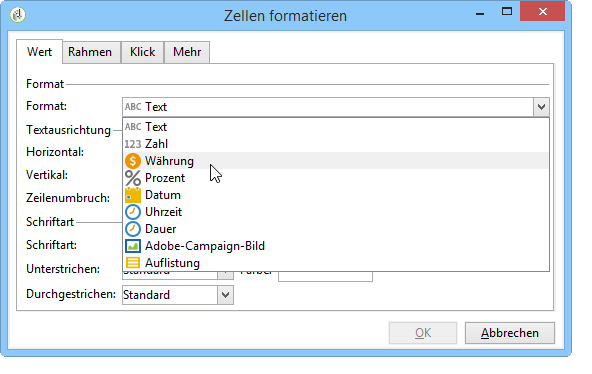

Das Format ändert die Anzeige der Daten: Die Formate **[!UICONTROL Zahl]**, **[!UICONTROL Währung]** und **[!UICONTROL Prozent]** erlauben beispielsweise eine rechtsbündige Anzeige der Ziffern mit Dezimalen.

Konfigurationsbeispiel Währungsformat: Sie können die Währung angeben, in der die Werte ausgedrückt werden, das Tausendertrennzeichen bei Bedarf verwenden und negative Werte in Rot anzeigen. Die Position des Währungssymbols hängt von der Sprache des Benutzers ab, die in seinem Profil festgelegt wurde.

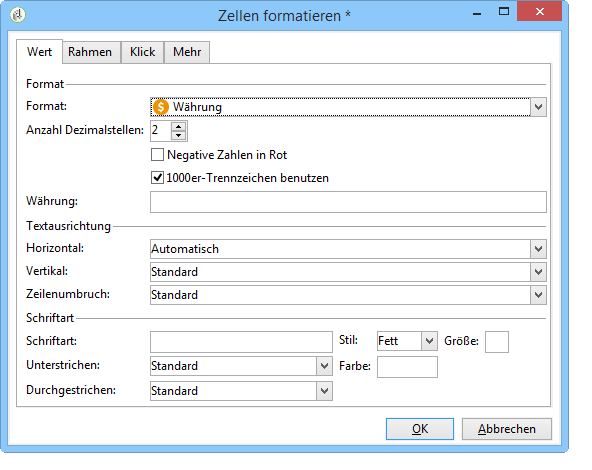

Konfigurationsbeispiel Datumsformat: Bei Bedarf kann die Uhrzeit angezeigt werden.

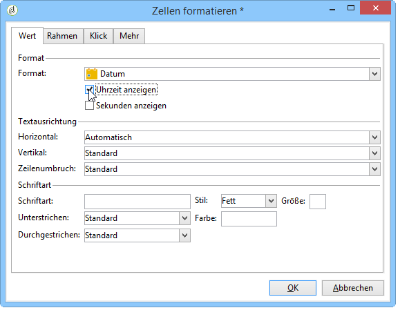

Im Tab **Rahmen** können den Zeilen und Spalten der Tabelle Rahmen hinzufügt werden. Die Umrahmung von Zellen kann die Leistung beim Export von umfangreichen Berichten im Excel-Format beeinträchtigen.

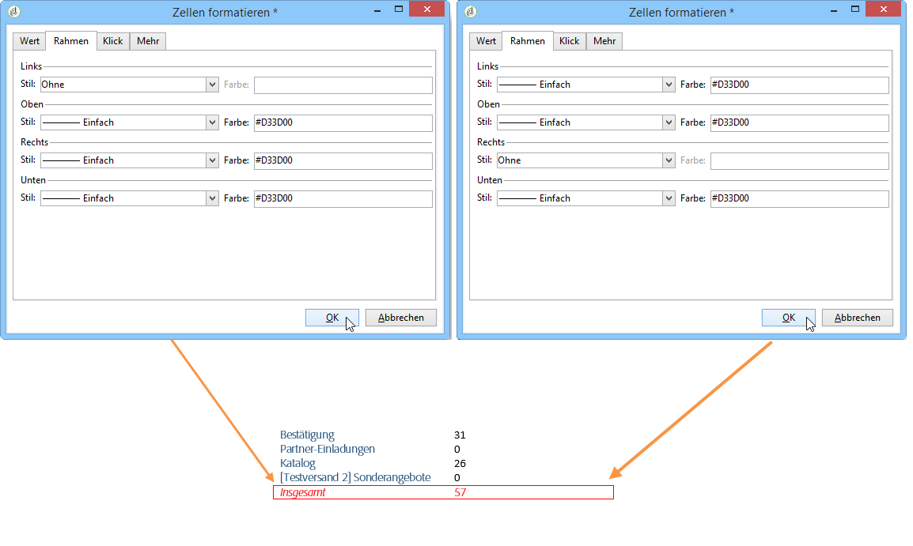

Bei Bedarf können Rahmen auch in der Tabellenvorlage hinzugefügt werden (**[!UICONTROL Administration > Konfiguration > Formular-Rendering]** ).

Die Syntax lautet in diesem Fall wie folgt:

im Web-Tab:

```
 .tabular td {
 border: solid 1px #000000;
 }
```

im Excel-Tab:

```
 <style name="odd" fillColor="#fdfdfd">
  <border>
   <borderTop value="solid 0.05pt #000000" />
   <borderBottom value="solid 0.05pt #000000" />
   <borderLeft value="solid 0.05pt #000000" />
   <borderRight value="solid 0.05pt #000000" />
  </border>
 </style> 
 
 <style name="even" fillColor="#f7f8fa">
  <border>
   <borderTop value="solid 0.05pt #000000" />
   <borderBottom value="solid 0.05pt #000000" />
   <borderLeft value="solid 0.05pt #000000" />
   <borderRight value="solid 0.05pt #000000" />
  </border>
 </style> 
```

Im Tab **[!UICONTROL Klick]** kann definiert werden, welche Aktion der Klick auf den Inhalt einer Zelle der Tabelle ermöglicht.

Im nachstehenden Beispiel wird durch Klick auf die Zelle die zweite Seite des Berichts angezeigt: Sie enthält Informationen bezüglich des in der Zelle enthaltenen Versands.

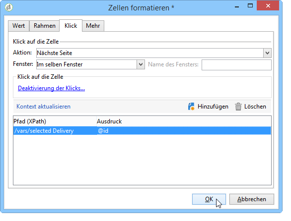

Mit dem Tab **Mehr** kann das Layout der Daten ausgewählt werden, zum Beispiel eine Farbplakette oder ein Bargraph. Die Farbplakette wird genutzt, wenn die Tabelle als Legende einer Grafik angezeigt wird. Weitere Informationen finden Sie im Implementierungsbeispiel: [5. Schritt - Zweite Seite konfigurieren](#step-5---create-the-second-page)

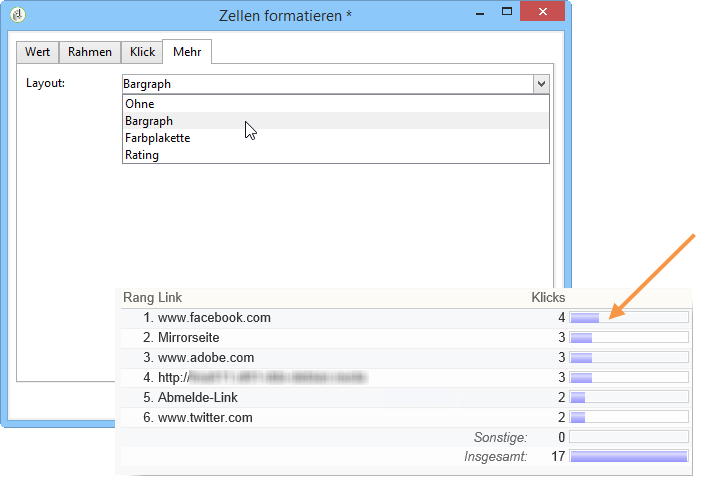

## Anwendungsbeispiel: Bericht mit einer Liste mit Gruppierung erstellen {#use-case--create-a-report-with-a-group-list}

In diesem Beispiel wird ein zweiseitiger Bericht erstellt: Die erste Seite soll die Liste und die Summe der Sendungen pro Kampagne sowie die Anzahl der gesendeten Nachrichten enthalten. Der Titel der Sendungen erhält die Form eines anklickbaren Links und wird den Zugriff auf die zweite Seite des Berichts ermöglichen, um die Verteilung der gesendeten Nachrichten des gewählten Versands pro E-Mail-Domain in einer Tabelle und einer Grafik einzusehen. Auf der zweiten Seite soll die Tabelle als Legende der Grafik dienen.

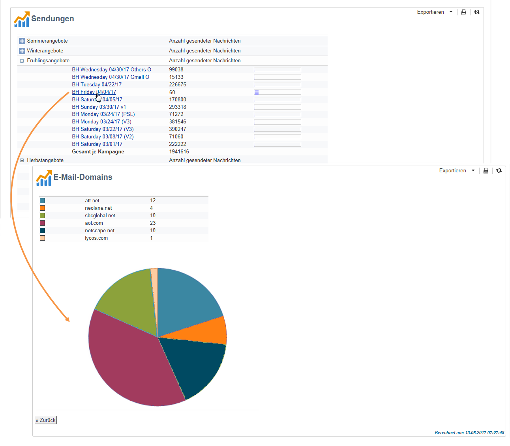

### 1. Schritt - Bericht erstellen {#step-1---create-a-report}

Erstellen Sie einen neuen Bericht, der sich auf das Kampagnen-Schema bezieht (**[!UICONTROL Kampagnen (nms)]**).

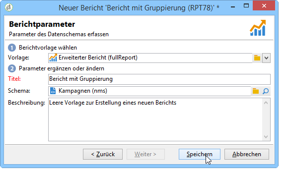

Klicken Sie auf **[!UICONTROL Speichern]**.

Positionieren Sie im Bericht die ersten Komponenten zur Erstellung des Inhalts: eine erste Abfrage und eine erste Seite.

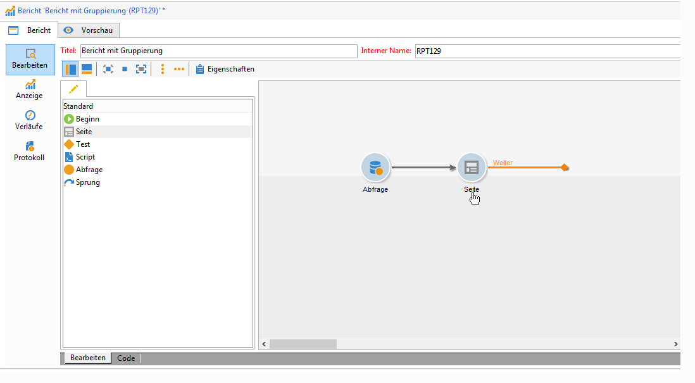

### 2. Schritt - Erste Abfrage konfigurieren {#step-2---create-the-first-query}

Die erste Abfrage soll die Sendungen aller Kampagnen abrufen.

Doppelklicken Sie auf die erste Abfrage, um sie zu öffnen, und konfigurieren Sie sie folgenderweise:

1. Ändern Sie zunächst das Schema, auf das sich die Abfrage bezieht: Wählen Sie das Schema **[!UICONTROL Sendungen (nms)]**.
1. Klicken Sie auf den Link **[!UICONTROL Abfrage bearbeiten...]** und aktivieren Sie die Anzeige der erweiterten Felder.

   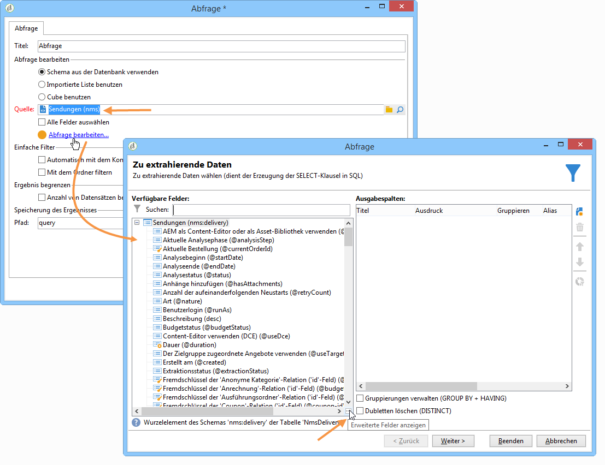

1. Wählen Sie die folgenden Felder aus:

   * Titel des Versands,
   * Primärschlüssel des Versands,
   * Titel der Kampagne,
   * Indikator der verarbeiteten Sendungen,
   * Fremdschlüssel des Kampagnen-Links,
   * Indikator der Fehlerrate.

   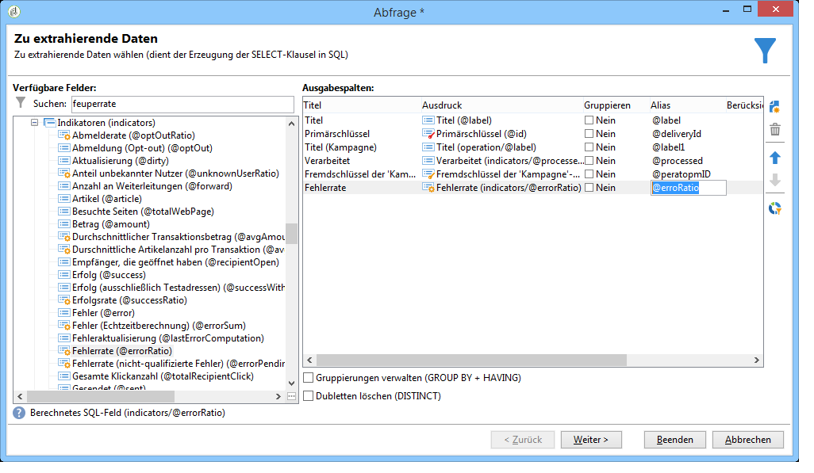

   Ordnen Sie jedem Feld einen Alias zu: Dies erleichtert die Auswahl der Daten der Tabelle, die in der ersten Seite des Berichts hinzugefügt wird.

   Im vorliegenden Beispiel werden die folgenden Alias verwendet:

   * Titel: **@label**
   * Primärschlüssel: **@deliveryId**
   * Titel (Kampagne): **@label1**
   * Verarbeitet: **@processed**
   * Fremdschlüssel der &#39;Kampagne&#39;-Relation (&#39;id&#39;-Feld) **@operationId**
   * Fehlerrate: **@errorRatio**


1. Klicken Sie zweimal auf die Schaltfläche **[!UICONTROL Weiter]** bis zur Etappe **[!UICONTROL Datenfilterung]**.

   Fügen Sie eine Filterbedingung hinzu, um nur die zu einer Kampagne gehörenden Sendungen abzurufen.

   Die Syntax des Filters sollte wie folgt lauten: &quot;Fremdschlüssel der &#39;Kampagne&#39;-Relation größer als 0&quot;.

   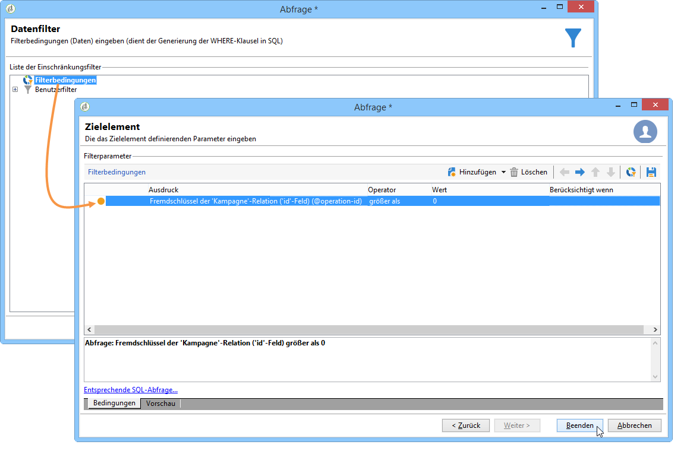

1. Klicken Sie zur Speicherung dieser Bedingung auf **[!UICONTROL Beenden]** und zum Schließen des Abfrage-Editors auf **[!UICONTROL OK]**.

### 3. Schritt - Erste Seite konfigurieren {#step-3--create-the-first-page}

In diesem Schritt wird die erste Seite des Berichts konfiguriert. Gehen Sie wie folgt vor:

1. Öffnen Sie die **[!UICONTROL Seite]**-Aktivität und vergeben Sie einen Titel, hier zum Beispiel **Sendungen**.

   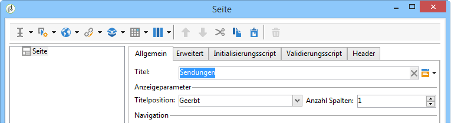

1. Fügen Sie eine Liste mit Gruppierung über die Symbolleiste ein und geben Sie ihr einen Titel, hier zum Beispiel Liste der Sendungen nach Kampagne.

   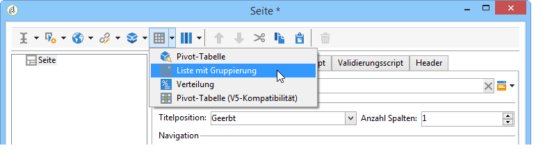

1. Klicken Sie auf den Link **[!UICONTROL Pfad der Tabellendaten...]** und wählen Sie den Sendungen-Link aus, also `[query/delivery]`.

   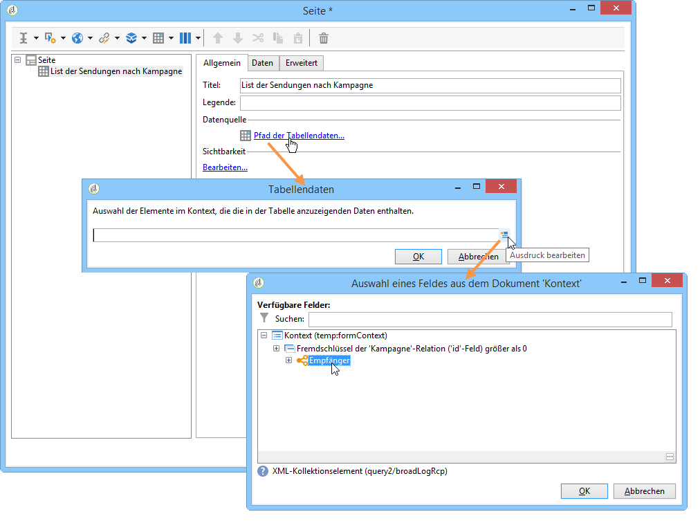

1. Klicken Sie auf den Tab **[!UICONTROL Daten]** und vergrößern Sie die Tabelle, indem Sie sie rechts auf insgesamt drei Spalten erweitern.

   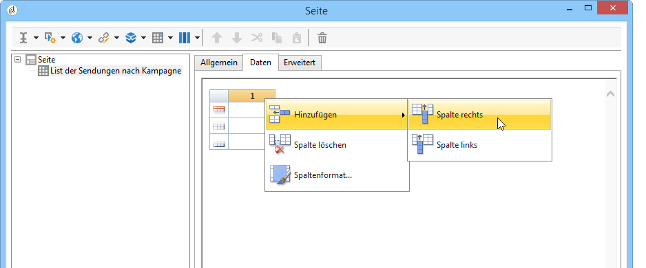

1. Fügen Sie eine Gruppierung hinzu.

   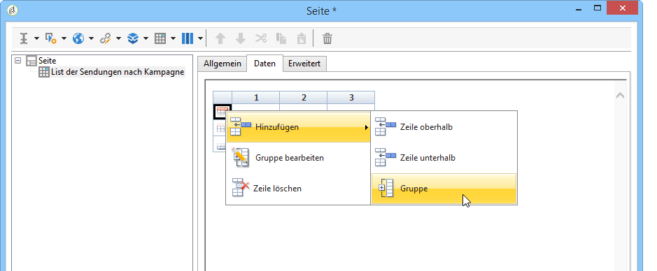

   Diese Gruppierung wird es ermöglichen, die Kampagnen und die ihnen zugeordneten Sendungen zusammenzufassen.

1. Referenzieren Sie im Gruppierungsfenster den **Fremdschlüssel der &#39;Kampagne&#39;-Relation** und schließen Sie das Fenster.

   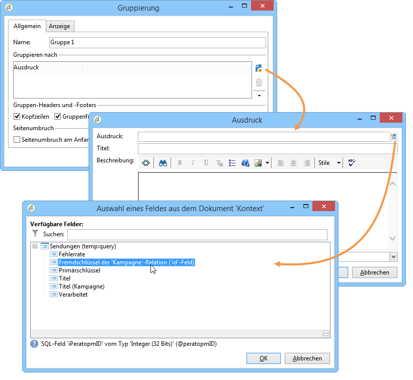

1. Bearbeiten Sie die erste Zelle des Gruppierungs-Headers und fügen Sie das **[!UICONTROL Titel]**-Feld der Kampagnen als Ausdruck ein.

   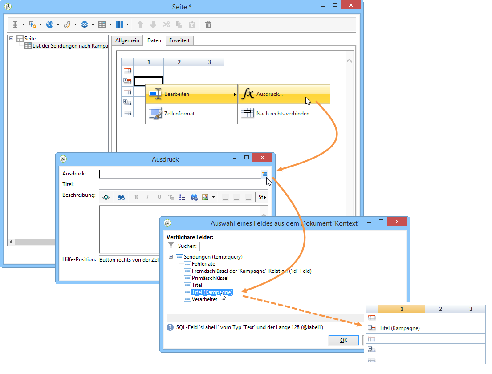

1. Bearbeiten Sie die zweite Zelle der Detailzeile und wählen Sie das **[!UICONTROL Titel]**-Feld der Sendungen.

   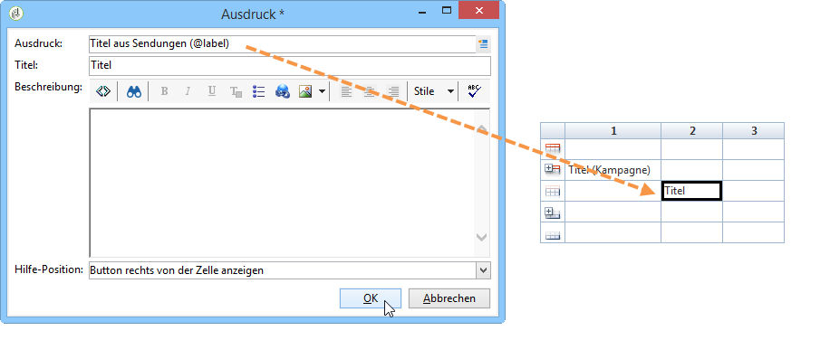

1. Bearbeiten Sie das Format der Zelle und öffnen Sie den Tab **[!UICONTROL Klick]**. Konfigurieren Sie die entsprechenden Optionen dahingehend, dass beim Klick auf den Namen eines Versands sich dieser im selben Fenster öffnet.

   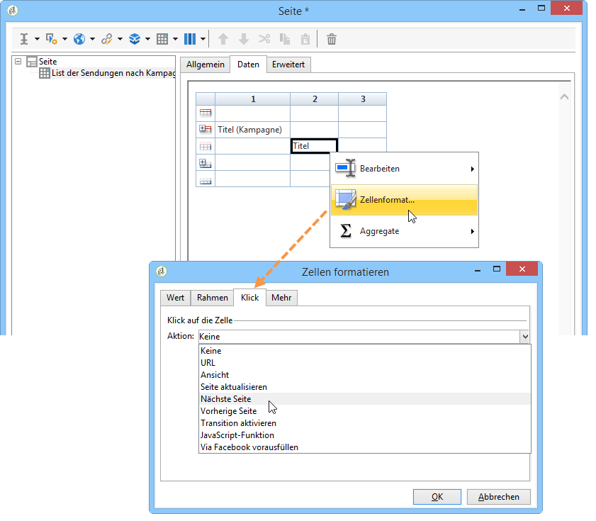

   Wählen Sie hierzu die Aktion vom Typ **[!UICONTROL Nächste Seite]** mit der Fensteroption **[!UICONTROL Im selben Fenster]**.

   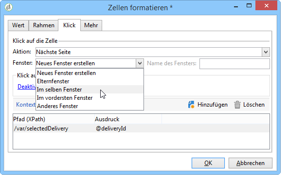

1. Klicken Sie im unteren Bereich des Fensters auf **[!UICONTROL Hinzufügen]** und geben Sie den Pfad **`/vars/selectedDelivery`** sowie den Ausdruck **[!UICONTROL @deliveryId]** an, der dem Alias des Primärschlüssels des Versands entspricht, der in der zuvor erstellten Abfrage definiert wurde. Diese Formel ermöglicht den Zugriff auf den gewählten Versand.

   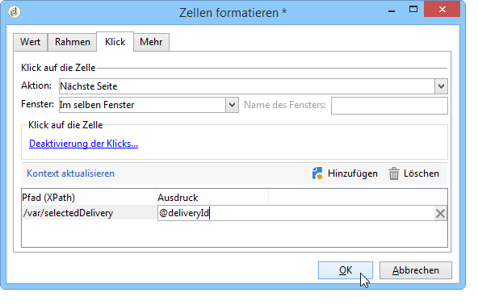

1. Bearbeiten Sie die zweite Zelle des Gruppierungs-Footers und geben Sie den Titel **[!UICONTROL Gesamt je Kampagne]** ein.

   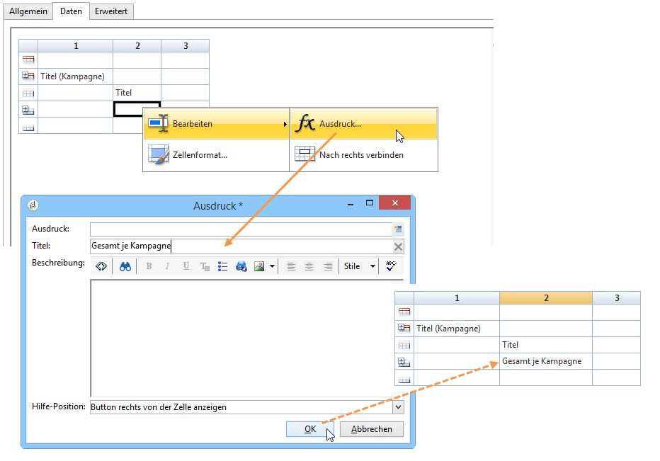

1. Bearbeiten Sie die dritte Zelle des Gruppierungs-Headers und geben Sie den Titel **[!UICONTROL Anzahl gesendeter Nachrichten]** an.

   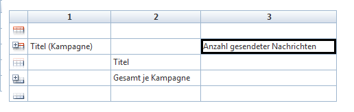

   Diese Information entspricht dem Spaltentitel.

1. Bearbeiten Sie die dritte Zelle der Detailzeile und wählen Sie als Ausdruck den Indikator &quot;Verarbeitete Nachrichten&quot; aus.

   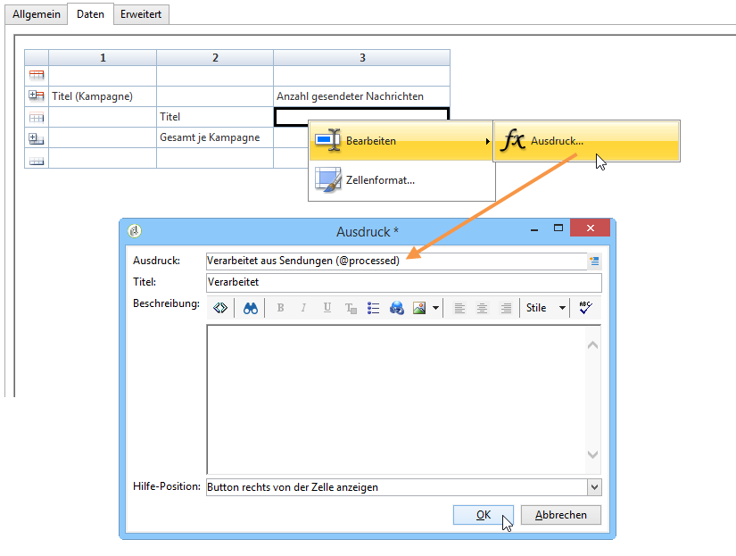

1. Bearbeiten Sie die dritte Zelle des Gruppierungs-Footers, wählen Sie den Indikator der verarbeiteten Sendungen und teilen Sie ihm das Aggregat **[!UICONTROL Summe]** zu.

   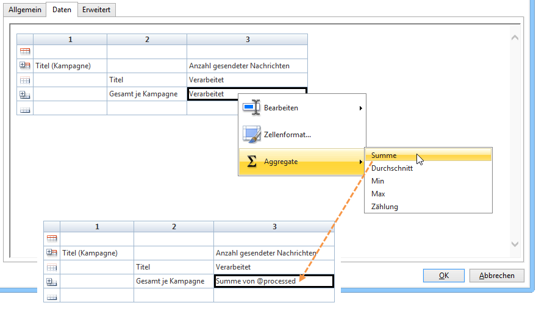

1. Bearbeiten Sie die vierte Zelle der Detailzeile und wählen Sie den Ausdruck **Fehlerrate der Sendungen** aus.

   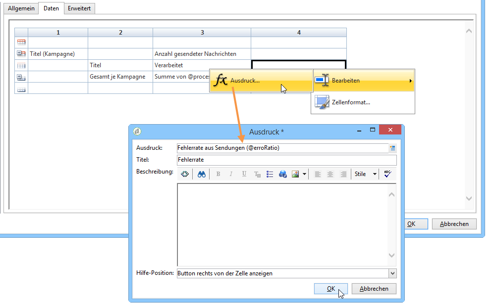

1. Markieren Sie diese Zelle, um die Fehlerrate der Sendungen als Bargraph darzustellen.

   Gehen Sie hierzu in den Tab **[!UICONTROL Mehr]** des Zellenformats. Wählen Sie dort das Format **[!UICONTROL Bargraph]** in der Dropdown-Liste aus und aktivieren Sie die Option **[!UICONTROL Zellenwert ausblenden]**.

   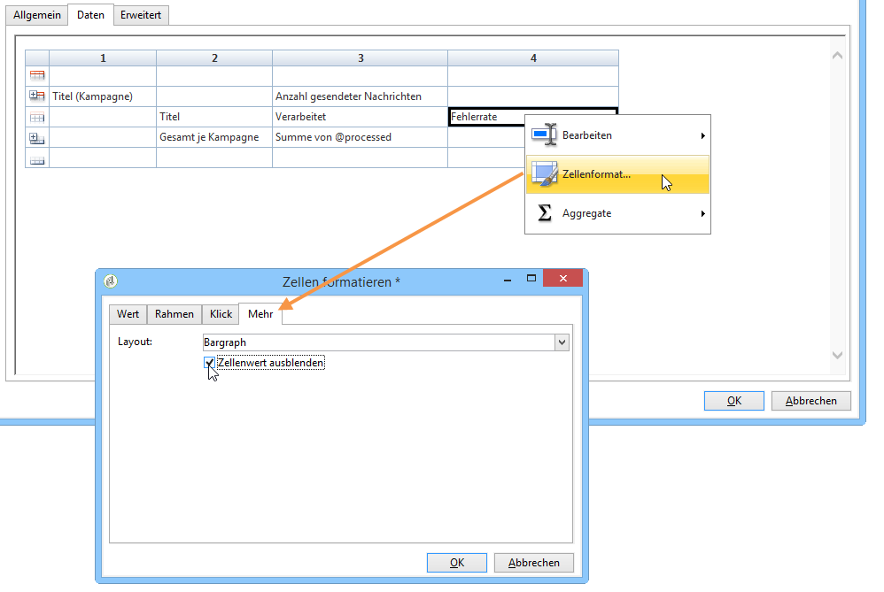

   Sie können nun die **[!UICONTROL Vorschau]** des Berichts im gleichnamigen Tab einsehen. Aktivieren Sie die Option **[!UICONTROL Allgemein]**: Die Liste aller mit einer Kampagne verbundenen Sendungen aus der Adobe-Campaign-Datenbank wird angezeigt.

   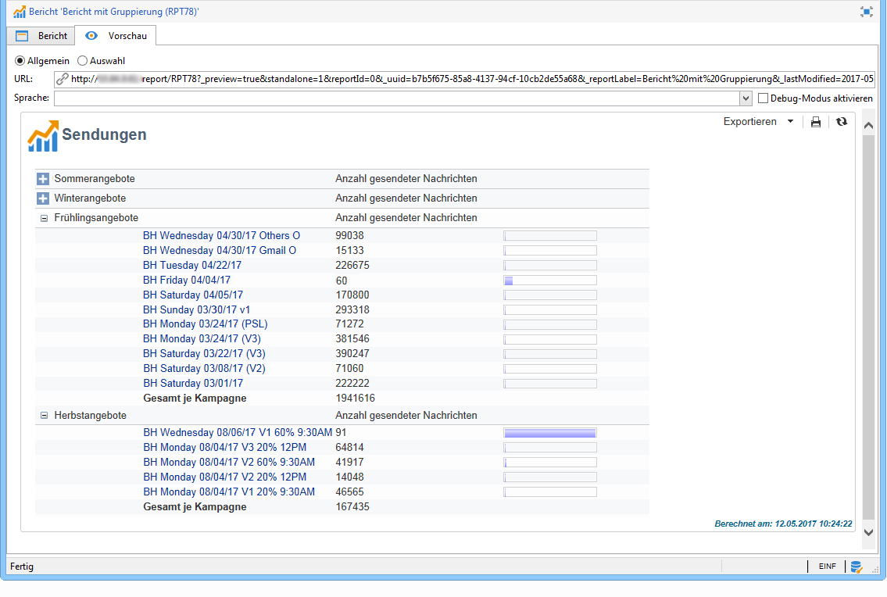

   Es wird empfohlen, stets im **[!UICONTROL Vorschau]**-Tab zu überprüfen, ob die Tabellendaten korrekt ausgewählt und konfiguriert wurden. Nach der Überprüfung können Sie Ihre Tabelle formatieren.

1. Wählen Sie für die Zellen, die die Gesamtanzahl pro Kampagne und die Summen der verarbeiteten Nachrichten anzeigen, den Stil **[!UICONTROL Fett]** aus.

   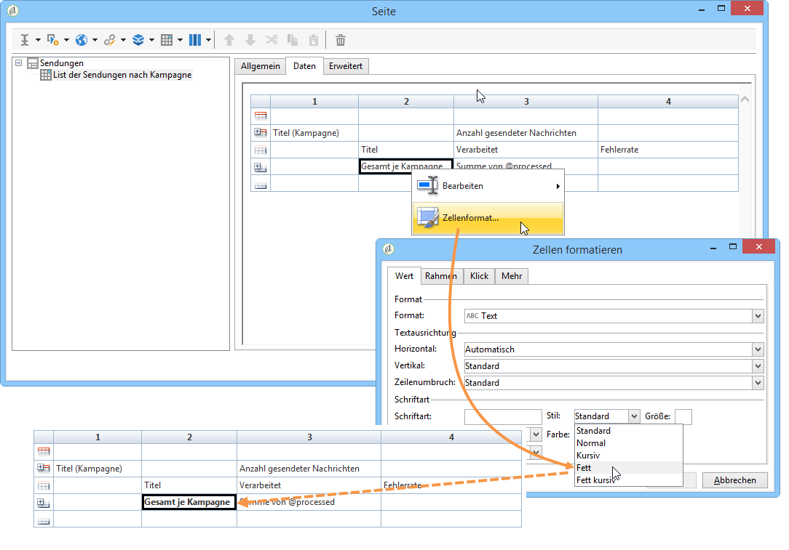

1. Klicken Sie auf die erste Zelle des Gruppierungs-Headers, die den Namen der Kampagne enthält, und wählen Sie **[!UICONTROL Bearbeiten > Nach rechts verbinden]**.

   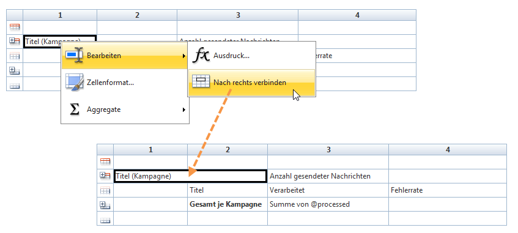

   Durch die Verbindung der ersten beiden Zellen des Gruppierungs-Headers wird der Abstand zwischen dem Titel der Kampagne und der Liste der ihr zugehörigen Sendungen verkleinert.

   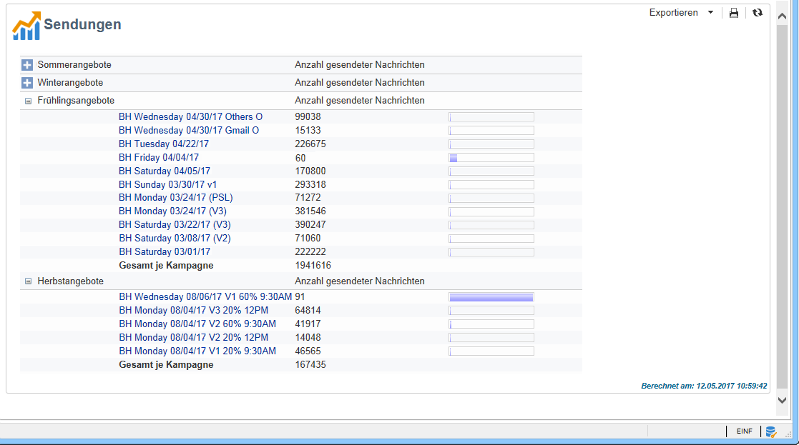

   >[!CAUTION]
   >
   >Dieser Vorgang kann nicht rückgängig gemacht werden. Daher wird ausdrücklich empfohlen, Zellen erst dann zu verbinden, wenn die Erstellung des Berichts abgeschlossen ist.

### 4. Schritt - Zweite Abfrage erstellen {#step-4---create-the-second-query}

Es werden eine zweite Abfrage und eine zweite Seite hinzugefügt, um die Details eines Versands anzuzeigen, wenn er vom Benutzer des Berichts angeklickt wird. Bevor Sie die Abfrage hinzufügen, öffnen Sie die bereits erstellte Seite und aktivieren Sie die ausgehende Transition, um sie mit der Abfrage verbinden zu können.

1. Fügen Sie die neue Abfrage nach der **[!UICONTROL Seite]**-Aktivität ein und wählen Sie als Quellschema die **[!UICONTROL Versandlogs der Empfänger]** aus.

   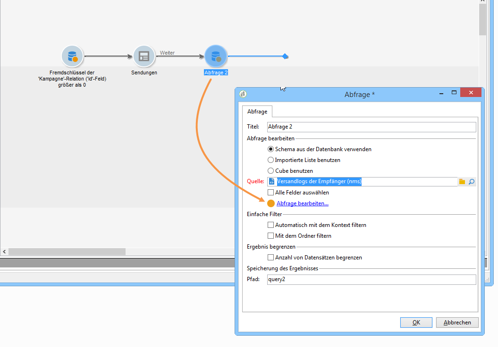

1. Öffnen Sie die Abfrage und bestimmen Sie die Ausgabespalten. Um die Anzahl an Sendungen je E-Mail-Domain anzuzeigen, gehen Sie wie folgt vor:

   * Konfigurieren Sie die Zählung der Versandlogs über deren Primärschlüssel:

      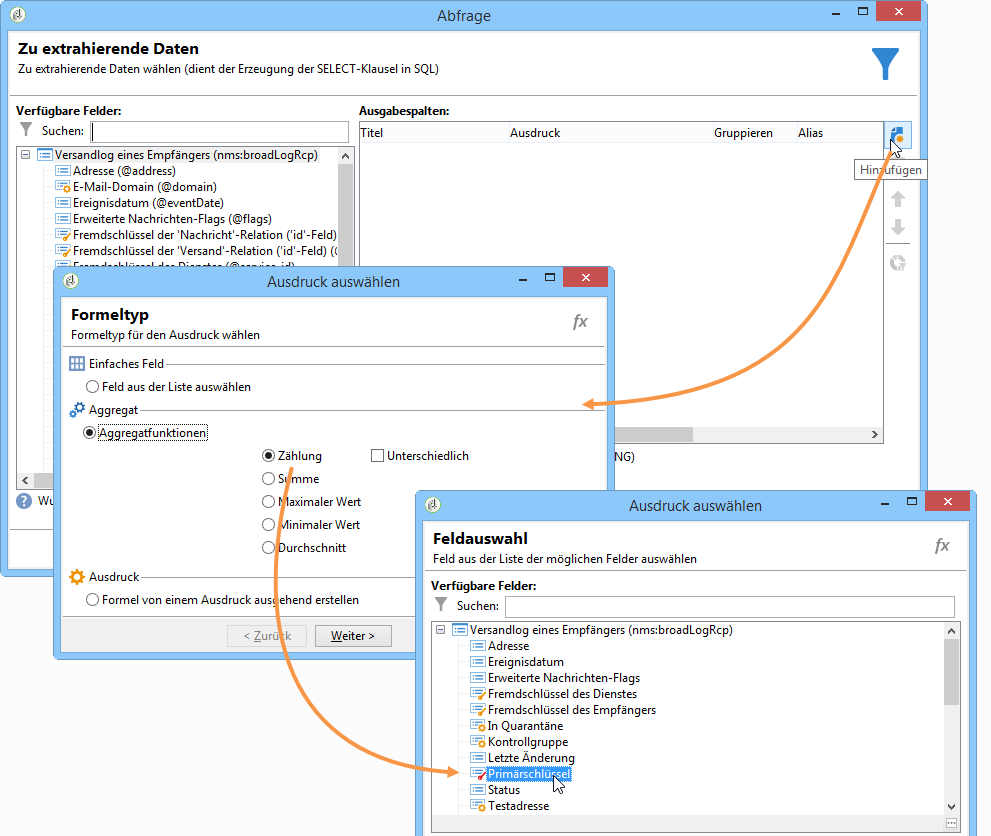

   * Fragen Sie die E-Mail-Domains der Empfänger ab und aktivieren Sie die Gruppierung für dieses Feld. Aktivieren Sie hierzu die Option **[!UICONTROL Gruppieren]** der Spalte des Domain-Namens.

   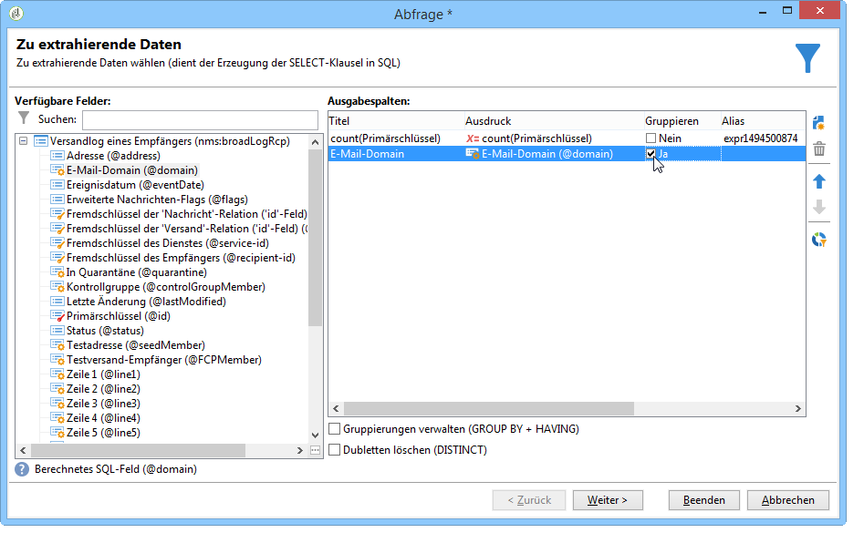

   Ordnen Sie den Feldern die folgenden Alias zu:

   * count(Primärschlüssel): **@count**
   * E-Mail-Domain (Empfänger): **@domain**

      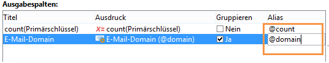


1. Klicken Sie zweimal auf die Schaltfläche **[!UICONTROL Weiter]**, bis zum Schritt **[!UICONTROL Datenfilter]**.

   Fügen Sie eine Filterbedingung hinzu, um nur die mit dem markierten Versand zusammenhängenden Informationen abzufragen.

   Die Syntax lautet wie folgt: Fremdschlüssel der &#39;Versand&#39;-Relation ist gleich dem Wert dieses Parameters `$([vars/selectedDelivery])`

   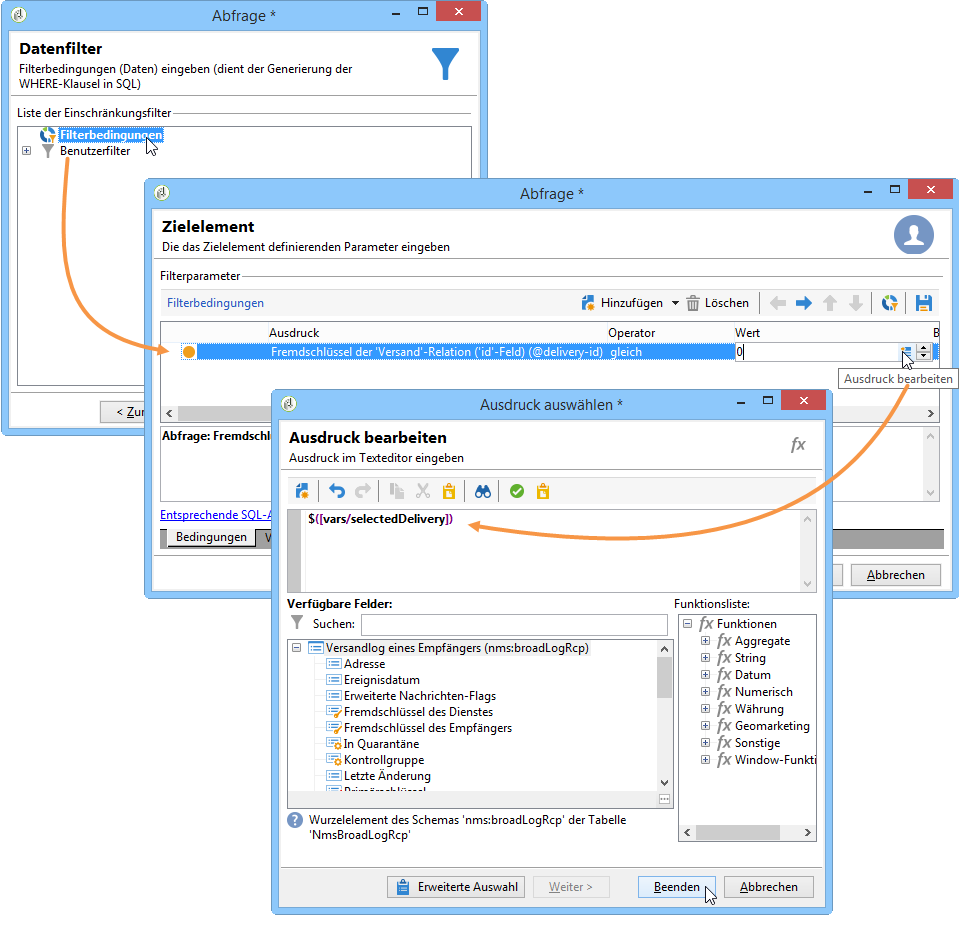

1. Schließen Sie das Konfigurationsfenster der Abfrage und fügen Sie dem Diagramm im Anschluss an die zweite Abfrage eine Seite hinzu.

### 5. Schritt - Zweite Seite konfigurieren {#step-5---create-the-second-page}

1. Öffnen Sie die Seite und vergeben Sie einen Titel, hier **E-Mail-Domains**.
1. Deaktivieren Sie die Option **[!UICONTROL Ausgehende Transitionen aktivieren]**: Diese Seite ist die letzte Aktivität des Berichts.

   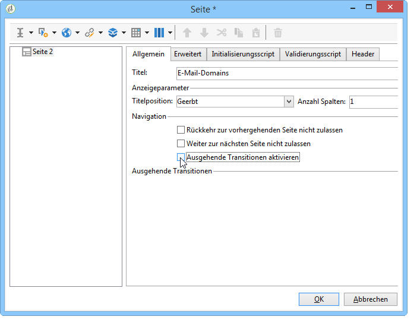

1. Fügen Sie eine neue Gruppierungs-Liste mithilfe des Kontextmenüs hinzu und geben Sie ihr den Titel **E-Mail-Domains nach Empfängern**.
1. Klicken Sie auf den Link **[!UICONTROL Pfad der Tabellendaten...]** und wählen Sie die Relation **[!UICONTROL Versandlogs der Empfänger]**.

   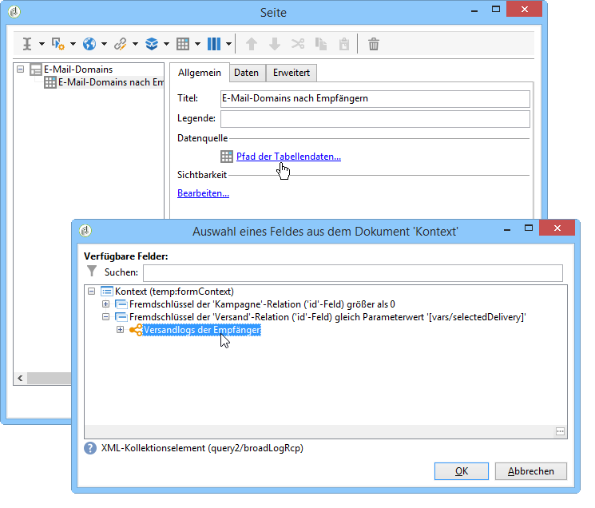

1. Passen Sie die Tabelle im Tab **[!UICONTROL Daten]** wie folgt an:

   * Fügen Sie rechts zwei zusätzliche Spalten ein.
   * Fügen Sie in der ersten Zelle der Detailzeile den Ausdruck **[!UICONTROL rowNum()-1]** hinzu, um die Anzahl der Zeilen zu zählen. Ändern Sie anschließend das Format der Zelle: Wählen Sie im Tab **[!UICONTROL Mehr]** die Option **[!UICONTROL Farbplakette]** aus und klicken Sie auf **[!UICONTROL OK]**.

      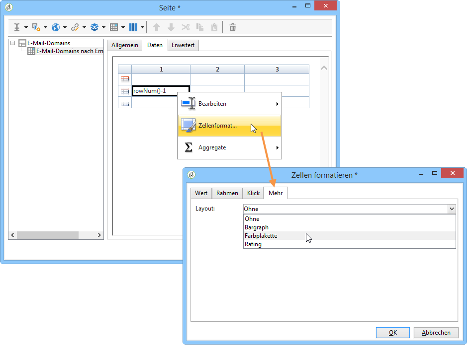

      Diese Konfiguration ermöglicht es, die Tabelle als Legende für die Grafik zu verwenden.

   * Fügen Sie in der zweiten Zelle der Detailzeile den Ausdruck **[!UICONTROL E-Mail-Domain(Empfänger)]** hinzu.
   * Fügen Sie in der dritten Zelle der Detailzeile den Ausdruck **[!UICONTROL count(Primärschlüssel)]** hinzu.

   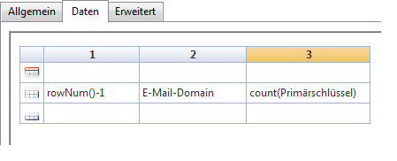

1. Fügen Sie der Seite über das Kontextmenü ein Kreisdiagramm hinzu und geben Sie ihm den Titel **E-Mail-Domains**. Weitere Informationen finden Sie unter [Grafiktypen und ihre Parameter](../../reporting/using/creating-a-chart.md#chart-types-and-variants).
1. Klicken Sie auf den Link **[!UICONTROL Grafikparameter...]** und deaktivieren Sie die Optionen **[!UICONTROL Titel anzeigen]** und **[!UICONTROL Legende anzeigen]**.
1. Stellen Sie sicher, dass keine Wertesortierung konfiguriert wurde. Nähere Informationen diesbezüglich erhalten Sie in [diesem Abschnitt](../../reporting/using/processing-a-report.md#configuring-the-layout-of-a-descriptive-analysis-report).

   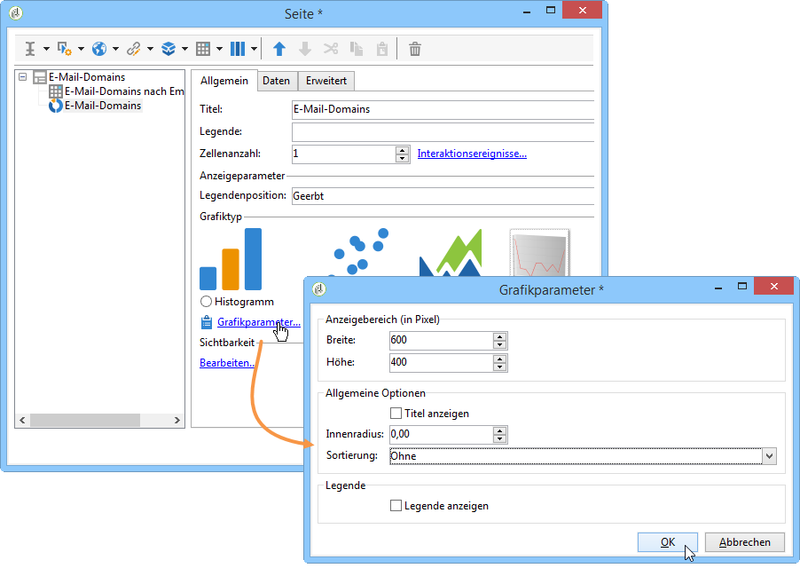

1. Ändern Sie im Tab **[!UICONTROL Daten]** die Datenquelle: Wählen Sie **[!UICONTROL Kontextdaten]** aus der Dropdown-Liste aus.

   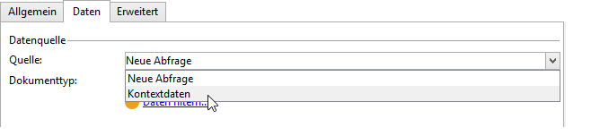

1. Klicken Sie dann auf **[!UICONTROL Erweiterte Parameter]** und wählen Sie die Relation der Empfänger-Versandlogs.

   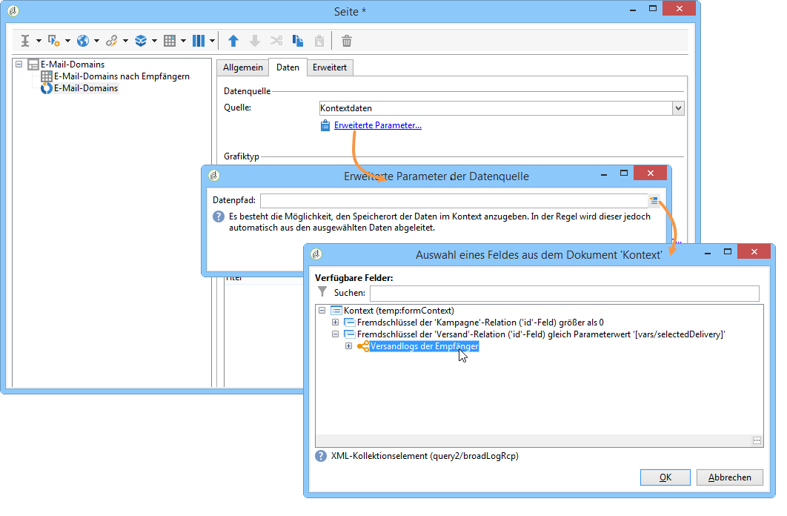

1. Wählen Sie im Abschnitt **[!UICONTROL Grafiktyp]** die Variable **[!UICONTROL E-Mail-Domain]**.
1. Fügen Sie anschließend die auszuführende Berechnung hinzu: Wählen Sie Summe als Funktion.

   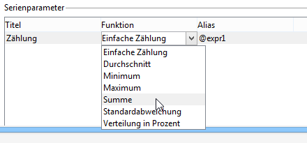

1. Klicken Sie auf die Schaltfläche **[!UICONTROL Detail]**, um das Feld auszuwählen, auf dass sich die Zählung beziehen soll, und schließen Sie das Konfigurationsfenster der Seite.

   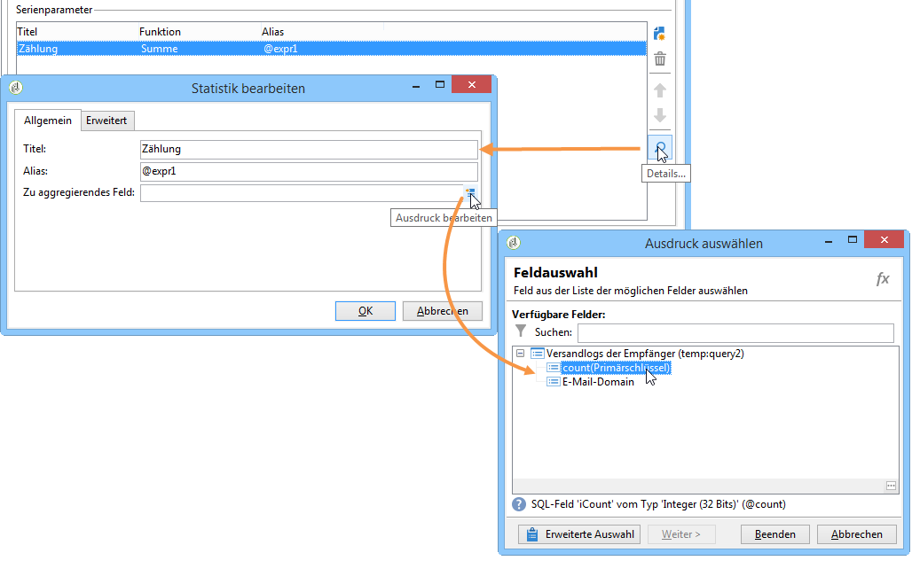

1. Speichern Sie den Bericht.

   Die zweite Seite ist nun konfiguriert.

### 6. Schritt - Bericht überprüfen {#step-6---viewing-the-report}

Um das Ergebnis der Konfiguration zu überprüfen, klicken Sie auf den Tab **[!UICONTROL Vorschau]** und wählen Sie die Option **[!UICONTROL Allgemein]** aus.

Die erste Seite des Berichts zeigt die Liste aller in der Datenbank enthaltenen Sendungen.

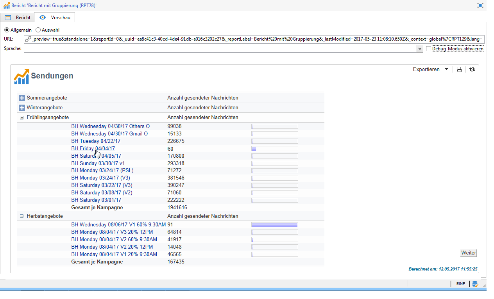

Durch Klick auf den Link einer der Sendungen wird die Verteilung dieses Versands pro E-Mail-Domain angezeigt. Von der zweiten Seite des Berichts können Sie über die entsprechende Schaltfläche auf die vorhergehende Seite zurückkehren.

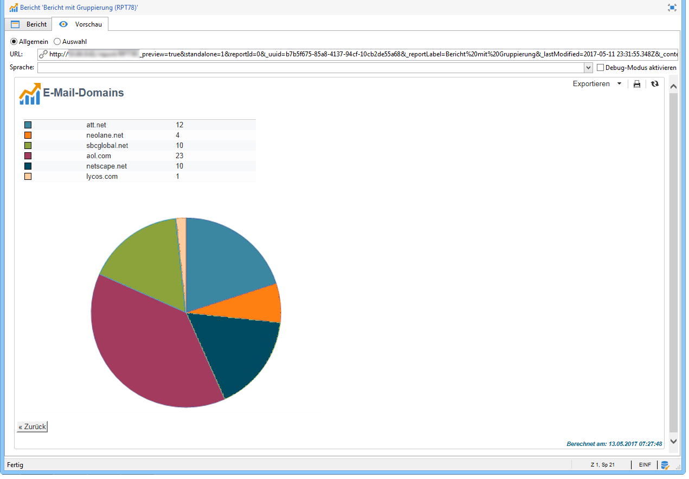

## Verteilungs- oder Pivot-Tabelle erstellen {#creating-a-breakdown-or-pivot-table}

Dieser Tabellentyp ermöglicht die Anzeige von Statistiken über die Datenbank.

Die Konfiguration derartiger Berichte entspricht der im Assistenten zur deskriptiven Analyse verwendeten. Lesen Sie hierzu [diese Seite](../../reporting/using/using-the-descriptive-analysis-wizard.md#configuring-the-quantitative-distribution-template).

Die Erstellung einer Pivot-Tabelle wird in [diesem Abschnitt](../../reporting/using/using-cubes-to-explore-data.md) beschrieben.
