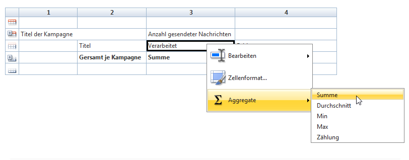

# Tabellen erstellen{#creating-a-table}

Sie haben die Möglichkeit, in Berichten je nach anzuzeigenden Daten verschiedene Tabellenarten zu verwenden. Es kann sich dabei um eine Liste mit Gruppierung, eine Tabelle mit Werteverteilung oder um eine über Cube-Messungen erstellte Pivot-Tabelle handeln.


## Liste mit Gruppierung erstellen {#creating-a-list-with-group}

Mit einer **[!UICONTROL List with group]** Typtabelle können Sie Daten in der Tabelle gruppieren und Statistiken dazu erstellen. Sie können beispielsweise Summen und Zwischensummen für die Daten erstellen. Jede Gruppe hat ihre eigene Kopf-, Detail- und Fußzeile.

>[!CAUTION]
>
>Der **[!UICONTROL Page]** Aktivität, die die Tabelle enthält, muss eine **[!UICONTROL Query]** oder **[!UICONTROL Script]** Aktivität vorausgehen, um die im Bericht zu analysierenden Daten zu erfassen. Weitere Informationen zu diesen Aktivitäten finden Sie unter [Datenerfassung zur Analyse](../../reporting/using/collecting-data-to-analyze.md) und [Skriptaktivität](../../reporting/using/advanced-functionalities.md#script-activity).

### Grundprinzip {#operating-principle}

Es besteht die Möglichkeit, dass Sie mehrere Datenkategorien gleichzeitig zu analysieren haben. Eine Liste mit Gruppierung ermöglicht es Ihnen, bestimmte Daten zusammenzufassen und Statistiken über unterschiedliche Gruppen in der gleichen Tabelle zu erzeugen. Erstellen Sie hierzu eine Gruppierung in der Tabelle.

Im unten stehenden Beispiel werden mithilfe der Gruppierung die Gesamtheit aller Kampagnen der Datenbank, die Sendungen und die Anzahl der pro Versand und pro Kampagne versendeten Nachrichten angezeigt.

It lets you list the campaigns (**[!UICONTROL Label (Campaign)]**, the list of deliveries (**[!UICONTROL Label]** ) linked to the campaign, and lets you count the number of messages sent per delivery (**[!UICONTROL Processed)]**, before adding them up for each campaign (**[!UICONTROL Sum(@processed)]** ).


### Umsetzung {#implementation-steps}

Ein Beispiel für die vollständige Implementierung finden Sie hier: Anwendungsfall: [Erstellen Sie einen Bericht mit einer Gruppenliste](#use-case--create-a-report-with-a-group-list).

Im Folgenden werden die Etappen zur Erstellung einer Tabelle vom Typ &quot;Liste mit Gruppierung&quot; kurz zusammengefasst:

1. Gehen Sie zum Berichtsdiagramm und platzieren Sie eine **[!UICONTROL Query]** Aktivität. Weitere Informationen finden Sie unter [Zu analysierende](../../reporting/using/collecting-data-to-analyze.md)Daten erfassen.
1. Geben Sie die Quelltabelle an und wählen Sie die Felder der Tabelle aus, auf die sich die Statistiken beziehen sollen.
1. Platzieren Sie eine **[!UICONTROL Page]** Aktivität in das Diagramm. Weitere Informationen finden Sie unter [Statische Elemente](../../reporting/using/creating-a-new-report.md#static-elements).
1. Fügen Sie eine **[!UICONTROL List with group]** Typtabelle in die Seite ein.
1. Geben Sie den Pfad der Daten an, also die als Datenquelle in der Abfrage gewählte Tabelle.

   Diese Etappe ist zwingend erforderlich, um die Felder der Quelltabelle zu finden und sie in die Zellen der Tabelle einzufügen.

1. Erstellen Sie die Tabelle und Ihren Inhalt.
1. Zeigen Sie den abgeschlossenen Bericht auf der **[!UICONTROL Preview]** Registerkarte an. Anschließend können Sie den Bericht veröffentlichen und ihn bei Bedarf in ein anderes Format exportieren. Weitere Informationen finden Sie unter [Berichtexport](../../reporting/using/actions-on-reports.md#exporting-a-report).

### Zeilen und Spalten hinzufügen {#adding-lines-and-columns}

By default, a **[!UICONTROL List with group]** type table includes a header, a detail line, and a footer line.

Eine Gruppierung enthält selbst ebenfalls eine Header-, eine Detail- und eine Footer-Zeile.

* **Header**: erlaubt die Angabe von Spaltentiteln.

   

* **Detail**: enthält die Werte der Statistiken.

   

* **Footer**: erlaubt die Anzeige der Summen der Statistiken.

   

Sie können beliebig viele Spalten und Zeilen hinzufügen.

Die Gruppierung kann in einer beliebigen Zeile der Tabelle positioniert werden. Sie besteht selbst aus einer Header-, einer Detail- und einer Footer-Zeile.


**Um eine Zeile oder eine Spalte hinzuzufügen, markieren Sie eine existierende Zeile oder Spalte und nutzen Sie die jeweiligen Kontextmenüs.**


The nature of the line you add depends on the location of the cursor. For example, to add a header line, place your cursors on a header, then click **[!UICONTROL Add > A line above/below]**.


The width of the columns can be modified via the **[!UICONTROL Column format]** item.

**Gruppierung**: Um eine Gruppierung hinzuzufügen, klicken Sie ebenfalls in eine Zeile und wählen Sie den entsprechenden Punkt im Kontextmenü aus.


### Zelleninhalt bestimmen {#defining-cell-content}

Um eine Zeile der Tabelle zu bearbeiten und Inhalt und Format zu definieren, klicken Sie in die Zelle und nutzen Sie das Kontextmenü.

Use the **[!UICONTROL Expression]** menu entry to select the values to display.


* Wenn Sie die zu analysierenden Werte direkt in die Tabelle einfügen möchten, wählen Sie sie unter den verfügbaren Feldern aus.

   Die Liste der verfügbaren Felder entspricht dem Inhalt der Abfrage, die der Tabelle im Berichtdiagramm vorausgeht.

   

* Erfassen Sie einen Titel, zum Beispiel in einer Header-Zelle.

   Verwenden Sie dazu denselben Prozess wie zum Einfügen eines Felds in die Datenbank, wählen Sie jedoch keinen Ausdruck aus. Geben Sie die Bezeichnung in das **[!UICONTROL Label]** Feld ein. Es wird so angezeigt, wie es ist.

* Berechnen Sie ein Aggregat (Durchschnitt, Summe etc.) und lassen Sie es in einer Zelle anzeigen.

   To do this, use the **[!UICONTROL Aggregates]** menu entry and select the desired campaign.

   

### Zellenformat bestimmen {#defining-cell-format}


To define the cell format, the **[!UICONTROL Cell format...]** menu lets you access all formatting options available for the selected cell.

Diese Optionen erlauben es, die spätere Darstellung des Berichts anzupassen und die Lesbarkeit der enthaltenen Informationen zu optimieren.

Verwenden Sie beim Exportieren von Daten in Excel das **[!UICONTROL Carriage return]** Feld: Wählen Sie den **[!UICONTROL Yes]** Wert aus, um den Wagenrücklauf zu erzwingen. Dieser Wert wird beim Exportieren beibehalten. Weitere Informationen finden Sie unter [Berichtexport](../../reporting/using/actions-on-reports.md#exporting-a-report).

The **[!UICONTROL Cell format]** window lets you access the following tab:

* Registerkarte **[!UICONTROL Value]**
* Registerkarte **[!UICONTROL Borders]**
* Registerkarte **[!UICONTROL Click]**
* Registerkarte **[!UICONTROL Extra]**

The **[!UICONTROL Value]** tab lets you change the font and the various value attributes or to define a format based on their nature.


The format changes data display: for example, the **[!UICONTROL Number]**, **[!UICONTROL Monetary]** and **[!UICONTROL Percentage]** formats allow you to align the figures on the right and display decimal points.

Konfigurationsbeispiel Währungsformat: Sie können die Währung angeben, in der die Werte ausgedrückt werden, das Tausendertrennzeichen bei Bedarf verwenden und negative Werte in Rot anzeigen. Die Position des Währungssymbols hängt von der Sprache des Benutzers ab, die in seinem Profil festgelegt wurde.


Konfigurationsbeispiel Datumsformat: Bei Bedarf kann die Uhrzeit angezeigt werden.


Im Tab **Rahmen** können den Zeilen und Spalten der Tabelle Rahmen hinzufügt werden. Die Umrahmung von Zellen kann die Leistung beim Export von umfangreichen Berichten im Excel-Format beeinträchtigen.


Bei Bedarf können Sie Ränder in der Tabellenvorlage definieren (**[!UICONTROL Administration > Configuration > Form rendering]** ).

Die Syntax lautet in diesem Fall wie folgt:

im Web-Tab:

```
 .tabular td {
 border: solid 1px #000000;
 }
```

im Excel-Tab:

```
 <style name="odd" fillColor="#fdfdfd">
  <border>
   <borderTop value="solid 0.05pt #000000" />
   <borderBottom value="solid 0.05pt #000000" />
   <borderLeft value="solid 0.05pt #000000" />
   <borderRight value="solid 0.05pt #000000" />
  </border>
 </style> 
 
 <style name="even" fillColor="#f7f8fa">
  <border>
   <borderTop value="solid 0.05pt #000000" />
   <borderBottom value="solid 0.05pt #000000" />
   <borderLeft value="solid 0.05pt #000000" />
   <borderRight value="solid 0.05pt #000000" />
  </border>
 </style> 
```

The **[!UICONTROL Click]** tab lets you define an action when the user clicks the content of a cell or of the table.

Im nachstehenden Beispiel wird durch Klick auf die Zelle die zweite Seite des Berichts angezeigt: Sie enthält Informationen bezüglich des in der Zelle enthaltenen Versands.


The **Extra** tab lets you link a visual to your data, such as a colored mark or a value bar. The colored mark is used when the table is shown as a legend in a chart. Weitere Informationen finden Sie im Implementierungsbeispiel: [Schritt 5: Erstellen der zweiten Seite](#step-5---create-the-second-page)


## Anwendungsbeispiel: Bericht mit einer Liste mit Gruppierung erstellen {#use-case--create-a-report-with-a-group-list}

In diesem Beispiel wird ein zweiseitiger Bericht erstellt: Die erste Seite soll die Liste und die Summe der Sendungen pro Kampagne sowie die Anzahl der gesendeten Nachrichten enthalten. Der Titel der Sendungen erhält die Form eines anklickbaren Links und wird den Zugriff auf die zweite Seite des Berichts ermöglichen, um die Verteilung der gesendeten Nachrichten des gewählten Versands pro E-Mail-Domain in einer Tabelle und einer Grafik einzusehen. Auf der zweiten Seite soll die Tabelle als Legende der Grafik dienen.


### 1. Schritt - Bericht erstellen {#step-1---create-a-report}

Create a new report that concerns the campaign schema, **[!UICONTROL Campaigns (nms)]**.


Click **[!UICONTROL Save]** to create the report.

Positionieren Sie im Bericht die ersten Komponenten zur Erstellung des Inhalts: eine erste Abfrage und eine erste Seite.


### 2. Schritt - Erste Abfrage konfigurieren {#step-2---create-the-first-query}

Die erste Abfrage soll die Sendungen aller Kampagnen abrufen.

Doppelklicken Sie auf die erste Abfrage, um sie zu öffnen, und konfigurieren Sie sie folgenderweise:

1. Start by changing the schema on which the query&#39;s source is applied: select the **[!UICONTROL Deliveries (nms)]** schema.
1. Click the **[!UICONTROL Edit query]** link and display the advanced fields.

   

1. Wählen Sie die folgenden Felder aus:

   * Titel des Versands,
   * Primärschlüssel des Versands,
   * Titel der Kampagne,
   * Indikator der verarbeiteten Sendungen,
   * Fremdschlüssel des Kampagnen-Links,
   * Indikator der Fehlerrate.
   

   Ordnen Sie jedem Feld einen Alias zu: Dies erleichtert die Auswahl der Daten der Tabelle, die in der ersten Seite des Berichts hinzugefügt wird.

   Im vorliegenden Beispiel werden die folgenden Alias verwendet:

   * Titel: **@label**
   * Primärschlüssel: **@deliveryId**
   * Titel (Kampagne): **@label1**
   * Verarbeitet: **@processed**
   * Fremdschlüssel der &#39;Kampagne&#39;-Relation (&#39;id&#39;-Feld) **@operationId**
   * Fehlerrate: **@errorRatio**


1. Klicken Sie zweimal auf die **[!UICONTROL Next]** Schaltfläche, um zum **[!UICONTROL Data filtering]** Schritt zu gelangen.

   Fügen Sie eine Filterbedingung hinzu, um nur die zu einer Kampagne gehörenden Sendungen abzurufen.

   Die Syntax des Filters sollte wie folgt lauten: &quot;Fremdschlüssel der &#39;Kampagne&#39;-Relation größer als 0&quot;.

   

1. Click **[!UICONTROL Finish]** to save these conditions, then click **[!UICONTROL Ok]** to close the query editor.

### 3. Schritt - Erste Seite konfigurieren {#step-3--create-the-first-page}

In diesem Schritt wird die erste Seite des Berichts konfiguriert. Gehen Sie wie folgt vor:

1. Open the **[!UICONTROL Page]** activity and enter its title, for instance **Deliveries** in this case.

   

1. Fügen Sie eine Liste mit Gruppierung über die Symbolleiste ein und geben Sie ihr einen Titel, hier zum Beispiel Liste der Sendungen nach Kampagne.

   

1. Klicken Sie auf den **[!UICONTROL Table data XPath...]** Link und wählen Sie den Lieferlink, d. h. `[query/delivery]`.

   

1. Click the **[!UICONTROL Data]** tab and change layout of the table: add three columns on the right.

   

1. Fügen Sie eine Gruppierung hinzu.

   

   Diese Gruppierung wird es ermöglichen, die Kampagnen und die ihnen zugeordneten Sendungen zusammenzufassen.

1. Referenzieren Sie im Gruppierungsfenster den **Fremdschlüssel der &#39;Kampagne&#39;-Relation** und schließen Sie das Fenster.

   

1. Edit the first cell of the group header and insert the **[!UICONTROL Label]** field of the campaigns as an expression.

   

1. Edit the second cell of the details line and select the deliveries **[!UICONTROL Label]**.

   

1. Bearbeiten Sie das Format dieser Zelle und öffnen Sie die **[!UICONTROL Click]** Registerkarte. Konfigurieren Sie die entsprechenden Optionen, damit beim Klicken auf den Namen einer Bereitstellung die entsprechende Anzeige im selben Fenster geöffnet wird.

   

   Wählen Sie dazu eine **[!UICONTROL Next page]** Typaktion und dann **[!UICONTROL In the same window]** als offene Option aus.

   

1. In the lower section of the window, click **[!UICONTROL Add]** and specify the **`/vars/selectedDelivery`** path and the **[!UICONTROL @deliveryId]** expression that matches the alias of the primary key of the delivery, as defined in the query created previously. Mit dieser Formel können Sie auf die ausgewählte Bereitstellung zugreifen.

   

1. Edit the second cell of the footer line of the group and enter **[!UICONTROL Total per campaign]** as a label.

   

1. Edit the third cell of the header line of the group and enter **[!UICONTROL Number of messages sent]** as a label.

   

   Diese Information entspricht dem Spaltentitel.

1. Bearbeiten Sie die dritte Zelle der Detailzeile und wählen Sie als Ausdruck den Indikator &quot;Verarbeitete Nachrichten&quot; aus.

   

1. Edit the third cell of the footer line of the group, select the processed delivery indicator and apply the **[!UICONTROL Sum]** aggregate to it.

   

1. Bearbeiten Sie die vierte Zelle der Detailzeile und wählen Sie den Ausdruck **Fehlerrate der Sendungen** aus.

   

1. Markieren Sie diese Zelle, um die Fehlerrate der Sendungen als Bargraph darzustellen.

   Rufen Sie dazu das Zellenformat auf und gehen Sie dann zur **[!UICONTROL More]** Registerkarte. Wählen Sie den **[!UICONTROL Value bar]** Eintrag in der Dropdownliste aus und wählen Sie die **[!UICONTROL Hide the cell value]** Option aus.

   

   Sie können jetzt eine Darstellung des Berichts anzeigen. Klicken Sie auf die **[!UICONTROL Preview]** Registerkarte und wählen Sie die **[!UICONTROL Global]** Option aus: zeigt die Liste aller Auslieferungen in der Adobe Campaign-Datenbank, die mit einer Kampagne verknüpft sind.

   

   Es wird empfohlen, die **[!UICONTROL Preview]** Registerkarte zu verwenden, um sicherzustellen, dass die Daten in der Tabelle korrekt ausgewählt und konfiguriert sind. Danach können Sie die Tabelle formatieren.

1. Apply the **[!UICONTROL Bold]** style to the cells that show the total per campaign and the total number of messages processed.

   

1. Click the 1st cell of the group header line, the one that displays the campaign name, and select **[!UICONTROL Edit > Merge to right]**.

   

   Durch die Verbindung der ersten beiden Zellen des Gruppierungs-Headers wird der Abstand zwischen dem Titel der Kampagne und der Liste der ihr zugehörigen Sendungen verkleinert.

   

   >[!CAUTION]
   >
   >Dieser Vorgang kann nicht rückgängig gemacht werden. Daher wird ausdrücklich empfohlen, Zellen erst dann zu verbinden, wenn die Erstellung des Berichts abgeschlossen ist.

### 4. Schritt - Zweite Abfrage erstellen {#step-4---create-the-second-query}

Es werden eine zweite Abfrage und eine zweite Seite hinzugefügt, um die Details eines Versands anzuzeigen, wenn er vom Benutzer des Berichts angeklickt wird. Bevor Sie die Abfrage hinzufügen, öffnen Sie die bereits erstellte Seite und aktivieren Sie die ausgehende Transition, um sie mit der Abfrage verbinden zu können.

1. Add a new query after the **[!UICONTROL Page]** activity and edit its schema: select the **[!UICONTROL Recipient delivery logs]** schema.

   

1. Öffnen Sie die Abfrage und bestimmen Sie die Ausgabespalten. Um die Anzahl an Sendungen je E-Mail-Domain anzuzeigen, gehen Sie wie folgt vor:

   * Konfigurieren Sie die Zählung der Versandlogs über deren Primärschlüssel:

      

   * collect recipient email domains and group information on this field: to do this, select the **[!UICONTROL Group]** option in the domain name column.
   

   Ordnen Sie den Feldern die folgenden Alias zu:

   * count(Primärschlüssel): **@count**
   * E-Mail-Domain (Empfänger): **@domain**

      


1. Click the **[!UICONTROL Next]** button twice: this takes you to the **[!UICONTROL Data filtering]** step.

   Fügen Sie eine Filterbedingung hinzu, um nur die mit dem markierten Versand zusammenhängenden Informationen abzufragen.

   The syntax is as follows: Foreign key of the &#39;Delivery&#39; link equals the value of the setting `$([vars/selectedDelivery])`

   

1. Schließen Sie das Konfigurationsfenster der Abfrage und fügen Sie dem Diagramm im Anschluss an die zweite Abfrage eine Seite hinzu.

### 5. Schritt - Zweite Seite konfigurieren {#step-5---create-the-second-page}

1. Öffnen Sie die Seite und vergeben Sie einen Titel, hier **E-Mail-Domains**.
1. Uncheck the **[!UICONTROL Enable output transitions]** option: this is the last page of the report and will not be followed by another activity.

   

1. Fügen Sie eine neue Gruppierungs-Liste mithilfe des Kontextmenüs hinzu und geben Sie ihr den Titel **E-Mail-Domains nach Empfängern**.
1. Klicken Sie auf den Link **[!UICONTROL Table data XPath...]** und wählen Sie den **[!UICONTROL Recipient delivery logs]** Link aus.

   

1. In the **[!UICONTROL Data]** tab, adapt the table as follows:

   * Fügen Sie rechts zwei zusätzliche Spalten ein.
   * Fügen Sie in der ersten Zelle der Zeile den **[!UICONTROL rowNum()-1]** Ausdruck hinzu, um die Anzahl der Zeilen zu zählen. Ändern Sie dann das Format der Zelle: auf der **[!UICONTROL Extra]** Registerkarte wählen Sie **[!UICONTROL Color tab]** und klicken Sie auf **[!UICONTROL Ok]**.

      

      Diese Konfiguration ermöglicht es, die Tabelle als Legende für die Grafik zu verwenden.

   * In the second cell of the detail line, add the **[!UICONTROL Email domain(Recipient)]** expression.
   * In the third cell of the detail line, add the **[!UICONTROL count(primary key)]** expression.
   

1. Add a pie chart to the page using the right-click menu and assign the **Email domains** label to it. Weitere Informationen finden Sie unter [Diagrammtypen und Varianten](../../reporting/using/creating-a-chart.md#chart-types-and-variants).
1. Klicken Sie auf den **[!UICONTROL Variants]** Link und deaktivieren Sie die Optionen **[!UICONTROL Display label]** und **[!UICONTROL Display caption]** Optionen.
1. Stellen Sie sicher, dass keine Wertesortierung konfiguriert wurde. Nähere Informationen diesbezüglich erhalten Sie in [diesem Abschnitt](../../reporting/using/processing-a-report.md#configuring-the-layout-of-a-descriptive-analysis-report).

   

1. In the **[!UICONTROL Data]** tab, change the data source: select **[!UICONTROL Context data]** from the drop-down list.

   

1. Then click **[!UICONTROL Advanced settings]** and select the link to the recipient delivery logs.

   

1. Wählen Sie im **[!UICONTROL Chart type]** Abschnitt die **[!UICONTROL Email domain]** Variable aus.
1. Fügen Sie anschließend die auszuführende Berechnung hinzu: Wählen Sie Summe als Funktion.

   

1. Klicken Sie auf die Schaltfläche **[!UICONTROL Detail]**, um das Feld auszuwählen, auf dass sich die Zählung beziehen soll, und schließen Sie das Konfigurationsfenster der Seite.

   

1. Speichern Sie den Bericht.

   Die zweite Seite ist nun konfiguriert.

### 6. Schritt - Bericht überprüfen {#step-6---viewing-the-report}

To view the result of this configuration, click the **[!UICONTROL Preview]** tab and select the **[!UICONTROL Global]** option.

Die erste Seite des Berichts zeigt die Liste aller in der Datenbank enthaltenen Sendungen.


Durch Klick auf den Link einer der Sendungen wird die Verteilung dieses Versands pro E-Mail-Domain angezeigt. Von der zweiten Seite des Berichts können Sie über die entsprechende Schaltfläche auf die vorhergehende Seite zurückkehren.


## Verteilungs- oder Pivot-Tabelle erstellen {#creating-a-breakdown-or-pivot-table}

Dieser Tabellentyp ermöglicht die Anzeige von Statistiken über die Datenbank.

Die Konfiguration derartiger Berichte entspricht der im Assistenten zur deskriptiven Analyse verwendeten. Lesen Sie hierzu [diese Seite](../../reporting/using/using-the-descriptive-analysis-wizard.md#configuring-the-quantitative-distribution-template).

Die Erstellung einer Pivot-Tabelle wird in [diesem Abschnitt](../../reporting/using/using-cubes-to-explore-data.md) beschrieben.
