# Erstellen von Indikatoren{#creating-indicators}

Um einen Cube nutzen zu können, müssen zunächst die erforderlichen Dimensionen und Kennzahlen identifiziert und auf Ebene des Cubes erstellt werden.

Ein Cube wird in folgenden Schritten konfiguriert:

1. Wählen Sie die Arbeitstabelle aus. Siehe [Auswahl der Arbeitstabelle](#selecting-the-work-table).
1. Definieren von Dimensionen. Siehe [Definieren von Dimensionen](#defining-dimensions).
1. Definieren von Kennzahlen. Siehe [Erstellen von Indikatoren](#building-indicators).
1. Erstellen von Aggregaten (optional). Siehe [Berechnen und Verwenden von Aggregaten](../../reporting/using/concepts-and-methodology.md#calculating-and-using-aggregates).

Das nachstehende Beispiel zeigt, wie schnell ein einfacher Cube in einem Bericht erstellt werden kann, um dessen Kennzahlen zu exportieren.

Die Implementierungsschritte werden im Folgenden beschrieben. Ausführliche Informationen und Beschreibungen werden in den anderen Abschnitten dieses Kapitels erläutert.

## Wählen der Arbeitstabelle {#selecting-the-work-table}

Um einen Cube zu erstellen, klicken Sie auf die oberhalb der Cube-Liste gelegene Schaltfläche **[!UICONTROL Neu]**.

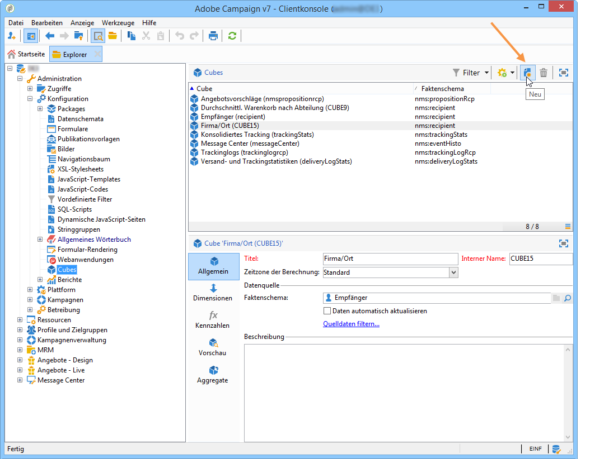

Wählen Sie ein Faktenschema aus, d. h. das Schema, das die zu analysierenden Elemente enthält. In diesem Beispiel wählen wir die Tabelle **Empfänger**.

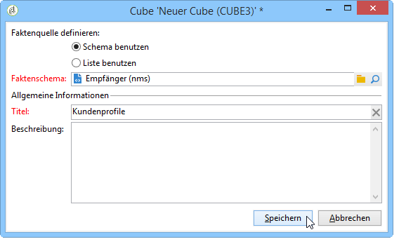

Klicken Sie auf **[!UICONTROL Speichern]**, um den Cube zu erstellen: Er erscheint daraufhin in der Liste der Cubes und kann über seine verschiedenen Tabs konfiguriert werden.

Klicken Sie auf den Link **[!UICONTROL Quelldaten filtern...]**, wenn Sie die Berechnungen des Cubes nur auf eine Auswahl von Daten anwenden möchten.

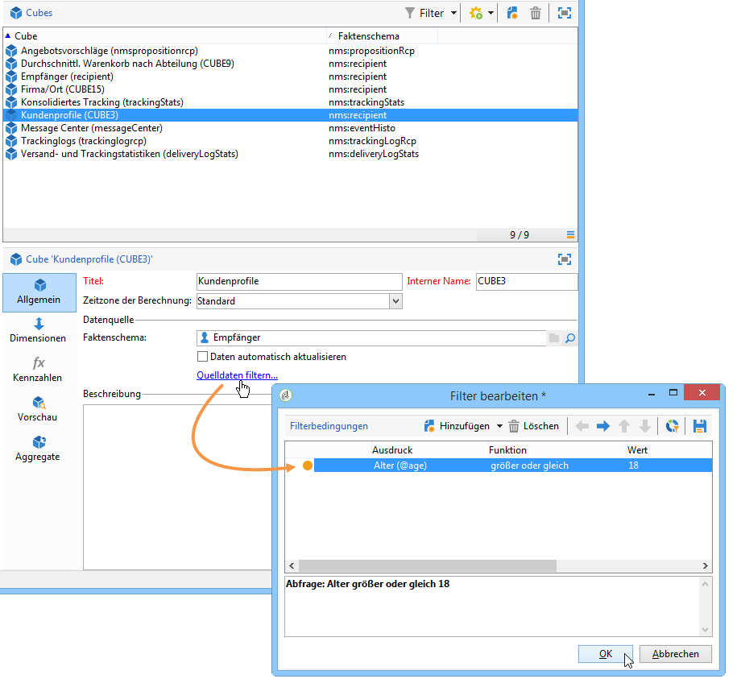

## Definieren von Dimensionen {#defining-dimensions}

Dimensionen entsprechen den Analyseachsen, die für jeden Cube basierend auf dem zugehörigen Faktenschema definiert werden. Dabei handelt es sich um die in der Analyse untersuchten Dimensionen, zum Beispiel Zeit (Jahr, Monat, Datum), eine Klassifizierung von Produkten oder Verträgen (Familie, Referenz usw.) und ein Populationssegment (nach Stadt, Altersgruppe, Status usw.).

Diese Analyseachsen werden im Tab **[!UICONTROL Dimensionen]** des Cubes festgelegt.

Klicken Sie auf die Schaltfläche **[!UICONTROL Hinzufügen]**, um eine neue Dimension zu erstellen, und klicken Sie im Feld **[!UICONTROL Ausdruck]** auf das Symbol **[!UICONTROL Ausdruck bearbeiten]**, um das die betroffenen Daten enthaltende Feld auszuwählen.

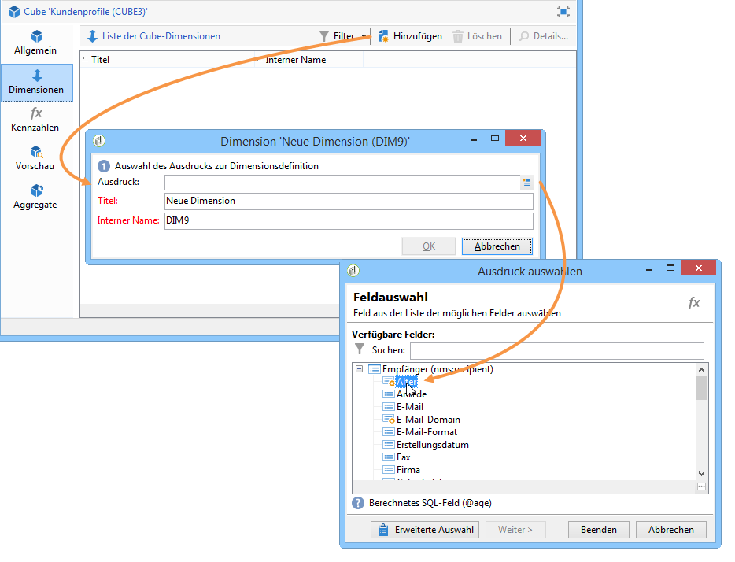

* Wählen Sie zunächst das **Alter** der empfangenden Person aus. Für dieses Feld können Sie eine Klassierung definieren, um Altersgruppen zu gruppieren und dadurch die Lesbarkeit der Informationen zu vereinfachen. Es wird empfohlen, die Klassierung immer dann zu verwenden, wenn die Wahrscheinlichkeit mehrerer separater Werte besteht.

  Kreuzen Sie hierzu die Option **[!UICONTROL Klassierung aktivieren]** an. Klassierungsmodi werden im Abschnitt [Daten klassieren](../../reporting/using/concepts-and-methodology.md#data-binning) detailliert beschrieben.

  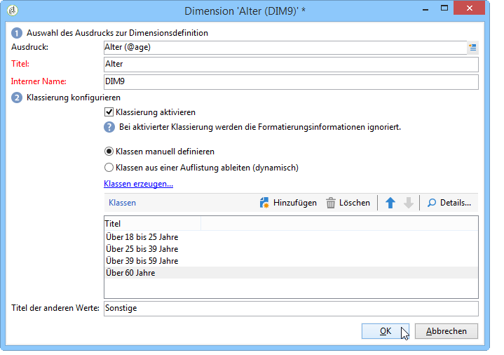

* Fügen Sie eine Dimension vom Typ **Datum** hinzu. Im Beispiel sollen die Erstellungsdaten der Empfängerprofile angezeigt werden.

  Klicken Sie hierzu auf **[!UICONTROL Hinzufügen]** und wählen Sie das Feld **[!UICONTROL Erstellungsdatum]** in der Empfängertabelle aus.

  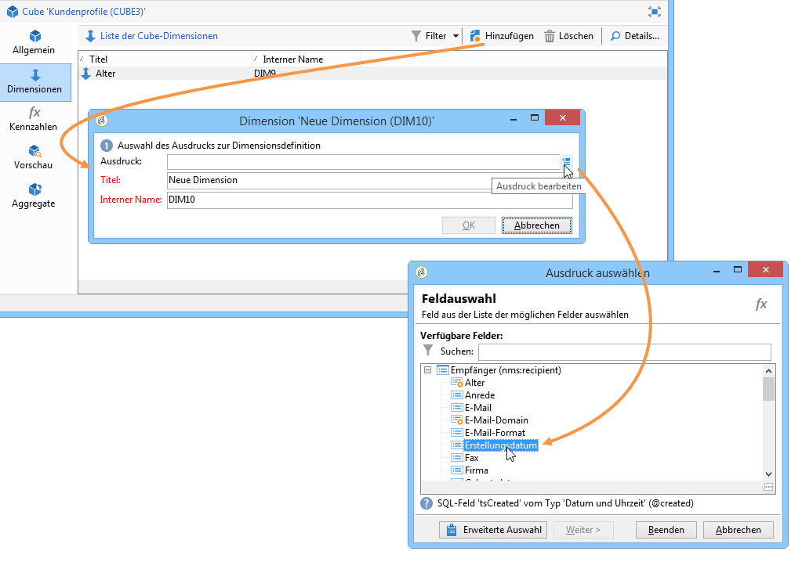

  Es ist möglich, den Anzeigemodus für das Datum auszuwählen. Wählen Sie dazu die zu verwendende Hierarchie und die zu erzeugenden Ebenen aus:

  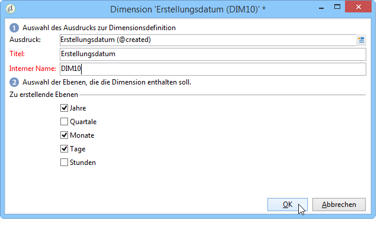

  Im Beispiel sollen nur Jahre, Monate und Tage angezeigt werden. Es ist nicht möglich, mit Wochen und Quartalen/Monaten zugleich zu arbeiten: Diese Ebenen sind nicht kompatibel.

* Erstellen Sie eine weitere Dimension, um die Informationen in Bezug auf den Ort des Empfängers zu analysieren.

  Fügen Sie hierzu eine neue Dimension hinzu und wählen Sie im Knoten **[!UICONTROL Geografische Lokalisierung]** des Empfängerschemas das Feld Ort aus.

  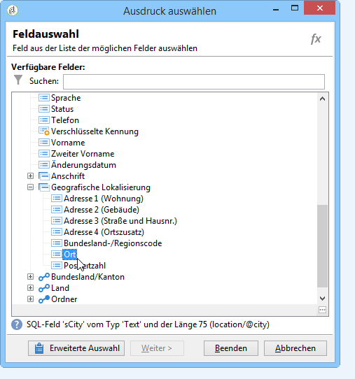

  Sie können auch hier die Klassierung aktivieren, um die Lesbarkeit der Informationen zu erleichtern, und in diesem Fall die Werte mit einem Aufzählungswert verknüpfen.

  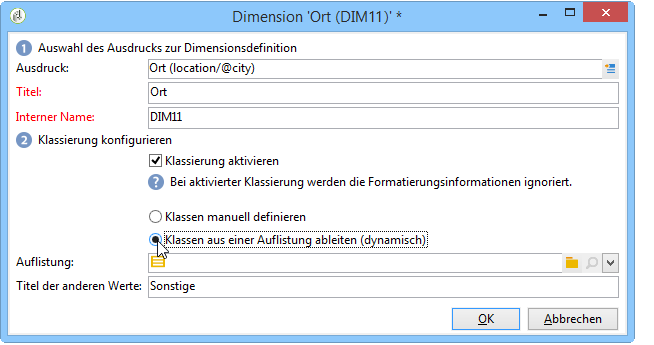

  Wählen Sie die Aufzählung in der Dropdown-Liste aus.

  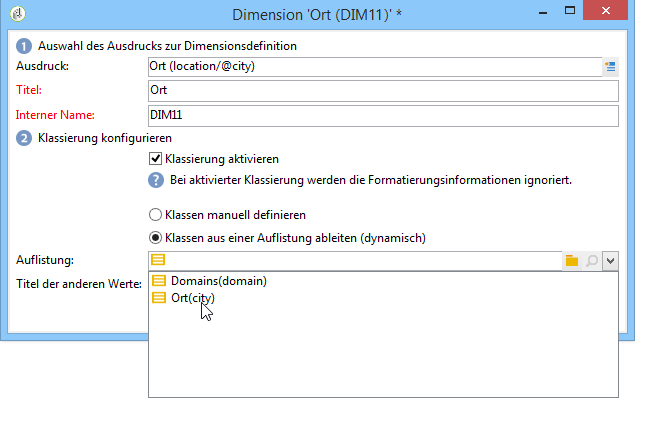

  Nur die in der Aufzählung vorhandenen Werte werden angezeigt. Alle anderen werden unter einem Titel zusammengefasst, den Sie im Feld **[!UICONTROL Titel der anderen Werte]** definieren können.

  Weitere Informationen hierzu finden Sie unter [Klassen dynamisch verwalten](../../reporting/using/concepts-and-methodology.md#dynamically-managing-bins).

## Erstellen von Indikatoren {#building-indicators}

Sobald die Dimensionen definiert sind, müssen Sie den Berechnungsmodus für die Werte festlegen, die in den Zellen angezeigt werden sollen. Erstellen Sie hierzu die jeweiligen Kennzahlen auf der gleichnamigen Registerkarte: Die Anzahl der Kennzahlen muss der Anzahl der Spalten entsprechen, die im Bericht angezeigt werden.****

Gehen Sie hierzu wie folgt vor:

1. Klicken Sie auf die Schaltfläche **[!UICONTROL Hinzufügen]**.
1. Wählen Sie den Kennzahlentyp und die anzuwendende Formel aus. Hier möchten wir die Anzahl an Frauen unter den Empfangenden zählen.

   Die Kennzahl basiert auf dem Faktenschema und verwendet den Operator **[!UICONTROL Zählung]**.

   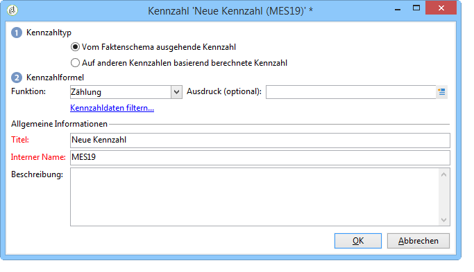

   Über den Link **[!UICONTROL Kennzahldaten filtern...]** gelangen Sie in das Abfragefenster, das die Beschränkung der zu berücksichtigenden Werte auf Frauen ermöglicht. Weitere Informationen zur Bestimmung von Kennzahlen und den verfügbaren Optionen finden Sie unter [Definieren von Kennzahlen](../../reporting/using/concepts-and-methodology.md#defining-measures).

   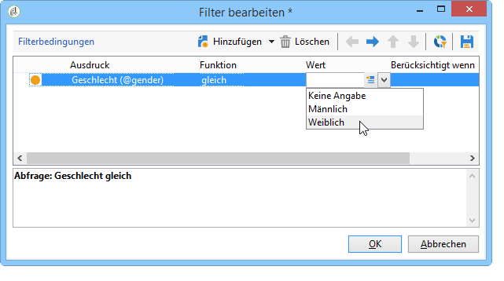

1. Geben Sie den Titel der Kennzahl an und speichern Sie sie.

   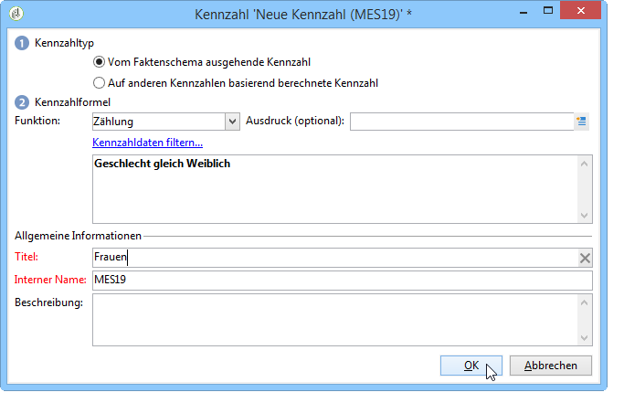

1. Speichern Sie den Cube.

## Erstellen eines Berichts basierend auf einem Cube {#creating-a-report-based-on-a-cube}

Nach der Konfiguration des Cubes kann er als Vorlage für einen neuen Bericht verwendet werden.

Gehen Sie dazu wie folgt vor:

1. Klicken Sie im Tab **[!UICONTROL Berichte]** auf die Schaltfläche **[!UICONTROL Erstellen]** und wählen Sie den zuvor erstellten Cube aus.

   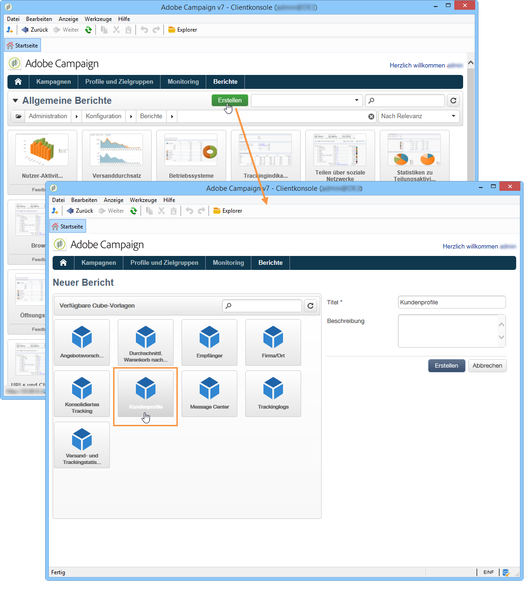

1. Klicken Sie zur Bestätigung auf die Schaltfläche **[!UICONTROL Erstellen]**: Der Bildschirm zur Konfiguration und Ansicht des Berichts wird geöffnet.

   Die ersten beiden verfügbaren Dimensionen werden standardmäßig in Zeilen und Spalten angezeigt, die Tabelle enthält jedoch keine Werte. Um die Tabelle zu generieren, klicken Sie auf das Hauptsymbol:

   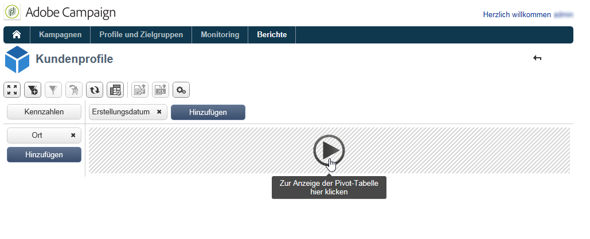

1. Sie können die Achsen der Dimension umtauschen, sie löschen, neue Kennzahlen einfügen usw. Die Möglichkeiten werden auf [dieser Seite](../../reporting/using/using-cubes-to-explore-data.md) beschrieben.

   Verwenden Sie hierzu die entsprechenden Symbole.

   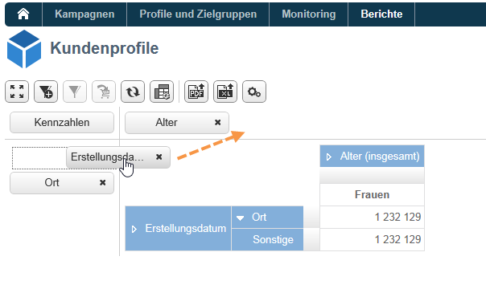
