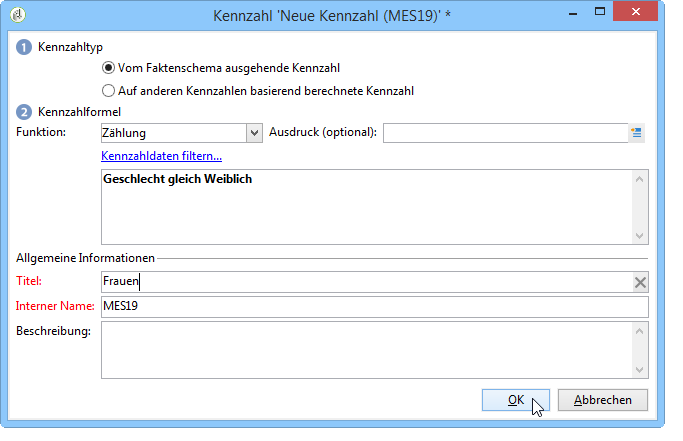

# Erstellen von Indikatoren{#creating-indicators}

Um einen Cube nutzen zu können, müssen zunächst die erforderlichen Dimensionen und Kennzahlen identifiziert und auf Ebene des Cubes erstellt werden.

Ein Cube wird in folgenden Schritten konfiguriert:

1. Wählen Sie die Arbeitstabelle aus. Siehe [Auswahl der Arbeitstabelle](#selecting-the-work-table).
1. Definieren von Dimensionen. Siehe [Definieren von Dimensionen](#defining-dimensions).
1. Definieren von Kennzahlen. Siehe [Erstellen von Indikatoren](#building-indicators).
1. Erstellen von Aggregaten (optional). Siehe [Berechnen und Verwenden von Aggregaten](../../reporting/using/concepts-and-methodology.md#calculating-and-using-aggregates).

Das nachstehende Beispiel zeigt, wie schnell ein einfacher Cube erstellt und in einem Bericht zur Kennzahlenanalyse verwendet werden kann.

Die Durchführungsschritte werden im Nachstehenden beschrieben, die verschiedenen Optionen und ihre Beschreibungen werden in den anderen Abschnitten dieses Kapitels ausführlich dargestellt.

## Wählen der Arbeitstabelle {#selecting-the-work-table}

Um einen Cube zu erstellen, klicken Sie auf die oberhalb der Cube-Liste gelegene Schaltfläche **[!UICONTROL Neu]**.

Wählen Sie das Faktenschema aus, d. h. das Schema mit den Elementen, die Sie untersuchen möchten. In diesem Beispiel wählen wir die **Empfänger** Tabelle.

Klicken Sie auf **[!UICONTROL Speichern]**, um den Cube zu erstellen: Er erscheint daraufhin in der Liste der Cubes und kann über seine verschiedenen Tabs konfiguriert werden.

Klicken Sie auf den Link **[!UICONTROL Quelldaten filtern...]**, wenn Sie die Berechnungen des Cubes nur auf eine Auswahl von Daten anwenden möchten.

## Definieren von Dimensionen {#defining-dimensions}

Dimensionen sind die Analyseachsen, die für jeden Cube entsprechend dem Faktenschema, auf das er sich bezieht, bestimmt werden. Es handelt sich um die analysierten Dimensionen, wie zum Beispiel die Zeit (Jahr, Monat, Tag etc.), eine Produkt- oder Vertragsnomenklatur (Familie, Referenz etc.), ein Populationssegment (nach Stadt, Altersgruppe, Status etc).

Diese Analyseachsen werden im Tab **[!UICONTROL Dimensionen]** des Cubes festgelegt.

Klicken Sie auf die Schaltfläche **[!UICONTROL Hinzufügen]**, um eine neue Dimension zu erstellen, und klicken Sie im Feld **[!UICONTROL Ausdruck]** auf das Symbol **[!UICONTROL Ausdruck bearbeiten]**, um das die betroffenen Daten enthaltende Feld auszuwählen.

* Wählen Sie zunächst das **Alter** der Empfänger. Für dieses Feld können Sie eine Klassierung bestimmen, um Altersgruppen zusammenzufassen und so die Lesbarkeit der Daten zu vereinfachen. Die Klassierung wird empfohlen, wenn ein Merkmal eine Vielzahl von unterschiedlichen Ausprägungen aufweist.

  Kreuzen Sie hierzu die Option **[!UICONTROL Klassierung aktivieren]** an. Klassierungsmodi werden im Abschnitt [Daten klassieren](../../reporting/using/concepts-and-methodology.md#data-binning) detailliert beschrieben.

  

* Fügen Sie eine Dimension vom Typ **Datum** hinzu. Im Beispiel sollen die Erstellungsdaten der Empfängerprofile angezeigt werden.

  Klicken Sie hierzu auf **[!UICONTROL Hinzufügen]** und wählen Sie das Feld **[!UICONTROL Erstellungsdatum]** in der Empfängertabelle aus.

  

  Sie können den Anzeigemodus der Daten auswählen. Wählen Sie hierzu die zu erzeugenden Ebenen aus:

  

  Im Beispiel sollen nur Jahre, Monate und Tage angezeigt werden. Es ist nicht möglich, mit Wochen und Quartalen/Monaten zugleich zu arbeiten: Diese Ebenen sind nicht kompatibel.

* Erstellen Sie eine weitere Dimension, um die Informationen in Bezug auf den Ort des Empfängers zu analysieren.

  Fügen Sie hierzu eine neue Dimension hinzu und wählen Sie im Knoten **[!UICONTROL Geografische Lokalisierung]** des Empfängerschemas das Feld Ort aus.

  

  Sie können auch hier die Klassierung aktivieren, um die Lesbarkeit der Informationen zu erleichtern, und in diesem Fall die Werte mit einem Auflistungswert verknüpfen.

  

  Wählen Sie die Auflistung in der Dropdown-Liste aus.

  

  Nur die Werte in der Auflistung werden angezeigt. Die anderen werden unter dem im Feld **[!UICONTROL Titel der anderen Werte]** -Feld.

  Weitere Informationen hierzu finden Sie unter [Klassen dynamisch verwalten](../../reporting/using/concepts-and-methodology.md#dynamically-managing-bins).

## Erstellen von Indikatoren {#building-indicators}

Nachdem die Dimensionen definiert wurden, müssen Sie einen Berechnungsmodus für die in den Zellen anzuzeigenden Werte festlegen. Erstellen Sie dazu die entsprechenden Indikatoren im **[!UICONTROL Maßnahmen]** Registerkarte: Erstellen Sie so viele Kennzahlen wie Spalten, die im Bericht angezeigt werden sollen und den Cube verwenden.

Gehen Sie hierzu wie folgt vor:

1. Klicken Sie auf die Schaltfläche **[!UICONTROL Hinzufügen]**.
1. Wählen Sie den Kennzahltyp und die anzuwendende Formel aus. Im Beispiel wird die Anzahl an Frauen unter den Empfängern gezählt.

   Die Kennzahl basiert auf dem Faktenschema und verwendet die Funktion **[!UICONTROL Zählung]**.

   

   Über den Link **[!UICONTROL Kennzahldaten filtern...]** gelangen Sie in das Abfragefenster, das die Beschränkung der zu berücksichtigenden Werte auf Frauen ermöglicht. Weitere Informationen zur Bestimmung von Kennzahlen und den verfügbaren Optionen finden Sie unter [Definieren von Kennzahlen](../../reporting/using/concepts-and-methodology.md#defining-measures).

   

1. Geben Sie den Titel der Kennzahl an und speichern Sie sie.

   

1. Speichern Sie den Cube.

## Erstellen eines Berichts basierend auf einem Cube {#creating-a-report-based-on-a-cube}

Nach der Konfiguration des Cubes kann er als Vorlage für einen neuen Bericht verwendet werden.

Gehen Sie dazu wie folgt vor:

1. Klicken Sie im Tab **[!UICONTROL Berichte]** auf die Schaltfläche **[!UICONTROL Erstellen]** und wählen Sie den zuvor erstellten Cube aus.

   

1. Klicken Sie zur Bestätigung auf die Schaltfläche **[!UICONTROL Erstellen]**: Der Bildschirm zur Konfiguration und Ansicht des Berichts wird geöffnet.

   Die ersten beiden verfügbaren Dimensionen werden standardmäßig in Spalten- und Zeilenform angezeigt, die Tabelle enthält jedoch keine Werte. Klicken Sie auf das zentrale Symbol, um sie zu erzeugen:

   

1. Sie können die Dimensionen von einer Achse in die andere verschieben, sie löschen, neue Kennzahlen hinzufügen etc. Die möglichen Operationen werden auf [dieser Seite](../../reporting/using/using-cubes-to-explore-data.md) beschrieben.

   Verwenden Sie hierzu die entsprechenden Symbole.

   
