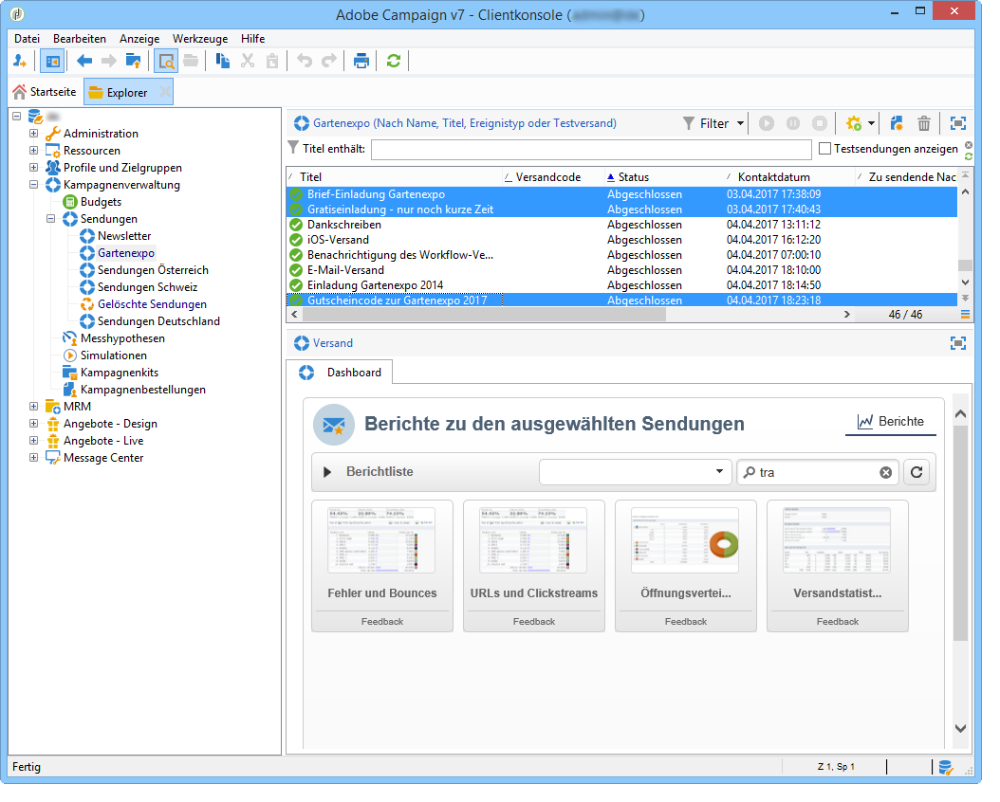
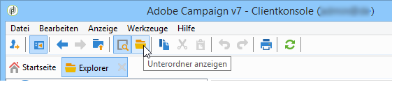

# Zusammenfassende Berichte {#cumulative-reports}

Sie haben die Möglichkeit, verschiedene Sendungen in zusammenfassenden Berichten gegenüberzustellen. Markieren Sie die gewünschten Sendungen, um die Liste der verfügbaren Berichte anzuzeigen.

Drücken Sie die Strg-Taste, um nicht direkt aufeinanderfolgende Sendungen zu markieren.

Klicken Sie in der Symbolleiste auf **[!UICONTROL Unterordner anzeigen]**, wenn Sie Sendungen einbeziehen möchten, die sich in einem anderen Ordner befinden. Auf diese Weise werden sie in derselben Liste angezeigt.

