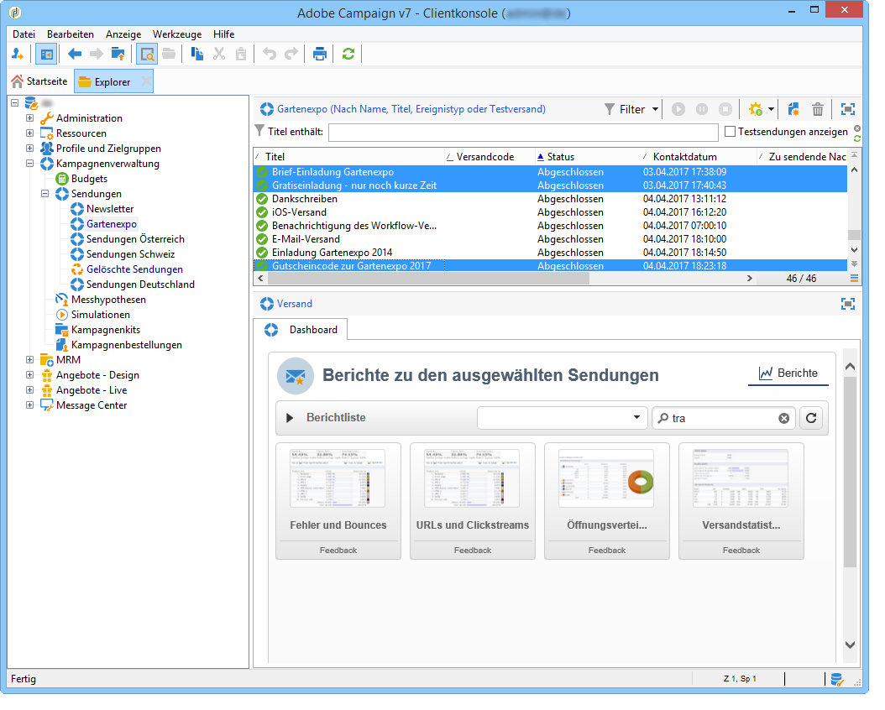
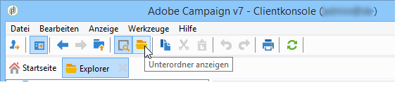

# Zusammenfassende Berichte {#cumulative-reports}

Sie können kumulierte Berichte zu Sendungen anzeigen. Wählen Sie dazu die zu vergleichenden Sendungen aus, um eine Liste mit Berichten für diese Sendungen zu erhalten.

Drücken Sie die Strg-Taste, um nicht direkt aufeinanderfolgende Sendungen zu markieren.

Um Sendungen auszuwählen, die in einem anderen Ordner gespeichert sind, klicken Sie auf **[!UICONTROL Unterordner anzeigen]** (Zugriff über die Symbolleiste). Sie werden dann in derselben Liste angezeigt.

