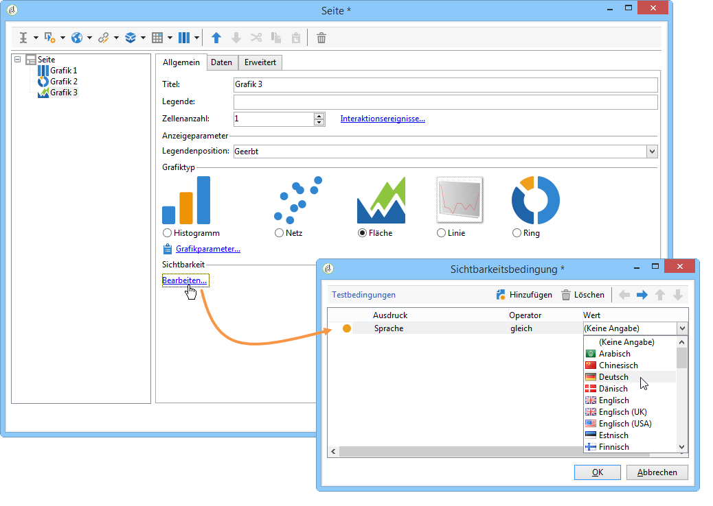
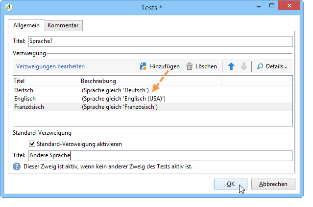
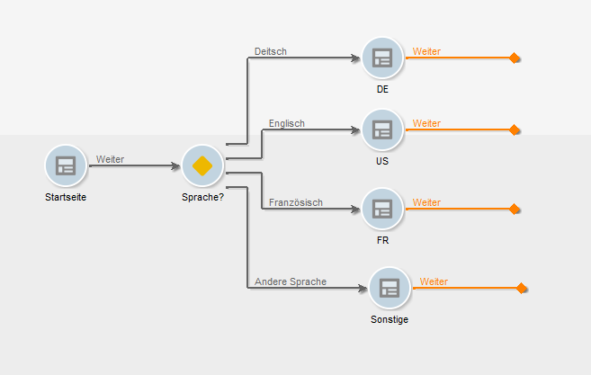

# Definieren von bedingten Inhalten{#defining-a-conditional-content}

Sie können die Anzeige bestimmter Elemente in einem Bericht oder einer Berichtsseite an Bedingungen knüpfen.

Um für einzelne Elemente Bedingungen zu erstellen, passen Sie deren Sichtbarkeitseinstellungen an. Weitere Informationen hierzu finden Sie unter [Bedingungen zur Anzeige von Elementen definieren](#conditioning-item-display).

Um die Anzeige einer oder mehrerer Seiten an Bedingungen zu knüpfen, verwenden Sie eine Aktivität vom Typ **[!UICONTROL Test]**. Weitere Informationen hierzu finden Sie unter [Bedingungen zur Anzeige von Seiten definieren](#conditioning-page-display).

## Bedingungen zur Anzeige von Elementen definieren {#conditioning-item-display}

Die Anzeige von Berichtelementen wird über Sichtbarkeitsbedingungen gesteuert. Wenn diese Bedingungen nicht erfüllt sind, werden die entsprechenden Elemente nicht angezeigt.

Die Sichtbarkeit kann zum Beispiel vom Status des Benutzers oder den von ihm in der Seite des Berichts ausgewählten oder angegebenen Elementen abhängen.

Beispiele bedingter Anzeige von Seitenelementen werden in [diesem Abschnitt](../../web/using/form-rendering.md#defining-fields-conditional-display) bereitgestellt.

Im folgenden Beispiel hängt die Anzeige von der Sprache ab:

## Bedingungen zur Anzeige von Seiten definieren {#conditioning-page-display}

Im Diagramm eines Berichts ermöglicht die Aktivität **[!UICONTROL Test]** es, die Abfolge der Berichtseiten von Bedingungen abhängig zu machen.

Gehen Sie wie folgt vor:

1. Positionieren Sie die **[!UICONTROL Test]**-Aktivität im Diagramm und öffnen Sie sie.
1. Klicken Sie auf die Schaltfläche **[!UICONTROL Hinzufügen]**, um die verschiedenen Bedingungen zu erstellen.

   

   Für jeden Fall wird der **[!UICONTROL Test]**-Aktivität eine zusätzliche ausgehende Transition hinzugefügt.

   

1. Aktivieren Sie die Option **[!UICONTROL Standard-Verzweigung aktivieren]**, um eine Transition hinzuzufügen, für den Fall dass keine der konfigurierten Bedingungen zutrifft.

   Weiterführende Informationen hierzu finden Sie in [diesem Abschnitt](../../web/using/defining-web-forms-page-sequencing.md#conditional-page-display).

Eine **[!UICONTROL Test]**-Aktivität sollte zu Beginn des Diagramms positioniert werden, um die Anzeige beispielsweise vom Kontext oder dem Benutzerprofil abhängig zu machen.
