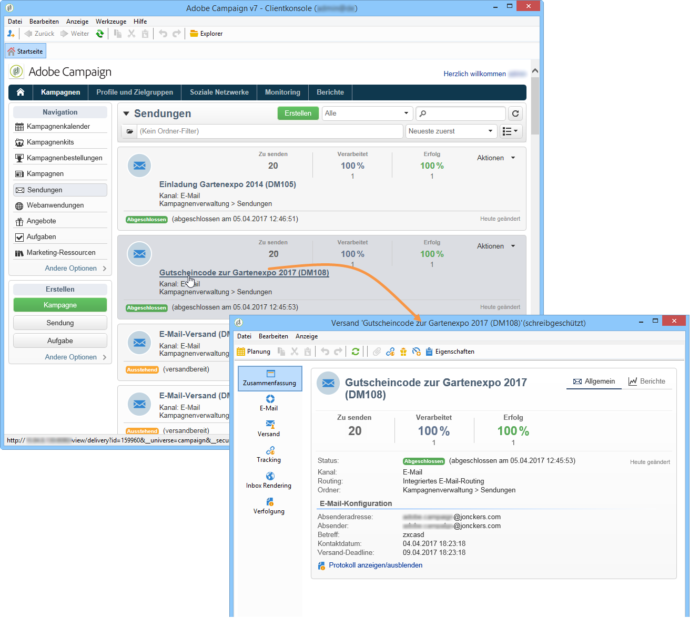
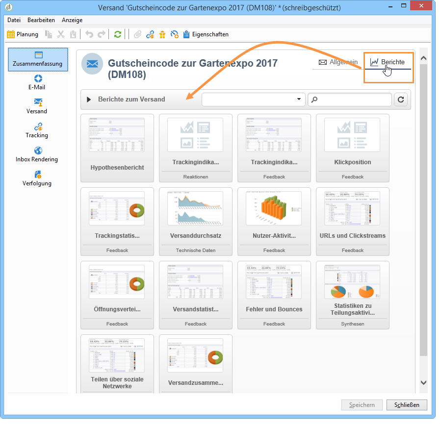
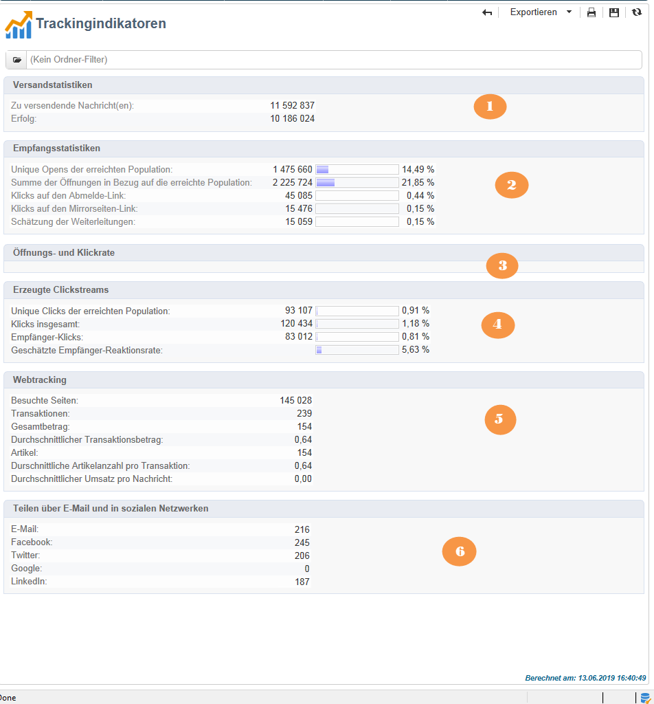
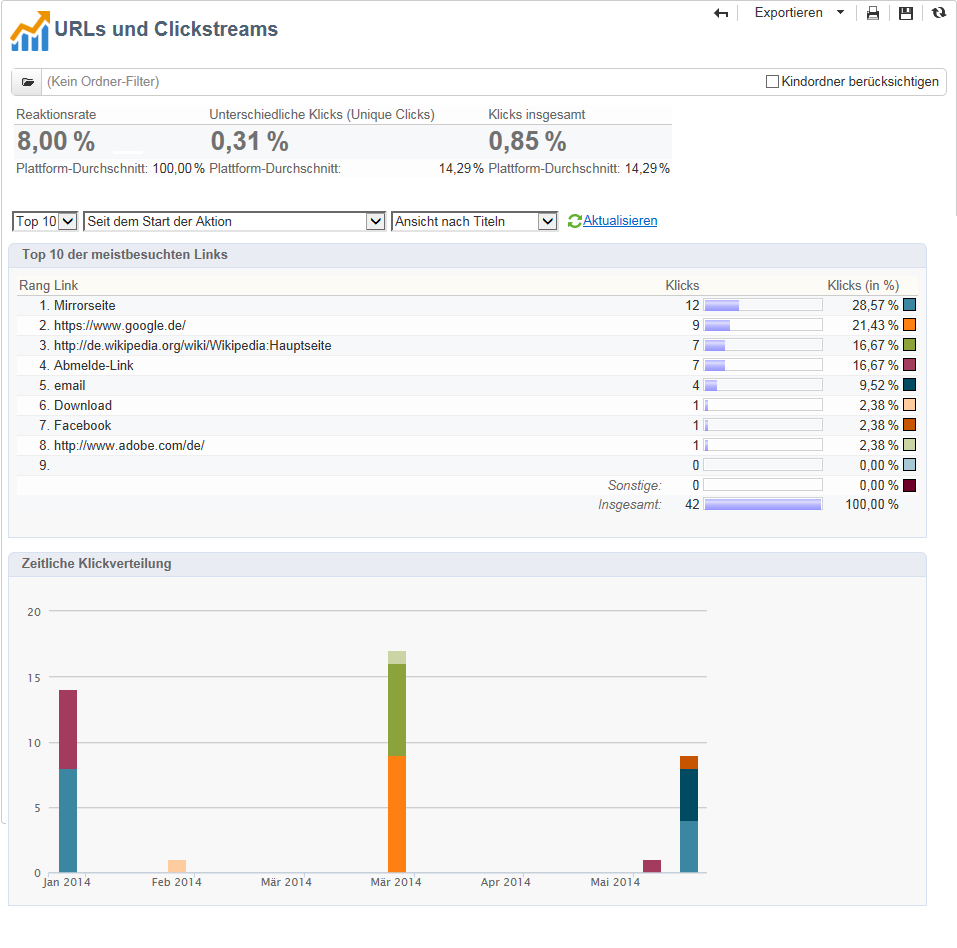
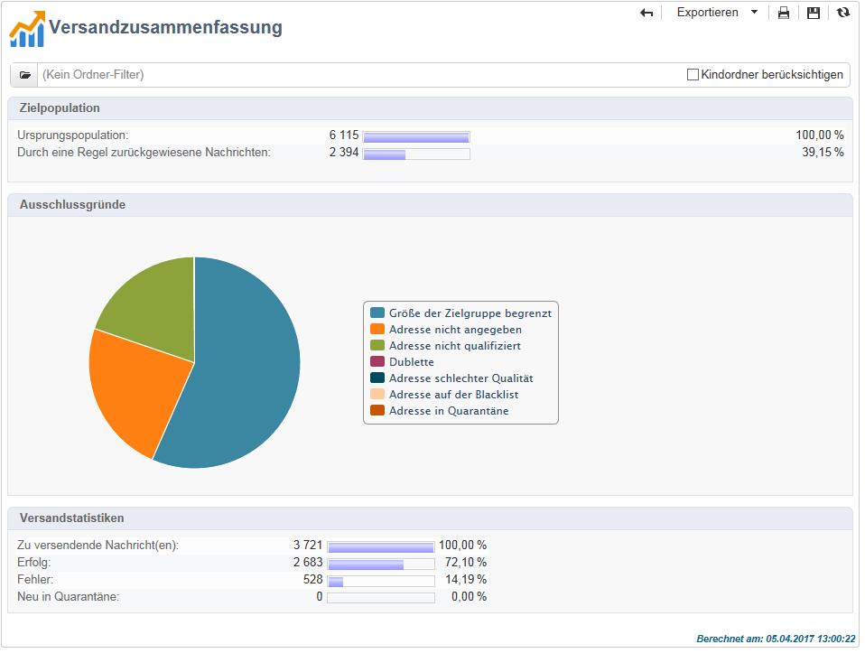

# Versandberichte {#delivery-reports}

Ausgehend von der Versandübersicht stehen diverse Berichte zur Verfügung, die Informationen bezüglich der Versanddurchführung enthalten. Gehen Sie wie folgt vor, um auf diese Berichte zuzugreifen:

1. Go to the **[!UICONTROL Campaigns]** universe and click the **[!UICONTROL Delivery]** link to display the list of deliveries.
1. Klicken Sie auf den Namen des gewünschten Versands, um ihn im Detail anzusehen.

   

1. Select the **[!UICONTROL Summary]** tab and click the **[!UICONTROL Reports]** link to access the reports specific to the delivery.

   

   Standardmäßig stehen folgende Berichte zur Verfügung:

   * **[!UICONTROL Delivery throughput]** : bezieht sich auf den [Bereitstellungsdurchsatz](#delivery-throughput).
   * **[!UICONTROL Sharing to social networks]** : Siehe [Freigeben in sozialen Netzwerken](#sharing-to-social-networks).
   * **[!UICONTROL Statistics on sharing activities]** : finden Sie unter [Statistiken über Freigabeaktivitäten](#statistics-on-sharing-activities).
   * **[!UICONTROL Hot clicks]** : siehe [Hotclicks](#hot-clicks).
   * **[!UICONTROL Tracking statistics]** : siehe [Verfolgungsstatistiken](#tracking-statistics)
   * **[!UICONTROL URLs and click streams]** : auf [URLs verweisen und auf Streams](#urls-and-click-streams)klicken.
   * **[!UICONTROL Tracking indicators]** : auf [Tracking-Indikatoren](#tracking-indicators).
   * **[!UICONTROL Non-deliverables and bounces]** : bezieht sich auf [Nicht-Lieferungen und Absprünge](#non-deliverables-and-bounces).
   * **[!UICONTROL User activities]** : Siehe [Benutzeraktivitäten](#user-activities).
   * **[!UICONTROL Delivery summary]** : Siehe [Lieferübersicht](#delivery-summary).
   * **[!UICONTROL Subscription tracking]** : Siehe [Abonnementverfolgung](#subscription-tracking).
   * **[!UICONTROL Delivery statistics]** : Siehe [Lieferstatistik](#delivery-statistics).
   * **[!UICONTROL Breakdown of opens]** : Siehe [Aufschlüsselung der geöffneten Fenster](#breakdown-of-opens).

## Trackingindikatoren {#tracking-indicators}

Dieser Bericht enthält die wichtigsten Indikatoren, die die Verfolgung des Empfängerverhaltens beim Erhalt eines Versands ermöglichen. Er bietet Zugriff auf Versand- und Empfangsstatistiken, Öffnungs- und Klickraten, erzeugte Clickstreams, Webtracking-Statistiken sowie Teilungsaktivitäten in sozialen Netzwerken.

>[!NOTE]
>
>Werte, die auf der Grundlage der Meldung &quot;Öffnen&quot;berechnet werden, sind immer Schätzungen, da die Fehlerspanne mit E-Mails im Textformat verknüpft ist. Die **[!UICONTROL Distinct opens/Sum of opens for the population reached]** Indikatoren berücksichtigen diese Fehlerquote. For more information on tracking opens, refer to [Tracking opens](#tracking-opens-).

**[!UICONTROL 1. Delivery statistics]**

* **[!UICONTROL Messages to deliver]** : Gesamtzahl der Nachrichten, die nach der Auslieferungsanalyse gesendet werden.
* **[!UICONTROL Success]** : Anzahl der erfolgreich verarbeiteten Nachrichten.

**[!UICONTROL 2. Reception statistics]**

>[!NOTE]
>
>Die Prozentsätze werden in Bezug auf die erfolgreich zugestellten Nachrichten berechnet.

* **[!UICONTROL Distinct opens for the population reached]** : Schätzung der Anzahl der Empfänger, die eine Nachricht mindestens einmal geöffnet haben. Klicks auf Abmeldelinks und Spiegelseiten werden berücksichtigt.
* **[!UICONTROL Sum of opens for the population reached]** : Schätzung der Gesamtzahl der Öffnen nach Zielempfängern.
* **[!UICONTROL Clicks on opt-out link]** : Gesamtanzahl der Klicks auf den Abmelde-Link.
* **[!UICONTROL Clicks on the mirror page link]** : Anzahl der Klicks auf den Link zur Spiegelseite. Um berücksichtigt zu werden, muss der Link als solcher im Auslieferungsassistenten (verfolgte URLs) definiert werden. Refer to this [page](../../delivery/using/monitoring-a-delivery.md).
* **[!UICONTROL Estimation of forwards]** : Schätzung der Anzahl der E-Mails, die von den Zielempfängern weitergeleitet werden. Dieser Wert wird berechnet, indem die Anzahl der einzelnen Personen und die Anzahl der einzelnen Empfänger, die auf die E-Mail geklickt haben, abgezogen werden.

   >[!NOTE]
   >
   >For more information on the difference between distinct people and targeted recipients, refer to [Targeted persons / recipients](#targeted-persons---recipients).

**[!UICONTROL 3. Open and click-through rate]**

Die Tabelle zeigt - aufgeschlüsselt nach Domains - Sendungen, Öffnungen, Klicks und Brutto-Reaktionsraten. Folgende Indikatoren werden angezeigt:

* **[!UICONTROL Sent]** : Gesamtanzahl der in dieser Domäne gesendeten Nachrichten.
* **[!UICONTROL Complaints]** : Anzahl der Meldungen für diese Domäne, die vom Empfänger als unerwünscht gemeldet wurden. Die Rate wird basierend auf der Gesamtzahl der Nachrichten berechnet, die auf dieser Domäne gesendet werden.
* **[!UICONTROL Opens]** : Anzahl der eindeutigen zielgerichteten Empfänger für diese Domäne, die mindestens einmal eine Nachricht geöffnet haben. Die Rate wird basierend auf der Gesamtzahl der Nachrichten berechnet, die auf dieser Domäne gesendet werden.
* **[!UICONTROL Clicks]** : Anzahl der einzelnen zielgerichteten Empfänger, die mindestens einmal auf dieselbe Bereitstellung geklickt haben. Die Rate wird basierend auf der Gesamtzahl der Nachrichten berechnet, die auf dieser Domäne gesendet werden
* **[!UICONTROL Raw reactivity]** : Prozentsatz der Anzahl der Empfänger, die mindestens einmal auf eine Lieferung geklickt haben, verglichen mit der Anzahl der Empfänger, die mindestens einmal eine Lieferung geöffnet haben.

>[!NOTE]
>
>Die in diesem Bericht angezeigten Domänennamen werden in der auf Kubikebene verwendeten Einzelliste definiert. Um Standarddomänen zu ändern, hinzuzufügen oder zu entfernen, bearbeiten Sie die **[!UICONTROL Domains]** Einzelliste und ändern Sie Werte und Aliase. Weiterführende Informationen hierzu finden Sie in [diesem Abschnitt](../../platform/using/managing-enumerations.md). Die **[!UICONTROL Others]** Kategorie enthält Domänennamen, die keinem Wert der Einzelliste angehören.

**[!UICONTROL 4. Generated click streams]**

>[!NOTE]
>
>Die Prozentsätze werden in Bezug auf die erfolgreich zugestellten Nachrichten berechnet.

* **[!UICONTROL Distinct clicks for the population reached]** : Anzahl der einzelnen Personen, die mindestens einmal auf eine Lieferung geklickt haben.
* **[!UICONTROL Cumulated clicks]** : Gesamtanzahl der Klicks nach Zielempfängern, ohne Abo-Links und Spiegelseiten.
* **[!UICONTROL Recipient clicks]** : Anzahl der einzelnen zielgerichteten Empfänger, die mindestens einmal auf dieselbe Bereitstellung geklickt haben.
* **[!UICONTROL Estimated recipient reactivity]** : Verhältnis der Anzahl der Empfänger, die mindestens einmal bei einer Lieferung geklickt haben, zur geschätzten Anzahl der Empfänger, die mindestens einmal eine Lieferung geöffnet haben. Klicks auf Ausschluss- und Spiegelseiten-Links werden nicht berücksichtigt.

**[!UICONTROL 5. Web tracking]**

* **[!UICONTROL Visited pages]** : Anzahl der Webseiten, die nach dem Empfang der Nachricht besucht wurden.
* **[!UICONTROL Transactions]** : Anzahl der Käufe nach dem Empfang der Nachricht.
* **[!UICONTROL Total amount]** : Gesamtsumme der Käufe nach dem Empfang der Nachricht.
* **[!UICONTROL Average transaction amount]** : Durchschnittlicher Einkauf durch unterschiedliche Empfänger.
* **[!UICONTROL Articles]** : Anzahl der von den Lieferempfängern gekauften Artikel.
* **[!UICONTROL Average count of articles per transaction]** : Durchschnittliche Anzahl von Artikeln pro Einkauf durch unterschiedliche Empfänger.
* **[!UICONTROL Average amount per message]** : Durchschnittliche Menge der pro Nachricht generierten Käufe.

   >[!NOTE]
   >
   >Damit Webseitenbesuche, Transaktionen, Umsätze und Artikel berücksichtigt werden können, muss auf der entsprechenden Webseite ein Webtrackingtag gesetzt werden. Die Konfiguration des Webtrackings wird in [diesem Abschnitt](../../configuration/using/about-web-tracking.md) erläutert.

**[!UICONTROL 6. Sharing activities to email and social networks]**

Dieser Abschnitt zeigt die Anzahl der in jedem sozialen Netzwerk freigegebenen Nachrichten. Weitere Informationen finden Sie unter [Freigeben in sozialen Netzwerken](#sharing-to-social-networks).

## URLs und Clickstreams {#urls-and-click-streams}

Dieser Bericht zeigt die Rangfolge der infolge eines Versands besuchten Webseiten.

You can configure the contents of this report by selecting: the score chart to be displayed, the time filter (since the action launch, over the first 6 hours following launch, etc.) and the data display mode (by label, by URL, by category - for more on this, refer to [this page](../../delivery/using/monitoring-a-delivery.md)). Klicken Sie auf **[!UICONTROL Refresh]** , um Ihre Auswahl zu bestätigen.

Im oberen Bereich des Berichts werden folgende Indikatoren angezeigt:

* **[!UICONTROL Reactivity]** : Verhältnis der Anzahl der Zielempfänger, die auf eine Bereitstellung geklickt haben, im Verhältnis zur geschätzten Anzahl der Zielempfänger, die eine Bereitstellung geöffnet haben. Klicks auf den Ausschluss-Link und auf der Spiegelseite werden nicht berücksichtigt.

   >[!NOTE]
   >
   >For more information on tracking opens, refer to [Tracking opens](#tracking-opens-).

* **[!UICONTROL Distinct clicks]** : Anzahl der einzelnen Personen, die mindestens einmal auf eine Lieferung geklickt haben (ohne den Link zum Abmelden und die Spiegelseite). Die angezeigte Rate wird basierend auf der Anzahl der erfolgreich bereitgestellten Nachrichten berechnet.
* **[!UICONTROL Cumulated clicks]** : Gesamtanzahl der Klicks nach Zielempfängern (ohne Link zum Abmelden und Spiegelseite). Die angezeigte Rate wird basierend auf der Anzahl der erfolgreich weitergeleiteten Nachrichten berechnet.

**[!UICONTROL Platform average]** : Diese durchschnittliche Rate, die unter jeder Rate (Reaktivität, unterschiedliche Klicks und kumulierte Klicks) angezeigt wird, wird für die in den letzten sechs Monaten gesendeten Lieferungen berechnet. Nur Lieferungen mit der gleichen Typologie und auf dem gleichen Kanal werden berücksichtigt. Nachweise sind ausgeschlossen.

Der mittlere Bereich der Tabelle zeigt folgende Indikatoren:

* **[!UICONTROL Clicks]** : Anzahl der kumulierten Klicks pro Link.
* **[!UICONTROL Clicks (in %)]** : Aufschlüsselung der Anzahl der Klicks pro Link im Verhältnis zur Gesamtanzahl der kumulierten Klicks.

**[!UICONTROL Breakdown of clicks in time]**

Dieses Diagramm zeigt die Verteilung der Klicks insgesamt nach Tagen.

## Versandzusammenfassung {#delivery-summary}

Dieser Bericht zeigt die wichtigsten Informationen zu einem Versand.

**[!UICONTROL Target population]**

Dieser Bereich zeigt zwei Indikatoren:

* **[!UICONTROL Initial population]** : Gesamtzahl der Empfänger, die den Versand erhalten sollen.
* **[!UICONTROL Messages rejected by the rule]** : Anzahl der Adressen, die während der Analyse bei Anwendung von Typologieregeln ignoriert wurden: Adresse fehlt, unter Quarantäne gestellt, auf der schwarzen Liste usw. For more information on typology rules, refer to this [page](../../delivery/using/steps-validating-the-delivery.md#validation-process-with-typologies).

**[!UICONTROL Causes of exclusion]**

Das Diagramm in der Mitte veranschaulicht die Verteilung der ausgeschlossenen Nachrichten nach Regeln.

**[!UICONTROL Delivery statistics]**

Dieser Bereich zeigt folgende Indikatoren:

* **[!UICONTROL Messages to be delivered]** : Gesamtzahl der Nachrichten, die nach der Auslieferungsanalyse gesendet werden.
* **[!UICONTROL Success]** : Anzahl erfolgreich verarbeiteter Nachrichten. Die zugehörige Rate ist das Verhältnis zur Anzahl der bereitzustellenden Nachrichten.
* **[!UICONTROL Errors]** : Gesamtanzahl der Fehler, die während der Auslieferung und der automatischen Rückgabeverarbeitung kumuliert wurden. Die zugehörige Rate ist das Verhältnis zur Anzahl der bereitzustellenden Nachrichten.
* **[!UICONTROL New quarantines]** : Anzahl der Adressen, die nach einer fehlgeschlagenen Bereitstellung isoliert wurden (unbekannte, ungültige Domäne des Benutzers). Die zugehörige Rate ist das Verhältnis zur Anzahl der bereitzustellenden Nachrichten.

## Klicks {#hot-clicks}

Er zeigt den Nachrichteninhalt (HTML und/oder Text) mit dem prozentualen Klickanteil für jeden Link. Links in Gestaltungsbausteinen, der Abmelde-Link, der Mirrorseite-Link und Angebotslinks werden in der Gesamtklickzahl berücksichtigt, in diesem Bericht jedoch nicht angezeigt.

>[!NOTE]
>
>Sollte Ihr Versand Angebote enthalten (Interaction), erscheint im oberen Bereich des Berichts ein Rahmen mit dem Klickanteil der Angebote.

## Trackingstatistiken {#tracking-statistics}

Dieser Bericht zeigt Statistiken zu Öffnungen, Klicks und Transaktionen.

Damit können Sie die Marketingauswirkungen der Bereitstellung verfolgen. Sie können konfigurieren, wie Werte angezeigt werden, indem Sie die Zeitspanne (1-Stunde-, 3-Stunden- oder 24-Stunden-Ansicht usw.) ändern. Klicken Sie auf **[!UICONTROL Refresh]** , um Ihre Auswahl zu bestätigen.

Die Statistiken werden in Form einer Tabelle und eines Pareto-Diagramms dargestellt, welches die Dauer angibt, die der Versand benötigt hat, um seine höchste Effizienz zu erreichen. Folgende Indikatoren werden angezeigt:

* **[!UICONTROL Opens]** : Schätzen Sie die Zeit, die erforderlich ist, um einen Prozentsatz der Gesamtzahl der geöffneten Nachrichten zu erreichen. E-Mails im Textformat werden nicht berücksichtigt. For more information on tracking opens, refer to [Tracking opens](#tracking-opens-).
* **[!UICONTROL Clicks]** : Schätzen der erforderlichen Zeit, um einen Prozentsatz der Gesamtzahl der aufgezeichneten Klicks zu erreichen. Klicks auf den Ausschluss-Link und die Spiegelseite werden nicht berücksichtigt.
* **[!UICONTROL Transactions]** : Zeit, die erforderlich ist, um einen Prozentsatz der Gesamtanzahl der Transaktionen nach dem Empfang der Nachricht zu erreichen. Damit eine Transaktion berücksichtigt werden kann, muss ein Transaktions-Typ-Web-Tracking-Tag in die entsprechende Webseite eingefügt werden. Die Webtracking-Konfiguration wird in [diesem Abschnitt](../../configuration/using/about-web-tracking.md)vorgestellt.
