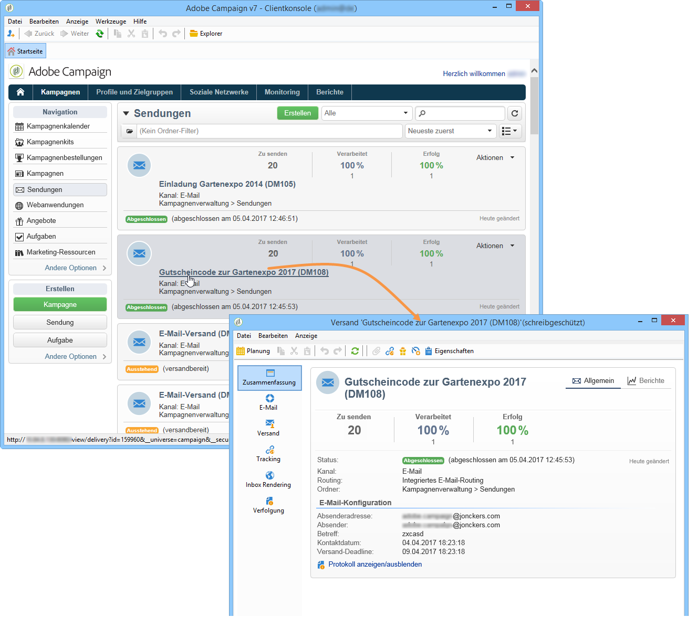
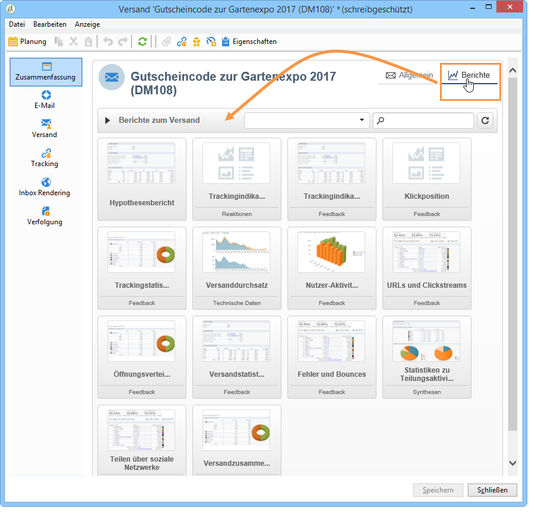
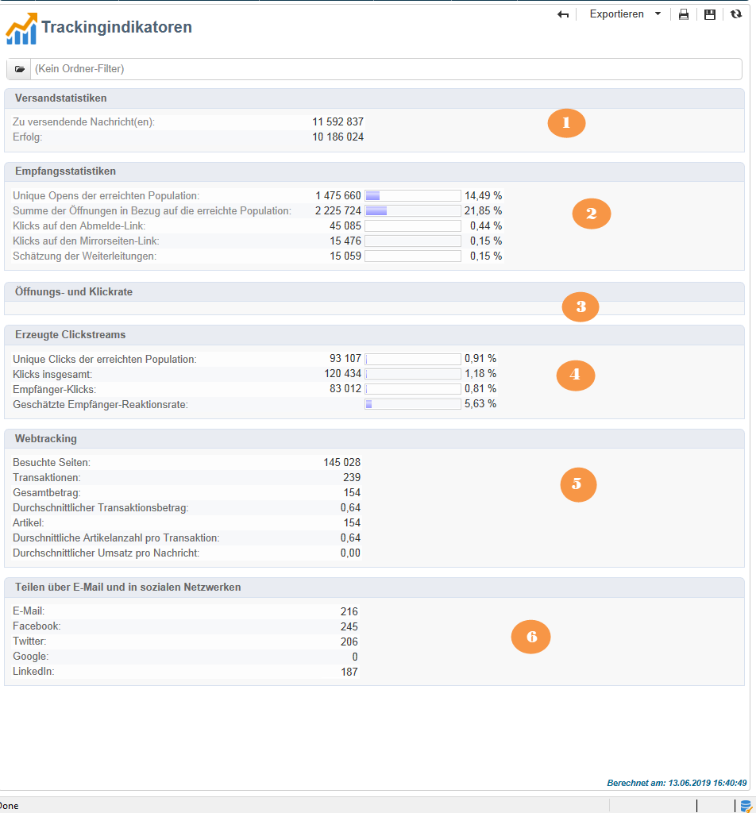
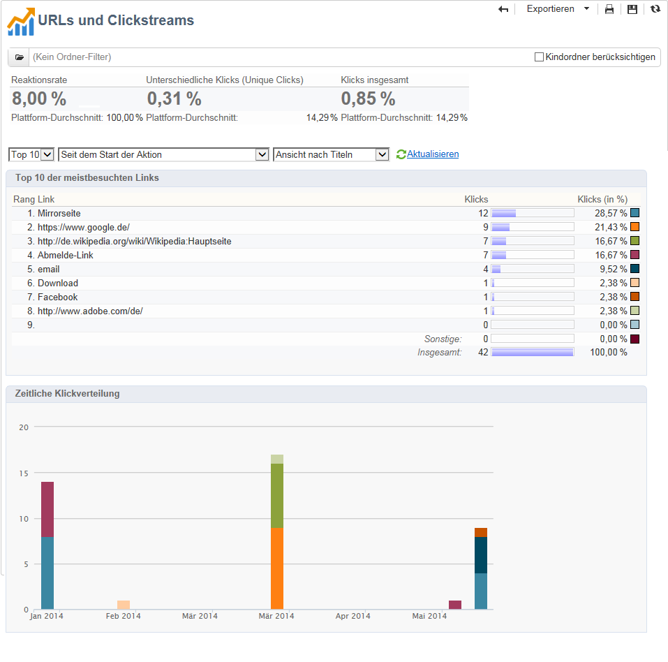
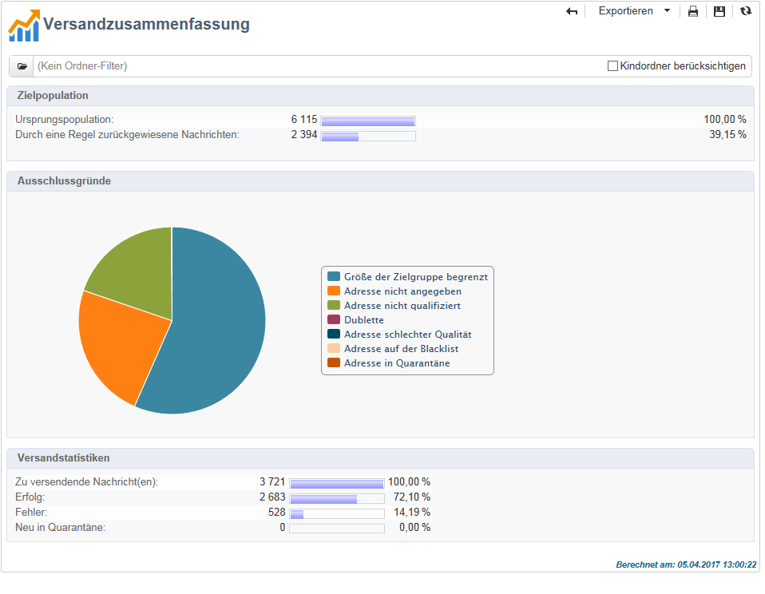
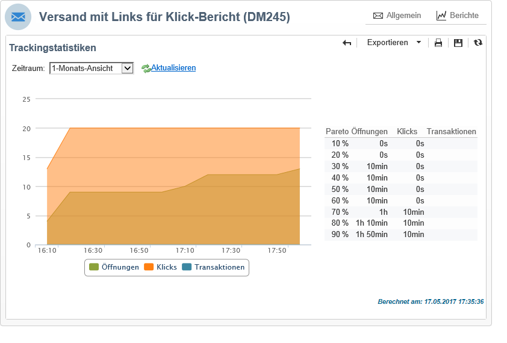

# Versandberichte {#delivery-reports}

Sie können die Ausführung von Sendungen in verschiedenen Berichten verfolgen, auf die über die Versandübersicht zugegriffen werden kann. Gehen Sie wie folgt vor, um Berichte anzuzeigen:

1. Klicken Sie im Tab **[!UICONTROL Kampagnen]** auf den Link **[!UICONTROL Sendungen]**, um die Versandliste aufzurufen.
1. Klicken Sie auf den Namen des gewünschten Versands, um ihn im Detail anzusehen.

   

1. Klicken Sie im Tab **[!UICONTROL Zusammenfassung]** auf **[!UICONTROL Berichte]**, um die spezifischen Versandberichte aufzurufen.

   

   Standardmäßig stehen folgende Berichte zur Verfügung:

   * **[!UICONTROL Versanddurchsatz]**: siehe [Versanddurchsatz](../../reporting/using/global-reports.md#delivery-throughput).
   * **[!UICONTROL Teilen über soziale Netzwerke]**: siehe [Teilen über soziale Netzwerke](../../reporting/using/global-reports.md#sharing-to-social-networks).
   * **[!UICONTROL Statistiken zu Teilungsaktivitäten]**: siehe [Statistiken zu Teilungsaktivitäten](../../reporting/using/global-reports.md#statistics-on-sharing-activities).
   * **[!UICONTROL Klickposition]**: siehe [Klickposition](#hot-clicks).
   * **[!UICONTROL Trackingstatistiken]**: siehe [Trackingstatistiken](#tracking-statistics).
   * **[!UICONTROL URLs und Clickstreams]**: siehe [URLs und Clickstreams](#urls-and-click-streams).
   * **[!UICONTROL Trackingindikatoren]**: siehe [Trackingindikatoren](#tracking-indicators).
   * **[!UICONTROL Unzustellbare Nachrichten und Bounces]**: siehe [Unzustellbare Nachrichten und Bounces](../../reporting/using/global-reports.md#non-deliverables-and-bounces).
   * **[!UICONTROL Nutzer-Aktivitäten]**: siehe [Nutzer-Aktivitäten](../../reporting/using/global-reports.md#user-activities).
   * **[!UICONTROL Versandzusammenfassung]**: siehe [Versandzusammenfassung](#delivery-summary).
   * **[!UICONTROL Abonnement-Verfolgung]**: siehe [Abonnement-Verfolgung](../../reporting/using/global-reports.md#subscription-tracking).
   * **[!UICONTROL Versandstatistiken]**: siehe [Versandstatistiken](../../reporting/using/global-reports.md#delivery-statistics).
   * **[!UICONTROL Aufschlüsselung der Öffnungen]**: siehe [Aufschlüsselung der Öffnungen](../../reporting/using/global-reports.md#breakdown-of-opens).

## Tracking-Indikatoren {#tracking-indicators}

Dieser Bericht enthält die wichtigsten Indikatoren, die die Verfolgung des Empfängerverhaltens beim Erhalt eines Versands ermöglichen. Es bietet Zugriff auf Versand- und Empfangsstatistiken, Öffnungs- und Klickraten, generierte Clickstreams, Webtracking sowie Teilungsaktivitäten in sozialen Netzwerken.

>[!NOTE]
>
>Die in Bezug auf Öffnungen berechneten Werte sind immer nur Schätzungen. Dies hängt insbesondere mit der durch E-Mails im Textformat bedingten Fehlerquote zusammen. Die Indikatoren **[!UICONTROL Unterschiedliche Öffnungen (Unique Opens) und Summe der Öffnungen in Bezug auf die erreichte Population]** berücksichtigen diese Fehlerquote. Weiterführende Informationen zum Verfolgen von Öffnungen finden Sie im Abschnitt [Öffnungs-Tracking](../../reporting/using/indicator-calculation.md#tracking-opens-).

**[!UICONTROL 1. Versandstatistiken]**

* **[!UICONTROL Zu versendende Nachricht(en)]**: Gesamtzahl der nach erfolgter Versandanalyse zu versendenden Nachrichten.
* **[!UICONTROL Erfolg]**: Anzahl der erfolgreich verarbeiteten Nachrichten.

**[!UICONTROL 2. Empfangsstatistiken]**

>[!NOTE]
>
>Die Prozentsätze werden in Bezug auf die erfolgreich zugestellten Nachrichten berechnet.

* **[!UICONTROL Unterschiedene Öffnungen für die erreichte Population]**: Schätzung der Anzahl der Zielgruppenempfänger, die eine Nachricht mindestens einmal geöffnet haben. Klicks auf getrackte URLs werden berücksichtigt, da E-Mails geöffnet werden müssen, damit auf einen Link geklickt werden kann.
* **[!UICONTROL Summe der Öffnungen in Bezug auf die erreichte Population]**: Schätzung der Gesamt-Öffnungszahl durch Zielgruppenempfänger.
* **[!UICONTROL Klicks auf den Abmelde-Link]**: Anzahl der Klicks auf den Abmelde-Link.
* **[!UICONTROL Klicks auf den Mirrorseiten-Link]**: Anzahl der Klicks auf den Mirrorseiten-Link. Um berücksichtigt zu werden, muss der Link im Versandassistenten als solcher definiert worden sein (getrackte URLs). Mehr dazu erfahren Sie auf [dieser Seite](../../delivery/using/about-delivery-monitoring.md).
* **[!UICONTROL Schätzung der Weiterleitungen]** : Schätzung der Anzahl der E-Mails, die von den Zielgruppenempfängerinnen und -empfängern weitergeleitet werden. Dieser Wert wird berechnet, indem die Anzahl der einzelnen Personen und die Anzahl der einzelnen Empfänger, die auf die E-Mail geklickt haben, abgezogen werden.

  >[!NOTE]
  >
  >Weiterführende Informationen zur Unterscheidung von Personen und Zielgruppenempfängern finden Sie unter [Unterschied zwischen Personen und Zielgruppenempfängern](../../reporting/using/indicator-calculation.md#targeted-persons---recipients).

**[!UICONTROL 3. Öffnungs- und Klickrate]**

Diese Wertetabelle zeigt die Aufschlüsselung der Sendungen, Öffnungen, Klicks und Brutto-Reaktionszeiten nach Internet-Domain. Folgende Indikatoren werden angezeigt:

* **[!UICONTROL Sendungen]**: Gesamtzahl der an die jeweilige Domain gesandten Nachrichten.
* **[!UICONTROL Beschwerden]** : Anzahl der Nachrichten für diese Domain, die von der Empfängerin oder vom Empfänger als unerwünscht gemeldet wurden. Die Rate wird auf Basis der Gesamtzahl der an die Domain gesandten Nachrichten berechnet.
* **[!UICONTROL Öffnungen]**: Anzahl unterschiedlicher Zielgruppenempfänger dieser Domain, die mindestens einmal die betreffende Nachricht geöffnet haben. Die Rate wird auf Basis der Gesamtzahl der an die Domain gesandten Nachrichten berechnet.
* **[!UICONTROL Klicks]** : Anzahl der unterschiedlichen Zielgruppenempfängerinnen und -empfänger, die mindestens einmal in einem Versand geklickt haben. Die Rate wird anhand der Gesamtzahl der in dieser Domain gesendeten Nachrichten berechnet
* **[!UICONTROL Brutto-Reaktionsrate]**: Prozentualer Anteil der Empfänger, die mindestens einmal im betreffenden Versand geklickt haben, in Bezug auf die Empfänger, die mindestens einmal den betreffenden Versand geöffnet haben.

>[!NOTE]
>
>Die in diesem Bericht dargestellten Domain-Namen werden in der auf Cube-Niveau verwendeten Auflistung definiert. Um Standard-Domains zu ändern, hinzuzufügen oder zu entfernen, bearbeiten Sie die **[!UICONTROL Domains]**-Auflistung und passen Sie die Werte und Aliase an. Weitere Informationen zum **Arbeiten mit Auflistungen** finden Sie in der [Dokumentation zu Adobe Campaign v8 (Konsole)](https://experienceleague.adobe.com/de/docs/campaign/campaign-v8/config/settings/enumerations){target=_blank}. Die Kategorie **[!UICONTROL Sonstige]** enthält Domain-Namen, die keinem Auflistungswert entsprechen.

**[!UICONTROL 4. Erzeugte Clickstreams]**

>[!NOTE]
>
>Die Prozentsätze werden in Bezug auf die erfolgreich zugestellten Nachrichten berechnet.

* **[!UICONTROL Unique Clicks der erreichten Population]**: Anzahl unterschiedlicher Personen, die mindestens einmal im betreffenden Versand geklickt haben.
* **[!UICONTROL Klicks insgesamt]**: Gesamtzahl der Klicks von Zielgruppenempfängern, ausgenommen Abmelde- und Mirrorseite-Links.
* **[!UICONTROL Empfänger-Klicks]**: Anzahl unterschiedlicher Zielgruppenempfänger, die mindestens einmal im betreffenden Versand geklickt haben.
* **[!UICONTROL Geschätzte Empfängerreaktivität]** : Verhältnis der Anzahl der Empfänger, die mindestens einmal auf einen Versand geklickt haben, im Vergleich zur geschätzten Anzahl der Empfänger, die mindestens einmal einen Versand geöffnet haben. Klicks auf die Abmelde- und Mirrorseiten-Links werden nicht berücksichtigt.

**[!UICONTROL 5. Webtracking]**

* **[!UICONTROL Besuchte Seiten]**: Anzahl besuchter Webseiten infolge des Erhalts einer Nachricht.
* **[!UICONTROL Transaktionen]**: Anzahl der Käufe infolge des Erhalts einer Nachricht.
* **[!UICONTROL Gesamtbetrag]**: Gesamtbetrag der Käufe infolge des Erhalts einer Nachricht.
* **[!UICONTROL Durchschnittlicher Transaktionsbetrag]**: Durchschnittlicher Warenkorb der unterschiedlichen Versandempfänger.
* **[!UICONTROL Artikel]**: Anzahl der von den Versandempfängern gekauften Artikel.
* **[!UICONTROL Durchschnittliche Artikelanzahl pro Transaktion]**: Durchschnittliche Artikelanzahl pro von unterschiedlichen Empfängern getätigtem Kauf.
* **[!UICONTROL Durchschnittlicher Transaktionsbetrag pro Nachricht]**: Durchschnittlicher Betrag der Käufe pro Nachricht.

  >[!NOTE]
  >
  >Damit Webseitenbesuche, Transaktionen, Umsätze und Artikel berücksichtigt werden können, muss auf der entsprechenden Webseite ein Webtrackingtag gesetzt werden. Die Konfiguration des Webtrackings wird in [diesem Abschnitt](../../configuration/using/about-web-tracking.md) erläutert.

**[!UICONTROL 6. Teilen über E-Mail und in sozialen Netzwerken]**

Dieser Abschnitt zeigt die Anzahl der in einzelnen sozialen Netzwerken geteilten Nachrichten. Weitere Informationen finden Sie unter [Teilen über soziale Netzwerke](../../reporting/using/global-reports.md#sharing-to-social-networks).

## URLs und Clickstreams {#urls-and-click-streams}

Dieser Bericht zeigt die Rangfolge der infolge eines Versands besuchten Web-Seiten.

Sie können den Inhalt dieses Berichts konfigurieren, indem Sie Folgendes auswählen: das anzuzeigende Score-Diagramm, den Zeitfilter (seit dem Start der Aktion, in den ersten 6 Stunden nach dem Start usw.) und den Datenanzeigemodus (nach Titel, URL, Kategorie). Klicken Sie auf die Schaltfläche **[!UICONTROL Aktualisieren]**, um Ihre Auswahl zu bestätigen.

Im oberen Bereich des Berichts werden folgende Indikatoren angezeigt:

* **[!UICONTROL Reaktionsrate]** : Verhältnis der Anzahl an Zielgruppenempfängerinnen und -empfängern, die auf einen Versand geklickt haben, in Bezug zur geschätzten Anzahl der Zielgruppenempfängerinnen und -empfänger, die einen Versand geöffnet haben. Klicks auf den Opt-out-Link und auf die Mirrorseite werden nicht berücksichtigt.

  >[!NOTE]
  >
  >Weiterführende Informationen zum Verfolgen von Öffnungen finden Sie im Abschnitt [Öffnungs-Tracking](../../reporting/using/indicator-calculation.md#tracking-opens-).

* **[!UICONTROL Unterschiedliche Klicks]** : Anzahl der unterschiedlichen Personen, die mindestens einmal auf einen Versand geklickt haben (ohne Abmelde-Link und Mirrorseite). Die angezeigte Rate wird anhand der Anzahl der erfolgreich zugestellten Nachrichten berechnet.
* **[!UICONTROL Klicks insgesamt]** : Gesamtzahl der Klicks nach Zielgruppenempfängern (ohne Abmelde-Link und Mirrorseite). Die angezeigte Rate wird anhand der Anzahl der erfolgreich weitergeleiteten Nachrichten berechnet.

**[!UICONTROL Plattform-Durchschnitt]** : Dieser unter jeder Rate (Reaktivität, Unique Clicks und Klicks insgesamt) angezeigte Wert bezieht sich auf die Gesamtheit der in den letzten sechs Monaten gesendeten Sendungen. Es werden nur Sendungen mit derselben Typologie und mit demselben Kanal berücksichtigt. Testsendungen sind ausgeschlossen.

Der mittlere Bereich der Tabelle zeigt folgende Indikatoren:

* **[!UICONTROL Klicks]**: Anzahl an Klicks insgesamt je Link.
* **[!UICONTROL Klicks (in %)]**: Prozentualer Anteil der Klicks je Link in Bezug auf die Anzahl an Klicks insgesamt.

**[!UICONTROL Zeitliche Klickaufschlüsselung]**

Dieses Diagramm zeigt die Aufschlüsselung der Klicks insgesamt nach Tagen.

## Versandzusammenfassung {#delivery-summary}

Dieser Bericht zeigt die wichtigsten Informationen zu einem Versand.

**[!UICONTROL Zielpopulation]**

Dieser Bereich zeigt zwei Indikatoren:

* **[!UICONTROL Ursprungspopulation]**: Gesamtzahl der Empfänger, die den Versand erhalten sollen.
* **[!UICONTROL Von der Regel zurückgewiesene Nachrichten]** : Anzahl der Adressen, die während der Analyse beim Anwenden von Typologieregeln ignoriert wurden: fehlende Adresse, in Quarantäne, auf Blockierungsliste usw. Weitere Informationen zu Typologieregeln finden Sie in der [Dokumentation zu Campaign v8](https://experienceleague.adobe.com/docs/campaign/campaign-v8/send/validate/delivery-analysis.html?lang=de){target="_blank"}.

**[!UICONTROL Ausschlussgründe]**

Das Diagramm in der Mitte veranschaulicht die Aufschlüsselung der ausgeschlossenen Nachrichten nach Regeln.

**[!UICONTROL Versandstatistiken]**

Dieser Bereich zeigt folgende Indikatoren:

* **[!UICONTROL Zu versendende Nachricht(en)]**: Gesamtzahl der nach erfolgter Versandanalyse zu versendenden Nachrichten.
* **[!UICONTROL Erfolg]**: Anzahl der erfolgreich verarbeiteten Nachrichten. Die zugehörige Rate wird in Bezug auf die Anzahl der zu versendenden Nachrichten berechnet.
* **[!UICONTROL Fehler]**: Gesamtzahl der bei Sendungen und automatischer Bounce-Verarbeitung kumulierten Fehler. Die zugehörige Rate wird in Bezug auf die Anzahl der zu versendenden Nachrichten berechnet.
* **[!UICONTROL Neue Quarantänen]** : Anzahl der Adressen, die infolge eines fehlgeschlagenen Versands unter Quarantäne gestellt wurden (unbekannter Nutzer, ungültige Domain). Die zugehörige Rate wird in Bezug auf die Anzahl der zu versendenden Nachrichten berechnet.

## Klicks {#hot-clicks}

Dieser Bericht zeigt den Nachrichteninhalt (HTML und/oder Text) mit dem prozentualen Anteil der Klicks auf Links für jeden Link. Abmelde-Links für Gestaltungsbausteine, Mirrorseiten-Links und Angebots-Links werden in der Gesamtklickzahl berücksichtigt, aber nicht im Bericht angezeigt.

>[!NOTE]
>
>Sollte Ihr Versand Angebote enthalten (Interaction), erscheint im oberen Bereich des Berichts ein Rahmen mit dem Klickanteil der Angebote.

## Tracking-Statistiken {#tracking-statistics}

Dieser Bericht zeigt Statistiken zu Öffnungen, Klicks und Transaktionen.

Damit können Sie die Marketing-Wirkung des Versands verfolgen. Sie können konfigurieren, wie Werte angezeigt werden, indem Sie die Zeitskala ändern (1-Stunden-, 3-Stunden- oder 24-Stunden-Ansicht usw.). Klicken Sie auf die Schaltfläche **[!UICONTROL Aktualisieren]**, um Ihre Auswahl zu bestätigen.

Dieser Bericht enthält eine Wertetabelle und ein Pareto-Diagramm, die die Zeit anzeigen, die der Versand benötigt, um die maximale Effizienz zu erreichen. Folgende Indikatoren werden angezeigt:

* **[!UICONTROL Öffnungen]** : Geschätzte Dauer, um einen bestimmten Prozentsatz der Gesamtzahl der geöffneten Nachrichten zu erreichen. E-Mails im Textformat werden nicht berücksichtigt. Weiterführende Informationen zum Verfolgen von Öffnungen finden Sie im Abschnitt [Öffnungs-Tracking](../../reporting/using/indicator-calculation.md#tracking-opens-).
* **[!UICONTROL Klicks]** : Geschätzte Dauer, um einen bestimmten Anteil an Klicks in Bezug auf die Gesamtzahl der aufgezeichneten Klicks zu erreichen. Klicks auf den Opt-out-Link und die Mirrorseite werden nicht berücksichtigt.
* **[!UICONTROL Transaktionen]** : Die Zeit, die benötigt wird, um einen Prozentsatz der Gesamtzahl der Transaktionen nach dem Nachrichtenempfang zu erreichen. Damit eine Transaktion berücksichtigt wird, muss ein Webtracking-Tag vom Typ Transaktion in die entsprechende Web-Seite eingefügt werden. Die Konfiguration des Webtrackings wird in [diesem Abschnitt](../../configuration/using/about-web-tracking.md) erläutert.
