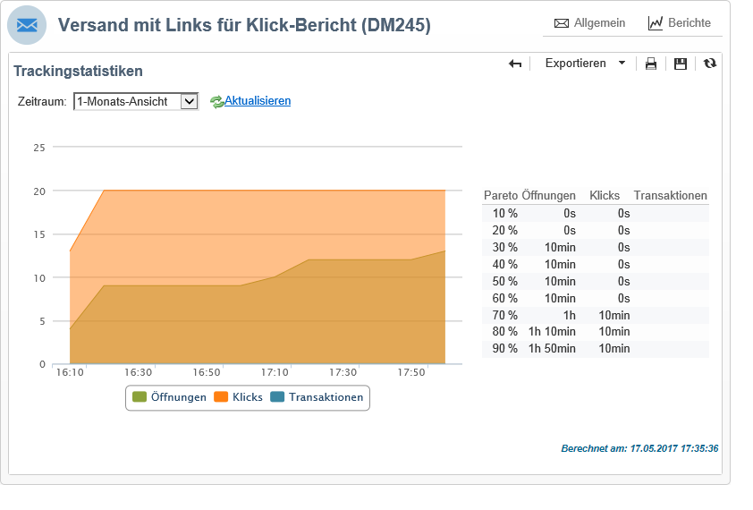

# Versandberichte {#delivery-reports}

Ausgehend von der Versandübersicht stehen diverse Berichte zur Verfügung, die Informationen bezüglich der Versanddurchführung enthalten. Gehen Sie wie folgt vor, um auf diese Berichte zuzugreifen:

1. Klicken Sie im Tab **[!UICONTROL Kampagnen]** auf den Link **[!UICONTROL Sendungen]**, um die Versandliste aufzurufen.
1. Klicken Sie auf den Namen des gewünschten Versands, um ihn im Detail anzusehen.

   

1. Klicken Sie im Tab **[!UICONTROL Zusammenfassung]** auf **[!UICONTROL Berichte]**, um die spezifischen Versandberichte aufzurufen.

   

   Standardmäßig stehen folgende Berichte zur Verfügung:

   * **[!UICONTROL Versanddurchsatz]**: siehe [Versanddurchsatz](../../reporting/using/global-reports.md#delivery-throughput).
   * **[!UICONTROL Teilen über soziale Netzwerke]**: siehe [Teilen über soziale Netzwerke](../../reporting/using/global-reports.md#sharing-to-social-networks).
   * **[!UICONTROL Statistiken zu Teilungsaktivitäten]**: siehe [Statistiken zu Teilungsaktivitäten](../../reporting/using/global-reports.md#statistics-on-sharing-activities).
   * **[!UICONTROL Klickposition]**: siehe [Klickposition](#hot-clicks).
   * **[!UICONTROL Trackingstatistiken]**: siehe [Trackingstatistiken](#tracking-statistics).
   * **[!UICONTROL URLs und Clickstreams]**: siehe [URLs und Clickstreams](#urls-and-click-streams).
   * **[!UICONTROL Trackingindikatoren]**: siehe [Trackingindikatoren](#tracking-indicators).
   * **[!UICONTROL Fehler und Bounces]**: siehe [Fehler und Bounces](../../reporting/using/global-reports.md#non-deliverables-and-bounces).
   * **[!UICONTROL Nutzer-Aktivitäten]**: siehe [Nutzer-Aktivitäten](../../reporting/using/global-reports.md#user-activities).
   * **[!UICONTROL Versandzusammenfassung]**: siehe [Versandzusammenfassung](#delivery-summary).
   * **[!UICONTROL Abonnement-Verfolgung]**: siehe [Abonnement-Verfolgung](../../reporting/using/global-reports.md#subscription-tracking).
   * **[!UICONTROL Versandstatistiken]**: siehe [Versandstatistiken](../../reporting/using/global-reports.md#delivery-statistics).
   * **[!UICONTROL Öffnungsverteilung]**: siehe [Öffnungsverteilung](../../reporting/using/global-reports.md#breakdown-of-opens).

## Tracking-Indikatoren {#tracking-indicators}

Dieser Bericht enthält die wichtigsten Indikatoren, die die Verfolgung des Empfängerverhaltens beim Erhalt eines Versands ermöglichen. Er bietet Zugriff auf Versand- und Empfangsstatistiken, Öffnungs- und Klickraten, erzeugte Clickstreams, Webtracking-Statistiken sowie Teilungsaktivitäten in sozialen Netzwerken.

>[!NOTE]
>
>Die auf der Basis von Öffnungen berechneten Werte sind immer nur Schätzungen. Dies hängt mit der durch E-Mails im Textformat bedingten Fehlerquote zusammen. Die **[!UICONTROL Unique Opens/Summe der Öffnungen der erreichten Population]** -Indikatoren berücksichtigen diese Fehlerquote. Weiterführende Informationen zum Verfolgen von Öffnungen finden Sie im Abschnitt [Öffnungs-Tracking](../../reporting/using/indicator-calculation.md#tracking-opens-).

**[!UICONTROL 1. Versandstatistiken]**

* **[!UICONTROL Zu versendende Nachricht(en)]**: Gesamtzahl der nach erfolgter Versandanalyse zu versendenden Nachrichten.
* **[!UICONTROL Erfolg]**: Anzahl der erfolgreich verarbeiteten Nachrichten.

**[!UICONTROL 2. Empfangsstatistiken]**

>[!NOTE]
>
>Die Prozentsätze werden in Bezug auf die erfolgreich zugestellten Nachrichten berechnet.

* **[!UICONTROL Unterschiedene Öffnungen für die erreichte Population]**: Schätzung der Anzahl der Zielgruppenempfänger, die eine Nachricht mindestens einmal geöffnet haben. Klicks auf getrackte URLs werden berücksichtigt, da E-Mails geöffnet werden müssen, damit auf einen Link geklickt werden kann.
* **[!UICONTROL Summe der Öffnungen in Bezug auf die erreichte Population]**: Schätzung der Gesamt-Öffnungszahl durch Zielgruppenempfänger.
* **[!UICONTROL Klicks auf den Abmelde-Link]**: Anzahl der Klicks auf den Abmelde-Link.
* **[!UICONTROL Klicks auf den Mirrorseiten-Link]** : Anzahl der Klicks auf den Mirrorseite-Link. Um berücksichtigt zu werden, muss der Link im Versand-Assistenten als solcher definiert sein (getrackte URLs). Mehr dazu erfahren Sie auf [dieser Seite](../../delivery/using/about-delivery-monitoring.md).
* **[!UICONTROL Schätzung der Weiterleitungen]**: Schätzung der Anzahl der E-Mails, die von Zielgruppenempfängern an andere Personen weitergeleitet wurden. Dieser Wert ist die Differenz aus den Unique Opens allgemein und den Unique Opens der Zielgruppenempfänger.

  >[!NOTE]
  >
  >Weiterführende Informationen zur Unterscheidung von Personen und Zielgruppenempfängern finden Sie unter [Unterschied zwischen Personen und Zielgruppenempfängern](../../reporting/using/indicator-calculation.md#targeted-persons---recipients).

**[!UICONTROL 3. Öffnungs- und Klickrate]**

Die Tabelle zeigt - aufgeschlüsselt nach Domains - Sendungen, Öffnungen, Klicks und Brutto-Reaktionsraten. Folgende Indikatoren werden angezeigt:

* **[!UICONTROL Sendungen]**: Gesamtzahl der an die jeweilige Domain gesandten Nachrichten.
* **[!UICONTROL Beschwerden]**: Anzahl der Nachrichten, die von den Empfängern als unerwünscht erklärt wurden, in Bezug auf die Gesamtzahl der an die Domain gesendeten Nachrichten.
* **[!UICONTROL Öffnungen]** : Anzahl unterschiedlicher Zielgruppenempfänger dieser Domain, die mindestens einmal die betreffende Nachricht geöffnet haben. Die Rate wird auf Basis der Gesamtzahl der an die Domain gesandten Nachrichten berechnet.
* **[!UICONTROL Klicks]**: Anzahl der unterschiedlichen Zielgruppenempfänger, die mindestens einmal im entsprechenden Versand geklickt haben, in Bezug auf die Gesamtzahl der an die Domain gesandten Nachrichten.
* **[!UICONTROL Brutto-Reaktionsrate]**: Prozentualer Anteil der Empfänger, die mindestens einmal im betreffenden Versand geklickt haben, in Bezug auf die Empfänger, die mindestens einmal den betreffenden Versand geöffnet haben.

>[!NOTE]
>
>Die in diesem Bericht angezeigten Domain-Namen werden in der Auflistung definiert, die auf Cube-Ebene verwendet wird. Um Standarddomänen zu ändern, hinzuzufügen oder zu entfernen, bearbeiten Sie die **[!UICONTROL Domänen]** Auflistungen und Änderung von Werten und Aliasen. Weiterführende Informationen hierzu finden Sie in [diesem Abschnitt](../../platform/using/managing-enumerations.md). Die **[!UICONTROL sonstige]** -Kategorie enthält Domänennamen, die keinem Wert der Auflistung angehören.

**[!UICONTROL 4. Erzeugte Clickstreams]**

>[!NOTE]
>
>Die Prozentsätze werden in Bezug auf die erfolgreich zugestellten Nachrichten berechnet.

* **[!UICONTROL Unique Clicks der erreichten Population]**: Anzahl unterschiedlicher Personen, die mindestens einmal im betreffenden Versand geklickt haben.
* **[!UICONTROL Klicks insgesamt]**: Gesamtzahl der Klicks von Zielgruppenempfängern, ausgenommen Abmelde- und Mirrorseite-Links.
* **[!UICONTROL Empfänger-Klicks]**: Anzahl unterschiedlicher Zielgruppenempfänger, die mindestens einmal im betreffenden Versand geklickt haben.
* **[!UICONTROL Geschätzte Empfänger-Reaktionsrate]**: Prozentualer Anteil der Empfänger, die mindestens einmal im betreffenden Versand geklickt haben, in Bezug auf die geschätzte Anzahl der Empfänger, die mindestens einmal den betreffenden Versand geöffnet haben. Klicks auf Abmelde- und Mirrorseite-Links werden nicht berücksichtigt.

**[!UICONTROL 5. Webtracking]**

* **[!UICONTROL Besuchte Seiten]**: Anzahl besuchter Webseiten infolge des Erhalts einer Nachricht.
* **[!UICONTROL Transaktionen]**: Anzahl der Käufe infolge des Erhalts einer Nachricht.
* **[!UICONTROL Gesamtbetrag]**: Gesamtbetrag der Käufe infolge des Erhalts einer Nachricht.
* **[!UICONTROL Durchschnittlicher Transaktionsbetrag]**: Durchschnittlicher Warenkorb der unterschiedlichen Versandempfänger.
* **[!UICONTROL Artikel]**: Anzahl der von den Versandempfängern gekauften Artikel.
* **[!UICONTROL Durchschnittliche Artikelanzahl pro Transaktion]**: Durchschnittliche Artikelanzahl pro von unterschiedlichen Empfängern getätigtem Kauf.
* **[!UICONTROL Durchschnittlicher Transaktionsbetrag pro Nachricht]**: Durchschnittlicher Betrag der Käufe pro Nachricht.

  >[!NOTE]
  >
  >Damit eine besuchte Seite, Transaktion, Betrag oder Artikel berücksichtigt werden kann, muss auf der entsprechenden Webseite ein Webtrackingtag gesetzt werden. Die Konfiguration des Webtrackings wird im Abschnitt [diesem Abschnitt](../../configuration/using/about-web-tracking.md).

**[!UICONTROL 6. Teilen über E-Mail und in sozialen Netzwerken]**

Dieser Abschnitt zeigt die Anzahl der in einzelnen sozialen Netzwerken geteilten Nachrichten. Weitere Informationen finden Sie unter [Teilen über soziale Netzwerke](../../reporting/using/global-reports.md#sharing-to-social-networks).

## URLs und Clickstreams {#urls-and-click-streams}

Dieser Bericht zeigt die Rangfolge der infolge eines Versands besuchten Web-Seiten.

Sie können den Inhalt dieses Berichts konfigurieren, indem Sie Folgendes auswählen: das anzuzeigende Punktdiagramm, den Zeitfilter (seit dem Start der Werbeaktion, über die ersten sechs Stunden nach dem Start usw.) und den Anzeigemodus der Daten (nach Titel, nach URL, nach Kategorie). Klicks **[!UICONTROL Aktualisieren]** um Ihre Auswahl zu bestätigen.

Im oberen Bereich des Berichts werden folgende Indikatoren angezeigt:

* **[!UICONTROL Reaktionsrate]**: Prozentualer Anteil der Zielgruppenempfänger, die mindestens einmal im betreffenden Versand geklickt haben, in Bezug auf die geschätzte Anzahl der Zielgruppenempfänger, die mindestens einmal den betreffenden Versand geöffnet haben. Klicks auf Abmelde- und Mirrorseite-Links werden nicht berücksichtigt.

  >[!NOTE]
  >
  >Weiterführende Informationen zum Verfolgen von Öffnungen finden Sie im Abschnitt [Öffnungs-Tracking](../../reporting/using/indicator-calculation.md#tracking-opens-).

* **[!UICONTROL Unique Clicks]**: Prozentualer Anteil der unterschiedlichen Personen, die mindestens einmal im betreffenden Versand geklickt haben (ausgenommen Abmelde- und Mirrorseite-Link), in Bezug auf die Gesamtzahl erfolgreich zugestellter Nachrichten.
* **[!UICONTROL Klicks insgesamt]**: Prozentualer Anteil aller Klicks von Zielgruppenempfängern, ausgenommen Abmelde- und Mirrorseite-Links, in Bezug auf die Gesamtzahl erfolgreich zugestellter Nachrichten.

**[!UICONTROL Plattform-Durchschnitt]**: Dieser unter allen Raten (Reaktivität, Unique Clicks und aufaddierte Klicks) angezeigte Wert bezieht sich auf die Gesamtheit der in den letzten sechs Monaten gesendeten Nachrichten. Nur Sendungen, die dieselbe Typologie aufweisen und die auf demselben Kanal gesendet wurden, werden berücksichtigt. Testsendungen sind von der Statistik ausgenommen.

Der mittlere Bereich der Tabelle zeigt folgende Indikatoren:

* **[!UICONTROL Klicks]**: Anzahl an Klicks insgesamt je Link.
* **[!UICONTROL Klicks (in %)]**: Prozentualer Anteil der Klicks je Link in Bezug auf die Anzahl an Klicks insgesamt.

**[!UICONTROL Zeitliche Klickverteilung]**

Dieses Diagramm zeigt die Verteilung der Klicks insgesamt nach Tagen.

## Versandzusammenfassung {#delivery-summary}

Dieser Bericht zeigt die wichtigsten Informationen zu einem Versand.

**[!UICONTROL Zielpopulation]**

Dieser Bereich zeigt zwei Indikatoren:

* **[!UICONTROL Ursprungspopulation]**: Gesamtzahl der Empfänger, die den Versand erhalten sollen.
* **[!UICONTROL Durch eine Regel zurückgewiesene Nachrichten]**: Zahl der Adressen, die während der Analyse beim Anwenden von Typologieregeln ignoriert wurden: Adresse fehlt, in Quarantäne, auf Blockierungsliste usw. Weiterführende Informationen zu Typologieregeln finden Sie auf dieser [Seite](../../delivery/using/steps-validating-the-delivery.md#validation-process-with-typologies).

**[!UICONTROL Ausschlussgründe]**

Das Diagramm in der Mitte veranschaulicht die Verteilung der ausgeschlossenen Nachrichten nach Regeln.

**[!UICONTROL Versandstatistiken]**

Dieser Bereich zeigt folgende Indikatoren:

* **[!UICONTROL Zu versendende Nachricht(en)]**: Gesamtzahl der nach erfolgter Versandanalyse zu versendenden Nachrichten.
* **[!UICONTROL Erfolg]** : Anzahl der erfolgreich verarbeiteten Nachrichten. Die zugehörige Rate wird in Bezug auf die Anzahl der zu versendenden Nachrichten berechnet.
* **[!UICONTROL Fehler]**: Gesamtzahl an Fehlern in Sendungen und der automatischen Bounce-Verarbeitung. Die zugeordnete Rate wird in Bezug auf die Anzahl zu versendender Nachrichten berechnet.
* **[!UICONTROL Neu in Quarantäne]**: Anzahl der Adressen, die infolge eines fehlgeschlagenen Zustellversuchs unter Quarantäne gestellt wurden (unbekannter Nutzer, ungültige Domain). Die zugeordnete Rate wird in Bezug auf die Anzahl zu versendender Nachrichten berechnet.

## Klicks {#hot-clicks}

Er zeigt den Nachrichteninhalt (HTML und/oder Text) mit dem prozentualen Klickanteil für jeden Link. Links in Gestaltungsbausteinen, der Abmelde-Link, der Mirrorseite-Link und Angebotslinks werden in der Gesamtklickzahl berücksichtigt, in diesem Bericht jedoch nicht angezeigt.

>[!NOTE]
>
>Sollte Ihr Versand Angebote enthalten (Interaction), erscheint im oberen Bereich des Berichts ein Rahmen mit dem Klickanteil der Angebote.

## Tracking-Statistiken {#tracking-statistics}

Dieser Bericht zeigt Statistiken zu Öffnungen, Klicks und Transaktionen.

Damit können Sie die Auswirkungen des Versands auf das Marketing verfolgen. Sie können konfigurieren, wie Werte angezeigt werden, indem Sie den Zeitraum ändern (1 Stunde, 3 Stunden, 24 Stunden usw.). Klicks **[!UICONTROL Aktualisieren]** um Ihre Auswahl zu bestätigen.

Die Statistiken werden in Form einer Tabelle und eines Pareto-Diagramms dargestellt, welches die Dauer angibt, die der Versand benötigt hat, um seine höchste Effizienz zu erreichen. Folgende Indikatoren werden angezeigt:

* **[!UICONTROL Öffnungen]**: Geschätzte Dauer, um einen bestimmten Anteil an Öffnungen in Bezug auf die Gesamtzahl der geöffneten Nachrichten zu erreichen. E-Mails im Textformat werden nicht berücksichtigt. Weiterführende Informationen zum Verfolgen von Öffnungen finden Sie im Abschnitt [Öffnungs-Tracking](../../reporting/using/indicator-calculation.md#tracking-opens-).
* **[!UICONTROL Klicks]**: Geschätzte Dauer, um einen bestimmten Anteil an Klicks in Bezug auf die Gesamtzahl der getrackten Klicks zu erreichen. Klicks auf Abmelde- und Mirrorseite-Links werden nicht berücksichtigt.
* **[!UICONTROL Transaktionen]** : Erforderliche Zeit, um einen Prozentsatz der Gesamtzahl der Transaktionen infolge des Erhalts einer Nachricht zu erreichen. Damit eine Transaktion berücksichtigt werden kann, muss auf der entsprechenden Webseite ein Webtrackingtag vom Typ Transaktion gesetzt werden. Die Konfiguration des Webtrackings wird im Abschnitt [diesem Abschnitt](../../configuration/using/about-web-tracking.md).
