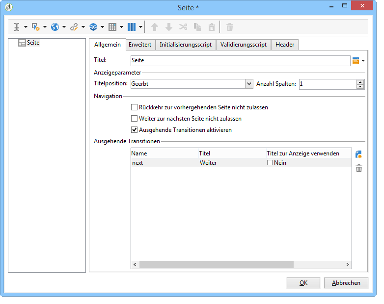
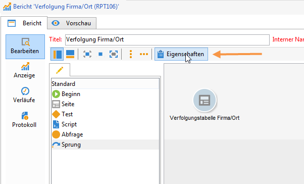
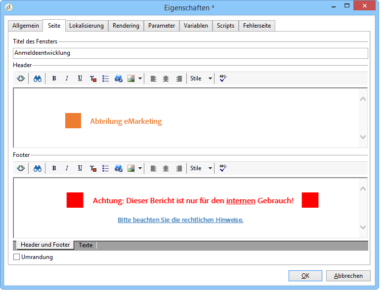
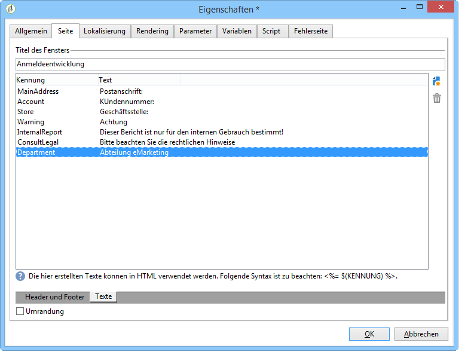
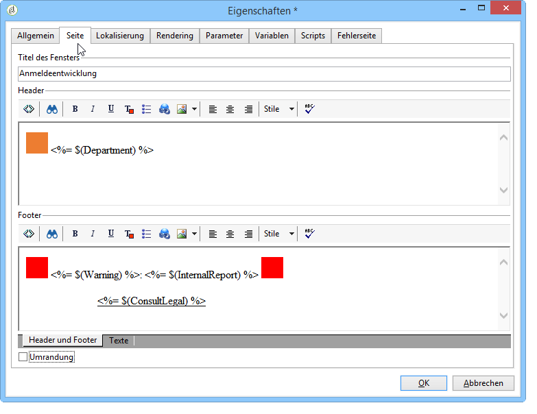

# Elemente anordnen{#element-layout}

Ergänzend zu den verfügbaren Grafikparametern (beschrieben im Abschnitt [Grafiktypen und ihre Parameter](../../reporting/using/creating-a-chart.md#chart-types-and-variants)) haben Sie die Möglichkeit, die Anzeige zu verändern und den Seiten des Berichts Elemente hinzuzufügen.

Sie können beispielsweise Container verwenden: Diese ermöglichen es, mehrere Elemente einer Seite zu gruppieren und in Spalten oder Zellen anzuordnen. Nähere Informationen zu ihrer Konfiguration werden in [diesem Abschnitt](../../web/using/defining-web-forms-layout.md#creating-containers) erläutert.

Sie können das Layout des Berichts in der Seite konfigurieren (an der Wurzel des Navigationsbaums) und es für jeden Container überschreiben. Sowohl Seiten als auch Container sind in Spalten organisiert. Nur statische Elemente und Grafiken sind in Zellen organisiert.

## Optionen jeder Seite festlegen {#defining-the-options-for-each-page}

Für jede Berichtseite können unterschiedliche Optionen konfiguriert werden.

Der Tab **[!UICONTROL Allgemein]** erlaubt es, den Titel der Seite zu ändern, die Positionierung der Legenden zu wählen und die Navigation zwischen den verschiedenen Seiten des Berichts zu konfigurieren.

Im Feld **[!UICONTROL Titel]** kann der Titel angepasst werden, der im Header der Berichtseite angezeigt wird. Der Titel des Fensters lässt sich in den **[!UICONTROL Eigenschaften]** des Berichts angegeben. Weitere Informationen hierzu finden Sie unter [Header und Footer hinzufügen](#adding-a-header-and-a-footer).

Die Optionen der **[!UICONTROL Anzeigeparameter]** ermöglichen es, die Positionierung der Legende in der Seite eines Berichts sowie die Spaltenanzahl der Seite zu bestimmen. Mehr Informationen zum Layout erhalten Sie im Abschnitt **Anordnung der Elemente** in [diesem Abschnitt](../../web/using/defining-web-forms-layout.md#positioning-the-fields-on-the-page).

Konfigurieren Sie die unterschiedlichen Optionen des Abschnitts **[!UICONTROL Navigation]**, um einen Übergang zwischen den Seiten des Berichts zu erlauben oder nicht. Bei Aktivierung der Option **[!UICONTROL Rückkehr zur vorhergehenden Seite nicht zulassen]** oder der Option **[!UICONTROL Weiter zur nächsten Seite nicht zulassen]** sind die Schaltflächen **[!UICONTROL Weiter]** oder **[!UICONTROL Zurück]** in der Berichtseite nicht mehr verfügbar.

## Header und Footer hinzufügen {#adding-a-header-and-a-footer}

Die Berichtseigenschaften bieten die Möglichkeit, Layout-Elemente wie einen Fenstertitel oder den HTML-Inhalt des Headers und des Footers zu konfigurieren.

Klicken Sie hierzu auf die Schaltfläche **[!UICONTROL Eigenschaften]** des Berichts.

Im Tab **[!UICONTROL Seite]** kann die Anzeige angepasst werden.

Der in diesem Tab konfigurierte Inhalt wird auf allen Seiten des Berichts sichtbar sein.

Im Untertab **[!UICONTROL Texte]** lassen sich variable Inhalte konfigurieren. Diese werden im Übersetzungszyklus berücksichtigt, wenn der Bericht in verschiedenen Sprachen angeboten wird.

Sie können hierzu eine Liste mit Textfragmenten erstellen und diesen jeweils eine Kennung zuordnen:

Fügen Sie die Kennungen in den HTML-Inhalt des Berichts ein:

Sie werden bei der Anzeige des Berichts automatisch durch den entsprechenden Inhalt ersetzt.

Diese Funktion ermöglicht es, wie bei HTML-Texten die im Bericht verwendeten Texte zu zentralisieren und ihre Übersetzungen zu erzeugen: Die in diesem Tab erstellten Texte werden automatisch von dem in Adobe Campaign integrierten Übersetzungstool abgerufen.
