# Allgemeine Berichte {#global-reports}

Diese Berichte beziehen sich auf Aktivitäten, die die Gesamtheit der Daten in der Datenbank betreffen. Begeben Sie sich in den Tab **[!UICONTROL Berichte]**, um auf das Dashboard zuzugreifen.

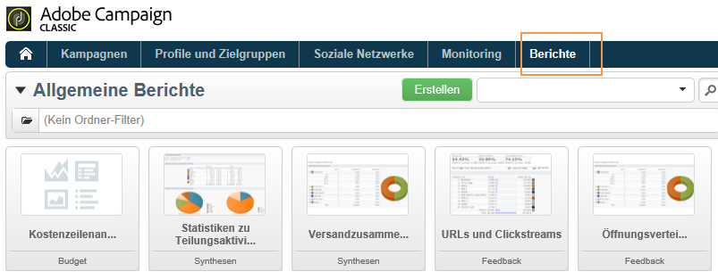

Klicken Sie zur Anzeige eines Berichts auf seinen Namen. Standardmäßig stehen folgende Berichte zur Verfügung:

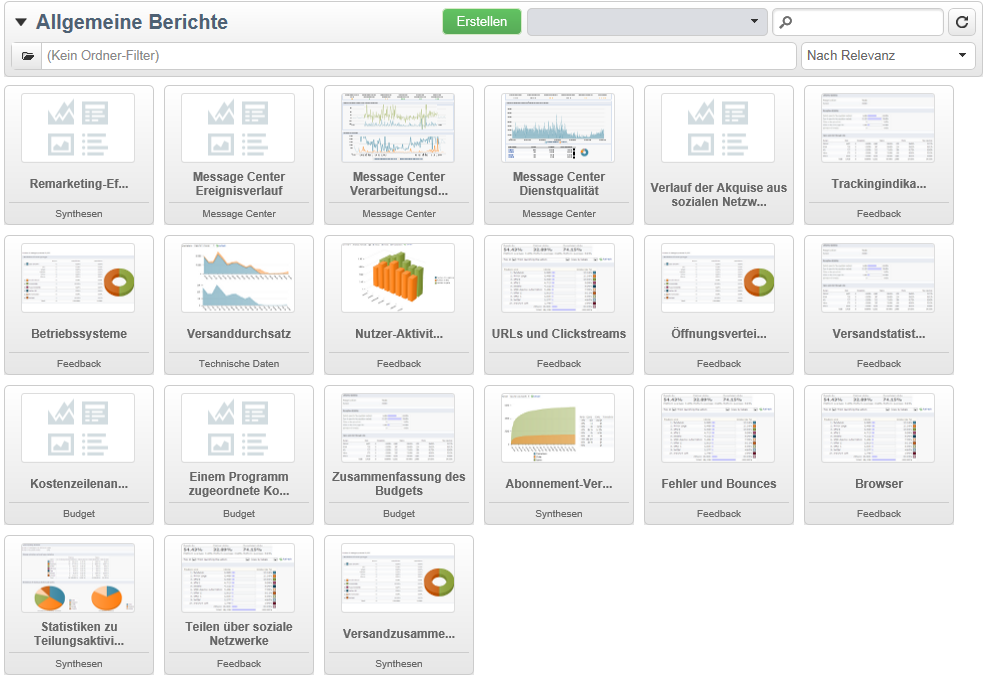

>[!NOTE]
>
>Dieser Abschnitt behandelt nur versandbezogene Berichte.

* **[!UICONTROL Versanddurchsatz]**: siehe [Versanddurchsatz](#delivery-throughput).
* **[!UICONTROL Browser]**: siehe [Browser](#browsers).
* **[!UICONTROL Teilen über soziale Netzwerke]**: siehe [Teilen über soziale Netzwerke](#sharing-to-social-networks).
* **[!UICONTROL Statistiken zu Teilungsaktivitäten]**: siehe [Statistiken zu Teilungsaktivitäten](#statistics-on-sharing-activities).
* **[!UICONTROL Betriebssysteme]**: siehe [Betriebssysteme](#operating-systems).
* **[!UICONTROL URLs und Clickstreams]**: siehe [URLs und Clickstreams](../../reporting/using/delivery-reports.md#urls-and-click-streams).
* **[!UICONTROL Trackingindikatoren]**: siehe [Trackingindikatoren](../../reporting/using/delivery-reports.md#tracking-indicators).
* **[!UICONTROL Fehler und Bounces]**: siehe [Fehler und Bounces](#non-deliverables-and-bounces).
* **[!UICONTROL Nutzer-Aktivitäten]**: siehe [Nutzer-Aktivitäten](#user-activities).
* **[!UICONTROL Abonnement-Verfolgung]**: siehe [Abonnement-Verfolgung](#subscription-tracking).
* **[!UICONTROL Versandzusammenfassung]**: siehe [Versandzusammenfassung](../../reporting/using/delivery-reports.md#delivery-summary).
* **[!UICONTROL Versandstatistiken]**: siehe [Versandstatistiken](#delivery-statistics).
* **[!UICONTROL Öffnungsverteilung]**: siehe [Öffnungsverteilung](#breakdown-of-opens).

## Versanddurchsatz {#delivery-throughput}

Dieser Bericht enthält Informationen zum Datendurchsatz der Sendungen in Bezug auf die gesamte Plattform für einen bestimmten Zeitraum. Zur Messung der Versandgeschwindigkeit von Nachrichten werden zwei Kennzahlen herangezogen: Anzahl an gesendeten Nachrichten pro Stunde und die gesendete Datenmenge in Bits pro Sekunde. Die unten stehende Grafik zeigt in Blau die Anzahl der erfolgreich versandten und in Orange die Anzahl der fehlgeschlagenen Nachrichten.

Sie können die Anzeige durch Änderung des Parameters (z. B. 1 Stunde, 3 Stunden, 24 Stunden) variieren. Klicken Sie auf die Schaltfläche **[!UICONTROL Aktualisieren]**, um Ihre Auswahl zu bestätigen.

## Nutzer-Aktivitäten {#user-activities}

Dieser Bericht zeigt Öffnungen, Klicks und Transaktionen in Form eines Diagramms (Verteilung nach Tagen, Stunden oder halben Stunden).

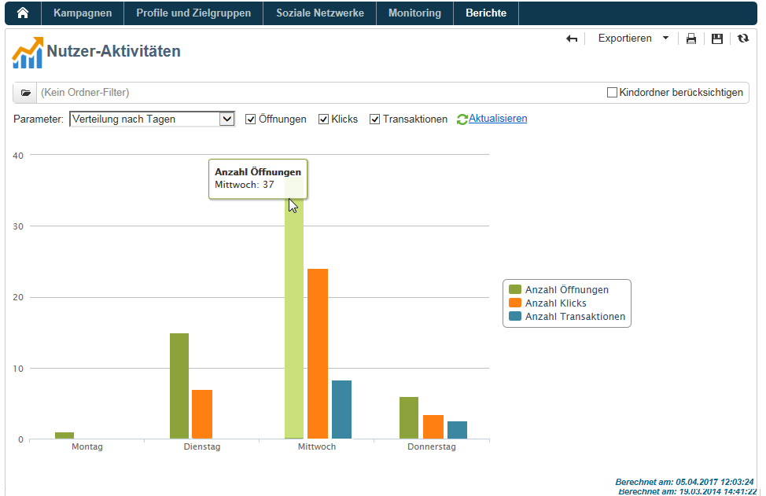

Folgende Optionen stehen zur Verfügung:

* **[!UICONTROL Öffnungen]**: Gesamtzahl der geöffneten Nachrichten. E-Mails im Textformat werden nicht berücksichtigt. Weiterführende Informationen zum Verfolgen von Öffnungen finden Sie im Abschnitt [Öffnungs-Tracking](../../reporting/using/indicator-calculation.md#tracking-opens-).
* **[!UICONTROL Klicks]**: Gesamtzahl der Klicks auf Links in Sendungen. Klicks auf Abmelde- und Mirrorseite-Links werden nicht berücksichtigt.
* **[!UICONTROL Transaktionen]**: Gesamtzahl der Transaktionen infolge eines Versands. Damit die Transaktionen berücksichtigt werden können, muss auf der entsprechenden Webseite ein Webtrackingtag vom Typ Transaktion gesetzt werden. Die Konfiguration des Webtrackings wird in [diesem Abschnitt](../../configuration/using/about-web-tracking.md) erläutert.

## Fehler und Bounces {#non-deliverables-and-bounces}

Dieser Bericht zeigt die Verteilung der Fehler nach Typ und nach Domain.

Die **[!UICONTROL Anzahl verarbeiteter Nachrichten]** entspricht der Gesamtzahl der vom Versandserver verarbeiteten Nachrichten. Die Anzahl kann u. U. geringer als die Zahl der zu versendenden Nachrichten ausfallen, wenn ein Teil der Nachrichten vor der Verarbeitung durch den Server gestoppt oder ausgesetzt wurden.

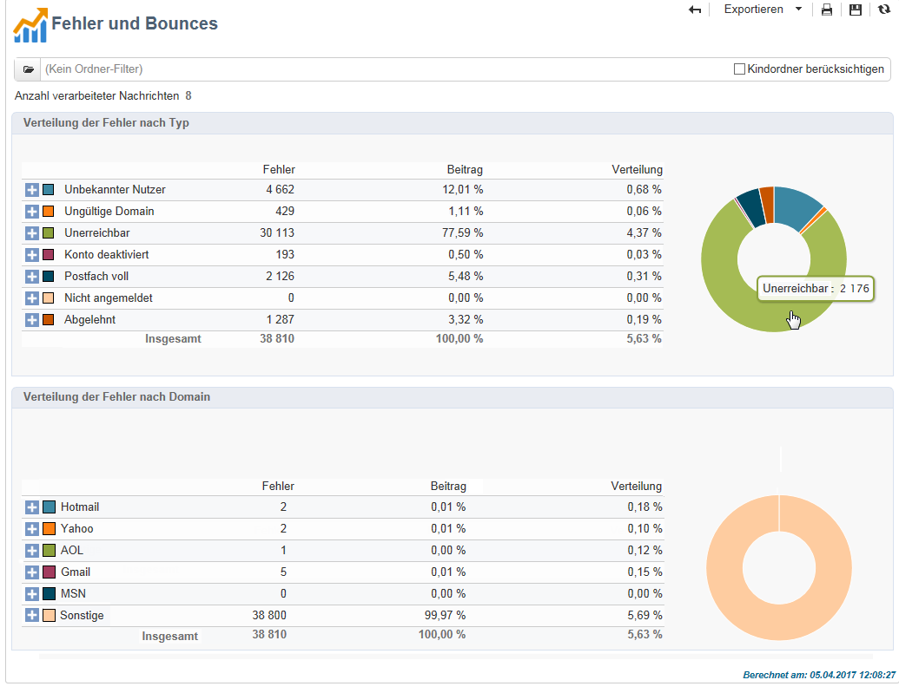

**[!UICONTROL Verteilung der Fehler nach Typ]**

>[!NOTE]
>
>Die in diesem Bericht dargestellten Fehler lösen eine Quarantäne der betroffenen Adressen aus. Weiterführende Informationen zur Quarantäneverwaltung finden Sie im Abschnitt [Quarantäneverwaltung](../../delivery/using/understanding-quarantine-management.md).

Der erste Teil des Berichts zeigt die Verteilung der fehlgeschlagenen Nachrichten nach Typ in Form einer Tabelle und eines Diagramms.

Zu jedem Fehlertyp erscheint:

* die Anzahl der fehlerhaften Nachrichten diesen Typs,
* der prozentuale Anteil der fehlerhaften Nachrichten diesen Typs in Bezug auf die Gesamtzahl der fehlerhaften Nachrichten,
* der prozentuale Anteil der fehlerhaften Nachrichten diesen Typs in Bezug auf die Gesamtzahl der verarbeiteten Nachrichten.

Folgende Indikatoren werden angezeigt:

* **[!UICONTROL Unbekannter Nutzer]**: Fehler bei ungültigen E-Mail-Adressen.
* **[!UICONTROL Ungültige Domain]**: Fehler bei ungültigen oder inexistenten E-Mail-Domains.
* **[!UICONTROL Postfach voll]**: Fehler, der nach fünf fehlgeschlagenen Zustellversuchen erzeugt wird, wenn das Postfach zu viele Nachrichten enthält.
* **[!UICONTROL Konto deaktiviert]**: Fehler, wenn eine Adresse nicht mehr existiert.
* **[!UICONTROL Abgelehnt]**: Fehler, wenn eine Adresse von einem ISP (Internet Service Provider) z. B. infolge der Anwendung einer Sicherheitsregel (Anti-Spam-Software) zurückgewiesen wird.
* **[!UICONTROL Unerreichbar]**: Fehler in der Verteilungskette der Nachricht (Vorfall beim SMTP-Server, zeitweilig unerreichbare Domain usw.).
* **[!UICONTROL Nicht angemeldet]**: Fehler, wenn das Mobiltelefon des Empfängers bei Versand der Nachricht ausgeschaltet war oder über keinen Netzempfang verfügte.

   >[!NOTE]
   >
   >Dieser Fehler betrifft nur Sendungen über Mobile-Kanäle. Weiterführende Informationen dazu finden Sie in [diesem Abschnitt](../../delivery/using/sms-channel.md).

   Jede Zeile der Datentabelle kann durch Anklicken des Symbols `[+]` ausgeklappt werden. Damit kann für jeden Fehlertyp die Verteilung der fehlerhaften Nachrichten nach Domain angezeigt werden.

   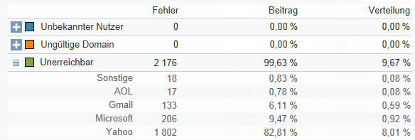

**[!UICONTROL Verteilung der Fehler nach Domain]**

Der zweite Teil des Berichts zeigt die Verteilung der fehlgeschlagenen Nachrichten nach Domains in Form einer Tabelle und eines Diagramms.

Zu jeder Domain erscheint:

* die Anzahl der fehlerhaften Nachrichten dieser Domain,
* der prozentuale Anteil der fehlerhaften Nachrichten für diese Domain in Bezug auf die Gesamtzahl der verarbeiteten Nachrichten dieser Domain,
* der prozentuale Anteil der fehlerhaften Nachrichten für diese Domain in Bezug auf die Gesamtzahl der fehlerhaften Nachrichten.

Jede Zeile der Datentabelle kann durch Klick auf das Symbol ]+[ ausgeklappt werden. Dies ermöglicht die Anzeige der Verteilung der fehlerhaften Nachrichten nach Fehlertyp für jede Domain.

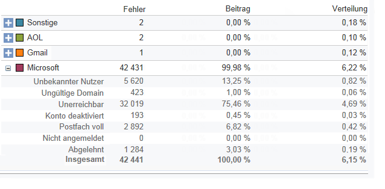

>[!NOTE]
>
>Die in diesem Bericht angezeigten Domain-Namen werden im Cube **[!UICONTROL Versandlogs (broadlogrcp)]** festgelegt und können vom Benutzer angepasst werden. Weiterführende Informationen finden Sie in [diesem Abschnitt](../../reporting/using/about-cubes.md). In der Kategorie **[!UICONTROL Sonstige]** werden die Domains zusammengefasst, die keiner der festgelegten Domains entsprechen.

## Browser {#browsers}

Dieser Bericht enthält die Verteilung der Browser, die von den Versandempfängern im ausgewählten Zeitraum verwendet wurden.

>[!NOTE]
>
>Bei den Werten handelt es sich um Schätzungen, da nur die Versandempfänger berücksichtigt werden, die in eine Nachricht geklickt haben.

**Allgemeine Statistiken**

Die allgemeinen Statistiken zur Browserverwendung werden als Tabelle und Diagramm dargestellt.

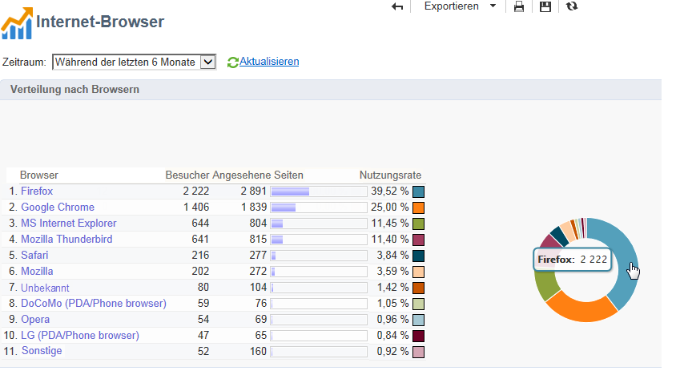

Folgende Indikatoren werden angezeigt:

* **[!UICONTROL Besucher]**: Gesamtzahl der Zielgruppenempfänger nach Domain, die mindestens einmal in einer Nachricht geklickt haben.
* **[!UICONTROL Angesehene Seiten]**: Gesamtzahl der Klicks auf Links in Sendungen nach Browser, bezogen auf alle Sendungen.
* **[!UICONTROL Nutzungsrate]**: Prozentuale Verteilung der Besucher nach Browser in Bezug auf die Gesamt-Besucherzahl.

**Statistiken nach Browsern**

In der Tabelle der allgemeinen Statistiken können Sie auf die Browser-Namen klicken, um für jeden Browser die Verwendungsstatistiken anzuzeigen.

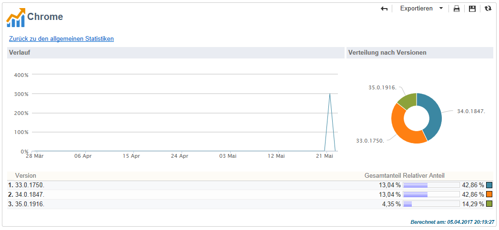

Die Statistiken werden in Form von Kurven, Diagrammen und Tabellen dargestellt.

Der **[!UICONTROL Verlauf]** zeigt die tägliche Besucherrate des ausgewählten Browsers in Bezug auf die höchste gemessene Besucherzahl.

Die **[!UICONTROL Verteilung nach Versionen]** zeigt den prozentualen Anteil der Besucher je Version in Bezug auf die Gesamt-Besucherzahl für den gewählten Browser.

In der Tabelle werden folgende Indikatoren dargestellt:

* **[!UICONTROL Gesamtanteil]**: Prozentualer Anteil der Besucher je Version, bezogen auf die Gesamt-Besucherzahl und auf alle Browser.
* **[!UICONTROL Relativer Anteil]**: Prozentualer Anteil der Besucher je Version, bezogen auf die Gesamt-Besucherzahl und auf den betreffenden Browser.

### Teilen über soziale Netzwerke {#sharing-to-social-networks}

Mit Viral-Marketing geben Sie den Empfängern Ihrer Sendungen die Möglichkeit, Nachrichten im Netzwerk zu teilen, sie also beispielsweise als Link auf ihrem Facebook- oder Twitter-Profil zu veröffentlichen oder an Freunde weiterzuleiten. Jede Verlinkung bzw. Weiterleitung und jeder Zugriff auf die weitergeleitete Information schlägt sich im Versandtracking nieder. Weiterführende Informationen zum Viral-Marketing finden Sie in [diesem Abschnitt](../../delivery/using/viral-and-social-marketing.md).

Dieser Bericht zeigt Teilungen und Öffnungen in sozialen Netzwerken (Facebook, Twitter etc.) und/oder über E-Mails.

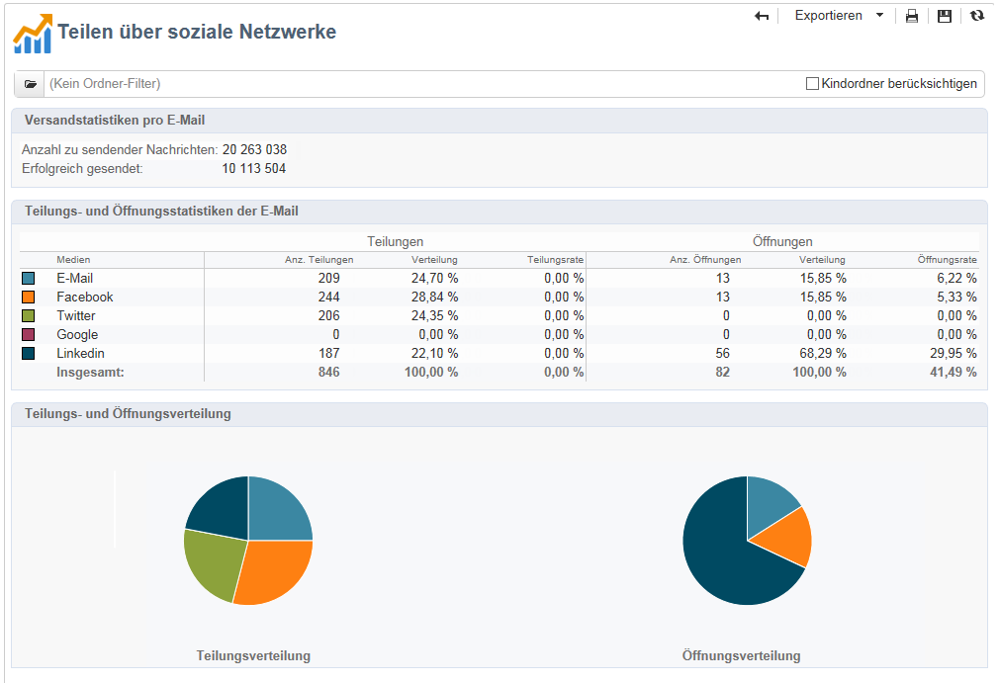

**[!UICONTROL Versandstatistiken pro E-Mail]**

In den Statistiken pro E-Mail werden zwei Werte angezeigt:

* **[!UICONTROL Anzahl zu sendender Nachrichten]**: Gesamtzahl der bei der Analyse verarbeiteten Nachrichten.
* **[!UICONTROL Erfolgreich gesendet]**: Anzahl erfolgreich zugestellter Nachrichten.

**[!UICONTROL Teilungs- und Öffnungsstatistiken der E-Mail]**

Der zentrale Bereich zeigt die Teilungs- und Öffnungsstatistiken der E-Mail.

In der Rubrik **[!UICONTROL Teilungen]** werden folgende Indikatoren angezeigt:

* **[!UICONTROL Anz. Teilungen]**: Anzahl der geteilten Nachrichten je Medium. Der Wert entspricht der Zahl der Klicks auf das dem Gestaltungsbaustein **[!UICONTROL Teilen-Links der sozialen Netzwerke]** entsprechende Symbol.
* **[!UICONTROL Verteilung]**: Prozentualer Anteil der Teilungen im jeweiligen Medium in Bezug auf die Gesamtzahl der Teilungen.
* **[!UICONTROL Teilungsrate]**: Prozentualer Anteil der Teilungen im jeweiligen Medium in Bezug auf die Gesamtzahl der zu sendenden Nachrichten.

In der Rubrik **[!UICONTROL Öffnungen]** werden folgende Indikatoren angezeigt:

* **[!UICONTROL Anz. Öffnungen]**: Anzahl der Nachrichten, die von Personen, an die die Nachricht (über den Gestaltungsbaustein **[!UICONTROL Teilen-Links der sozialen Netzwerke]**) weitergeleitet wurde, geöffnet wurden. Der Wert entspricht der Anzahl der Mirrorseiten-Öffnungen. Die Öffnungen der Mirrorseite durch Zielgruppenempfänger werden in diesem Wert nicht berücksichtigt.
* **[!UICONTROL Verteilung]**: Prozentualer Anteil der Öffnungen im jeweiligen Medium in Bezug auf die Gesamtzahl der Öffnungen.
* **[!UICONTROL Öffnungsrate]**: Prozentualer Anteil der Öffnungen im jeweiligen Medium in Bezug auf die Gesamtzahl der Teilungen.

**[!UICONTROL Teilungs- und Öffnungsverteilung]**

Dieser Bereich veranschaulicht in zwei Diagrammen die Verteilung von Teilungen und Öffnungen nach sozialen Medien.

## Statistiken zu Teilungsaktivitäten {#statistics-on-sharing-activities}

Dieser Bericht zeigt die zeitliche Entwicklung von Teilungen in sozialen Netzwerken (Facebook, Twitter usw.) und/oder über E-Mails.

Weitere Informationen zum Viral-Marketing finden Sie in [diesem Abschnitt](../../delivery/using/viral-and-social-marketing.md).

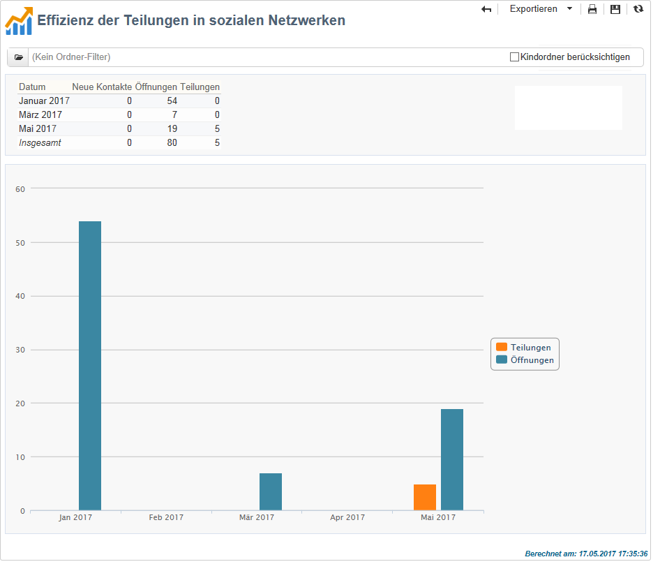

Die Statistiken werden in Form von Diagrammen und Tabellen dargestellt.

Folgende Indikatoren werden angezeigt:

* **[!UICONTROL Neue Kontakte]**: Anzahl der Anmeldungen infolge des Erhalts einer per E-Mail weitergeleiteten Nachricht. Der Wert entspricht der Anzahl an Personen, die per E-Mail eine weitergeleitete Nachricht erhalten, auf den **[!UICONTROL Anmelde-Link]** geklickt und das Formular ausgefüllt haben.
* **[!UICONTROL Öffnungen]**: Anzahl der Nachrichten, die von Personen, an die die Nachricht (über den Gestaltungsbaustein **[!UICONTROL Teilen-Links der sozialen Netzwerke]**) weitergeleitet wurde, geöffnet wurden. Der Wert entspricht der Anzahl der Mirrorseiten-Öffnungen. Die Öffnungen der Mirrorseite durch Zielgruppenempfänger werden in diesem Wert nicht berücksichtigt.
* **[!UICONTROL Teilungen]**: Anzahl der in sozialen Netzwerken geteilten Nachrichten. Der Wert entspricht der Zahl der Klicks auf das dem Gestaltungsbaustein **[!UICONTROL Teilen-Links der sozialen Netzwerke]** entsprechende Symbol.

## Betriebssysteme {#operating-systems}

Dieser Bericht enthält die Betriebssysteme, die von den Versandempfängern im ausgewählten Zeitraum verwendet wurden.

>[!NOTE]
>
>Bei den Werten handelt es sich um Schätzungen, da nur die Versandempfänger berücksichtigt werden, die in eine Nachricht geklickt haben.

**Allgemeine Statistiken**

Die allgemeinen Statistiken bezüglich der verwendeten Betriebssysteme werden in Form von Diagrammen und Tabellen dargestellt.

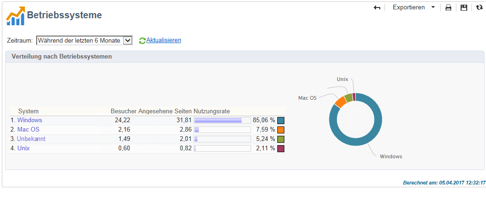

Folgende Indikatoren werden angezeigt:

* **[!UICONTROL Besucher]**: Durchschnittliche Anzahl der Zielgruppenempfänger pro Tag nach Betriebssystem, die mindestens einmal in einer Nachricht geklickt haben.
* **[!UICONTROL Angesehene Seiten]**: Durchschnittliche Anzahl von Klicks auf Links in Sendungen nach Betriebssystem, bezogen auf alle Sendungen.
* **[!UICONTROL Nutzungsrate]**: Prozentuale Verteilung der Besucher nach Betriebssystem in Bezug auf die Gesamt-Besucherzahl.

**Statistiken nach Betriebssystem**

In der Tabelle der allgemeinen Statistiken können Sie auf die Namen der einzelnen Betriebssysteme klicken, um die jeweiligen Verwendungsstatistiken anzuzeigen.

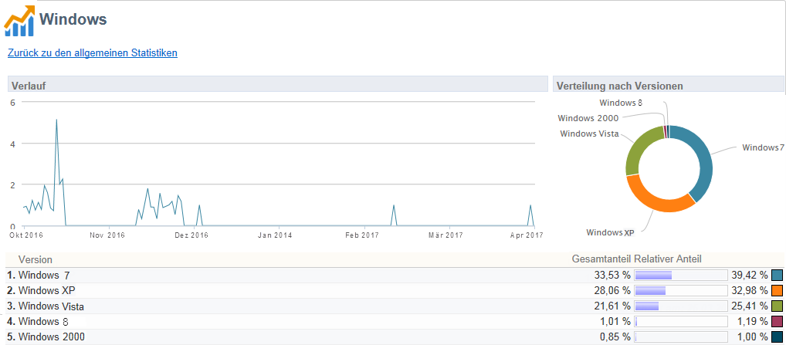

Die Statistiken werden in Form von Kurven, Diagrammen und Tabellen dargestellt.

Der **[!UICONTROL Verlauf]** zeigt die tägliche Nutzungsrate des ausgewählten Betriebssystems in Bezug auf die höchste gemessene Besucherzahl.

Die **[!UICONTROL Verteilung nach Versionen]** zeigt den prozentualen Anteil der Besucher je Version in Bezug auf die Gesamt-Besucherzahl für das gewählte Betriebssystem.

In der Tabelle werden folgende Indikatoren dargestellt:

* **[!UICONTROL Gesamtanteil]**: Prozentualer Anteil der Besucher je Version, bezogen auf die Gesamt-Besucherzahl und auf alle Betriebssysteme.
* **[!UICONTROL Relativer Anteil]**: Prozentualer Anteil der Besucher je Version, bezogen auf die Gesamt-Besucherzahl und alle Browser.

## Abonnement-Verfolgung {#subscription-tracking}

Dieser Bericht enthält Informationen bezüglich der Informationsdienst-Abonnements. An- und Abmeldungen werden im Detail beleuchtet.

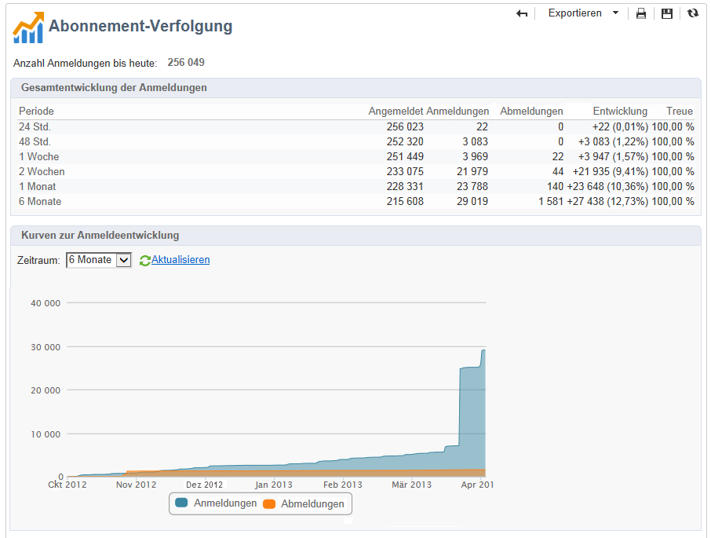

Er kann für ein bestimmtes Abonnement angezeigt werden, indem Sie im Knoten **[!UICONTROL Profile und Zielgruppen > Dienste und Abonnements]** den entsprechenden Titel markieren und auf die Rubrik **[!UICONTROL Berichte]** klicken. Der Bericht **[!UICONTROL Abonnement-Verfolgung]** steht standardmäßig zur Verfügung und gibt über verschiedene Zeiträume hinweg Auskunft über die An- und Abmeldeentwicklung sowie die Treue der Abonnenten. Der Zeitraum des Diagramms kann über die Dropdown-Liste angepasst werden. Klicken Sie auf **[!UICONTROL Aktualisieren]**, um Ihre Wahl zu bestätigen.

Weiterführende Informationen dazu finden Sie auf [dieser Seite](../../delivery/using/managing-subscriptions.md).

Die Zeile **[!UICONTROL Anzahl Anmeldungen bis heute]** gibt die Gesamtzahl aller Abonnenten zum aktuellen Zeitpunkt an.

**[!UICONTROL Gesamtentwicklung der Anmeldungen]**

In der Tabelle werden folgende Indikatoren dargestellt:

* **[!UICONTROL Angemeldet]**: Anzahl der Abonnenten insgesamt für den entsprechenden Zeitraum.
* **[!UICONTROL Anmeldungen]**: Anzahl der Anmeldungen für den entsprechenden Zeitraum.
* **[!UICONTROL Abmeldungen]**: Anzahl der Abmeldungen für den entsprechenden Zeitraum.
* **[!UICONTROL Entwicklung]**: Anzahl Anmeldungen abzüglich Abmeldungen. Der Prozentsatz in Klammern bezieht sich auf die Gesamtzahl der Abonnenten.
* **[!UICONTROL Treue]**: Treuerate der Abonnenten über den entsprechenden Zeitraum.

**[!UICONTROL Kurven zur Anmeldeentwicklung]**

Das Diagramm veranschaulicht die Abonnemententwicklung über den ausgewählten Zeitraum.

## Versandstatistiken {#delivery-statistics}

Dieser Bericht enthält die Anzahl verarbeiteter E-Mails sowie den prozentualen Anteil an zugestellten Nachrichten, Hard- und Softbounces, Öffnungen, Klicks und Abmeldungen nach Domains.

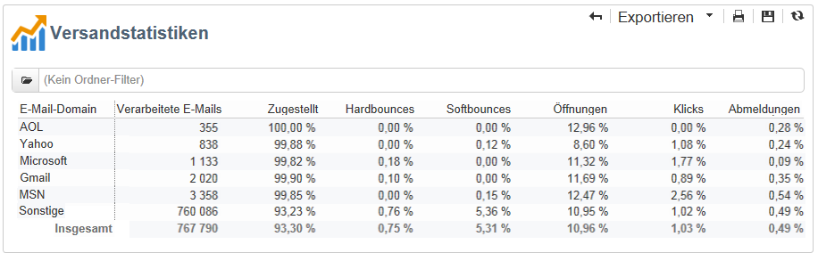

Folgende Indikatoren werden angezeigt:

* **[!UICONTROL Verarbeitete E-Mails]**: Gesamtzahl der E-Mails, die vom Versandserver verarbeitet wurden.
* **[!UICONTROL Zugestellt]**: Prozentualer Anteil der erfolgreich zugestellten E-Mails in Bezug auf die Gesamtzahl der verarbeiteten E-Mails.
* **[!UICONTROL Hardbounces]**: Prozentualer Anteil der Hardbounces in Bezug auf die Gesamtzahl der verarbeiteten E-Mails.
* **[!UICONTROL Softbounces]**: Prozentualer Anteil der Softbounces in Bezug auf die Gesamtzahl der verarbeiteten E-Mails.

   >[!NOTE]
   >
   >Weiterführende Informationen zu Hard- und Softbounces finden Sie im Abschnitt [Quarantäneverwaltung](../../delivery/using/understanding-quarantine-management.md).

* **[!UICONTROL Öffnungen]**: Prozentualer Anteil der unterschiedlichen Zielgruppenempfänger, die mindestens einmal die betreffende Nachricht geöffnet haben, in Bezug auf die Gesamtzahl der verarbeiteten E-Mails.
* **[!UICONTROL Klicks]**: Prozentualer Anteil der unterschiedlichen Zielgruppenempfänger, die mindestens einmal in eine Nachricht geklickt haben, in Bezug auf die Gesamtzahl der verarbeiteten E-Mails.
* **[!UICONTROL Abmeldungen]**: Prozentualer Anteil der Klicks auf einen Abmelde-Link in Bezug auf die Gesamtzahl der verarbeiteten E-Mails.

## Öffnungsverteilung {#breakdown-of-opens}

Dieser Bericht zeigt die Öffnungsverteilung nach Betriebssystem, Geräteart und Browser für den ausgewählten Zeitraum. Für jede Kategorie stehen zwei Diagramme zur Verfügung. Das erste zeigt die Öffnungsstatistiken für Computer und Mobilgeräte an, das zweite nur für Mobilgeräte.

Die Zahl der Öffnungen entspricht der Gesamtzahl der geöffneten Nachrichten. E-Mails im Textformat werden nicht berücksichtigt. Weitere Informationen zum Verfolgen von Öffnungen finden Sie im Abschnitt [Öffnungs-Tracking](../../reporting/using/indicator-calculation.md#tracking-opens-).

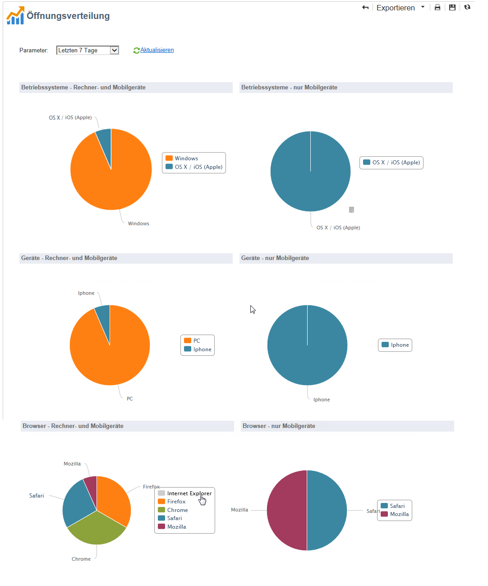

>[!NOTE]
>
>Browser- und Betriebssystemnamen stellen einen Teil der Informationen dar, die vom Benutzeragent des Browsers gesendet werden, für den die Nachricht geöffnet wurde. Adobe Campaign leitet den Gerätetyp anhand der Geräteinformationen ab.