# Allgemeine Berichte {#global-reports}

Diese Berichte beziehen sich auf die Aktivität der Daten in der gesamten Datenbank. Um das Berichte-Dashboard anzuzeigen, gehen Sie zur Registerkarte **[!UICONTROL Berichte]** .

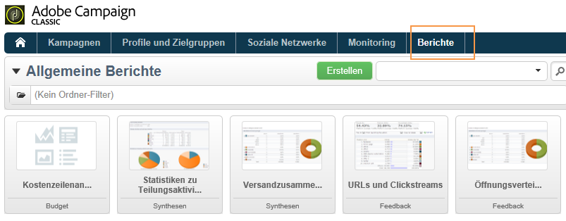

Um Berichte anzuzeigen, klicken Sie auf ihre Namen. Die folgenden Berichte sind standardmäßig verfügbar:

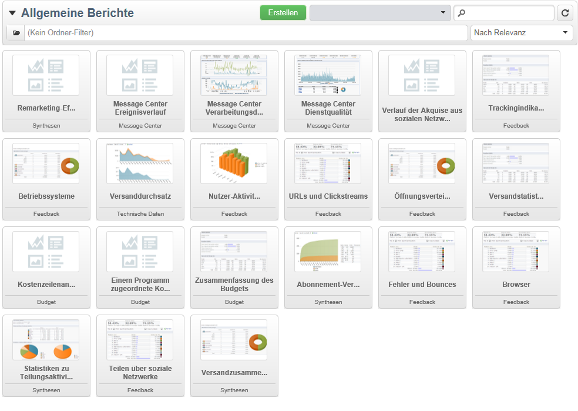

>[!NOTE]
>
>Dieser Abschnitt behandelt nur versandbezogene Berichte.

* **[!UICONTROL Versanddurchsatz]**: siehe [Versanddurchsatz](#delivery-throughput).
* **[!UICONTROL Browser]**: siehe [Browser](#browsers).
* **[!UICONTROL Teilen über soziale Netzwerke]**: siehe [Teilen über soziale Netzwerke](#sharing-to-social-networks).
* **[!UICONTROL Statistiken zu Teilungsaktivitäten]**: siehe [Statistiken zu Teilungsaktivitäten](#statistics-on-sharing-activities).
* **[!UICONTROL Betriebssysteme]**: siehe [Betriebssysteme](#operating-systems).
* **[!UICONTROL URLs und Clickstreams]**: siehe [URLs und Clickstreams](../../reporting/using/delivery-reports.md#urls-and-click-streams).
* **[!UICONTROL Trackingindikatoren]**: siehe [Trackingindikatoren](../../reporting/using/delivery-reports.md#tracking-indicators).
* **[!UICONTROL Unzustellbare Nachrichten und Bounces]**: siehe [Unzustellbare Nachrichten und Bounces](#non-deliverables-and-bounces).
* **[!UICONTROL Nutzer-Aktivitäten]**: siehe [Nutzer-Aktivitäten](#user-activities).
* **[!UICONTROL Abonnement-Verfolgung]**: siehe [Abonnement-Verfolgung](#subscription-tracking).
* **[!UICONTROL Versandzusammenfassung]**: siehe [Versandzusammenfassung](../../reporting/using/delivery-reports.md#delivery-summary).
* **[!UICONTROL Versandstatistiken]**: siehe [Versandstatistiken](#delivery-statistics).
* **[!UICONTROL Aufschlüsselung der Öffnungen]**: siehe [Aufschlüsselung der Öffnungen](#breakdown-of-opens).

## Versanddurchsatz {#delivery-throughput}

Dieser Bericht enthält Informationen zum Versanddurchsatz der gesamten Plattform für einen bestimmten Zeitraum. Zur Messung der Versandgeschwindigkeit von Nachrichten werden als Kriterien die Anzahl der pro Stunde gesendeten Nachrichten und die Größe der Nachrichten (in Bit pro Sekunde) herangezogen. Im folgenden Beispiel zeigt das erste Diagramm die erfolgreichen Sendungen in Blau und die Anzahl der fehlerhaften Sendungen in Orange an.

Sie können die angezeigten Werte konfigurieren, indem Sie die Zeitskala ändern: 1-Stunden-Ansicht, 3-Stunden-Ansicht, 24-Stunden-Ansicht usw. Klicken Sie **[!UICONTROL Aktualisieren]**, um Ihre Auswahl zu bestätigen.

>[!NOTE]
>
>Wenn Ihre Instanz auf AWS gehostet wird, können Sie auch die Anzahl der pro Stunde durchgeführten Sendungen mithilfe des Campaign Classic [Control Panel](https://experienceleague.adobe.com/docs/control-panel/using/sftp-management/sftp-storage-management.html?lang=de) überwachen. Um zu überprüfen, ob Ihre Instanz auf AWS gehostet wird, folgen Sie den Schritten auf [dieser Seite](https://experienceleague.adobe.com/docs/control-panel/using/faq.html?lang=de).
>
>Das Control Panel steht allen Administratoren zur Verfügung. Die Schritte, um einem Benutzer Administratorzugriff zu gewähren, finden Sie auf [dieser Seite](https://experienceleague.adobe.com/docs/control-panel/using/discover-control-panel/managing-permissions.html?lang=de#discover-control-panel).
>
>Beachten Sie, dass Ihre Instanz mit dem neuesten [Gold Standard](../../rn/using/gold-standard.md)-Build oder dem neuesten [allgemein verfügbaren Build (21.1.3)](../../rn/using/latest-release.md) aktualisiert werden muss. Erfahren Sie in [diesem Abschnitt](../../platform/using/launching-adobe-campaign.md#getting-your-campaign-version), wie Sie Ihre Version überprüfen.

## Nutzer-Aktivitäten {#user-activities}

Dieser Bericht zeigt Öffnungen, Klicks und Transaktionen in Form eines Diagramms (Aufschlüsselung nach Tagen, Stunden oder halben Stunden).

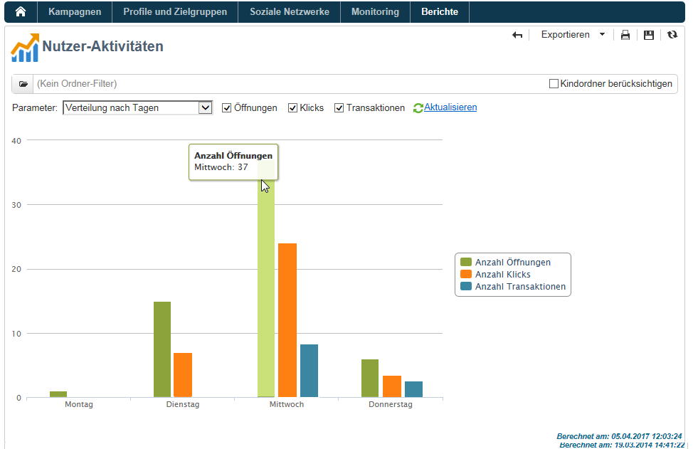

Folgende Optionen stehen zur Verfügung:

* **[!UICONTROL Öffnungen]** : Gesamtzahl der geöffneten Nachrichten. E-Mails im Textformat werden nicht berücksichtigt. Weiterführende Informationen zum Verfolgen von Öffnungen finden Sie im Abschnitt [Öffnungs-Tracking](../../reporting/using/indicator-calculation.md#tracking-opens-).
* **[!UICONTROL Klicks]**: Gesamtzahl der Klicks auf Links in Sendungen. Klicks auf Abmeldungs-Links und Mirrorseiten werden nicht berücksichtigt.
* **[!UICONTROL Transaktionen]** : Gesamtzahl der Transaktionen, nachdem eine Nachricht empfangen wurde. Damit eine Transaktion berücksichtigt wird, muss ein Webtracking-Tag vom Typ Transaktion in die entsprechende Web-Seite eingefügt werden. Die Konfiguration des Webtrackings wird in [diesem Abschnitt](../../configuration/using/about-web-tracking.md) erläutert.

## Unzustellbare Nachrichten und Bounces {#non-deliverables-and-bounces}

Dieser Bericht zeigt die Aufschlüsselung der unzustellbaren Nachrichten nach Typ und nach Domain.

Die **[!UICONTROL Anzahl verarbeiteter Nachrichten]** gibt die Gesamtzahl der vom Versand-Server verarbeiteten Nachrichten an. Dieser Wert ist kleiner als die Anzahl der Nachrichten, die versendet werden sollen, wenn einige Sendungen gestoppt oder angehalten wurden (bevor sie vom Server verarbeitet werden).

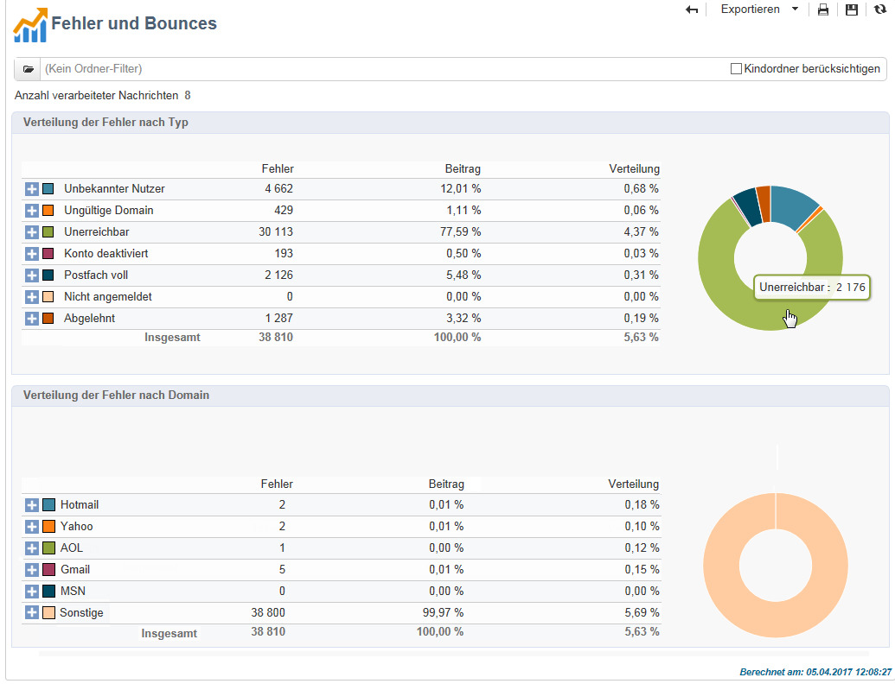

**[!UICONTROL Aufschlüsselung der Fehler nach Typ]**

>[!NOTE]
>
>Die in diesem Bericht angezeigten Fehler lösen einen Quarantäneprozess aus. Weiterführende Informationen zur Quarantäneverwaltung finden Sie im Abschnitt [Quarantäneverwaltung](../../delivery/using/delivery-failures-quarantine.md).

Der erste Teil des Berichts zeigt die Aufschlüsselung der unzustellbaren Nachrichten nach Typ in Form einer Tabelle und eines Diagramms.

Zu jedem Fehlertyp erscheint:

* die Anzahl der fehlerhaften Nachrichten diesen Typs,
* der prozentuale Anteil der fehlerhaften Nachrichten diesen Typs in Bezug auf die Gesamtzahl der fehlerhaften Nachrichten,
* der prozentuale Anteil der fehlerhaften Nachrichten diesen Typs in Bezug auf die Gesamtzahl der verarbeiteten Nachrichten.

Folgende Indikatoren werden angezeigt:

* **[!UICONTROL Unbekannter Nutzer]**: Fehler bei ungültigen E-Mail-Adressen.
* **[!UICONTROL Ungültige Domain]**: Fehler bei ungültigen oder inexistenten E-Mail-Domains.
* **[!UICONTROL Postfach voll]**: Fehler, der nach fünf fehlgeschlagenen Zustellversuchen erzeugt wird, wenn das Postfach zu viele Nachrichten enthält.
* **[!UICONTROL Konto deaktiviert]**: Fehler, wenn eine Adresse nicht mehr existiert.
* **[!UICONTROL Abgelehnt]**: Fehler, wenn eine Adresse von einem ISP (Internet Service Provider) z. B. infolge der Anwendung einer Sicherheitsregel (Anti-Spam-Software) zurückgewiesen wird.
* **[!UICONTROL Unerreichbar]**: Fehler in der Nachrichtenverteilungs-Zeichenfolge (Vorfall beim SMTP-Server, zeitweilig unerreichbare Domain usw.).
* **[!UICONTROL Nicht angemeldet]**: Fehler, wenn das Mobiltelefon des Empfängers bei Versand der Nachricht ausgeschaltet war oder über keinen Netzempfang verfügte.

  >[!NOTE]
  >
  >Dieser Fehler betrifft nur Sendungen über Mobile-Kanäle. Weiterführende Informationen hierzu finden Sie in [diesem Abschnitt](../../delivery/using/sms-channel.md).

  Sie können jede Zeile der Wertetabelle öffnen, indem Sie auf das `[+]` klicken. Für jeden Fehlertyp können Sie die Aufschlüsselung der Fehlermeldungen nach Domain anzeigen.

  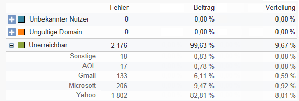

**[!UICONTROL Aufschlüsselung der Fehler nach Domain]**

Der zweite Teil des Berichts zeigt die Aufschlüsselung der fehlgeschlagenen Nachrichten nach Domains in Form einer Tabelle und eines Diagramms.

Zu jeder Domain erscheint:

* die Anzahl der fehlerhaften Nachrichten dieser Domain,
* der prozentuale Anteil der fehlerhaften Nachrichten für diese Domain in Bezug auf die Gesamtzahl der verarbeiteten Nachrichten dieser Domain,
* der prozentuale Anteil der fehlerhaften Nachrichten für diese Domain in Bezug auf die Gesamtzahl der fehlerhaften Nachrichten.

Sie können jede Zeile der Wertetabelle öffnen, indem Sie auf das Symbol [+] klicken. Sie können für jeden Domain-Typ die Aufschlüsselung der Fehlermeldungen nach Fehlertyp anzeigen.

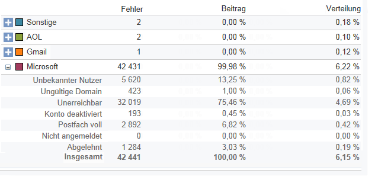

>[!NOTE]
>
>Die in diesem Bericht angezeigten Domain-Namen werden auf Cube-Ebene definiert. Um diese Werte zu ändern, bearbeiten Sie den Cube **[!UICONTROL Versandlogs (broadlogrcp)]**. Weiterführende Informationen hierzu finden Sie in [diesem Abschnitt](../../reporting/using/ac-cubes.md). Die Kategorie **[!UICONTROL Sonstige]** enthält Domain-Namen, die nicht zu einer bestimmten Klasse gehören.

## Browser {#browsers}

Dieser Bericht enthält die Aufschlüsselung der Browser, die von den Versandempfängern im ausgewählten Zeitraum verwendet wurden.

>[!NOTE]
>
>Bei den Werten handelt es sich um Schätzungen, da nur die Versandempfänger berücksichtigt werden, die in eine Nachricht geklickt haben.

**Allgemeine Statistiken**

Die allgemeinen Statistiken zur Browserverwendung werden als Tabelle und Diagramm dargestellt.

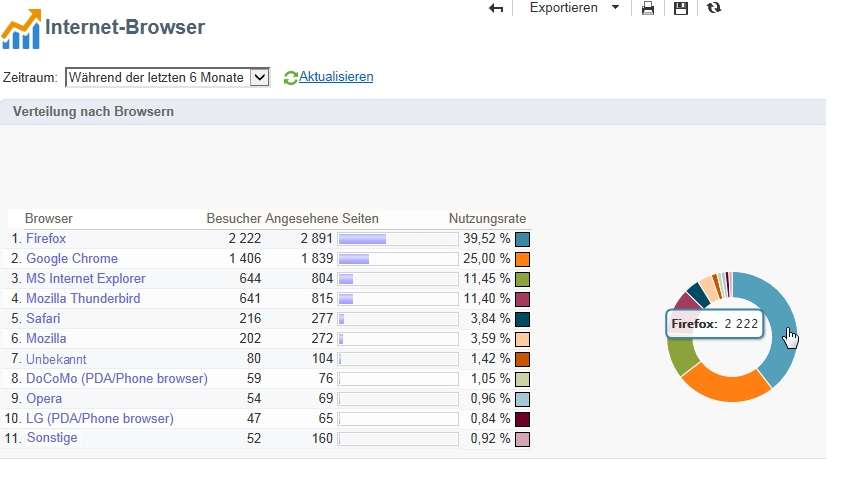

Folgende Indikatoren werden angezeigt:

* **[!UICONTROL Besucher]**: Gesamtzahl der Zielgruppenempfänger nach Domain, die mindestens einmal in einer Nachricht geklickt haben.
* **[!UICONTROL Angesehene Seiten]**: Gesamtzahl der Klicks auf Links in Sendungen nach Browser, bezogen auf alle Sendungen.
* **[!UICONTROL Nutzungsrate]**: Prozentuale Aufschlüsselung der Besucher nach Browser in Bezug auf die Gesamt-Besucherzahl.

**Statistiken nach Browsern**

In der Tabelle der allgemeinen Statistiken können Sie auf die Browser-Namen klicken, um für jeden Browser die Verwendungsstatistiken anzuzeigen.

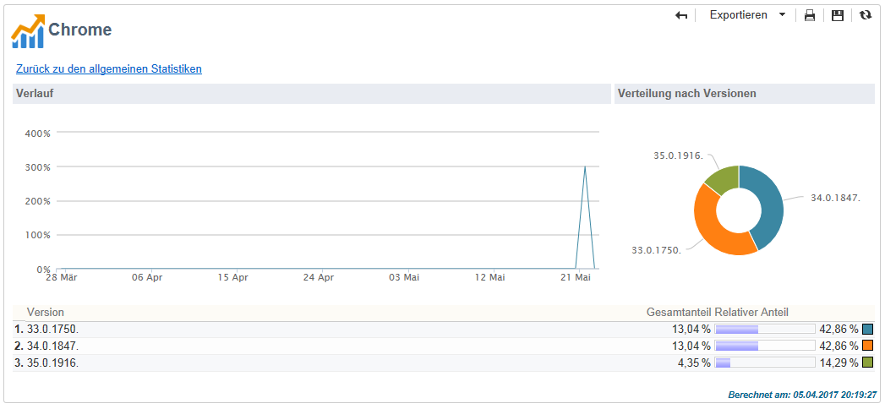

Die Statistiken werden in Form von Kurven, Diagrammen und Tabellen dargestellt.

Die **[!UICONTROL Verlauf]**-Kurve stellt die Anwesenheitsrate dieses Browsers pro Tag dar. Die Rate ist das Verhältnis zwischen der Anzahl der Besucher pro Tag (in diesem Browser) und der Anzahl der Besucher, die an dem Tag mit der höchsten Anwesenheitsrate gemessen wird.

Die **[!UICONTROL Aufschlüsselung nach Versionen]** zeigt den prozentualen Anteil der Besucher je Version in Bezug auf die Gesamt-Besucherzahl für den gewählten Browser.

In der Tabelle werden folgende Indikatoren dargestellt:

* **[!UICONTROL Gesamtanteil]**: Prozentualer Anteil der Besucher je Version, bezogen auf die Gesamt-Besucherzahl und auf alle Browser.
* **[!UICONTROL Relativer Anteil]**: Prozentualer Anteil der Besucher je Version, bezogen auf die Gesamt-Besucherzahl und auf den betreffenden Browser.

### Teilen über soziale Netzwerke {#sharing-to-social-networks}

Empfänger von Sendungen können im Rahmen von Viral-Marketing Informationen mit ihrem Kontaktnetzwerk teilen: Sie können ihrem Profil einen Link hinzufügen (Facebook, X - früher als Twitter bezeichnet). oder senden Sie eine Nachricht an einen Freund. Jede Freigabe und jeder Zugriff auf freigegebene Informationen werden innerhalb des Versands nachverfolgt. Weitere Informationen zum viralen Marketing finden Sie in [diesem Abschnitt](../../delivery/using/viral-and-social-marketing.md).

Dieser Bericht zeigt die Aufschlüsselung der freigegebenen und geöffneten Nachrichten nach sozialen Netzwerken (Facebook, X usw.) und/oder pro E-Mail.

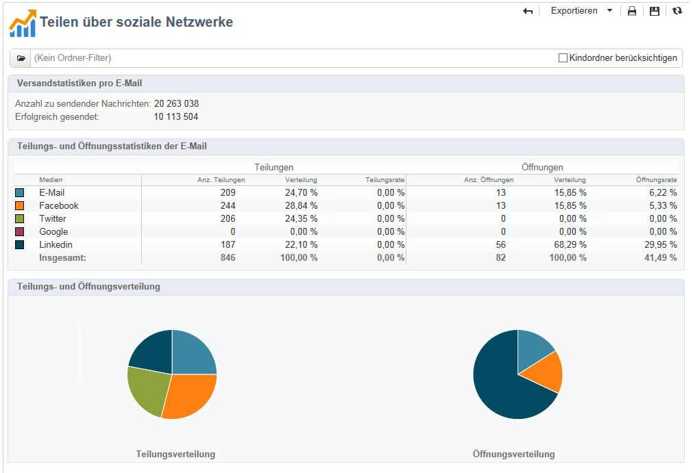

**[!UICONTROL Versandstatistiken pro E-Mail]**

In den Statistiken pro E-Mail werden zwei Werte angezeigt:

* **[!UICONTROL Anzahl zu sendender Nachrichten]**: Gesamtzahl der bei der Analyse verarbeiteten Nachrichten.
* **[!UICONTROL Erfolgreich gesendet]**: Anzahl erfolgreich zugestellter Nachrichten.

**[!UICONTROL Teilungs- und Öffnungsstatistiken der E-Mail]**

Der zentrale Bereich zeigt die Teilungs- und Öffnungsstatistiken der E-Mail.

In der Rubrik **[!UICONTROL Teilungen]** werden folgende Indikatoren angezeigt:

* **[!UICONTROL Anzahl von Teilungen]**: Anzahl der geteilten Nachrichten je sozialem Netzwerk. Der Wert entspricht der Zahl der Klicks auf das dem Gestaltungsbaustein **[!UICONTROL Teilen-Links der sozialen Netzwerke]** entsprechende Symbol.
* **[!UICONTROL Aufschlüsselung]**: Prozentualer Anteil der Teilungen im jeweiligen Medium in Bezug auf die Gesamtzahl der Teilungen.
* **[!UICONTROL Teilungsrate]**: Prozentualer Anteil der Teilungen im jeweiligen Medium in Bezug auf die Gesamtzahl der zu sendenden Nachrichten.

In der Rubrik **[!UICONTROL Öffnungen]** werden folgende Indikatoren angezeigt:

* **[!UICONTROL Anz. Öffnungen]**: Anzahl der Nachrichten, die von Personen, an die die Nachricht (über den Gestaltungsbaustein **[!UICONTROL Teilen-Links der sozialen Netzwerke]**) weitergeleitet wurde, geöffnet wurden. Der Wert entspricht der Anzahl der Mirrorseiten-Öffnungen. Öffnungen durch Versandempfänger werden nicht berücksichtigt.
* **[!UICONTROL Aufschlüsselung]**: Prozentualer Anteil der Öffnungen im jeweiligen Medium in Bezug auf die Gesamtzahl der Öffnungen.
* **[!UICONTROL Öffnungsrate]**: Prozentualer Anteil der Öffnungen im jeweiligen Medium in Bezug auf die Gesamtzahl der Teilungen.

**[!UICONTROL Teilungs- und Öffnungsaufschlüsselung]**

Dieser Bereich veranschaulicht in zwei Diagrammen die Aufschlüsselung von Teilungen und Öffnungen nach sozialen Medien.

## Statistiken zu Teilungsaktivitäten {#statistics-on-sharing-activities}

Dieser Bericht zeigt die Entwicklung von Freigaben für soziale Netzwerke (Facebook, X - früher bekannt als Twitter, E-Mail, etc.) rechtzeitig.

Weitere Informationen zum Viral-Marketing finden Sie in [diesem Abschnitt](../../delivery/using/viral-and-social-marketing.md).

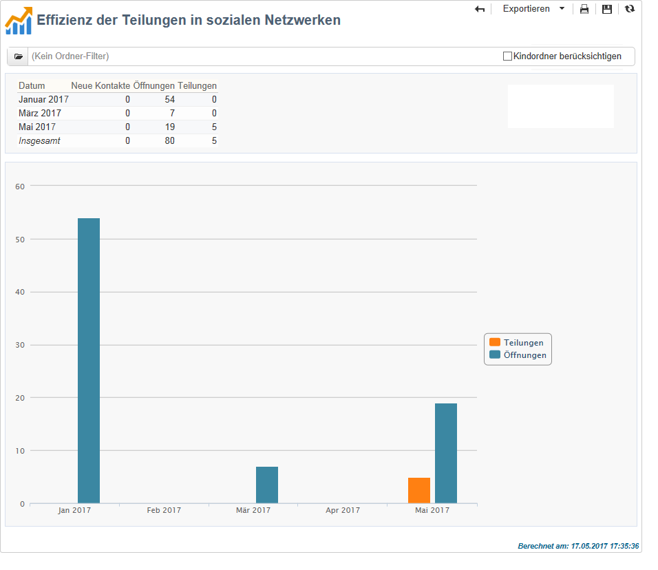

Die Statistiken werden in Form von Diagrammen und Tabellen dargestellt.

Folgende Indikatoren werden angezeigt:

* **[!UICONTROL Neue Kontakte]** : Anzahl neuer Anmeldungen infolge des Erhalts einer per E-Mail geteilten Nachricht. Der Wert entspricht der Anzahl an Personen, die per E-Mail eine weitergeleitete Nachricht erhalten, auf den **[!UICONTROL Anmelde-Link]** geklickt und das Formular ausgefüllt haben.
* **[!UICONTROL Öffnungen]** : Gesamtzahl der Nachrichten, die von Personen geöffnet wurden, an die die Nachricht übertragen wurde (über den **[!UICONTROL Link für die Freigabe in sozialen Netzwerken]** Personalisierungsblock). Der Wert entspricht der Anzahl der Mirrorseiten-Öffnungen. Öffnungen durch Versandempfänger werden nicht berücksichtigt.
* **[!UICONTROL Teilungen]**: Anzahl der in sozialen Netzwerken geteilten Nachrichten. Dieser Wert entspricht der Zahl der Klicks auf das dem Gestaltungsbaustein **[!UICONTROL Teilen-Links der sozialen Netzwerke]** entsprechende Symbol.

## Betriebssysteme {#operating-systems}

Dieser Bericht enthält die Aufschlüsselung der Betriebssysteme, die von den Versandempfängern im ausgewählten Zeitraum verwendet wurden.

>[!NOTE]
>
>Bei den Werten handelt es sich um Schätzungen, da nur die Versandempfänger berücksichtigt werden, die in eine Nachricht geklickt haben.

**Allgemeine Statistiken**

Die allgemeinen Statistiken bezüglich der verwendeten Betriebssysteme werden in Form von Diagrammen und Tabellen dargestellt.

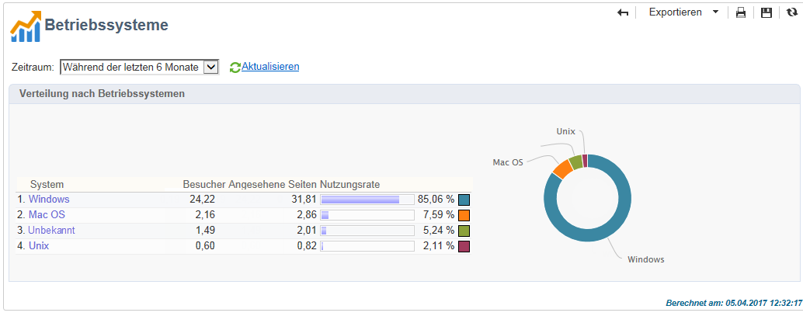

Folgende Indikatoren werden angezeigt:

* **[!UICONTROL Besucher]**: Durchschnittliche Anzahl der Zielgruppenempfänger pro Tag nach Betriebssystem, die mindestens einmal in einer Nachricht geklickt haben.
* **[!UICONTROL Angesehene Seiten]**: Durchschnittliche Anzahl von Klicks auf Links in Sendungen nach Betriebssystem, bezogen auf alle Sendungen.
* **[!UICONTROL Nutzungsrate]**: Prozentuale Aufschlüsselung der Besucher nach Betriebssystem in Bezug auf die Gesamt-Besucherzahl.

**Statistiken nach Betriebssystem**

In der Tabelle der allgemeinen Statistiken können Sie auf die Namen der einzelnen Betriebssysteme klicken, um die jeweiligen Verwendungsstatistiken anzuzeigen.

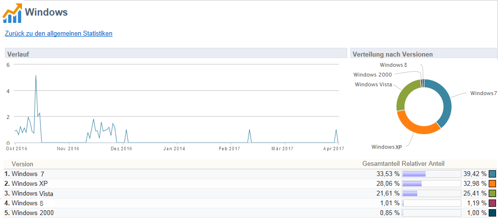

Die Statistiken werden in Form von Kurven, Diagrammen und Tabellen dargestellt.

Die **[!UICONTROL Verlauf]**-Kurve stellt die Nutzungsrate dieses Betriebssystems pro Tag dar. Diese Rate ist das Verhältnis der Anzahl der Besucher pro Tag (auf diesem Betriebssystem) in Bezug auf die Anzahl der Besucher, die an dem Tag mit der höchsten Anwesenheitszahl gemessen werden.

Die **[!UICONTROL Aufschlüsselung nach Versionen]** zeigt den prozentualen Anteil der Besucher je Version in Bezug auf die Gesamt-Besucherzahl für das gewählte Betriebssystem.

In der Tabelle werden folgende Indikatoren dargestellt:

* **[!UICONTROL Gesamtanteil]**: Prozentualer Anteil der Besucher je Version, bezogen auf die Gesamt-Besucherzahl und auf alle Betriebssysteme.
* **[!UICONTROL Relativer Anteil]**: Prozentualer Anteil der Besucher je Version, bezogen auf die Gesamt-Besucherzahl und alle Browser.

## Abonnement-Verfolgung {#subscription-tracking}

Dieser Bericht ermöglicht die Überwachung von Abonnements für Informations-Services. Hier werden An- und Abmeldungen angezeigt.

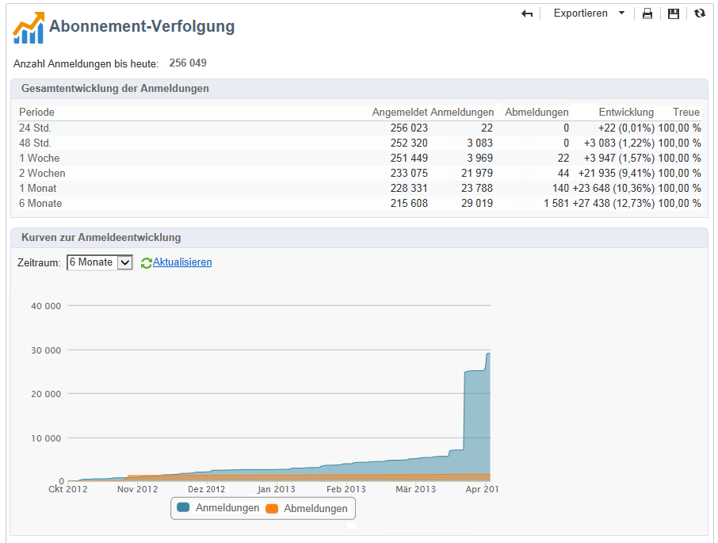

Er kann für ein Abonnement angezeigt werden, indem Sie auf den Knoten **[!UICONTROL Profile und Zielgruppen > Dienste und Abonnements]** der Homepage oder des Explorers klicken. Wählen Sie das gewünschte Abonnement aus und klicken Sie dann auf die Registerkarte **[!UICONTROL Berichte]**. Der Bericht **[!UICONTROL Abonnement-Tracking]** ist standardmäßig verfügbar. Sie können damit die An- und Abmelde-Trends und die Treuerate über einen Zeitraum hinweg sehen. Die Darstellung dieser Daten kann über die Dropdown-Liste konfiguriert werden. Klicken Sie auf **[!UICONTROL Aktualisieren]**, um die ausgewählte Konfiguration zu validieren.

Weiterführende Informationen dazu finden Sie auf [dieser Seite](../../delivery/using/managing-subscriptions.md).

Die Zeile **[!UICONTROL Anzahl Anmeldungen bis heute]** gibt die Gesamtzahl aller Abonnenten zum aktuellen Zeitpunkt an.

**[!UICONTROL Gesamtentwicklung der Anmeldungen]**

In der Tabelle werden folgende Indikatoren dargestellt:

* **[!UICONTROL Angemeldet]**: Anzahl der Abonnenten insgesamt für den entsprechenden Zeitraum.
* **[!UICONTROL Anmeldungen]**: Anzahl der Anmeldungen für den entsprechenden Zeitraum.
* **[!UICONTROL Abmeldungen]**: Anzahl der Abmeldungen für den entsprechenden Zeitraum.
* **[!UICONTROL Entwicklung]** : Anzahl der Abmeldungen abzüglich der Anzahl der Abonnements. Der Tarif wird anhand der Gesamtzahl der Abonnenten berechnet.
* **[!UICONTROL Treue]**: Treuerate der Abonnenten über den entsprechenden Zeitraum.

**[!UICONTROL Kurven zur Anmeldeentwicklung]**

Das Diagramm veranschaulicht die Abonnemententwicklung über den ausgewählten Zeitraum.

## Versandstatistiken {#delivery-statistics}

Dieser Bericht enthält die Anzahl verarbeiteter E-Mails sowie den prozentualen Anteil an zugestellten Nachrichten, Hard- und Softbounces, Öffnungen, Klicks und Abmeldungen nach Domains.

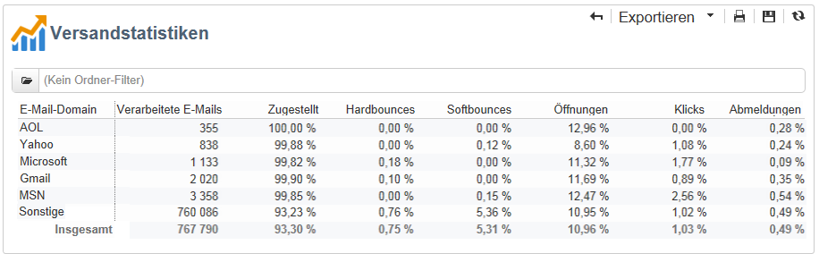

Folgende Indikatoren werden angezeigt:

* **[!UICONTROL Verarbeitete E-Mails]**: Gesamtzahl der E-Mails, die vom Versandserver verarbeitet wurden.
* **[!UICONTROL Zugestellt]**: Prozentualer Anteil der erfolgreich zugestellten E-Mails in Bezug auf die Gesamtzahl der verarbeiteten E-Mails.
* **[!UICONTROL Hardbounces]**: Prozentualer Anteil der Hardbounces in Bezug auf die Gesamtzahl der verarbeiteten E-Mails.
* **[!UICONTROL Softbounces]**: Prozentualer Anteil der Softbounces in Bezug auf die Gesamtzahl der verarbeiteten E-Mails.

  >[!NOTE]
  >
  >Weiterführende Informationen zu Hard- und Softbounces finden Sie im Abschnitt [Quarantäneverwaltung](../../delivery/using/delivery-failures-quarantine.md).

* **[!UICONTROL Öffnungen]**: Prozentualer Anteil der unterschiedlichen Zielgruppenempfänger, die mindestens einmal die betreffende Nachricht geöffnet haben, in Bezug auf die Gesamtzahl der verarbeiteten E-Mails.
* **[!UICONTROL Klicks]**: Prozentualer Anteil der unterschiedlichen Zielgruppenempfänger, die mindestens einmal in eine Nachricht geklickt haben, in Bezug auf die Gesamtzahl der verarbeiteten E-Mails.
* **[!UICONTROL Abmeldungen]**: Prozentualer Anteil der Klicks auf einen Abmelde-Link in Bezug auf die Gesamtzahl der verarbeiteten E-Mails.

## Aufschlüsselung der Öffnungen {#breakdown-of-opens}

Dieser Bericht zeigt die Aufschlüsselung der Öffnungen nach Betriebssystem, Gerät und Browser im betreffenden Zeitraum. Für jede Kategorie werden zwei Diagramme verwendet. Das erste zeigt Statistiken zu Öffnungen auf Computern und Mobilgeräten. Die zweite zeigt Statistiken an, die sich nur auf Öffnungen auf Mobilgeräten beziehen.

Die Anzahl der Öffnungen entspricht der Gesamtzahl der geöffneten Nachrichten. E-Mails im Textformat werden nicht gezählt. Weitere Informationen zum Verfolgen von Öffnungen finden Sie im Abschnitt [Öffnungs-Tracking](../../reporting/using/indicator-calculation.md#tracking-opens-).

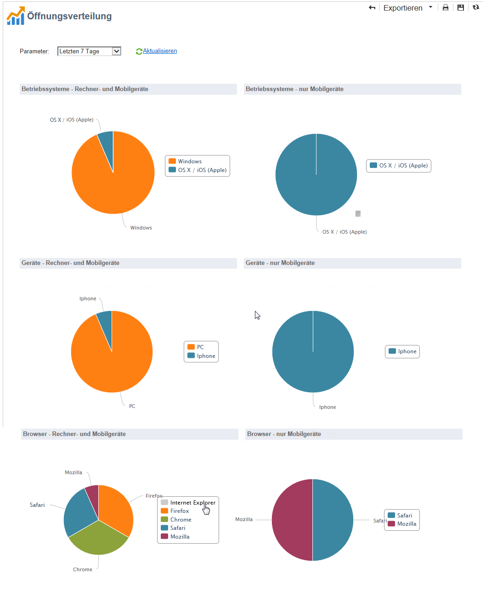

>[!NOTE]
>
>Browser- und Betriebssystemnamen stellen einen Teil der Informationen dar, die vom Benutzeragent des Browsers gesendet werden, für den die Nachricht geöffnet wurde. Adobe Campaign leitet den Gerätetyp anhand der Geräteinformationen ab.
