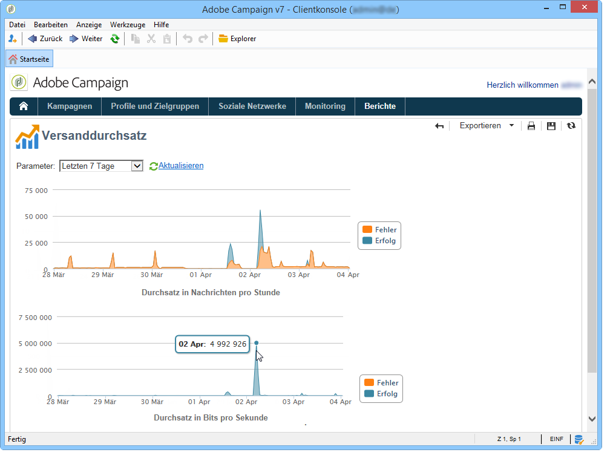

# Allgemeine Berichte {#global-reports}

Diese Berichte beziehen sich auf die Aktivität der Daten in der gesamten Datenbank. Gehen Sie zur **[!UICONTROL Reports]** Registerkarte, um das Berichts-Dashboard anzuzeigen.

Klicken Sie zur Anzeige eines Berichts auf seinen Namen. Standardmäßig stehen folgende Berichte zur Verfügung:

>[!CAUTION]
>
>Dieser Abschnitt behandelt nur versandbezogene Berichte.

* **[!UICONTROL Delivery throughput]** : bezieht sich auf den [Bereitstellungsdurchsatz](#delivery-throughput).
* **[!UICONTROL Browsers]** : auf [Browser](#browsers)verweisen.
* **[!UICONTROL Sharing to social networks]** : Siehe [Freigeben in sozialen Netzwerken](#sharing-to-social-networks).
* **[!UICONTROL Statistics on sharing activities]** : finden Sie unter [Statistiken über Freigabeaktivitäten](#statistics-on-sharing-activities).
* **[!UICONTROL Operating systems]** : bezieht sich auf [Betriebssysteme](#operating-systems).
* **[!UICONTROL URLs and click streams]** : auf [URLs verweisen und auf Streams](#urls-and-click-streams)klicken.
* **[!UICONTROL Tracking indicators]** : auf [Tracking-Indikatoren](#tracking-indicators).
* **[!UICONTROL Non-deliverables and bounces]** : bezieht sich auf [Nicht-Lieferungen und Absprünge](#non-deliverables-and-bounces).
* **[!UICONTROL User activities]** : Siehe [Benutzeraktivitäten](#user-activities).
* **[!UICONTROL Subscription tracking]** : Siehe [Abonnementverfolgung](#subscription-tracking).
* **[!UICONTROL Delivery summary]** : Siehe [Lieferübersicht](#delivery-summary).
* **[!UICONTROL Delivery statistics]** : Siehe [Lieferstatistik](#delivery-statistics).
* **[!UICONTROL Breakdown of opens]** : Siehe [Aufschlüsselung der geöffneten Fenster](#breakdown-of-opens).

## Versanddurchsatz {#delivery-throughput}

Dieser Bericht enthält Informationen zum Datendurchsatz der Sendungen in Bezug auf die gesamte Plattform für einen bestimmten Zeitraum. Zur Messung der Versandgeschwindigkeit von Nachrichten werden zwei Kennzahlen herangezogen: Anzahl an gesendeten Nachrichten pro Stunde und die gesendete Datenmenge in Bits pro Sekunde. Die unten stehende Grafik zeigt in Blau die Anzahl der erfolgreich versandten und in Orange die Anzahl der fehlgeschlagenen Nachrichten.

Sie können die angezeigten Werte konfigurieren, indem Sie die Zeitspanne ändern: 1-Stunden-Ansicht, 3-Stunden-Ansicht, 24-Stunden-Ansicht usw. Klicken Sie auf **[!UICONTROL Refresh]** , um Ihre Auswahl zu bestätigen.

## Nutzer-Aktivitäten {#user-activities}

Dieser Bericht zeigt Öffnungen, Klicks und Transaktionen in Form eines Diagramms (Verteilung nach Tagen, Stunden oder halben Stunden).

Folgende Optionen stehen zur Verfügung:

* **[!UICONTROL Opens]** : Gesamtzahl der geöffneten Nachrichten.  E-Mails im Textformat werden nicht berücksichtigt. For more information on tracking opens, refer to [Tracking opens](#tracking-opens-).
* **[!UICONTROL Clicks]** : Gesamtanzahl der Klicks auf Links in Auslieferungen. Klicks auf Abmeldelinks und Spiegelseiten werden nicht berücksichtigt.
* **[!UICONTROL Transactions]** : Gesamtzahl der Transaktionen nach Erhalt einer Nachricht. Damit eine Transaktion berücksichtigt werden kann, muss ein Transaktions-Typ-Web-Tracking-Tag in die entsprechende Webseite eingefügt werden. Die Webtracking-Konfiguration wird in [diesem Abschnitt](../../configuration/using/about-web-tracking.md)vorgestellt.

## Fehler und Bounces {#non-deliverables-and-bounces}

Dieser Bericht zeigt die Verteilung der Fehler nach Typ und nach Domain.

Der Wert **[!UICONTROL Number of messages processed]** gibt die Gesamtanzahl der vom Bereitstellungsserver verarbeiteten Nachrichten an. Dieser Wert ist niedriger als die Anzahl der Nachrichten, die gesendet werden, wenn einige Auslieferungen beendet oder angehalten wurden (bevor sie vom Server verarbeitet werden).

**[!UICONTROL Breakdown of errors by type]**

>[!NOTE]
>
>Die in diesem Bericht dargestellten Fehler lösen eine Quarantäne der betroffenen Adressen aus. Weiterführende Informationen zur Quarantäneverwaltung finden Sie im Abschnitt [Quarantäneverwaltung](../../delivery/using/understanding-quarantine-management.md).

Der erste Teil des Berichts zeigt die Verteilung der fehlgeschlagenen Nachrichten nach Typ in Form einer Tabelle und eines Diagramms.

Zu jedem Fehlertyp erscheint:

* die Anzahl der fehlerhaften Nachrichten diesen Typs,
* der prozentuale Anteil der fehlerhaften Nachrichten diesen Typs in Bezug auf die Gesamtzahl der fehlerhaften Nachrichten,
* der prozentuale Anteil der fehlerhaften Nachrichten diesen Typs in Bezug auf die Gesamtzahl der verarbeiteten Nachrichten.

Folgende Indikatoren werden angezeigt:

* **[!UICONTROL User unknown]** : Während der Bereitstellung generierter Fehlertyp, der angibt, dass die E-Mail-Adresse ungültig ist.
* **[!UICONTROL Invalid domain]** : Fehlertyp, der beim Senden einer Lieferung generiert wurde, um anzuzeigen, dass die Domäne der E-Mail-Adresse falsch ist oder nicht vorhanden ist.
* **[!UICONTROL Inbox full]** : Fehlertyp, der nach fünf Auslieferungsversuchen generiert wurde, um anzugeben, dass der Posteingang des Empfängers zu viele Nachrichten enthält.
* **[!UICONTROL Account disabled]** : Beim Senden einer Lieferung generierter Fehlertyp, der angibt, dass die Adresse nicht mehr vorhanden ist.
* **[!UICONTROL Rejected]** : Fehlertyp, der erzeugt wird, wenn eine Adresse vom IAP (Internet Access Provider) abgelehnt wird, z. B. nach Anwendung einer Sicherheitsregel (Anti-Spam-Software).
* **[!UICONTROL Unreachable]** : Fehlertyp, der in der Meldungsverteilungszeichenfolge auftritt: Zwischenfall auf dem SMTP-Server, Domäne vorübergehend nicht erreichbar usw.
* **[!UICONTROL Not connected]** : Fehlertyp, der angibt, dass das Mobiltelefon des Empfängers zum Zeitpunkt des Sendens ausgeschaltet oder vom Netzwerk getrennt wird.

   >[!NOTE]
   >
   >Dieser Fehler betrifft nur Sendungen über Mobile-Kanäle. Weiterführende Informationen dazu finden Sie in [diesem Abschnitt](../../delivery/using/sms-channel.md).

   You can open up each line of the value table by clicking the [+] symbol. For each error type, you can show the breakdown of error messages by domain.

   

**[!UICONTROL Breakdown of errors per domain]**

Der zweite Teil des Berichts zeigt die Verteilung der fehlgeschlagenen Nachrichten nach Domains in Form einer Tabelle und eines Diagramms.

Zu jeder Domain erscheint:

* die Anzahl der fehlerhaften Nachrichten dieser Domain,
* der prozentuale Anteil der fehlerhaften Nachrichten für diese Domain in Bezug auf die Gesamtzahl der verarbeiteten Nachrichten dieser Domain,
* der prozentuale Anteil der fehlerhaften Nachrichten für diese Domain in Bezug auf die Gesamtzahl der fehlerhaften Nachrichten.

You can open up each line of the value table by clicking the [+] symbol. For each domain type, you can show the breakdown of error messages by error type.

>[!NOTE]
>
>Die in diesem Bericht angezeigten Domänennamen werden auf Kubikebene definiert. Um diese Werte zu ändern, bearbeiten Sie den **[!UICONTROL Delivery logs (broadlogrcp)]** Würfel. Weiterführende Informationen hierzu finden Sie in [diesem Abschnitt](../../reporting/using/about-cubes.md). Die **[!UICONTROL Others]** Kategorie enthält Domänennamen, die nicht zu einer bestimmten Klasse gehören.

## Browser {#browsers}

Dieser Bericht enthält die Verteilung der Browser, die von den Versandempfängern im ausgewählten Zeitraum verwendet wurden.

>[!NOTE]
>
>Bei den Werten handelt es sich um Schätzungen, da nur die Versandempfänger berücksichtigt werden, die in eine Nachricht geklickt haben.

**Allgemeine Statistiken**

Die allgemeinen Statistiken zur Browserverwendung werden als Tabelle und Diagramm dargestellt.

Folgende Indikatoren werden angezeigt:

* **[!UICONTROL Visitors]** : Gesamtzahl der Empfänger (pro Internetbrowser), auf die mindestens einmal geklickt wurde.
* **[!UICONTROL Pages viewed]** : Gesamtanzahl der Klicks auf Links in einer Lieferung (pro Internetbrowser) für alle Lieferungen.
* **[!UICONTROL Usage rate]** : Diese Rate stellt die Aufschlüsselung der Besucher (pro Internetbrowser) im Verhältnis zur Gesamtanzahl der Besucher dar.

**Statistiken nach Browsern**

In der Tabelle der allgemeinen Statistiken können Sie auf die Browser-Namen klicken, um für jeden Browser die Verwendungsstatistiken anzuzeigen.

Die Statistiken werden in Form von Kurven, Diagrammen und Tabellen dargestellt.

Die **[!UICONTROL History]** Kurve stellt die Anwesenheitsrate dieses Browsers pro Tag dar. Die Rate ist das Verhältnis zwischen der Anzahl der Besucher pro Tag (in diesem Browser) und der Anzahl der Besucher, die am Tag mit der höchsten Besuchsrate gemessen werden.

The **[!UICONTROL Breakdown per version]** chart represents the breakdown of visitors per version compared to the total number of visitors (on this browser).

In der Tabelle werden folgende Indikatoren dargestellt:

* **[!UICONTROL Global rate]** : Diese Rate stellt die Aufschlüsselung der Besucher pro Version im Vergleich zur Gesamtanzahl der Besucher (in allen Browsern) dar.
* **[!UICONTROL Relative rate]** : Diese Rate stellt die Aufschlüsselung der Besucher pro Version im Vergleich zur Gesamtanzahl der Besucher (in diesem Browser) dar.

### Teilen über soziale Netzwerke {#sharing-to-social-networks}

Mit Viral-Marketing geben Sie den Empfängern Ihrer Sendungen die Möglichkeit, Nachrichten im Netzwerk zu teilen, sie also beispielsweise als Link auf ihrem Facebook- oder Twitter-Profil zu veröffentlichen oder an Freunde weiterzuleiten. Jede Verlinkung bzw. Weiterleitung und jeder Zugriff auf die weitergeleitete Information schlägt sich im Versandtracking nieder. Weiterführende Informationen zum Viral-Marketing finden Sie in [diesem Abschnitt](../../delivery/using/viral-and-social-marketing.md).

Dieser Bericht zeigt Teilungen und Öffnungen in sozialen Netzwerken (Facebook, Twitter etc.) und/oder über E-Mails.

**[!UICONTROL Email delivery statistics]**

In den Statistiken pro E-Mail werden zwei Werte angezeigt:

* **[!UICONTROL Number of messages to be delivered]** : Gesamtzahl der während der Auslieferungsanalyse verarbeiteten Nachrichten.
* **[!UICONTROL Number of successful deliveries]** : Anzahl erfolgreich verarbeiteter Nachrichten.

**[!UICONTROL Sharing activities and mail open statistics]**

Der zentrale Bereich zeigt die Teilungs- und Öffnungsstatistiken der E-Mail.

In the **[!UICONTROL Shares]** column, we have the following indicators:

* **[!UICONTROL No. of sharing activities]** : Gesamtzahl der in jedem sozialen Netzwerk freigegebenen Nachrichten. Dieser Wert entspricht der Gesamtzahl der Klicks auf das Symbol des entsprechenden **[!UICONTROL Links for sharing to social networks]** Personalisierungsblocks.
* **[!UICONTROL Breakdown]** : Dieser Satz entspricht der Aufteilung der Anteile nach sozialen Netzwerken im Verhältnis zur Gesamtzahl der Aktien.
* **[!UICONTROL Sharing rate]** : Dieser Satz entspricht der Aufteilung der Anteile nach sozialen Netzwerken im Verhältnis zur Anzahl der zu übermittelnden Nachrichten.

In the **[!UICONTROL Opens]** column, we have the following indicators:

* **[!UICONTROL No. of opens]** : Gesamtzahl der Nachrichten, die von Personen, an die die Nachricht weitergeleitet wurde (über den **[!UICONTROL Links for sharing to social networks]** Personalisierungsblock), geöffnet wurden. Dieser Wert entspricht der Anzahl der Spiegelseiten. Von Lieferempfängern geöffnete Objekte werden nicht berücksichtigt.
* **[!UICONTROL Breakdown]** : Diese Rate stellt die Aufschlüsselung von &quot;open&quot;pro soziales Netzwerk im Verhältnis zur Gesamtanzahl der &quot;open&quot; dar.
* **[!UICONTROL Rate of opens]** : Diese Rate stellt die Aufschlüsselung der Öffnung nach sozialen Netzwerken im Verhältnis zur Gesamtzahl der Aktien dar.

**[!UICONTROL Breakdown of sharing activities and opens]**

Dieser Bereich veranschaulicht in zwei Diagrammen die Verteilung von Teilungen und Öffnungen nach sozialen Medien.

## Statistiken zu Teilungsaktivitäten {#statistics-on-sharing-activities}

Dieser Bericht zeigt die zeitliche Entwicklung von Teilungen in sozialen Netzwerken (Facebook, Twitter usw.) und/oder über E-Mails.

Weitere Informationen zum Viral-Marketing finden Sie in [diesem Abschnitt](../../delivery/using/viral-and-social-marketing.md).

Die Statistiken werden in Form von Diagrammen und Tabellen dargestellt.

Folgende Indikatoren werden angezeigt:

* **[!UICONTROL New contacts]** : Anzahl der neuen Abonnements nach Erhalt einer E-Mail-Nachricht. Dieser Wert stimmt mit der Anzahl der Personen überein, die eine E-Mail-Nachricht erhalten haben, auf die Schaltfläche geklickt haben **[!UICONTROL Subscription link]** und das Abonnementformular ausgefüllt haben.
* **[!UICONTROL Opens]** : Gesamtzahl der Nachrichten, die von Personen geöffnet wurden, an die die Nachricht übertragen wurde (über den **[!UICONTROL Link for sharing to social networks]** Personalisierungsblock). Dieser Wert entspricht der Anzahl der Spiegelseiten. Von Lieferempfängern geöffnete Objekte werden nicht berücksichtigt.
* **[!UICONTROL Sharing activities]** : Gesamtzahl der über soziale Netzwerke freigegebenen Nachrichten. Dieser Wert entspricht der Gesamtanzahl der Klicks auf das Symbol des **[!UICONTROL Links for sharing to social networks]** Personalisierungsblocks.

## Betriebssysteme {#operating-systems}

Dieser Bericht enthält die Betriebssysteme, die von den Versandempfängern im ausgewählten Zeitraum verwendet wurden.

>[!NOTE]
>
>Bei den Werten handelt es sich um Schätzungen, da nur die Versandempfänger berücksichtigt werden, die in eine Nachricht geklickt haben.

**Allgemeine Statistiken**

Die allgemeinen Statistiken bezüglich der verwendeten Betriebssysteme werden in Form von Diagrammen und Tabellen dargestellt.

Folgende Indikatoren werden angezeigt:

* **[!UICONTROL Visitors]** : Täglicher Durchschnitt der Gesamtzahl der Zielempfänger (pro Betriebssystem), die mindestens einmal auf eine Bereitstellung geklickt haben.
* **[!UICONTROL Pages viewed]** : Täglicher Durchschnitt der Gesamtanzahl der Klicks auf Auslieferungslinks (pro Betriebssystem) für alle Auslieferungen.
* **[!UICONTROL Rate of use]** : Diese Rate stellt die Aufschlüsselung der Besucher (nach Betriebssystem) im Verhältnis zur Gesamtanzahl der Besucher dar.

**Statistiken nach Betriebssystem**

In der Tabelle der allgemeinen Statistiken können Sie auf die Namen der einzelnen Betriebssysteme klicken, um die jeweiligen Verwendungsstatistiken anzuzeigen.

Die Statistiken werden in Form von Kurven, Diagrammen und Tabellen dargestellt.

Die **[!UICONTROL History]** Kurve stellt die Nutzungsrate dieses Betriebssystems pro Tag dar. Diese Rate ist das Verhältnis zwischen der Anzahl der Besucher pro Tag (auf diesem Betriebssystem) und der Anzahl der Besucher, die an dem Tag mit der höchsten Teilnahme gemessen werden.

The **[!UICONTROL Breakdown by version]** chart represents the breakdown of visitors per version in relation to the total number of visitors on this operating system.

In der Tabelle werden folgende Indikatoren dargestellt:

* **[!UICONTROL Global rate]** : Diese Rate stellt die Aufschlüsselung der Besucher (pro Version) im Verhältnis zur Gesamtanzahl der Besucher in allen Betriebssystemen dar.
* **[!UICONTROL Relative rate]** : Diese Rate stellt die Aufschlüsselung der Besucher (pro Version) im Verhältnis zur Gesamtanzahl der Besucher dieses Betriebssystems dar.

## Abonnement-Verfolgung {#subscription-tracking}

Dieser Bericht enthält Informationen bezüglich der Informationsdienst-Abonnements. An- und Abmeldungen werden im Detail beleuchtet.

Sie kann für ein Abonnement angezeigt werden, indem Sie auf den **[!UICONTROL Profiles and targets > Services and subscriptions]** Knoten der Homepage oder des Explorers klicken. Wählen Sie das gewünschte Abonnement aus und klicken Sie auf die **[!UICONTROL Reports]** Registerkarte. Der **[!UICONTROL Subscriptions tracking]** Bericht ist standardmäßig verfügbar. Damit können Sie die Trends bei Abonnements und Abonnements sowie die Treuerate über einen Zeitraum hinweg sehen. Sie können die Darstellung dieser Daten über die Dropdownliste konfigurieren. Klicken Sie auf **[!UICONTROL Refresh]** , um die ausgewählte Konfiguration zu validieren.

Weiterführende Informationen dazu finden Sie auf [dieser Seite](../../delivery/using/managing-subscriptions.md).

Die **[!UICONTROL Number subscribed to date]** stellt die Gesamtzahl der Personen dar, die zurzeit abonniert sind.

**[!UICONTROL Overall evolution of subscriptions]**

In der Tabelle werden folgende Indikatoren dargestellt:

* **[!UICONTROL Subscribers]** : Gesamtzahl der Teilnehmer für den betreffenden Zeitraum.
* **[!UICONTROL Subscriptions]** : Anzahl der Abonnements für den betreffenden Zeitraum.
* **[!UICONTROL Unsubscriptions]** : Anzahl der Abmeldungen für den betreffenden Zeitraum.
* **[!UICONTROL Evolution]** : Anzahl der Abonnements abzüglich der Anzahl der Abonnements. Der Tarif wird auf Basis der Gesamtzahl der Abonnenten berechnet.
* **[!UICONTROL Loyalty]** : Loyalitätsrate der Teilnehmer für den betreffenden Zeitraum.

**[!UICONTROL Subscription evolution curves]**

Das Diagramm veranschaulicht die Abonnemententwicklung über den ausgewählten Zeitraum.

## Versandstatistiken {#delivery-statistics}

Dieser Bericht enthält die Anzahl verarbeiteter E-Mails sowie den prozentualen Anteil an zugestellten Nachrichten, Hard- und Softbounces, Öffnungen, Klicks und Abmeldungen nach Domains.

Folgende Indikatoren werden angezeigt:

* **[!UICONTROL Emails processed]** : Gesamtanzahl der vom Bereitstellungsserver verarbeiteten Nachrichten.
* **[!UICONTROL Delivered]** : Prozentanteil der Anzahl der erfolgreich verarbeiteten Nachrichten im Vergleich zur Gesamtzahl der verarbeiteten Nachrichten.
* **[!UICONTROL Hard bounces]** : Prozentanteil der Anzahl der &quot;harten&quot;Absprünge im Vergleich zur Gesamtzahl der verarbeiteten Nachrichten.
* **[!UICONTROL Soft bounces]** : Prozentsatz der Anzahl der &quot;weichen&quot;Absprünge im Vergleich zur Gesamtzahl der verarbeiteten Nachrichten.

   >[!NOTE]
   >
   >Weiterführende Informationen zu Hard- und Softbounces finden Sie im Abschnitt [Quarantäneverwaltung](../../delivery/using/understanding-quarantine-management.md).

* **[!UICONTROL Opens]** : Prozentsatz der Anzahl der Empfänger, die eine Nachricht mindestens einmal geöffnet haben, im Vergleich zur Anzahl der erfolgreich verarbeiteten Nachrichten.
* **[!UICONTROL Clicks]** : Prozentsatz der Anzahl der Personen, die mindestens einmal auf eine Bereitstellung geklickt haben, im Vergleich zur Anzahl der erfolgreich verarbeiteten Nachrichten.
* **[!UICONTROL Unsubscription]** : Prozentanteil der Anzahl der Klicks auf einen Link zur Abonnementaufhebung im Vergleich zur Anzahl der erfolgreich verarbeiteten Nachrichten.

## Öffnungsverteilung {#breakdown-of-opens}

Dieser Bericht zeigt die Öffnungsverteilung nach Betriebssystem, Geräteart und Browser für den ausgewählten Zeitraum. Für jede Kategorie stehen zwei Diagramme zur Verfügung. Das erste zeigt die Öffnungsstatistiken für Computer und Mobilgeräte an, das zweite nur für Mobilgeräte.

Die Anzahl der geöffneten Nachrichten entspricht der Gesamtzahl der geöffneten Nachrichten. E-Mails im Textformat werden nicht gezählt. Weitere Informationen zum Öffnen der Verfolgung finden Sie im Abschnitt zum Öffnen der [Verfolgung](#tracking-opens-) .

>[!NOTE]
>
>Die Namen der Browser und Betriebssysteme werden vom User Agent des Browsers übermittelt, mit dem die E-Mail geöffnet wurde. Ausgehend von diesen Informationen ist Adobe Campaign in der Lage, die Geräteart zu erkennen.