# Personen und Empfänger {#person-people-and-recipients}

In diesem Beispiel wird der Unterschied zwischen Personen und Empfängern in Adobe Campaign erläutert. Zu diesem Zweck werden wir einen Versand an mehrere Personen durchführen. Zusätzlich wird die Berechnungsmethode für die folgenden Indikatoren erklärt:

* **[!UICONTROL Clicks]**
* **[!UICONTROL Distinct clicks for the population reached]**
* **[!UICONTROL Distinct opens for the population reached]**
* **[!UICONTROL Estimation of forwards]**
* **[!UICONTROL Raw reactivity]**

>[!NOTE]
>
>Diese Indikatoren werden im **[!UICONTROL Tracking indicators]** Bericht verwendet. For more on this, refer to [Tracking indicators](../../reporting/using/delivery-reports.md#tracking-indicators).

Einem Versand werden drei Links hinzugefügt. Er wird an vier Empfänger gesendet.

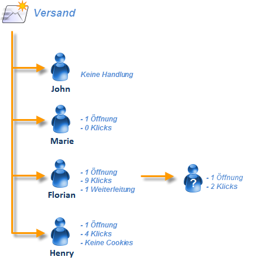

* **[!UICONTROL John Davis]** öffnet die E-Mail nicht und klickt demzufolge auf keinen der Links.
* **[!UICONTROL Marie Stuart]** : öffnet die E-Mail, klickt jedoch auf keinen der Links.
* **[!UICONTROL Florian David]** : öffnet die E-Mail und klickt neunmal auf die Links. Er leitet die E-Mail auch an jemanden weiter, der sie öffnet und zweimal klickt.
* **[!UICONTROL Henry Macdonald]** : dieser Empfänger hat seinen Internetbrowser so konfiguriert, dass er Cookies ablehnt. Er öffnet die E-Mail und klickt 4 mal auf die Links.

Folgende Trackinglogs werden ausgegeben:

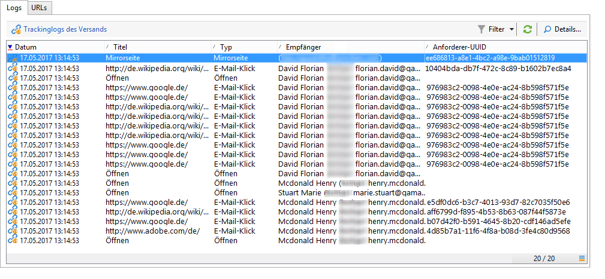

Für ein besseres Verständnis des Zählmechanismus von Personen und Empfängern werden die den jeweiligen Profilen entsprechenden Logs im Folgenden nacheinander analysiert.

## 1. Schritt: John {#step-1--john}

**[!UICONTROL John Davis]** öffnet die E-Mail nicht und klickt demzufolge auf keinen der Links.

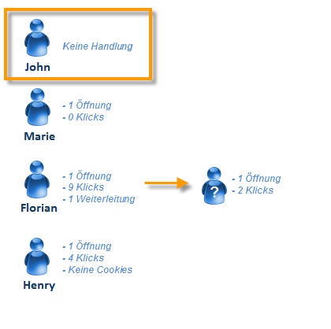

Da John weder geöffnet noch geklickt hat, erscheint er nicht in den Trackinglogs.

**Zwischenrechnung:**

|  | Empfänger, die geklickt haben | Personen, die geklickt haben | Empfänger, die geöffnet haben |
|---|---|---|---|
| John | - | - | - |
| Zwischenergebnis | 0 | 0 | 0 |

## 2. Schritt: Marie {#step-2--marie}

**[!UICONTROL Marie Stuart]** öffnet die E-Mail, klickt jedoch auf keinen der Links.

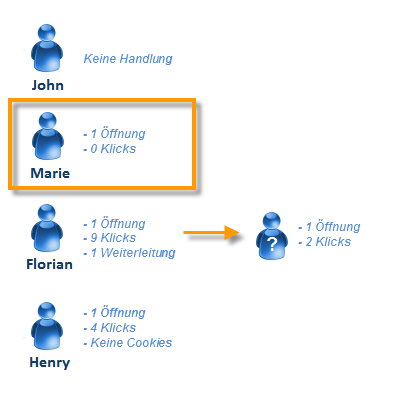

Maries Öffnung der E-Mail erscheint in folgendem Log:

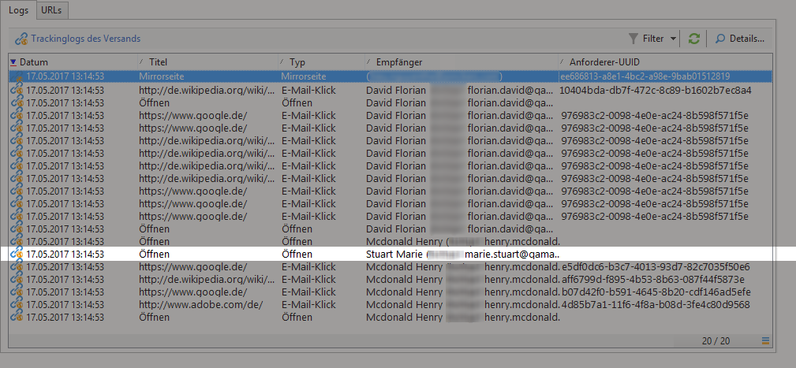

Die Öffnung wird einem Empfänger zugeordnet (Marie). Adobe Campaign zählt also einen neuen Empfänger.

**Zwischenrechnung:**

|  | Empfänger, die geklickt haben | Personen, die geklickt haben | Empfänger, die geöffnet haben |
|---|---|---|---|
| John | - | - | - |
| Marie | - | - | +1 |
| Zwischenergebnis | 0 | 0 | 1 |

## 3. Schritt: Florian {#step-3--florian}

**[!UICONTROL Florian David]** öffnet die E-Mail und klickt neunmal auf die Links. Er leitet die E-Mail auch an jemanden weiter, der sie öffnet und zweimal klickt.

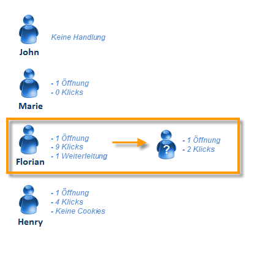

Florians Handlungen (eine Öffnung, neun Klicks) erscheinen in folgenden Logs:

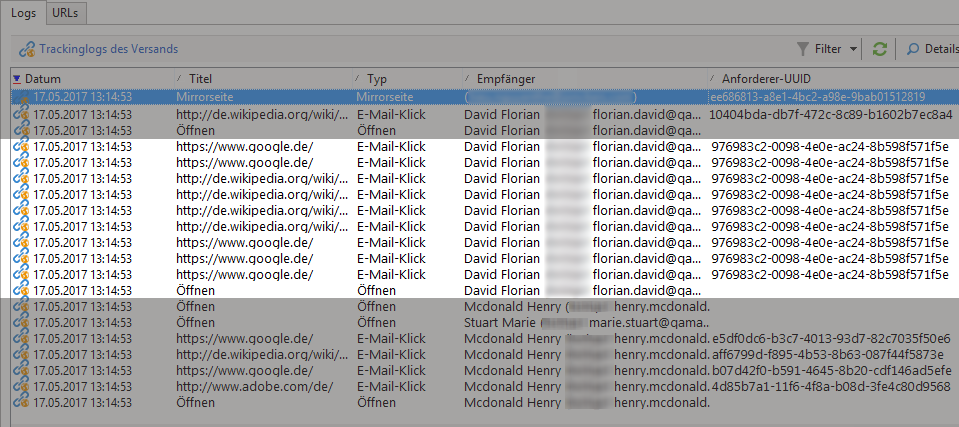

**Empfänger:** Die Öffnung und die Klicks werden demselben Empfänger (Florian) zugeordnet. Da dieser nicht mit dem ersten Empfänger (Marie) identisch ist, zählt Adobe Campaign einen neuen Empfänger.

People: Since this recipient&#39;s browser accepts cookies, we can see that the same identifier (UUID) is assigned to all click logs: **`fe37a503 [...]`**. Adobe Campaign correctly identifies these clicks as belonging to the same person. Der Zählung wird eine neue Person hinzugefügt.

**Zwischenrechnung:**

|  | Empfänger, die geklickt haben | Personen, die geklickt haben | Empfänger, die geöffnet haben |
|---|---|---|---|
| John | - | - | - |
| Marie | - | - | +1 |
| Florian | +1 | +1 | +1 |
| Zwischenergebnis | 1 | 1 | 2 |

Folgende Logs entsprechen der Öffnung und den zwei Klicks der Person, an die Florian die E-Mail weitergeleitet hat:

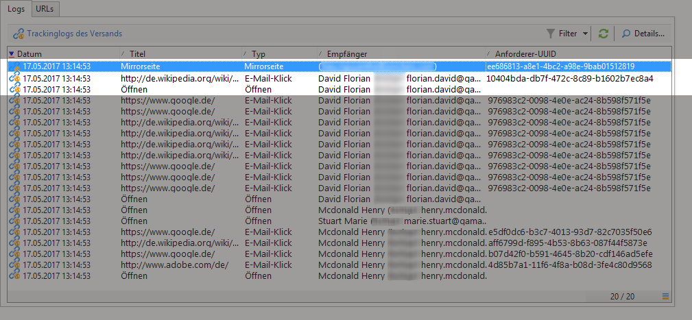

**Empfänger:** Die Öffnung und die Klicks werden dem Empfänger zugeordnet, der die E-Mail weitergeleitet hat (Florian). Da dieser Empfänger bereits gezählt wurde, ändert sich die Empfängeranzahl nicht.

**Personen**: in Bezug auf Klicks sehen wir, dass allen Protokollen dieselbe ID (UUID) zugewiesen ist: **`9ab648f9 [...]`**. Diese Kennung wurde noch nicht gezählt. Der Zählung wird daher eine neue Person hinzugefügt.

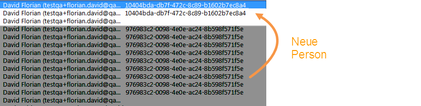

**Zwischenrechnung:**

|  | Empfänger, die geklickt haben | Personen, die geklickt haben | Empfänger, die geöffnet haben |
|---|---|---|---|
| John | - | - | - |
| Marie | - | - | +1 |
| Florian | +1 | +1 | +1 |
| Unbekannte Person | - | +1 | - |
| Zwischenergebnis | 1 | 2 | 2 |

## 4. Schritt: Henry {#step-4--henry}

**[!UICONTROL Henry Macdonald]** hat seinen Internetbrowser so konfiguriert, dass Cookies abgelehnt werden. Er öffnet die E-Mail und klickt 4 mal auf die Links.

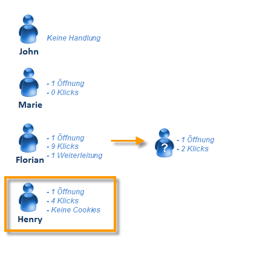

Henrys Handlungen (eine Öffnung, vier Klicks) erscheinen in folgenden Logs:

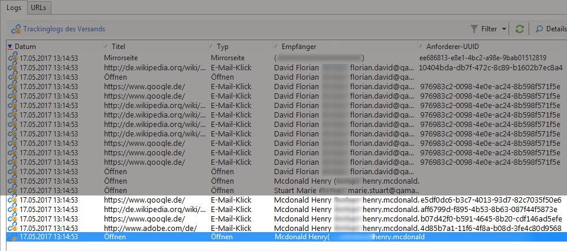

**Empfänger:** Die Öffnung und die Klicks werden demselben Empfänger (Henry) zugeordnet. Da dieser zum ersten Mal auftritt, zählt Adobe Campaign einen neuen Empfänger hinzu.

**Personen:** Da Henry keine Cookies zulässt, wird bei jedem Klick eine neue Kennung (UUID) erzeugt. Jeder seiner vier Klicks wird einer neuen Person zugeschrieben, der Zähler wird um vier Personen erhöht.

**Zwischenrechnung:**

|  | Empfänger, die geklickt haben | Personen, die geklickt haben | Empfänger, die geöffnet haben |
|---|---|---|---|
| John | - | - | - |
| Marie | - | - | +1 |
| Florian | +1 | +1 | +1 |
| Unbekannte Person | - | +1 | - |
| Henry | +1 | +4 | +1 |
| Zwischenergebnis | 2 | 6 | 3 |

## Zusammenfassung {#summary}

Auf Versandniveau stellt sich das Ergebnis wie folgt dar:

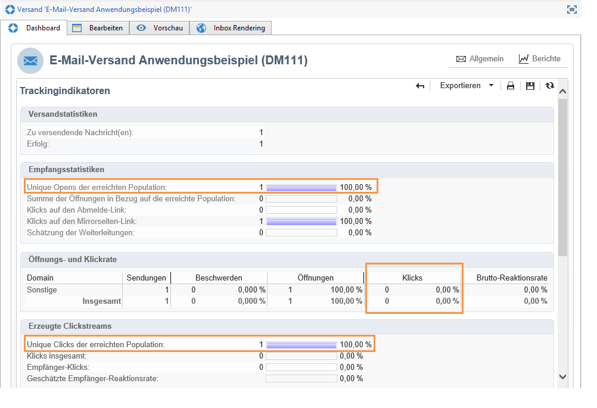

* **[!UICONTROL Clicks]** (Empfänger, die geklickt haben): 2
* **[!UICONTROL Distinct clicks for the population reached]** (Personen, die auf klicken): 6
* **[!UICONTROL Distinct opens for the population reached]** (Empfänger, die geöffnet haben): 3

Die Brutto-Reaktionsrate und die Weiterleitungen werden wie folgt berechnet:

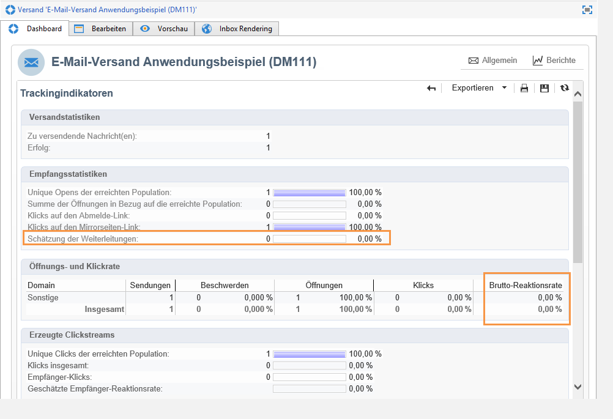

* **[!UICONTROL Estimation of forwards]** = **B - A** (also 6 - 2 = 4)
* **[!UICONTROL Raw reactivity]** = **A / C** (also 2 / 3 = 66,67%)

>[!NOTE]
>
>In oben stehenden Formeln bezeichnet:
>
>* A represents the **[!UICONTROL Clicks]** indicator (recipients who clicked).
>* B stellt den **[!UICONTROL Distinct clicks for the population reached]** Indikator dar (Personen, die auf ihn geklickt haben).
>* C steht für den **[!UICONTROL Distinct opens for the population reached]** Indikator (Empfänger, die geöffnet haben).