# Personen und Empfänger {#person-people-and-recipients}

Dieses Beispiel hilft Ihnen, den Unterschied zwischen einer Person/einer Person und einer Empfängerin bzw. einem Empfänger in Adobe Campaign zu verstehen. Wir senden eine Lieferung an mehrere Personen, um den Unterschied zwischen Personen und Empfängern hervorzuheben, während wir die Berechnungsmethode für die folgenden Indikatoren detailliert beschreiben:

* **[!UICONTROL Klicks]**
* **[!UICONTROL Unique Clicks der erreichten Population]**
* **[!UICONTROL Unique Opens der erreichten Population]**
* **[!UICONTROL Schätzung der Weiterleitungen]**
* **[!UICONTROL Brutto-Reaktionsrate]**

>[!NOTE]
>
>Diese Indikatoren werden im Bericht **[!UICONTROL Trackingindikatoren]** verwendet. Weitere Informationen hierzu finden Sie unter [Trackingindikatoren](../../reporting/using/delivery-reports.md#tracking-indicators).

Einem Versand werden drei Links hinzugefügt. Es wird an 4 Empfänger gesendet:

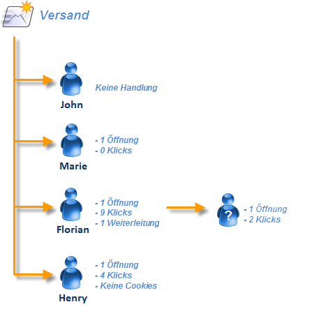

* **[!UICONTROL John Davis]** öffnet die E-Mail nicht und klickt demzufolge auf keinen der Links.
* **[!UICONTROL Marie Stuart]** öffnet die E-Mail, klickt jedoch auf keinen der Links.
* **[!UICONTROL Florian David]** : öffnet die E-Mail und klickt 9 Mal auf die Links. Er leitet die E-Mail auch an jemanden weiter, der sie öffnet und zweimal klickt.
* **[!UICONTROL Henry Macdonald]** : Dieser Empfänger hat seinen Internet-Browser so konfiguriert, dass Cookies abgelehnt werden. Er öffnet die E-Mail und klickt viermal auf die Links.

Folgende Trackinglogs werden ausgegeben:

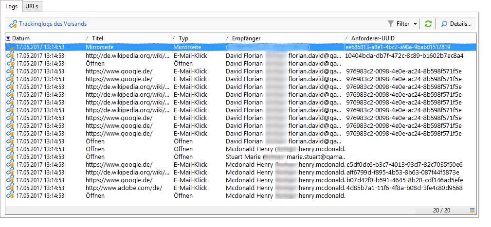

Für ein besseres Verständnis des Zählmechanismus von Personen und Empfängern werden die den jeweiligen Profilen entsprechenden Logs im Folgenden nacheinander analysiert.

## &#x200B;1. Schritt: John {#step-1--john}

**[!UICONTROL John Davis]** öffnet die E-Mail nicht und klickt demzufolge auf keinen der Links.

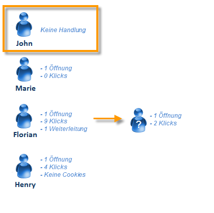

Da John weder geöffnet noch geklickt hat, erscheint er nicht in den Trackinglogs.

**Zwischenrechnung:**

|   | Empfänger, die geklickt haben | Personen, die geklickt haben | Empfänger, die geöffnet haben |
|---|---|---|---|
| John | - | - | - |
| Zwischenergebnis | 0 | 0 | 0 |

## &#x200B;2. Schritt: Marie {#step-2--marie}

**[!UICONTROL Marie Stuart]** öffnet die E-Mail, klickt jedoch auf keinen der Links.

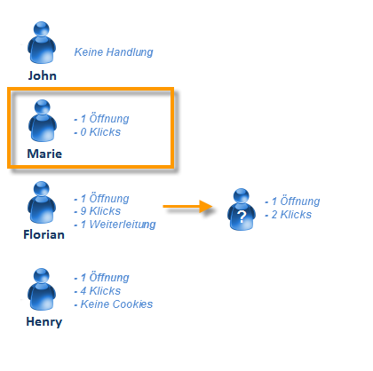

Maries Öffnung der E-Mail erscheint in folgendem Log:

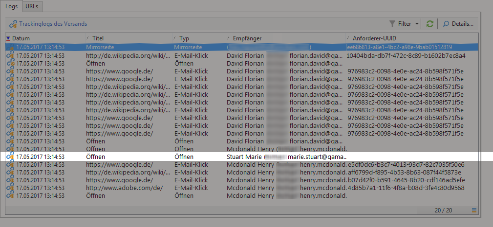

Die offene Stelle wurde einer Empfängerin bzw. einem Empfänger zugewiesen: Marie. Adobe Campaign fügt daher einen neuen Empfänger zur Zählung hinzu.

**Zwischenrechnung:**

|   | Empfänger, die geklickt haben | Personen, die geklickt haben | Empfänger, die geöffnet haben |
|---|---|---|---|
| John | - | - | - |
| Marie | - | - | +1 |
| Zwischenergebnis | 0 | 0 | 1 |

## &#x200B;3. Schritt: Florian {#step-3--florian}

**[!UICONTROL Florian David]** öffnet die E-Mail und klickt 9 Mal auf die Links. Er leitet die E-Mail auch an jemanden weiter, der sie öffnet und zweimal klickt.

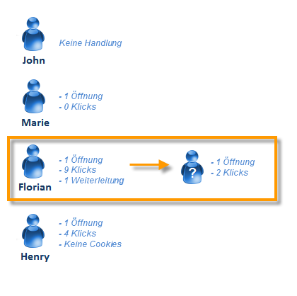

Florians Handlungen (eine Öffnung, neun Klicks) erscheinen in folgenden Logs:

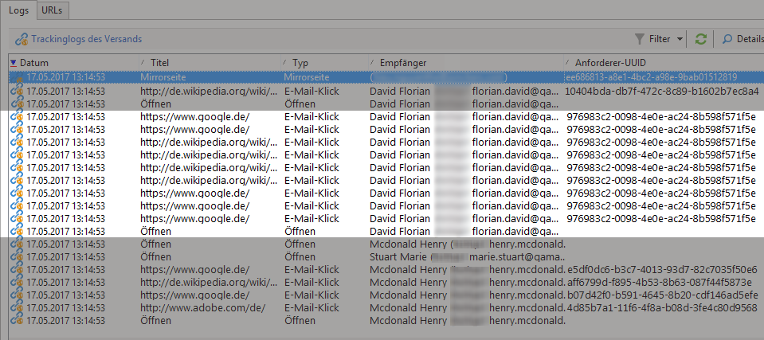

**Empfänger**: Die Öffnungen und Klicks werden demselben Empfänger (Florian) zugewiesen. Da sich dieser Empfänger vom vorherigen unterscheidet (Marie), fügt Adobe Campaign einen neuen Empfänger zur Zählung hinzu.

Personen: Da der Browser dieses Empfängers Cookies akzeptiert, können wir sehen, dass allen Klickprotokollen dieselbe Kennung (UUID) zugewiesen wird: **`fe37a503 [...]`**. Adobe Campaign kennzeichnet diese Klicks korrekt als zu derselben Person gehörend. und zählt eine neue Person.

**Zwischenrechnung:**

|   | Empfänger, die geklickt haben | Personen, die geklickt haben | Empfänger, die geöffnet haben |
|---|---|---|---|
| John | - | - | - |
| Marie | - | - | +1 |
| Florian | +1 | +1 | +1 |
| Zwischenergebnis | 1 | 1 | 2 |

Folgende Logs entsprechen der Öffnung und den zwei Klicks der Person, an die Florian die E-Mail weitergeleitet hat:

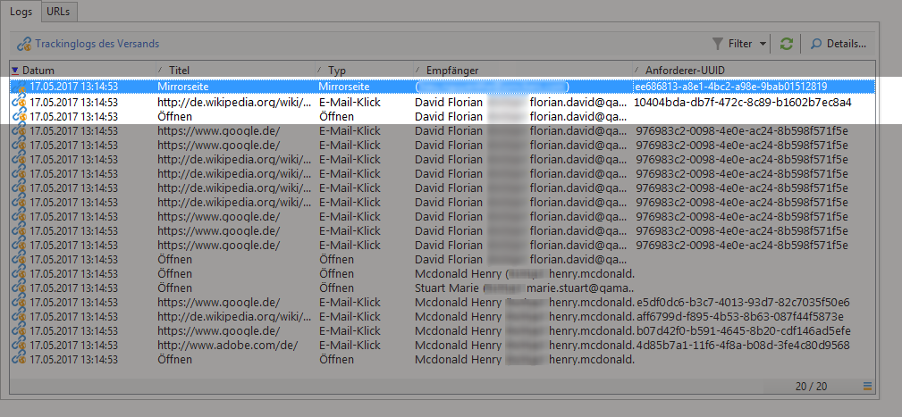

**Empfänger**: Die Öffnungen und Klicks werden dem Empfänger zugewiesen, der die E-Mail weitergeleitet hat (Florian). Da dieser Empfänger bereits gezählt wurde, bleibt die Empfängeranzahl gleich.

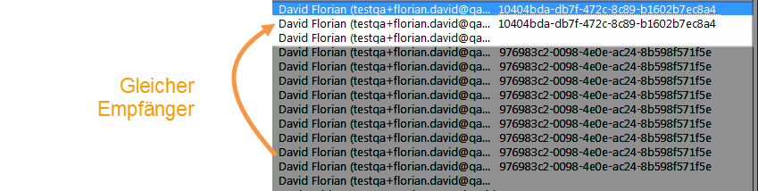

**Personen**: Bei Klicks können wir sehen, dass allen Protokollen dieselbe Kennung (UUID) zugewiesen ist: **`9ab648f9 [...]`**. Diese Kennung wurde noch nicht gezählt. Es wird daher eine neue Person gezählt.

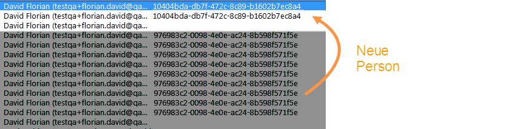

**Zwischenrechnung:**

|   | Empfänger, die geklickt haben | Personen, die geklickt haben | Empfänger, die geöffnet haben |
|---|---|---|---|
| John | - | - | - |
| Marie | - | - | +1 |
| Florian | +1 | +1 | +1 |
| Unbekannte Person | - | +1 | - |
| Zwischenergebnis | 1 | 2 | 2 |

## &#x200B;4. Schritt: Henry {#step-4--henry}

**[!UICONTROL Henry Macdonald]** hat seinen Internet-Browser so konfiguriert, dass Cookies abgelehnt werden. Er öffnet die E-Mail und klickt viermal auf die Links.

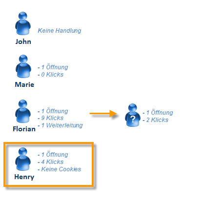

Henrys Handlungen (eine Öffnung, vier Klicks) erscheinen in folgenden Logs:

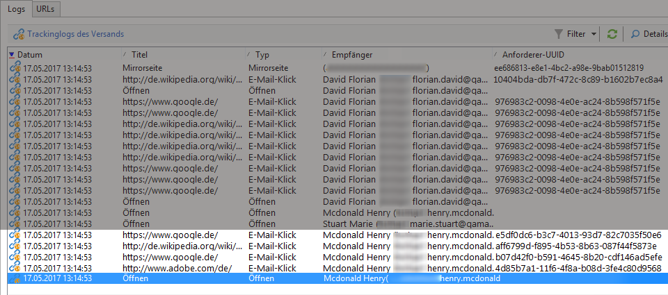

**Empfänger**: Die Öffnungen und Klicks werden demselben Empfänger (Henry) zugewiesen. Da dieser Empfänger noch nicht gezählt wurde, fügt Adobe Campaign einen Empfänger zur Anzahl hinzu.

**Personen**: Da Henrys Browser keine Cookies akzeptiert, wird für jeden Klick eine neue Kennung (UUID) generiert. Jeder der vier Klicks wird als von einer anderen Person kommend interpretiert. Da diese Kennungen noch nicht gezählt wurden, werden sie der Anzahl hinzugefügt.

**Zwischenrechnung:**

|   | Empfänger, die geklickt haben | Personen, die geklickt haben | Empfänger, die geöffnet haben |
|---|---|---|---|
| John | - | - | - |
| Marie | - | - | +1 |
| Florian | +1 | +1 | +1 |
| Unbekannte Person | - | +1 | - |
| Henry | +1 | +4 | +1 |
| Zwischenergebnis | 2 | 6 | 3 |

## Zusammenfassung {#summary}

Auf Versandniveau stellt sich das Ergebnis wie folgt dar:

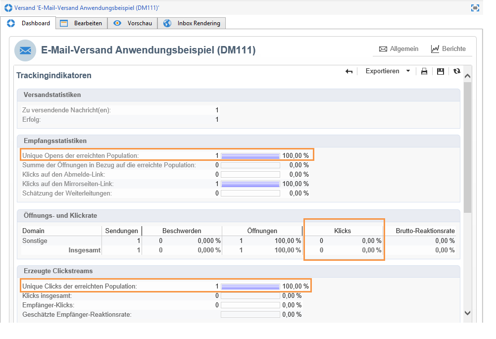

* **[!UICONTROL Klicks]** (Empfänger, die geklickt haben): 2
* **[!UICONTROL Unique Clicks der erreichten Population]** (Personen, die geklickt haben): 6
* **[!UICONTROL Unique Opens der erreichten Population]** (Empfänger, die geöffnet haben): 3

Die Brutto-Reaktionsrate und die Weiterleitungen werden wie folgt berechnet:

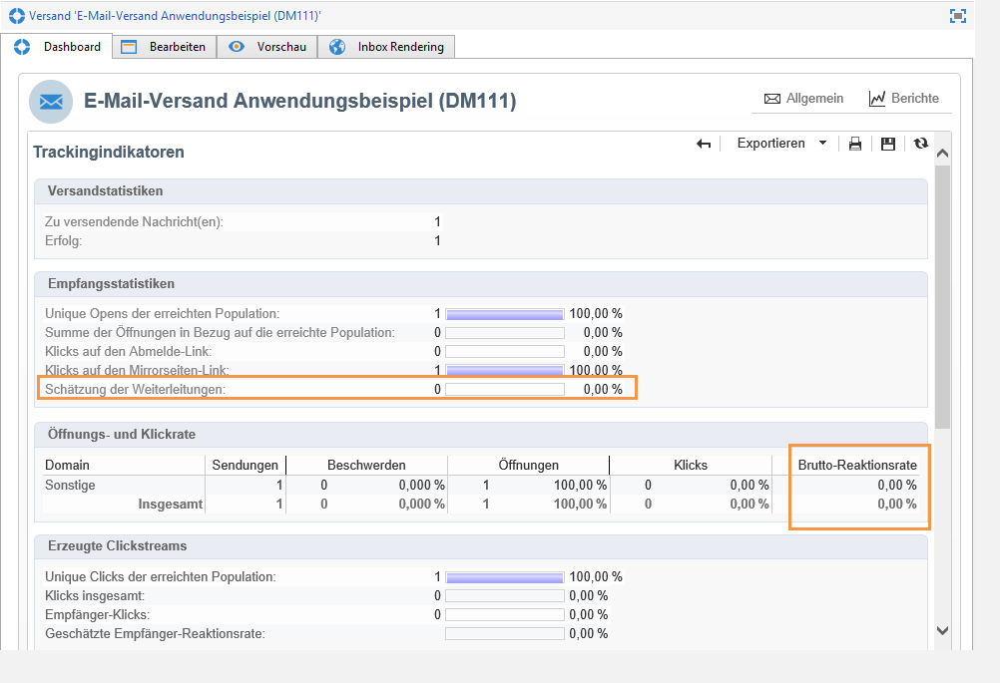

* **[!UICONTROL Schätzung der Weiterleitungen]** = **B - A** (also 6 - 2 = 4)
* **[!UICONTROL Brutto-Reaktionsrate]** = **A / C** (also 2 / 3 = 66,67%)

>[!NOTE]
>
>In oben stehenden Formeln bezeichnet:
>
>* A den Indikator **[!UICONTROL Klicks]** (Empfänger, die geklickt haben).
>* B den Indikator **[!UICONTROL Unique Clicks der erreichten Population]** (Personen, die geklickt haben).
>* C den Indikator **[!UICONTROL Unique Opens der erreichten Population]** (Empfänger, die geöffnet haben).
