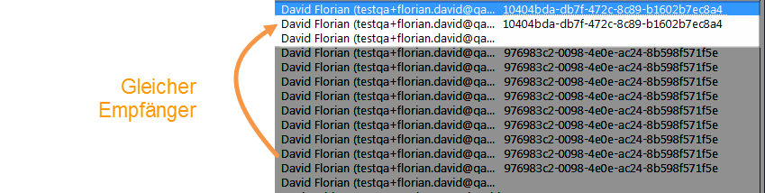

# Personen und Empfänger {#person-people-and-recipients}

In diesem Beispiel wird der Unterschied zwischen Personen und Empfängern in Adobe Campaign erläutert. Zu diesem Zweck werden wir einen Versand an mehrere Personen durchführen. Zusätzlich wird die Berechnungsmethode für die folgenden Indikatoren erklärt:

* **[!UICONTROL Klicks]**
* **[!UICONTROL Unique Clicks der erreichten Population]**
* **[!UICONTROL Unique Opens der erreichten Population]**
* **[!UICONTROL Schätzung der Weiterleitungen]**
* **[!UICONTROL Brutto-Reaktionsrate]**

>[!NOTE]
>
>Diese Indikatoren werden im Bericht **[!UICONTROL Trackingindikatoren]** verwendet. Weitere Informationen hierzu finden Sie unter [Trackingindikatoren](../../reporting/using/delivery-reports.md#tracking-indicators).

Einem Versand werden drei Links hinzugefügt. Er wird an vier Empfänger gesendet.

* **[!UICONTROL John Davis]** öffnet die E-Mail nicht und klickt demzufolge auf keinen der Links.
* **[!UICONTROL Marie Stuart]** öffnet die E-Mail, klickt jedoch auf keinen der Links.
* **[!UICONTROL Florian David]** öffnet die E-Mail und klickt neunmal auf die Links. Er leitet die E-Mail darüber hinaus an eine Person weiter, welche sie öffnet und zweimal klickt.
* **[!UICONTROL Henry Macdonald]** öffnet die E-Mail und klickt viermal auf die Links. Sein Browser akzeptiert keine Cookies.

Folgende Trackinglogs werden ausgegeben:

Für ein besseres Verständnis des Zählmechanismus von Personen und Empfängern werden die den jeweiligen Profilen entsprechenden Logs im Folgenden nacheinander analysiert.

## 1. Schritt: John {#step-1--john}

**[!UICONTROL John Davis]** öffnet die E-Mail nicht und klickt demzufolge auf keinen der Links.

Da John weder geöffnet noch geklickt hat, erscheint er nicht in den Trackinglogs.

**Zwischenrechnung:**

|  | Empfänger, die geklickt haben | Personen, die geklickt haben | Empfänger, die geöffnet haben |
|---|---|---|---|
| John | - | - | - |
| Zwischenergebnis | 0 | 0 | 0 |

## 2. Schritt: Marie {#step-2--marie}

**[!UICONTROL Marie Stuart]** öffnet die E-Mail, klickt jedoch auf keinen der Links.

Maries Öffnung der E-Mail erscheint in folgendem Log:

Die Öffnung wird einem Empfänger zugeordnet (Marie). Adobe Campaign zählt also einen neuen Empfänger.

**Zwischenrechnung:**

|  | Empfänger, die geklickt haben | Personen, die geklickt haben | Empfänger, die geöffnet haben |
|---|---|---|---|
| John | - | - | - |
| Marie | - | - | +1 |
| Zwischenergebnis | 0 | 0 | 1 |

## 3. Schritt: Florian {#step-3--florian}

**[!UICONTROL Florian David]** öffnet die E-Mail und klickt neunmal auf die Links. Er leitet die E-Mail darüber hinaus an eine Person weiter, welche sie öffnet und zweimal klickt.

Florians Handlungen (eine Öffnung, neun Klicks) erscheinen in folgenden Logs:

**Empfänger:** Die Öffnung und die Klicks werden demselben Empfänger (Florian) zugeordnet. Da dieser nicht mit dem ersten Empfänger (Marie) identisch ist, zählt Adobe Campaign einen neuen Empfänger.

Personen: Dank der Cookies lässt sich beobachten, dass allen Klick-Logs dieselbe Kennung zugeordnet ist, nämlich **`fe37a503 [...]`**. Adobe Campaign erkennt also folgerichtig, dass die Klicks von derselben Person stammen und zählt eine neue Person.

**Zwischenrechnung:**

|  | Empfänger, die geklickt haben | Personen, die geklickt haben | Empfänger, die geöffnet haben |
|---|---|---|---|
| John | - | - | - |
| Marie | - | - | +1 |
| Florian | +1 | +1 | +1 |
| Zwischenergebnis | 1 | 1 | 2 |

Folgende Logs entsprechen der Öffnung und den zwei Klicks der Person, an die Florian die E-Mail weitergeleitet hat:

**Empfänger:** Die Öffnung und die Klicks werden dem Empfänger zugeordnet, der die E-Mail weitergeleitet hat (Florian). Da dieser Empfänger bereits gezählt wurde, ändert sich die Empfängeranzahl nicht.

**Personen**: In Bezug auf Klicks sehen wir, dass allen Logs dieselbe ID (UUID) zugewiesen ist: **`9ab648f9 [...]`**. Diese Kennung wurde noch nicht gezählt. Es wird daher eine neue Person gezählt.

**Zwischenrechnung:**

|  | Empfänger, die geklickt haben | Personen, die geklickt haben | Empfänger, die geöffnet haben |
|---|---|---|---|
| John | - | - | - |
| Marie | - | - | +1 |
| Florian | +1 | +1 | +1 |
| Unbekannte Person | - | +1 | - |
| Zwischenergebnis | 1 | 2 | 2 |

## 4. Schritt: Henry {#step-4--henry}

**[!UICONTROL Henry Macdonald]** akzeptiert keine Cookies. Er öffnet die E-Mail und klickt viermal auf die Links.

Henrys Handlungen (eine Öffnung, vier Klicks) erscheinen in folgenden Logs:

**Empfänger:** Die Öffnung und die Klicks werden demselben Empfänger (Henry) zugeordnet. Da dieser zum ersten Mal auftritt, zählt Adobe Campaign einen neuen Empfänger hinzu.

**Personen:** Da Henry keine Cookies zulässt, wird bei jedem Klick eine neue Kennung (UUID) erzeugt. Jeder seiner vier Klicks wird einer neuen Person zugeschrieben, der Zähler wird um vier Personen erhöht.

**Zwischenrechnung:**

|  | Empfänger, die geklickt haben | Personen, die geklickt haben | Empfänger, die geöffnet haben |
|---|---|---|---|
| John | - | - | - |
| Marie | - | - | +1 |
| Florian | +1 | +1 | +1 |
| Unbekannte Person | - | +1 | - |
| Henry | +1 | +4 | +1 |
| Zwischenergebnis | 2 | 6 | 3 |

## Zusammenfassung {#summary}

Auf Versandniveau stellt sich das Ergebnis wie folgt dar:

* **[!UICONTROL Klicks]** (Empfänger, die geklickt haben): 2
* **[!UICONTROL Unique Clicks der erreichten Population]** (Personen, die geklickt haben): 6
* **[!UICONTROL Unique Opens der erreichten Population]** (Empfänger, die geöffnet haben): 3

Die Brutto-Reaktionsrate und die Weiterleitungen werden wie folgt berechnet:

* **[!UICONTROL Schätzung der Weiterleitungen]** = **B - A** (also 6 - 2 = 4)
* **[!UICONTROL Brutto-Reaktionsrate]** = **A / C** (also 2 / 3 = 66,67%)

>[!NOTE]
>
>In oben stehenden Formeln bezeichnet:
>
>* A den Indikator **[!UICONTROL Klicks]** (Empfänger, die geklickt haben).
>* B den Indikator **[!UICONTROL Unique Clicks der erreichten Population]** (Personen, die geklickt haben).
>* C den Indikator **[!UICONTROL Unique Opens der erreichten Population]** (Empfänger, die geöffnet haben).