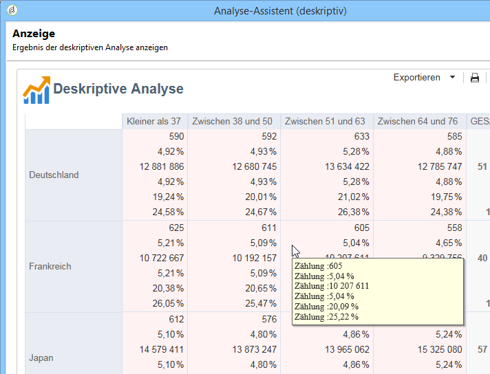

# Analysebericht verwenden{#processing-a-report}

## Analyseberichte speichern {#saving-an-analysis-report}

Wenn Sie über die entsprechenden Berechtigungen verfügen, können Sie einen erstellten Analysebericht speichern oder ihn in den Formaten Excel, PDF oder OpenDocument exportieren.

Um Ihren Bericht zu speichern, klicken Sie auf **[!UICONTROL Speichern]** und benennen Sie den Bericht.

Aktivieren Sie die Option **[!UICONTROL Auch die Daten speichern]**, wenn Sie einen Verlauf Ihres Berichts speichern und die zum Zeitpunkt der Speicherung zugrunde liegenden Daten später wieder aufrufen möchten. Lesen Sie diesbezüglich den Abschnitt [Analyseberichte archivieren](#archiving-analysis-reports).

Mit Aktivierung der Option **[!UICONTROL Bericht freigeben]** wird der Bericht für andere Benutzer zugänglich.

Sobald der Bericht gespeichert ist, kann er zur Erzeugung anderer Analyseberichte verwendet werden:

Um den Bericht zu ändern, öffnen Sie den Knoten **[!UICONTROL Administration > Konfiguration > Berichte]** des Navigationsbaums (oder den ersten Ordner vom Typ „Berichte“, für den der Benutzer Schreibrechte hat). Weitere Informationen finden Sie unter [Anzeige deskriptiver Berichte anpassen](#configuring-the-layout-of-a-descriptive-analysis-report).

## Zusätzliche Einstellungen für Analyseberichte {#analysis-report-additional-settings}

Nachdem Sie einen Analysebericht gespeichert haben, können Sie seine Eigenschaften ändern und auf weitere Optionen zugreifen.

Diese Optionen entsprechen denen von Standardberichten. Sie werden auf [dieser Seite](../../reporting/using/properties-of-the-report.md) beschrieben.

## Anzeige deskriptiver Berichte anpassen {#configuring-the-layout-of-a-descriptive-analysis-report}

Sie können die Anzeige und Anordnung Ihrer Daten in den Grafiken und Tabellen anpassen. Gehen Sie hierzu ausgehend vom Explorer in den Tab **[!UICONTROL Bearbeiten]** des Berichts, den Sie anpassen möchten.

### Anzeigemodus des Analyseberichts {#analysis-report-display-mode}

Wenn Sie einen Bericht basierend auf der Vorlage **[!UICONTROL Qualitative Verteilung]** erstellen, sind die Anzeigemodi Tabelle und Grafik standardmäßig ausgewählt. Wenn Sie nur einen der beiden Anzeigemodi verwenden möchten, wählen Sie den anderen ab: Nur der Tab des beibehaltenen Anzeigemodus bleibt verfügbar.

Wenn Sie im Nachhinein im Bericht Daten aus einem anderen Schema verwenden möchten, klicken Sie auf **[!UICONTROL Link auswählen]** und wählen Sie eine andere Tabelle der Datenbank aus.

### Anzeigeparameter des Analyseberichts {#analysis-report-display-settings}

Sie können den Namen der Statistiken und Zwischensummen anzeigen oder ausblenden und die Ausrichtung der Statistiken wählen.

Der Titel der Statistiken kann bei der Erstellung bestimmt werden.

Der angegebene Titel erscheint im Bericht.

Wenn Sie die Anzeigeoption der Titel und Zwischensummen jedoch abwählen, erscheinen diese nicht im Bericht. Der Name erscheint dennoch beim Überfahren einer Zelle der Tabelle mit dem Mauszeiger.

Die Statistiken werden standardmäßig in Zeilen angezeigt. Um die Ausrichtung zu ändern, wählen Sie die gewünschte Option in der Dropdown-Liste aus.

Im nachstehenden Beispiel werden die Statistiken in Spalten angezeigt:

### Anordnung der Daten in Analyseberichten {#analysis-report-data-layout}

Die Anordnung der Daten kann direkt in den Analyse-Tabellen angepasst werden. Machen Sie hierzu einen Rechtsklick auf die betreffende Variable. Wählen Sie eine der folgenden, im Kontextmenü verfügbaren Optionen aus:

* **[!UICONTROL Pivotieren]**: ändert die Achse der ausgewählten Variable;
* **[!UICONTROL Nach oben]**/**[!UICONTROL Nach unten]**: kehrt die Zeilen-Reihenfolge der Variablen in um;
* **[!UICONTROL Nach rechts verschieben]**/**[!UICONTROL Nach links verschieben]**: kehrt die Spalten-Reihenfolge der Variablen um;
* **[!UICONTROL Umkehren]**: kehrt die Achsen der Variablen um;
* **[!UICONTROL Von A bis Z sortieren]**: sortiert die Werte der Variable in aufsteigender Reihenfolge;
* **[!UICONTROL Von Z bis A sortieren]**: sortiert die Werte der Variable in absteigender Reihenfolge.

   

Um zur ursprünglichen Anzeige zurückzukehren, aktualisieren Sie die Ansicht.

### Grafikoptionen in Analyseberichten {#analysis-report-chart-options}

Auch die Anzeige der Daten einer Grafik kann vom Benutzer angepasst werden. Klicken Sie hierzu bei der Grafiktyp-Auswahl auf den Link **[!UICONTROL Grafikparameter...]**.

Folgende Optionen stehen zur Verfügung:

* Im oberen Abschnitt des Fensters kann der Anzeigebereich der Grafik verändert werden.
* Standardmäßig werden die Titel in der Grafik angezeigt. Um sie auszublenden, deaktivieren Sie die Option **[!UICONTROL Werte anzeigen]**.
* Die Option **[!UICONTROL Werte kumulieren]** ermöglicht das Addieren der unterschiedlichen, von einer Serie zur anderen zurückgegebenen Werte.
* Die Legende der Grafik kann durch Deaktivieren der entsprechenden Option ausgeblendet werden. Die Legende wird standardmäßig außerhalb der Grafik oben rechts angezeigt.

   Um den Anzeigebereich maximal zu nutzen, kann sie auch innerhalb der Grafik positioniert werden. Aktivieren Sie hierzu die Option **[!UICONTROL In die Grafik einschließen]**.

   Wählen Sie eine senkrechte oder vertikale Ausrichtung in der Dropdown-Liste **[!UICONTROL Legendenposition]** aus.

   

## Analyseberichte exportieren {#exporting-an-analysis-report}

Um Analyseberichte zu exportieren, wählen Sie in der Dropdown-Liste das gewünschte Ausgabeformat aus.

Weiterführende Informationen hierzu finden Sie auf dieser [Seite](../../reporting/using/actions-on-reports.md).

## Existierende Analysen und Berichte erneut verwenden {#re-using-existing-reports-and-analyses}

Sie können neue Berichte mit deskriptiven Analysen auf bereits existierenden, in Adobe Campaign gespeicherten Berichten basieren. Dieser Verwendungsmodus ist möglich, wenn die Analysen gespeichert oder die Berichte dahingehend erstellt und konfiguriert wurden, dass sie für den Assistenten zugänglich sind.

Informationen zum Speichern deskriptiver Analysen finden Sie unter [Analyseberichte speichern](#saving-an-analysis-report).

Um einen deskriptiven Analysebericht zu erstellen, muss der deskriptive Analyse-Assistent über einen Workflow oder das Menü **[!UICONTROL Werkzeuge > Deskriptive Analyse]** ausgeführt werden.

1. Wählen Sie **[!UICONTROL Existierende Analysen und Berichte]** aus und klicken Sie auf **[!UICONTROL Weiter]**.
1. Die Liste der verfügbaren Berichte wird angezeigt. Klicken Sie auf den Berichttitel, um ihn zu erzeugen.

   

## Analyseberichte archivieren {#archiving-analysis-reports}

Wenn Sie eine deskriptive Analyse basierend auf einer existierenden Analyse erstellen, haben Sie die Möglichkeit, Verläufe zu erstellen. Dies erlaubt die Speicherung der Daten von einer Analyse zur anderen und den Vergleich der unterschiedlichen Ergebnisse Ihrer Berichte.

Gehen Sie wie folgt vor, um einen Verlauf zu erstellen:

1. Öffnen Sie eine existierende Analyse oder erstellen Sie einen neuen Analyse-Bericht.
1. Klicken Sie auf die Schaltfläche zur Erstellung eines Verlaufs in der Symbolleiste und bestätigen Sie Ihre Auswahl, wie im folgenden Beispiel:

   

1. Über die entsprechende Schaltfläche können Sie auf frühere Analysen zugreifen.

   

