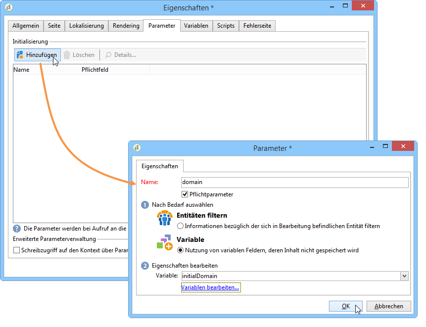
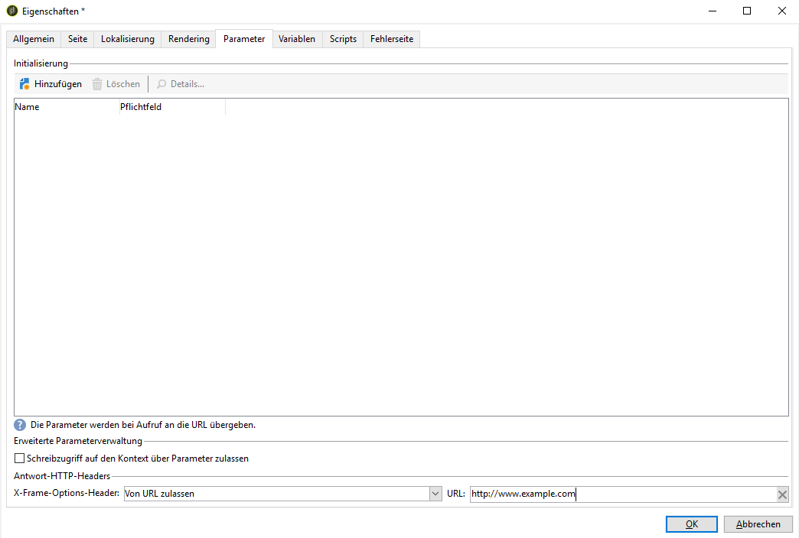
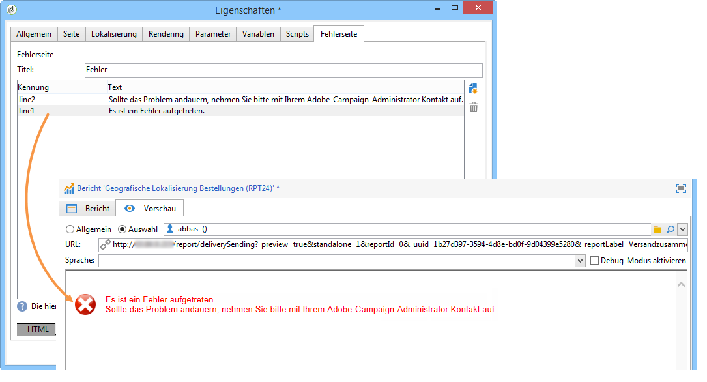

# Berichteigenschaften{#properties-of-the-report}

## Übersicht {#overview}

Ein Bericht kann vollständig angepasst und nach Bedarf konfiguriert werden. Öffnen Sie hierzu die Eigenschaften des Berichts. Diese sind über die entsprechende Schaltfläche oberhalb des Berichtdiagramms zugänglich.

## Allgemeine Eigenschaften {#overall-properties}

Im Tab **[!UICONTROL Allgemein]** können der Titel und das Schema, auf das sich der Bericht bezieht, eingesehen und verändert werden. Diese Elemente werden bei der Erstellung des Berichts angegeben.

Es wird dringend davon abgeraten, den **[!UICONTROL Internen Namen]** zu verändern, da dieser in der Zugriffs-URL des Berichts verwendet wird.

Die Berichtvorlage wird bei der Erstellung des Berichts gewählt und kann später nicht mehr verändert werden.

Um die Tabelle zu ändern, auf die sich der Bericht bezieht, klicken Sie auf das rechts vom Feld **[!UICONTROL Dokumenttyp]** liegende Symbol **[!UICONTROL Verknüpftes Element auswählen]**. Um die in der ausgewählten Tabelle verfügbaren Felder einzusehen, klicken Sie auf das Symbol **[!UICONTROL Lupe]**.

## Zugriff auf Berichte {#report-accessibility}

Ein Bericht kann von außerhalb der Adobe-Campaign-Konsole, beispielsweise von einem Webbrowser aus, zugänglich gemacht werden. Hierzu muss gegebenenfalls die Zugriffskontrolle des Berichts wie folgt konfiguriert werden:

Allgemein gilt:

* Die Option **[!UICONTROL Anonymen Zugriff zulassen]** macht den Bericht öffentlich zugänglich. Er kann jedoch nicht verändert werden.

   Die Anzeige der Berichtelemente hängen von den Berechtigungen des Standard-Berichtebenutzers ab (&#39;webapp&#39;).

* Die Option **[!UICONTROL Zugriffskontrolle]** erlaubt Adobe-Campaign-Benutzern den Zugriff auf den Bericht nach Anmeldung.
* Die Option **[!UICONTROL Spezifisches Konto nutzen]** ermöglicht die Ausführung des Berichts mit den Berechtigungen des im Feld **[!UICONTROL Benutzer]** ausgewählten Benutzers.

Weiterführende Informationen zu Webformular-Eigenschaften finden Sie auf [dieser Seite](../../web/using/about-web-forms.md).

## Berichtlokalisierung verwalten {#managing-report-localization}

Die Sprachen, in die der Bericht übersetzt werden soll, können konfiguriert werden. Klicken Sie hierzu auf den Tab **[!UICONTROL Lokalisierung]**.

Die Arbeitssprache entspricht der Sprache, in der Sie den Bericht verfassen. Beim Hinzufügen einer Sprache erscheint ein Untertab der Bearbeitungsseite des Berichts.

>[!NOTE]
>
>Lesen Sie diesbezüglich auch den entsprechenden Unterabschnitt [dieses Abschnitts](../../web/using/translating-a-web-form.md).

## HTML-Rendering anpassen {#personalizing-html-rendering}

Im Tab **[!UICONTROL Rendering]** haben Sie die Möglichkeit, den Anzeigemodus der Daten auf der Seite anzupassen. Folgende Elemente können ausgewählt werden:

* Die Rendering-Engine für Grafiken: Adobe Campaign bietet zwei verschiedene Modi zur Erzeugung des Grafik-Renderings. Die Standard-Rendering-Engine ist HTML 5. Bei Bedarf kann ein Flash-Rendering gewählt werden.
* Die Navigation im Bericht: über Schaltflächen oder Links.
* Die Standardposition der Titel der Berichtelemente. Die Position kann auf Ebene jedes Elements überschrieben werden.
* Die Vorlage oder das Thema, das zur Erzeugung der Berichtseiten verwendet wird.

Weiterführende Informationen zu Webformular-Eigenschaften finden Sie auf [dieser Seite](../../web/using/about-web-forms.md).

## Zusätzliche Parameter definieren {#defining-additional-settings}

Im Tab **[!UICONTROL Parameter]** können zusätzliche Parameter für den Bericht erstellt werden: Diese werden beim Aufruf der URL übergeben.

Weiterführende Informationen zu Webformular-Eigenschaften finden Sie auf [dieser Seite](../../web/using/about-web-forms.md).

>[!CAUTION]
>
>Diese Parameter sollten aus Sicherheitsgründen mit Vorsicht benutzt werden.

Gehen Sie wie folgt vor, um einen neuen Parameter zu erstellen:

1. Klicken Sie auf die Schaltfläche **[!UICONTROL Hinzufügen]** und erfassen Sie den Namen des Parameters.

   

1. Geben Sie an, ob es sich um einen obligatorischen Parameter handeln soll.
1. Wählen Sie den zu erstellenden Parameter aus: **[!UICONTROL Filter]** oder **[!UICONTROL Variable]**.

   Die Option **[!UICONTROL Entitäten filtern]** ermöglicht die Nutzung eines Datenbank-Feldes als Parameter.

   

   Die Daten werden direkt auf Ebene der Entität abgerufen: **ctx/recipient/@account**.

   Über die Option **[!UICONTROL Variable]** kann eine Variable erstellt oder ausgewählt werden, die als URL-Parameter übergeben und auf Ebene der Filter genutzt werden kann.

Mit **[!UICONTROL Antwort-HTTP-Headers]** können Sie Clickjacking verhindern, wenn Sie die Seite Ihres Berichts mit iframe in eine HTML-Seite einschließen. Zur Vermeidung von Clickjacking können Sie das Verhalten **[!UICONTROL X-Frame-Options-Header]** auswählen:

* **[!UICONTROL Keiner]**: Der Bericht enthält keinen **[!UICONTROL X-Frame-Options-Header]**.
* **[!UICONTROL Identisch mit Ursprung]**: Standardmäßig für neue Berichte und erneut veröffentlichte Berichte festgelegt. Der Host-Name entspricht der URL des Berichts.
* **[!UICONTROL Ablehnen]**: Der Bericht kann nicht mit iframe in eine HTML-Seite eingefügt werden.

## Variablen hinzufügen {#adding-variables}

Der Tab **[!UICONTROL Variablen]** enthält die Liste der im Bericht konfigurierten Variablen. Diese werden im Kontext des Berichts aufgeführt und können in den Berechnungen verwendet werden.

Klicken Sie auf die Schaltfläche **[!UICONTROL Hinzufügen]**, um eine neue Variable zu erstellen.

Um die Parameter einer Variablen einzusehen, markieren Sie sie und klicken Sie auf die Schaltfläche **[!UICONTROL Detail...]**.

## Scripts referenzieren {#referencing-scripts}

Im Tab **[!UICONTROL Scripts]** können JavaScript-Codes referenziert werden, die client- und/oder serverseitig beim Aufruf der Berichtseite ausgeführt werden.

Die referenzierten Scripts müssen in JavaScript verfasst und mit den gängigen Browsern kompatibel sein, um sicherzustellen, dass sie clientseitig korrekt ausgeführt werden. Weiterführende Informationen hierzu finden Sie in [diesem Abschnitt](../../web/using/web-forms-answers.md).

## Fehlerseite anpassen {#personalizing-the-error-page}

Im Tab **[!UICONTROL Fehlerseite]** können Sie die Nachricht anpassen, die im Falle eines Fehlers bei der Berichtanzeige erscheint.

Sie können Texte verfassen und diesen Kennungen zuordnen, die für die Berichtlokalisierung erforderlich sind. Weitere Informationen hierzu finden Sie unter [Header und Footer hinzufügen](../../reporting/using/element-layout.md#adding-a-header-and-a-footer).

