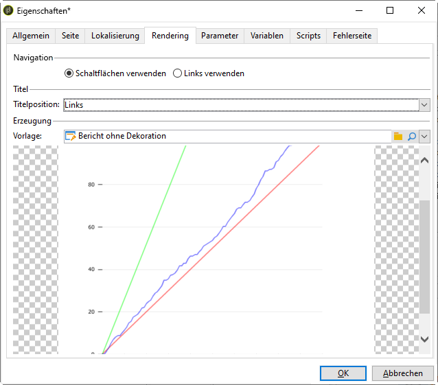

# Berichteigenschaften{#properties-of-the-report}

Sie können Ihren Bericht ganz nach Bedarf personalisieren und konfigurieren. Bearbeiten Sie dazu die Eigenschaften. Auf Berichteigenschaften können Sie mit der Schaltfläche **[!UICONTROL Eigenschaften]** über dem Diagramm für Aktivitätsabfolgen zugreifen.

Allgemeine Eigenschaften werden nachfolgend beschrieben. Erweiterte Funktionen, die sich auf den Tabs **[!UICONTROL Parameter]**, **[!UICONTROL Variablen]** und **[!UICONTROL Scripts]** konfigurieren lassen, werden [in diesem Abschnitt](../../reporting/using/advanced-functionalities.md) beschrieben.

## Allgemeine Eigenschaften {#overall-properties}

Auf dem Tab **[!UICONTROL Allgemein]** der Berichteigenschaften können Sie die folgenden Einstellungen bearbeiten:

* Titel und interner Berichtsname. Der **[!UICONTROL interne Name]** wird in der endgültigen URL des Berichts verwendet. Er sollte nach der Berichterstellung nicht mehr geändert werden.

* Der **Ordner** des Berichts wird bei der Berichterstellung ausgewählt. Es empfiehlt sich, für benutzerspezifische Berichte einen eigenen Ordner zu erstellen, damit diese nicht mit [integrierten Berichten](../../reporting/using/about-campaign-built-in-reports.md) vermischt werden.

* Die **Speicherung** wird beim Erstellen des Berichts ausgewählt. Um die Datentabelle des Berichts zu ändern, klicken Sie auf das Symbol **[!UICONTROL Verknüpftes Element auswählen]** rechts neben dem Feld **[!UICONTROL Dokumenttyp]**.

   

* Die Parameter der **Zugriffskontrolle**. Diese Einstellungen werden nachfolgend beschrieben.

## Zugriff auf den Bericht kontrollieren {#report-accessibility}

Auf einen Bericht kann über die Adobe Campaign-Konsole oder einen Webbrowser zugegriffen werden. In dem Fall kann es erforderlich sein, wie unten dargestellt die Zugriffskontrolle für den Bericht zu konfigurieren.

Mögliche Optionen sind:

* **[!UICONTROL Anonymer Zugriff]**: Diese Option bietet uneingeschränkten Zugriff auf den Bericht. Eine Bearbeitung ist jedoch nicht möglich.

   Die Anzeige der Berichtelemente hängt von den Berechtigungen des technischen &quot;webapp&quot;-Benutzers ab. Weiterführende Informationen finden Sie [in diesem Abschnitt](../../platform/using/access-management.md#default-operators).

* **[!UICONTROL Zugriffskontrolle]**: Diese Option bietet Adobe Campaign-Benutzern nach der Anmeldung Zugriff auf den Bericht.
* **[!UICONTROL Spezifisches Konto nutzen]**: Diese Option ermöglicht die Ausführung des Berichts mit den Berechtigungen des im Feld **[!UICONTROL Benutzer]** ausgewählten Benutzers.

## Berichtlokalisierung verwalten {#managing-report-localization}

Die Sprachen, in die der Bericht übersetzt werden soll, können konfiguriert werden. Klicken Sie hierzu auf den Tab **[!UICONTROL Lokalisierung]**.

Die Arbeitssprache entspricht der Sprache, in der Sie den Bericht verfassen. Beim Hinzufügen einer Sprache erscheint ein Untertab der Bearbeitungsseite des Berichts.

>[!NOTE]
>
>Weiterführende Informationen zur Lokalisierung von Web-Seiten in Campaign finden Sie in [diesem Abschnitt](../../web/using/translating-a-web-form.md).

## HTML-Rendering anpassen {#personalizing-html-rendering}

Im Tab **[!UICONTROL Rendering]** haben Sie die Möglichkeit, den Anzeigemodus der Daten auf der Seite anzupassen. Folgende Elemente können ausgewählt werden:

* Die Rendering-Engine für Grafiken: Adobe Campaign bietet zwei verschiedene Modi zur Erzeugung des Grafik-Renderings. Die Standard-Rendering-Engine ist HTML 5. Bei Bedarf kann ein Flash-Rendering gewählt werden.
* Die Navigation im Bericht: über Schaltflächen oder Links.
* Die Standardposition der Titel der Berichtelemente. Die Position kann auf Ebene jedes Elements überschrieben werden.
* Die Vorlage oder das Thema, das zur Erzeugung der Berichtseiten verwendet wird.

## Fehlerseite anpassen {#personalizing-the-error-page}

Im Tab **[!UICONTROL Fehlerseite]** können Sie die Nachricht anpassen, die im Falle eines Fehlers bei der Berichtanzeige erscheint.

Sie können Texte verfassen und diesen Kennungen zuordnen, die für die Berichtlokalisierung erforderlich sind. Weitere Informationen hierzu finden Sie unter [Header und Footer hinzufügen](../../reporting/using/element-layout.md#adding-a-header-and-a-footer).

