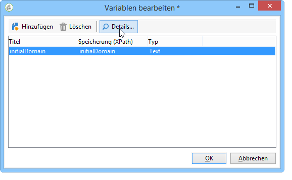

# Berichteigenschaften{#properties-of-the-report}

## Übersicht {#overview}

Ein Bericht kann vollständig angepasst und nach Bedarf konfiguriert werden. Öffnen Sie hierzu die Eigenschaften des Berichts. Diese sind über die entsprechende Schaltfläche oberhalb des Berichtdiagramms zugänglich.

## Allgemeine Eigenschaften {#overall-properties}

Auf der **[!UICONTROL General]** Registerkarte können Sie die Bezeichnung und das Schema, das sich auf den Bericht bezieht, anzeigen oder ändern. Diese Elemente werden bei der Berichterstellung eingegeben.

We do not recommend changing the **[!UICONTROL Internal name]** : this is used in the report access URL.

Die Berichtvorlage wird bei der Erstellung des Berichts gewählt und kann später nicht mehr verändert werden.

Um die Tabelle zu ändern, die den Bericht betrifft, klicken Sie auf das **[!UICONTROL Select link]** Symbol rechts neben dem **[!UICONTROL Document type]** Feld. Um die verfügbaren Felder in der ausgewählten Tabelle anzuzeigen, klicken Sie auf das **[!UICONTROL Magnifier]** Symbol.

## Zugriff auf Berichte {#report-accessibility}

Ein Bericht kann von außerhalb der Adobe-Campaign-Konsole, beispielsweise von einem Webbrowser aus, zugänglich gemacht werden. Hierzu muss gegebenenfalls die Zugriffskontrolle des Berichts wie folgt konfiguriert werden:

Allgemein gilt:

* Die **[!UICONTROL Anonymous access]** Option ermöglicht uneingeschränkten Zugriff auf den Bericht. Manipulation ist jedoch nicht möglich.

   Die Anzeige der Berichtelemente hängen von den Berechtigungen des Standard-Berichtebenutzers ab (&#39;webapp&#39;).

* The **[!UICONTROL Access control]** option enables Adobe Campaign operators to access it once they are logged on.
* The **[!UICONTROL Specific account]** option lets you execute the report with the rights of the operator selected in the **[!UICONTROL Operator]** field.

Weiterführende Informationen zu Webformular-Eigenschaften finden Sie auf [dieser Seite](../../web/using/about-web-forms.md).

## Berichtlokalisierung verwalten {#managing-report-localization}

Sie können die Sprachen konfigurieren, in die der Bericht übersetzt werden soll. To do this, click the **[!UICONTROL Localization]** tab.

Die Arbeitssprache entspricht der Sprache, in der Sie den Bericht verfassen. Beim Hinzufügen einer Sprache erscheint ein Untertab der Bearbeitungsseite des Berichts.

>[!NOTE]
>
>Lesen Sie diesbezüglich auch den entsprechenden Unterabschnitt [dieses Abschnitts](../../web/using/translating-a-web-form.md).

## HTML-Rendering anpassen {#personalizing-html-rendering}

In the **[!UICONTROL Rendering]** tab, you can personalize the data display mode for the page. Sie können Folgendes auswählen:

* Die Rendering-Engine für Grafiken: Adobe Campaign bietet zwei verschiedene Modi zur Erzeugung des Grafik-Renderings. Die Standard-Rendering-Engine ist HTML 5. Bei Bedarf kann ein Flash-Rendering gewählt werden.
* Die Navigation im Bericht: über Schaltflächen oder Links.
* Die Standardposition der Titel der Berichtelemente. Die Position kann auf Ebene jedes Elements überschrieben werden.
* Die Vorlage oder das Thema, das zur Erzeugung der Berichtseiten verwendet wird.

Weiterführende Informationen zu Webformular-Eigenschaften finden Sie auf [dieser Seite](../../web/using/about-web-forms.md).

## Zusätzliche Parameter definieren {#defining-additional-settings}

The **[!UICONTROL Settings]** tab lets you create additional settings for the report: these settings will be passed into the URL during the call up.

Weiterführende Informationen zu Webformular-Eigenschaften finden Sie auf [dieser Seite](../../web/using/about-web-forms.md).

>[!CAUTION]
>
>Diese Parameter sollten aus Sicherheitsgründen mit Vorsicht benutzt werden.

Gehen Sie wie folgt vor, um einen neuen Parameter zu erstellen:

1. Click the **[!UICONTROL Add]** button and enter the name of the setting.

   

1. Geben Sie an, ob es sich um einen obligatorischen Parameter handeln soll.
1. Wählen Sie den zu erstellenden Parameter aus: **[!UICONTROL Filter]** oder **[!UICONTROL Variable]**.

   The **[!UICONTROL Filter entities]** option lets you use a field of the database as a parameter.

   

   Die Daten werden direkt auf Ebene der Entität abgerufen: **ctx/recipient/@account**.

   Über die Option **[!UICONTROL Variable]** kann eine Variable erstellt oder ausgewählt werden, die als URL-Parameter übergeben und auf Ebene der Filter genutzt werden kann.

## Variablen hinzufügen {#adding-variables}

Die **[!UICONTROL Variables]** Registerkarte enthält die Liste der im Bericht konfigurierten Variablen. Diese Variablen werden im Kontext des Berichts bereitgestellt und können in Berechnungen verwendet werden.

Click the **[!UICONTROL Add]** button to create a new variable.

To view the definition of a variable, select it and click the **[!UICONTROL Detail...]** button.

## Scripts referenzieren {#referencing-scripts}

Im Tab **[!UICONTROL Scripts]** können JavaScript-Codes referenziert werden, die client- und/oder serverseitig beim Aufruf der Berichtseite ausgeführt werden.

Die referenzierten Scripts müssen in JavaScript verfasst und mit den gängigen Browsern kompatibel sein, um sicherzustellen, dass sie clientseitig korrekt ausgeführt werden. Weiterführende Informationen hierzu finden Sie in [diesem Abschnitt](../../web/using/web-forms-answers.md).

## Fehlerseite anpassen {#personalizing-the-error-page}

The **[!UICONTROL Error page]** tab lets you configure the message that will come up in case of an error in the report display.

Sie können Texte verfassen und diesen Kennungen zuordnen, die für die Berichtlokalisierung erforderlich sind. Weitere Informationen finden Sie unter [Hinzufügen einer Kopf- und Fußzeile](../../reporting/using/element-layout.md#adding-a-header-and-a-footer).

