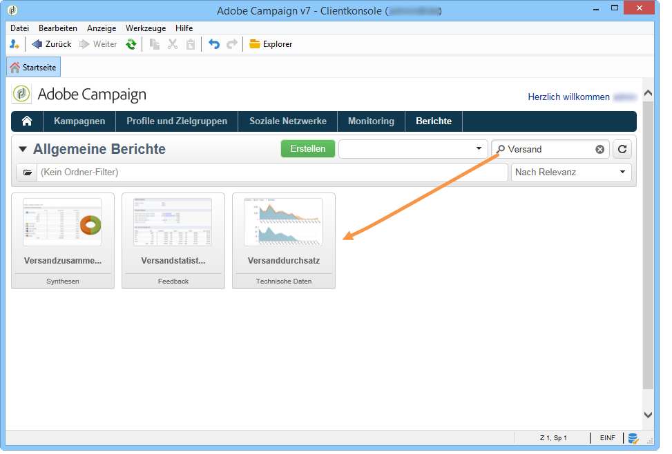
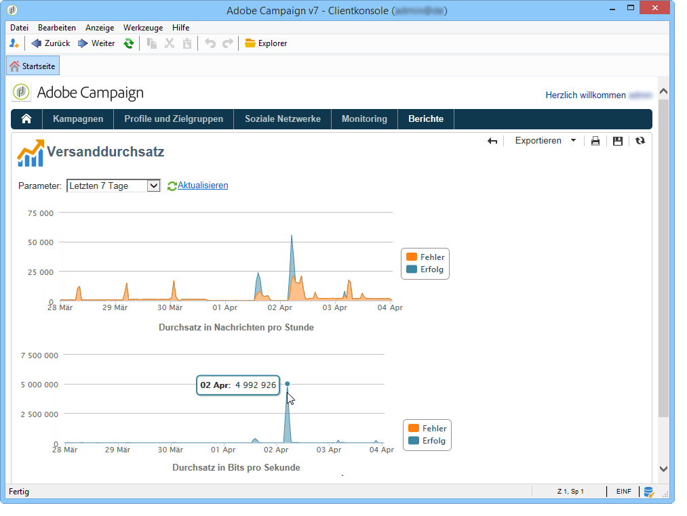

# Über Versandberichte{#reports-on-deliveries}

Adobe Campaign bietet diverse Berichte, auf die über die Konsole oder einen Webbrowser Zugriff besteht.

Folgende Berichttypen stehen zur Verfügung:

* Berichte zur gesamten Plattform, siehe [Allgemeine Berichte](../../reporting/using/global-reports.md).
* Versandberichte, siehe [Versandberichte](../../reporting/using/delivery-reports.md).
* Zusammenfassende Berichte, siehe [Zusammenfassende Berichte](../../reporting/using/cumulative-reports.md).

Der Zugriff auf Berichte ist über die Startseite der Clientkonsole, das Bericht-Dashboard oder die Versandliste möglich. Der Anzeigemodus eines Berichts hängt vom Kontext ab. Die wichtigsten Berichte stehen auf der Startseite zur Verfügung und ermöglichen einen schnellen Zugang zu Versanddaten. Die zugrunde liegende Liste kann Ihren Bedürfnissen entsprechend angepasst werden. Weitere Informationen dazu finden Sie in [diesem Abschnitt](../../reporting/using/about-reports-creation-in-campaign.md).

## Berichte verwenden {#using-reports}

Im Bericht-Dashboard ermöglicht ein Filterfeld das schnelle Auffinden eines bestimmten Berichts aus der Liste.

Nach Erzeugung eines Berichts stehen verschiedene Aktionen zur Verfügung, auf die über die Symbole rechts oben im Berichtfenster zugegriffen werden kann.

Sie haben folgende Möglichkeiten:

* den Bericht in den Formaten Excel, PDF oder Open Document exportieren,
* den Bericht drucken,
* einen Berichtverlauf erstellen,
* existierende Berichtverläufe anzeigen,
* Berichtdaten aktualisieren.

>[!NOTE]
>
>Teilweise enthalten Berichte Grafiken, wie z. B. Kurven, Histogramme oder Trichter. Durch Überfliegen der Grafik mit der Maus werden die verschiedenen Werte angezeigt.

Weiterführende Informationen zu diesen Optionen erfahren Sie in [diesem Abschnitt](../../reporting/using/about-adobe-campaign-reporting-tools.md).
