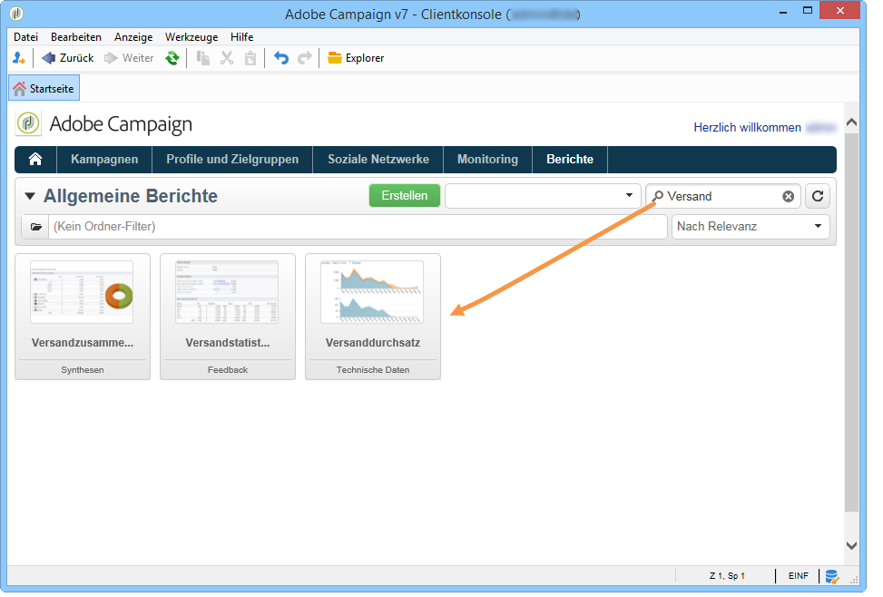
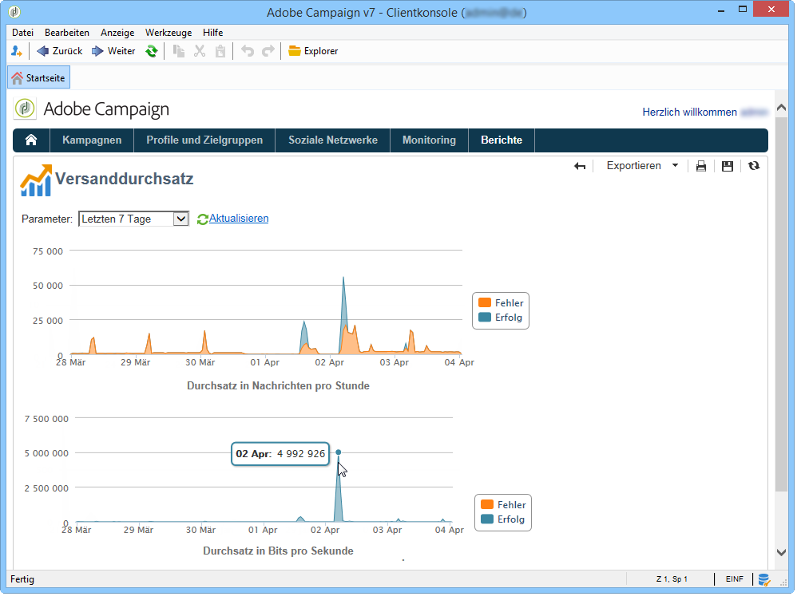

# Über Versandberichte{#reports-on-deliveries}

Adobe Campaign bietet diverse Berichte, auf die über die Konsole oder einen Webbrowser Zugriff besteht.

Folgende Berichttypen stehen zur Verfügung:

* Berichte zur gesamten Plattform, siehe [Allgemeine Berichte](../../reporting/using/global-reports.md).
* Versandberichte, siehe [Versandberichte](../../reporting/using/delivery-reports.md).
* Zusammenfassende Berichte, siehe [Zusammenfassende Berichte](../../reporting/using/cumulative-reports.md).

Der Zugriff auf Berichte erfolgt über die Startseite der Client-Konsole, das Berichte-Dashboard oder die Versandliste. Der Anzeigemodus eines Berichts hängt vom Kontext ab. Die Liste der Hauptberichte ist auf der Startseite verfügbar und ermöglicht den schnellen Zugriff auf Versanddaten. Diese Liste kann Ihren Bedürfnissen entsprechend geändert werden. Weitere Informationen finden Sie in [diesem Abschnitt](../../reporting/using/about-reports-creation-in-campaign.md).

Im Bericht-Dashboard ermöglicht ein Filterfeld das schnelle Auffinden eines bestimmten Berichts aus der Liste.

Nach Erzeugung eines Berichts stehen verschiedene Aktionen zur Verfügung, auf die über die Symbole rechts oben im Berichtfenster zugegriffen werden kann.

Sie haben folgende Möglichkeiten:

* den Bericht in den Formaten Excel, PDF oder Open Document exportieren,
* den Bericht drucken,
* einen Berichtverlauf erstellen,
* existierende Berichtverläufe anzeigen,
* Berichtdaten aktualisieren.

>[!NOTE]
>
>Einige Berichte enthalten Diagramme (Kurve, Balken, funnel usw.). Bewegen Sie den Cursor über ein Diagramm, um dessen Werte anzuzeigen.

Weiterführende Informationen zu diesen Optionen erfahren Sie in [diesem Abschnitt](../../reporting/using/about-adobe-campaign-reporting-tools.md).
