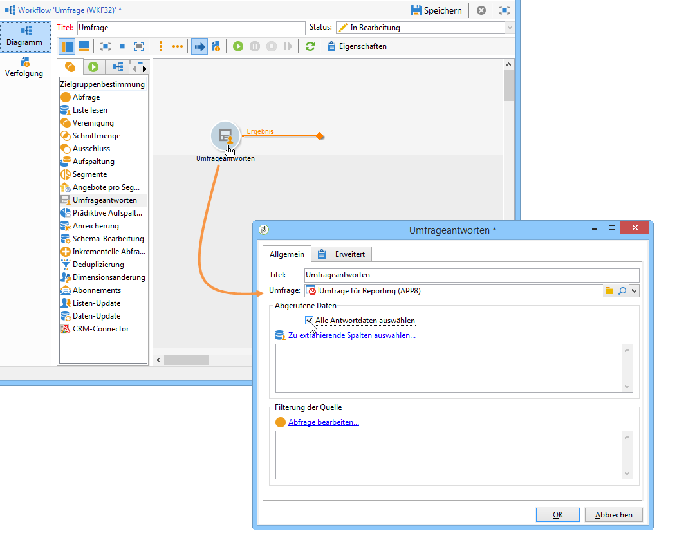
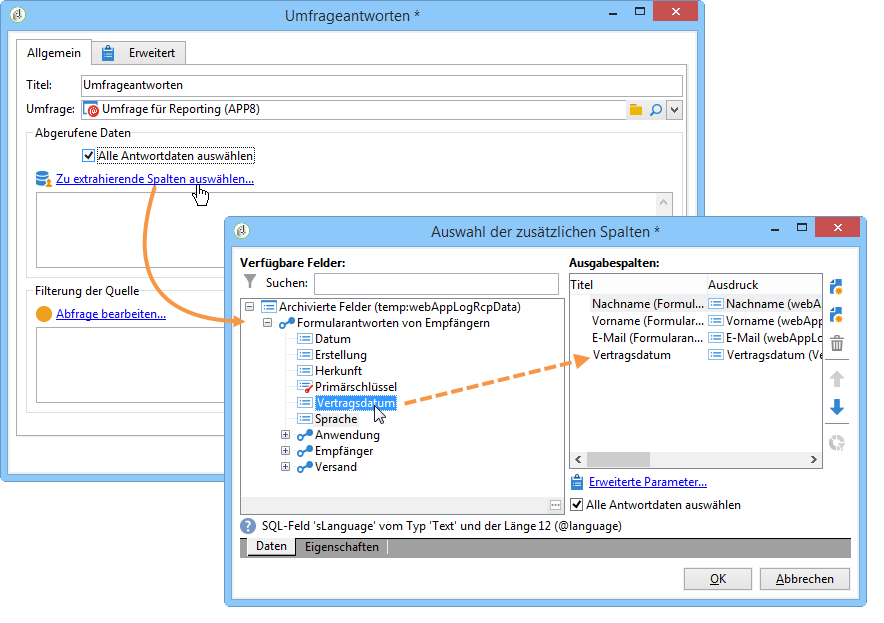
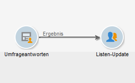
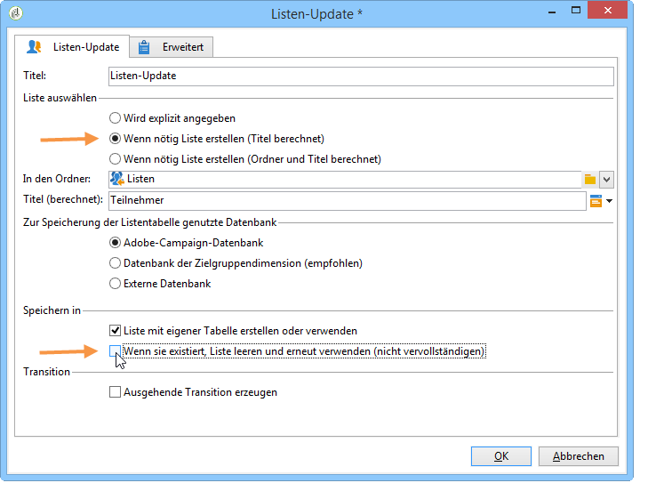
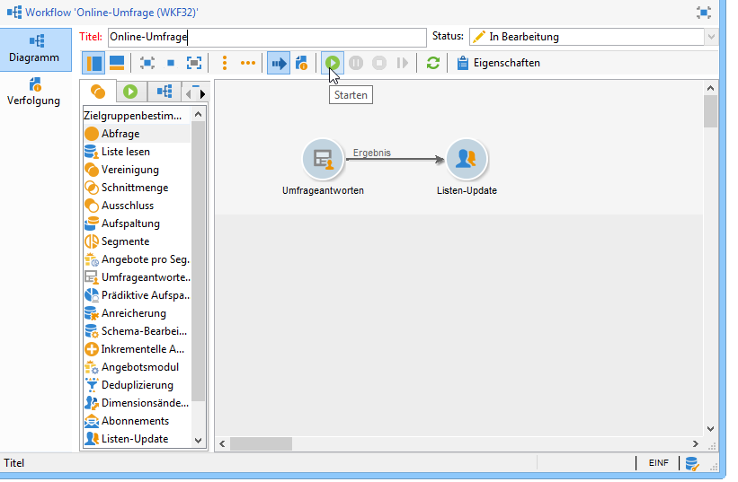
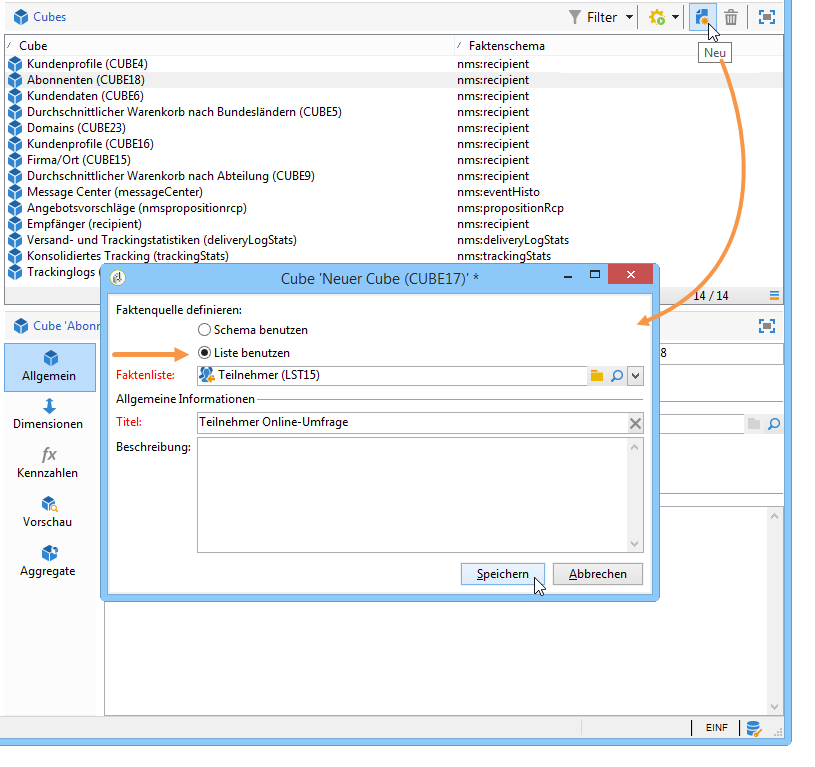
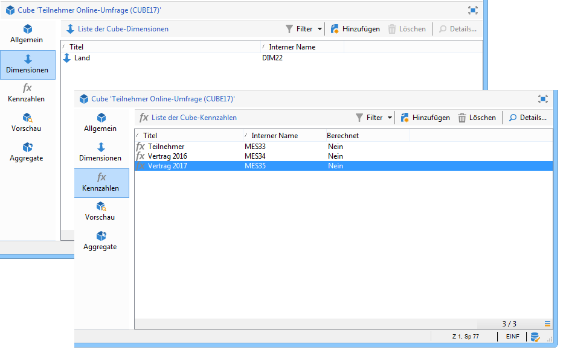
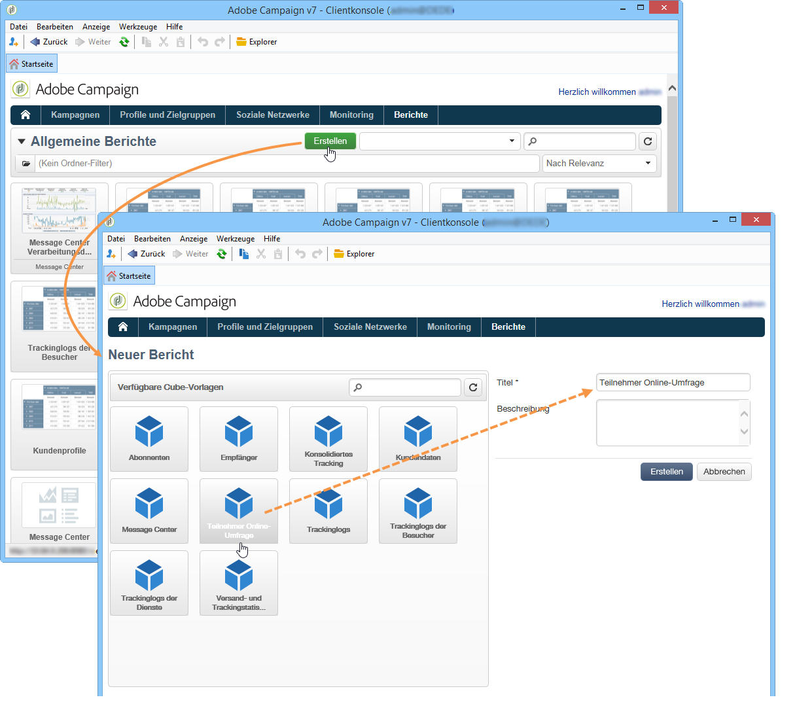
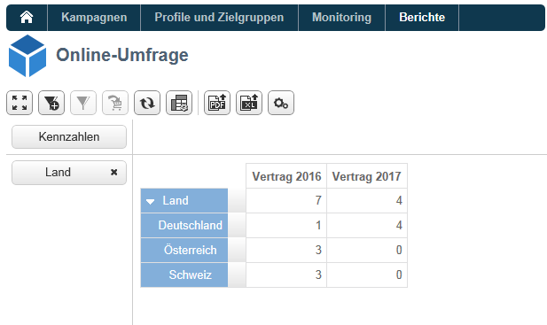

# Anwendungsbeispiel: Bericht zu Antworten auf eine Online-Umfrage erstellen{#use-case-displaying-report-on-answers-to-an-online-survey}

Die Antworten auf Adobe-Campaign-Fragebögen können abgerufen und in dedizierten Berichten analysiert werden.

Im unten stehenden Beispiel werden die Antworten auf eine Online-Umfrage gesammelt und in einem Bericht in Form einer Pivot-Tabelle angezeigt.

Gehen Sie wie folgt vor:

1. Erstellung eines Workflows zum Abruf der Umfrage-Antworten und ihrer Speicherung in einer Liste.
1. Erstellung eines Cubes, der die Daten der Liste verwendet.
1. Erstellung eines Berichts mit einer Pivot-Tabelle und Anzeige der Antwortenverteilung.

Voraussetzung für die Durchführung dieses Anwendungsbeispiels sind ein Fragebogen und zu analysierende Antworten auf diesen.

>[!NOTE]
>
>Dieses Anwendungsbeispiel kann nur durchgeführt werden, wenn Sie die Option **Survey Manager** erworben haben. Überprüfen Sie Ihren Lizenzvertrag.

## 1. Schritt - Erstellung des Workflows für Datenabruf und -speicherung {#step-1---creating-the-data-collection-and-storage-workflow}

Gehen Sie wie folgt vor, um die Antworten der Umfrage abzurufen:

1. Erstellen Sie einen Workflow und platzieren Sie eine **[!UICONTROL Answers to a survey]** Aktivität. For more on using this activity, refer to [this section](../../web/using/publish--track-and-use-collected-data.md#using-the-collected-data).
1. Öffnen Sie die Aktivität und wählen Sie die Umfrage aus, deren Antworten analysiert werden sollen.
1. Aktivieren Sie die **[!UICONTROL Select all the answer data]** Option, um alle Informationen zu erfassen.

   

1. Wählen Sie die zu extrahierenden Spalten aus (hier: Alle archivierten Felder). Die Antworten werden in diesen Feldern gespeichert.

   

1. Once the answer collection box is configured, position a **[!UICONTROL List update]** type activity to save the data.

   

   Geben Sie in dieser Aktivität die zu aktualisierende Liste an und deaktivieren Sie die **[!UICONTROL Purge and re-use the list if it exists (otherwise add to the list)]** Option: Antworten werden der vorhandenen Tabelle hinzugefügt. Mit dieser Option können Sie auf die Liste in einem Würfel verweisen. Das mit der Liste verknüpfte Schema wird nicht für jede Aktualisierung neu generiert, was die Integrität des Würfels gewährleistet, der diese Liste verwendet.

   

1. Speichern und starten Sie den Workflow, um die Konfiguration zu beenden.

   

   Die angegebene Liste wird daraufhin erstellt und mit dem Schema der Umfrageantworten ergänzt.

1. Fügen Sie eine Planung hinzu, um einen täglichen Abruf der Antworten und die Aktualisierung der Liste zu konfigurieren.

   Die **[!UICONTROL List update]** und **[!UICONTROL Scheduler]** Aktivitäten sind in ausführlich beschrieben.

## 2. Schritt - Erstellung des Cubes und seiner Kennzahlen {#step-2---creating-the-cube--its-measures-and-its-indicators}

Erstellen Sie anschließend den Cube und konfigurieren Sie seine Kennzahlen: Sie werden bei der Erstellung der Indikatoren verwendet. Die Indikatoren werden später im Bericht angezeigt. For more on creating and configuring cubes, refer to [About cubes](../../reporting/using/about-cubes.md).

Im vorliegenden Beispiel basiert der Cube auf den Daten der Liste, die im zuvor erstellten Workflow angereichert wird.

Definieren Sie die im Bericht anzuzeigenden Dimensionen und Kennzahlen. Im Beispiel werden das Vertragsdatum und das Land des Teilnehmers angezeigt.

The **[!UICONTROL Preview]** tab lets you control the rendering of the report.

## 3. Schritt - Berichterstellung und Konfiguration der Datenanzeige in der Tabelle {#step-3---creating-the-report-and-configuring-the-data-layout-within-the-table}

Erstellen Sie anschließend einen auf dem Cube basierenden Bericht, um dessen Informationen zu nutzen.

Passen Sie die anzuzeigenden Informationen entsprechend Ihren Bedürfnissen an.

