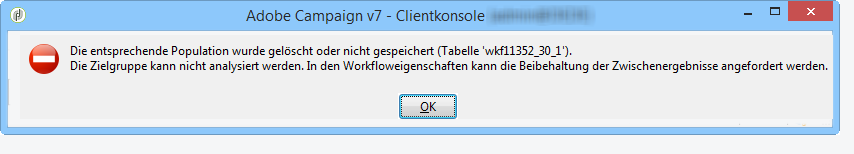
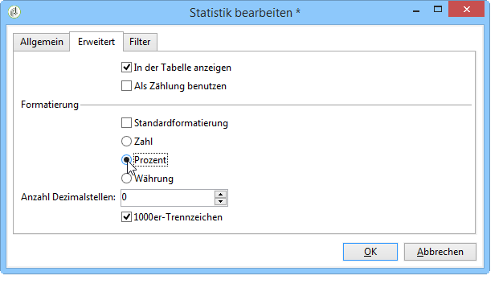

# Anwendungsfälle für Analyseberichte {#use-cases}

## Populationen analysieren {#analyzing-a-population}

Im unten stehenden Beispiel wird mithilfe des Assistenten für deskriptive Analysen die Population einer Newsletter-Serie untersucht.

Die Implementierungsschritte werden im Folgenden detailliert beschrieben, während eine vollständige Liste der Optionen und Beschreibungen in den anderen Abschnitten dieses Kapitels zu finden ist.

### Zu analysierende Population identifizieren {#identifying-the-population-to-analyze}

In unserem Beispiel werden die Zielgruppen der im Ordner **Newsletter** enthaltenen Sendungen untersucht.

Markieren Sie hierzu die betreffenden Sendungen und wählen Sie per Rechtsklick im Kontextmenü **[!UICONTROL Aktion > Ergebnis analysieren...]** aus.


### Zu realisierenden Analysetyp wählen {#selecting-a-type-of-analysis}

Im ersten Schritt des Assistenten können Sie die zu verwendende deskriptive Analysevorlage auswählen. Standardmäßig bietet Adobe Campaign zwei Vorlagen: **[!UICONTROL Qualitative Verteilung]** und **[!UICONTROL Quantitative Verteilung]**. Lesen Sie diesbezüglich den Abschnitt [Vorlage „Quantitative Verteilung“ konfigurieren](../../reporting/using/using-the-descriptive-analysis-wizard.md#configuring-the-qualitative-distribution-template). Die verschiedenen Renderings werden im Abschnitt [Über die deskriptive Analyse](../../reporting/using/about-descriptive-analysis.md) dargestellt.

Wählen Sie für das Beispiel die Vorlage **[!UICONTROL Qualitative Verteilung]** und eine Anzeige mit Grafik und Tabelle aus. Nennen Sie den Bericht &quot;Meine deskriptive Analyse&quot; und klicken Sie auf die Schaltfläche **[!UICONTROL Weiter]**.


### Anzuzeigende Variablen auswählen {#selecting-the-variables-to-display}

Im nächsten Schritt werden die in der Tabelle anzuzeigenden Daten ausgewählt.

Klicken Sie auf den Link **[!UICONTROL Hinzufügen]**, um die Variable auszuwählen, die die anzuzeigenden Daten enthält. In unserem Beispiel sollen die Wohnorte der Versandempfänger in Zeilen angezeigt werden:


Die Spalten sollen den jeweiligen Einkaufsbetrag der Empfänger anzeigen. In unserem Beispiel werden die Beträge im Feld **Online-Bestellungen** aggregiert.

In unserem Beispiel soll die Klassifizierung der Ergebnisse definiert werden, um deren Anzeige zu verdeutlichen. Wählen Sie dazu die Klassifizierungsoption **[!UICONTROL Manuell]** und legen Sie die Berechnungsklassen für die anzuzeigenden Segmente fest:


Klicken Sie dann auf **[!UICONTROL OK]**, um die Konfiguration zu bestätigen.

Nach der Festlegung der Zeilen und Spalten können Sie sie über die Symbolleiste verändern, verschieben oder löschen.


### Anzeigeformat bestimmen {#defining-the-display-format}

Im folgenden Schritt des Assistenten wird der zu erzeugende Grafiktyp festgelegt.

In diesem Beispiel wird das Histogramm gewählt.


Mögliche Konfigurationen der verschiedenen Grafiken werden im Abschnitt [Grafikoptionen in Analyseberichten](../../reporting/using/processing-a-report.md#analysis-report-chart-options) aufgeführt.

### Zu berechnende Statistiken konfigurieren {#configuring-the-statistic-to-calculate}

Geben Sie anschließend die mit den abgerufenen Daten durchzuführenden Berechnungen an. Der Assistent für deskriptive Analysen führt standardmäßig eine einfache Zählung der Werte durch.

In diesem Fenster können Sie die Liste der zu berechnenden Statistiken bestimmen.


Um eine neue Statistik zu erstellen, klicken Sie auf die Schaltfläche **[!UICONTROL Hinzufügen]**. Weitere Informationen hierzu finden Sie im Abschnitt [Statistikberechnung](../../reporting/using/using-the-descriptive-analysis-wizard.md#statistics-calculation).

### Berichte anzeigen und nutzen {#viewing-and-using-the-report}

Im letzten Schritt des Assistenten werden Tabelle und Grafik angezeigt.

Sie können Daten über die Symbolleiste oberhalb der Tabelle speichern, exportieren oder drucken. Weitere Informationen finden Sie unter [Berichtbearbeitung](../../reporting/using/processing-a-report.md).


## Qualitative Datenanalyse {#qualitative-data-analysis}

### Beispiel: Anzeige als Grafik {#example-of-a-chart-display}

**Ziel**: Erstellen von Analyseberichten über die Standorte von Interessentinnen und Interessenten sowie Kundinnen und Kunden.

1. Öffnen Sie den Assistenten für deskriptive Analysen und wählen Sie nur **[!UICONTROL Grafik]** aus.

   

   Klicken Sie zur Bestätigung auf **[!UICONTROL Weiter]**.

1. Wählen Sie anschließend die Option **[!UICONTROL 2 Variablen]** und geben Sie an, dass sich die **[!UICONTROL erste Variable (Abzisse)]** auf den Empfängerstatus (Interessenten/Kunden) bezieht und die zweite auf das Land.
1. Wählen Sie den Grafiktyp **[!UICONTROL Histogramm]**.

   

1. Klicken Sie auf **[!UICONTROL Weiter]** und behalten Sie die Standardstatistik bei: **[!UICONTROL Einfache Zählung]**.
1. Klicken Sie auf **[!UICONTROL Weiter]**, um den Bericht anzuzeigen.

   

   Um die genaue Anzahl an Kunden oder Interessenten für ein Land zu kennen, überfahren Sie die entsprechende Säule mit dem Mauszeiger.

1. Über die Legende können Sie die Anzeige einzelner Länder aktivieren oder deaktivieren.

   

### Beispiel: Anzeige als Tabelle {#example-of-a-table-display}

**Zielgruppe**: Analyse der E-Mail-Domains unterschiedlicher Firmen.

1. Öffnen Sie den Assistenten für deskriptive Analysen und wählen Sie nur den Anzeigemodus **[!UICONTROL Array]** aus.

   

   Klicken Sie zur Bestätigung auf die Schaltfläche **[!UICONTROL Weiter]**.

1. Wählen Sie die Variable **[!UICONTROL Firma]** in Spalten und die Variable **[!UICONTROL E-Mail-Domain]** in Zeilen aus.
1. Lassen Sie die Option **[!UICONTROL In Zeilen]** für die Ausrichtung der Statistiken: Die Berechnung der Statistik wird rechts von der Variable **[!UICONTROL E-Mail-Domain]** angezeigt.

   

   Klicken Sie zur Bestätigung auf **[!UICONTROL Weiter]**.

1. Geben Sie anschließend die zu berechnenden Statistiken an: Behalten Sie die Standard-Zählung bei und erstellen Sie eine neue Statistik. Klicken Sie dazu auf **[!UICONTROL Hinzufügen]** und wählen Sie **[!UICONTROL Verteilung in Prozent]** als Operator.

   

1. Geben Sie der Statistik zur besseren Lesbarkeit der Berichtsinhalte einen Titel.

   

1. Klicken Sie auf **[!UICONTROL Weiter]**, um den Bericht anzuzeigen.

   

1. Nachdem der Analysebericht erstellt wurde, können Sie die Anzeige Ihren Bedürfnissen entsprechend anpassen, ohne die Konfiguration zu ändern. Sie haben beispielsweise die Möglichkeit, die Achsen zu vertauschen: Rechtsklicken Sie hierzu einen Rechtsklick auf die die Domains enthaltende Zeile und wählen Sie im Kontextmenü **[!UICONTROL Umkehren]**.

   

   Die Tabelle stellt nun die Ergebnisse folgendermaßen dar:

   

## Quantitative Datenanalyse {#quantitative-data-analysis}

**Zielgruppe**: Erzeugung eines Berichts zur quantitativen Analyse des Empfängeralters.

1. Öffnen Sie den Assistenten für deskriptive Analysen und wählen Sie **[!UICONTROL Quantitative Verteilung]** aus der Dropdown-Liste aus.

   

   Klicken Sie zur Bestätigung auf die Schaltfläche **[!UICONTROL Weiter]**.

1. Wählen Sie anschließend die Variable **[!UICONTROL Alter]** aus und benennen Sie sie. Geben Sie an, dass es sich um einen Integer handelt und klicken Sie dann auf **[!UICONTROL Weiter]**.

   

1. Löschen Sie unnötige Statistiken, hier **[!UICONTROL Dezile]**, **[!UICONTROL Verteilung]** und **[!UICONTROL Summe]**.

   

1. Klicken Sie auf **[!UICONTROL Weiter]**, um den Bericht anzuzeigen.

   

## Analyse der Zielgruppe einer Workflow-Transition {#analyzing-a-transition-target-in-a-workflow}

**Ziel**: Erzeugung von Berichten über die Population eines Zielgruppen-Workflows.

1. Öffnen Sie einen Zielgruppen-Workflow Ihrer Wahl.
1. Machen Sie einen Rechtsklick auf eine Transition, die auf die Empfängertabelle zeigt.
1. Wählen Sie im Kontextmenü **[!UICONTROL Ergebnis analysieren...]** aus, um den Assistenten zur deskriptiven Analyse zu öffnen.

   

1. An dieser Stelle können Sie entweder die Option **[!UICONTROL Existierende Analysen und Berichte erneut verwenden]** auswählen und zuvor erstellte Berichte nutzen (siehe [Existierende Analysen und Berichte erneut verwenden ](../../reporting/using/processing-a-report.md#re-using-existing-reports-and-analyses)) oder eine neue deskriptive Analyse erstellen. Lassen Sie dazu die Option **[!UICONTROL Neue deskriptive Analyse basierend auf einer Vorlage]** standardmäßig aktiviert.

   Die weitere Konfiguration entspricht der der zuvor dargestellten deskriptiven Analysen.

### Empfehlungen zur Analyse von Zielgruppen {#target-analyze-recommendations}

Die Analyse einer Population in einem Workflow setzt voraus, dass die Population noch in der Transition präsent ist. Wenn der Workflow gestartet wurde, kann es sein, dass die Transition und damit die Population bereinigt wird. Sie haben folgende Möglichkeiten, eine Analyse durchzuführen:

* die Transition von ihrer Zielaktivität lösen und den Workflow starten, um sie zu aktivieren. Sobald die Transition blinkt, können Sie den Assistenten wie gewohnt starten.

  

* in den Eigenschaften des Workflows die Option **[!UICONTROL Zwischen zwei Ausführungen die ermittelte Population festhalten]** aktivieren. Auf diese Weise können Sie auch nach Abschluss des Workflows eine Analyse auf der Transition Ihrer Wahl starten.

  

  Wenn die Transition von der Population bereinigt wurde, fordert eine entsprechende Fehlernachricht dazu auf, die besagte Option zu aktivieren, bevor der Assistent für deskriptive Analysen gestartet wird.

  

>[!CAUTION]
>
>Die Option **[!UICONTROL Zwischen zwei Ausführungen die ermittelte Population festhalten]** darf nur in Entwicklungsphasen und niemals in einer Produktionsumgebung verwendet werden.\
>Die betreffenden Populationen werden automatisch bereinigt, sobald ihre Beibehaltungsdauer abgelaufen ist. Diese Dauer wird im Tab **[!UICONTROL Ausführung]** der Workflow-Eigenschaften festgelegt.

## Analyse der Empfänger-Trackinglogs {#analyzing-recipient-tracking-logs}

Mithilfe des Assistenten für deskriptive Analysen können auch Berichte über andere Arbeitstabellen erzeugt werden. Sie können zum Beispiel Versandlogs analysieren.

Im folgenden Beispiel wird die Reaktionsrate der Empfänger von Newslettern untersucht.

Gehen Sie hierzu wie folgt vor:

1. Öffnen Sie den Assistenten für deskriptive Analysen über das Menü **[!UICONTROL Werkzeuge > Deskriptive Analyse…]** und ändern Sie die standardmäßige Arbeitstabelle. Wählen Sie **[!UICONTROL Trackinglogs der Empfangenden]** aus. Fügen Sie einen Filter hinzu, damit die Analyse sich nur auf Newsletter bezieht und Testsendungen ausschließt.

   

   Wählen Sie nur den Tabellen-Anzeigemodus aus und klicken Sie auf **[!UICONTROL Weiter]**.

1. Geben Sie im nächsten Schritt an, dass die Analyse sich auf Sendungen bezieht.

   

   Im vorliegenden Beispiel werden die Sendungen in der ersten Spalte angezeigt.

1. Löschen Sie die Standard-Zählung und erstellen Sie die drei Statistiken, die in der Tabelle angezeigt werden sollen:

   Im Beispiel soll die Tabelle für jeden Newsletter folgende Informationen anzeigen: die Anzahl der Öffnungen, die Anzahl der Klicks und die Reaktionsrate (in Prozent).

1. Fügen Sie eine Statistik hinzu, um die Anzahl der Klicks zu zählen: Erstellen Sie den entsprechenden Filter im Tab **[!UICONTROL Filter]**.

   

1. Gehen Sie dann in den Tab **[!UICONTROL Allgemein]**, um den Titel der Statistik und ihren Alias anzupassen:

   

1. Fügen Sie eine zweite Statistik hinzu, um die Anzahl der Öffnungen zu zählen:

   

1. Gehen Sie dann in den Tab **[!UICONTROL Allgemein]**, um den Titel der Statistik und ihren Alias anzupassen:

   

1. Fügen Sie eine letzte Statistik hinzu und wählen Sie die Funktion **[!UICONTROL Berechnetes Feld]** aus, um die Reaktionsrate zu messen.

   

   Erfassen Sie im Feld **[!UICONTROL Benutzerfunktion]** die folgende Formel:

   ```
   @clic / @open * 100
   ```

   Passen Sie den Titel der Statistik wie unten gezeigt an:

   

   Geben Sie schließlich an, dass die Werte in Prozent angezeigt werden sollen: Deaktivieren Sie hierzu die Option **[!UICONTROL Standardformatierung]** des Tabs **[!UICONTROL Erweitert]** und wählen Sie **[!UICONTROL Prozent]** ohne Dezimalstelle aus.

   

1. Klicken Sie auf **[!UICONTROL Weiter]**, um den Bericht anzuzeigen.

   

## Analyse der Versandausschluss-Logs {#analyzing-delivery-exclusion-logs}

Wenn sich die Analyse auf einen Versand bezieht, besteht die Möglichkeit, die ausgeschlossene Population zu analysieren. Markieren Sie hierzu die zu analysierenden Sendungen und wählen Sie per Rechtsklick im Kontextmenü **[!UICONTROL Aktion > Ausschlüsse analysieren...]** aus.


Daraufhin öffnet sich der Assistent für deskriptive Analysen. Die Analyse bezieht sich automatisch auf die Ausschlusslogs.

Sie können beispielsweise die Domains der ausgeschlossenen Adressen nach Ausschlussdatum anzeigen lassen:


Dies ergibt einen Bericht dieser Art:


