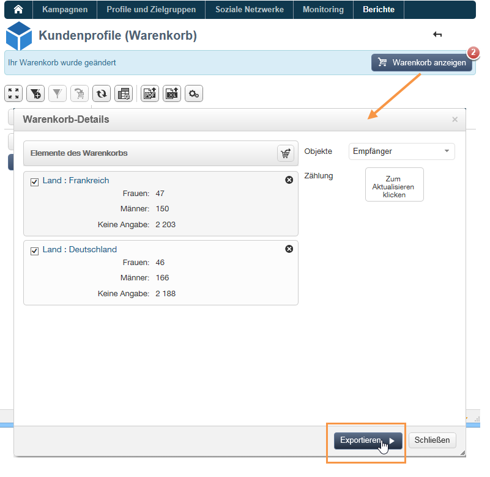

# Cubes zur Datenanalyse verwenden{#using-cubes-to-explore-data}

Marketing Analytics ermöglicht es, auf vereinfachte Weise Berichte zu erstellen und Daten aus der Datenbank mithilfe von Cubes zu identifizieren und auszuwählen. Folgende Möglichkeiten stehen zur Verfügung:

* Erstellung von Cube-basierten Berichten. Der Prozess wird hier detailliert beschrieben: [Daten eines Berichts analysieren](#exploring-the-data-in-a-report).
* Abruf von Daten der Datenbank und Gruppierung in Listen, um beispielsweise Ziele und Sendungen zu identifizieren und zu erstellen. Weitere Informationen finden Sie unter [Zielpopulation erstellen](#building-a-target-population).
* Fügen Sie eine Pivot-Tabelle in einen Bericht ein und verweisen Sie auf einen darin vorhandenen Cube. Weitere Informationen finden Sie unter [Pivot-Tabellen in Berichte einfügen](#inserting-a-pivot-table-into-a-report).

>[!NOTE]
>
>Marketing Analytics ist erforderlich, um Cubes zu erstellen oder zu ändern. Weitere Informationen finden Sie unter [Über Cubes](../../reporting/using/about-cubes.md).

## Daten eines Berichts analysieren {#exploring-the-data-in-a-report}

### 1. Schritt - Erstellung eines Cube-basierten Berichts {#step-1---creating-a-report-based-on-a-cube}

Klicken Sie auf die Schaltfläche **[!UICONTROL Erstellen]** der **[!UICONTROL Berichte]**-Rubrik und wählen Sie den zu verwendenden Cube.

Der Prozess wird hier detailliert beschrieben: [Cube-basierten Bericht erstellen](../../reporting/using/creating-indicators.md#creating-a-report-based-on-a-cube).

### 2. Schritt - Auswahl der Zeilen und Spalten {#step-2---selecting-lines-and-columns}

Die Standardanzeige beinhaltet die ersten beiden Dimensionen des Cubes (in unserem Beispiel: Alter und Stadt).

Über die oberhalb der jeweiligen Achse gelegenen **[!UICONTROL Hinzufügen]**-Schaltflächen können weitere Dimensionen hinzugefügt werden.

1. Um eine Dimension hinzuzufügen, klicken Sie auf die Schaltfläche Hinzufügen der betreffenden Zeile oder Spalte.
1. Wählen Sie die der Tabelle hinzuzufügende Dimension aus den verfügbaren Dimensionen aus:

   

1. Legen Sie die Parameter dieser Dimension fest.

   

   Die Parameter hängen vom Datentyp und der gewählten Dimension ab.

   Beispielsweise können für Daten mehrere Ebenen verfügbar sein. Weitere Informationen finden Sie unter [Kennzahlen anzeigen](../../reporting/using/concepts-and-methodology.md#displaying-measures).

   Folgende Optionen stehen zur Verfügung:

   

   Sie können

   * die Daten beim Laden auszuklappen: Die Werte werden bei Aktivierung dieser Option bei jeder Aktualisierung des Berichts angezeigt (Standardwert: Nein);
   * das Ergebnis am Zeilenende anzuzeigen: Für in Spalten angezeigte Daten wird eine zusätzliche Option angeboten, um das Gesamtergebnis am Ende der Zeile anzuzeigen. In diesem Fall wird der Tabelle eine zusätzliche Spalte hinzugefügt (Standardwert: Ja);
   * die Daten zu sortieren: Die Spaltenwerte können nach Wert, Titel oder Kennzahl sortiert werden (Standardwert: Nach Wert);
   * die Werte absteigend (A-Z, 0-9) oder aufsteigend (Z-A, 9-0) anzuzeigen;
   * die Anzahl der beim Laden anzuzeigenden Spalten ändern (Standardwert: 200).

1. Klicken Sie zur Bestätigung auf **[!UICONTROL OK]**: Die Dimension wird den existierenden Dimensionen hinzugefügt.

   Das gelbe Banner oberhalb der Tabelle zeigt an, dass Sie Änderungen vorgenommen haben. Klicken Sie auf die Schaltfläche **[!UICONTROL Speichern]**, wenn diese berücksichtigt werden sollen.

   

### 3. Schritt - Konfiguration der anzuzeigenden Kennzahlen {#step-3---configuring-the-measures-to-display}

Geben Sie nach der Positionierung der Zeilen und Spalten die anzuzeigenden Kennzahlen sowie ihren Anzeigemodus an.

Standardmäßig wird nur eine Kennzahl angezeigt. Um Kennzahlen hinzuzufügen oder zu konfigurieren, gehen Sie wie folgt vor:

1. Klicken Sie auf die Schaltfläche **[!UICONTROL Kennzahlen]**.

   

1. Über die Schaltfläche **[!UICONTROL Kennzahl benutzen]** können existierende Kennzahlen ausgewählt werden.

   

   Wählen Sie die Informationen aus, die Sie anzeigen möchten, und geben Sie den zu verwendenden Formatierungstyp an. Die Liste der Optionen hängt vom konfigurierten Kennzahlentyp ab.

   

   Eine übergreifende Konfiguration der Kennzahlen ist über das Symbol **[!UICONTROL Konfiguration der Pivot-Tabelle bearbeiten]** möglich.

   

   Sie können insbesondere bestimmen, ob die Titel der Kennzahlen angezeigt werden sollen. Weitere Informationen finden Sie unter [Anzeige konfigurieren](../../reporting/using/concepts-and-methodology.md#configuring-the-display).

1. Sie können neue Kennzahlen auf Basis von bereits existierenden erstellen. Klicken Sie hierzu auf die Schaltfläche **[!UICONTROL Kennzahl erstellen]** und geben Sie ihre Konfiguration an.

   

   Folgende Kennzahltypen sind möglich:

   * Kombination von Kennzahlen: ermöglicht die Erstellung der neuen Kennzahl auf Basis von existierenden Kennzahlen.

      Für diese Kennzahlen stehen folgende Funktionen zur Verfügung: Summe, Differenz, Produkt und Rate.

   * Anteil: ermöglicht die Berechnung der Anzahl an für eine gegebene Dimension gemessenen Datensätzen. Der Anteil kann in Bezug auf eine Dimension oder eine Unter-Dimension berechnet werden.
   * Abweichung: ermöglicht die Berechnung der Abweichungen der Werte einer Ebene.
   * Abweichung vom Durchschnitt: ermöglicht die Berechnung der Abweichungen in jeder Gruppe von entsprechenden Zellen in Bezug auf den Wertedurschnitt. Sie können zum Beispiel die jeweilige Einkaufsmenge der existierenden Segmente vergleichen.

   Die erstellte Kennzahl wird dem Bericht hinzugefügt.

   

   Nach der Erstellung können Sie die Kennzahl bearbeiten und bei Bedarf ihre Konfiguration ändern. Klicken Sie hierzu auf die Schaltfläche **[!UICONTROL Kennzahlen]** und dann auf den Tab der zu bearbeitenden Kennzahl.

   Klicken Sie anschließend auf die Schaltfläche **[!UICONTROL Dynamische Kennzahl bearbeiten]**, um auf die Einstellungen zuzugreifen.

## Zielpopulation erstellen {#building-a-target-population}

Die basierend auf Cubes erstellten Berichte ermöglichen den Abruf von Daten aus der Datenbank und deren Speicherung in einer Liste.

Hierzu können Sie diese einem Warenkorb hinzufügen, dessen Inhalt anschließend exportiert wird.

Gehen Sie wie folgt vor, um eine Population in einer Liste zusammenzufassen:

1. Markieren Sie durch Klick die Zellen, die die abzurufenden Populationen enthalten, und klicken Sie auf das Symbol **[!UICONTROL Zum Warenkorb hinzufügen]**.

   

   Wiederholen Sie diesen Vorgang so oft wie nötig, um die unterschiedlichen Profile zu sammeln.

1. Klicken Sie auf die Schaltfläche **[!UICONTROL Warenkorb anzeigen]**, um den Inhalt einzusehen, bevor er exportiert wird.

   

1. Die Schaltfläche **[!UICONTROL Exportieren]** ermöglicht die Zusammenfassung der Elemente des Warenkorbs in einer Liste.

   Geben Sie den Namen der Liste und den Exporttyp an.

   

   Klicken Sie auf **[!UICONTROL Starten]**, um mit dem Export zu beginnen.

1. Nach Abschluss des Exports bestätigt eine Nachricht seine korrekte Ausführung und die Anzahl der verarbeiteten Datensätze.

   

   Sie können den Inhalt des Warenkorbs beibehalten oder löschen.

   Die entsprechende Liste ist über die Rubrik **[!UICONTROL Profile und Zielgruppen]** zugänglich.

   

## Pivot-Tabellen in Berichte einfügen {#inserting-a-pivot-table-into-a-report}

Gehen Sie wie folgt vor:

1. Erstellen Sie einen neuen Bericht mit einer Seite und fügen Sie eine Pivot-Tabelle ein. Weiterführende Informationen hierzu finden Sie auf dieser [Seite](../../reporting/using/creating-a-table.md#creating-a-breakdown-or-pivot-table).

   

1. Im Tab **[!UICONTROL Daten]** haben Sie die Möglichkeit, einen existierenden Cube auszuwählen. Auf diese Weise werden automatisch die Dimensionen und Kennzahlen angezeigt, die zuvor konfiguriert wurden.

   

   Auf diese Weise können Sie den anzuzeigenden Bericht erstellen. Weitere Informationen finden Sie unter [2. Schritt - Auswahl der Zeilen und Spalten](#step-2---selecting-lines-and-columns).

