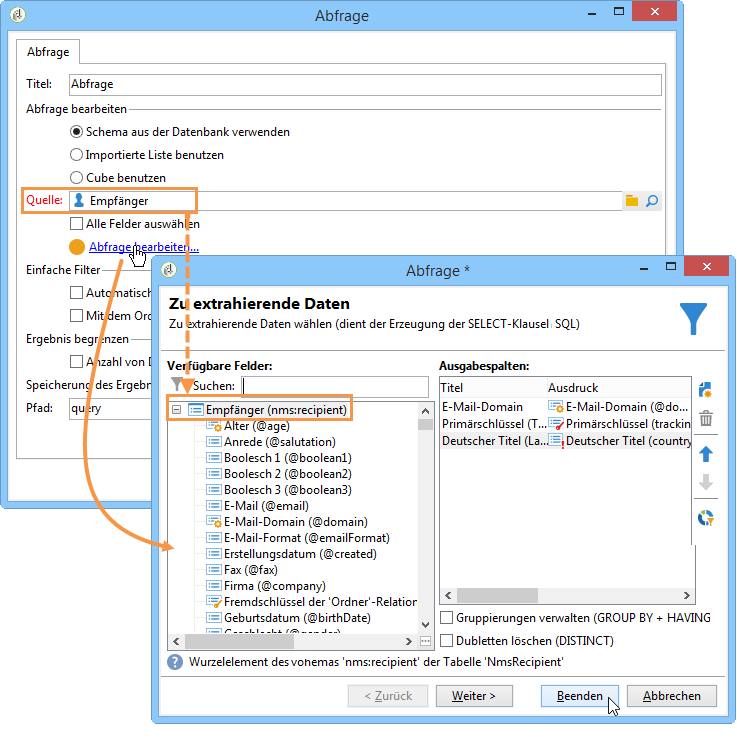

# Kontext verwenden{#using-the-context}

Wenn Sie Daten in Form von **[!UICONTROL Tabellen]** oder **[!UICONTROL Diagrammen]** darstellen möchten, können sie aus zwei Quellen stammen: einer neuen Abfrage (siehe [Direkten Datenfilter definieren](#defining-a-direct-filter-on-data)) oder dem Berichtskontext (siehe [Kontextdaten verwenden](#using-context-data)).

## Direkten Datenfilter definieren {#defining-a-direct-filter-on-data}

### Datenfilter {#filtering-data}

Die Nutzung einer Aktivität vom Typ **[!UICONTROL Abfrage]** bei der Erstellung eines Berichts ist nicht obligatorisch. Die Daten können alternativ direkt in den Tabellen und Grafiken des Berichts gefiltert werden.

Wählen Sie in diesem Fall die im Bericht anzuzeigenden Daten direkt in der **[!UICONTROL Seite]**-Aktivität des Berichts aus.

Klicken Sie hierzu auf den im Tab **[!UICONTROL Daten]** verfügbaren Link **[!UICONTROL Daten filtern...]** aus: Dieser Link ermöglicht den Zugriff auf den Ausdruck-Editor, um eine Abfrage über die zu analysierenden Daten zu definieren.

### Beispiel: Filter in einer Grafik {#example--use-a-filter-in-a-chart}

Im folgenden Beispiel soll die Grafik nur die Profile der Empfänger anzeigen, die in Deutschland leben und im laufenden Jahr Einkäufe getätigt haben.

Um diesen Filter zu definieren, positionieren Sie eine Seite im Bericht-Diagramm und öffnen Sie die Aktivität. Klicken Sie auf den Link **[!UICONTROL Daten filtern...]** und erstellen Sie den gewünschten Filter. Mehr Informationen über die Erstellung von Abfragen in Adobe Campaign erhalten Sie in [diesem Abschnitt](../../platform/using/about-queries-in-campaign.md).

In unserem Beispiel wird die Verteilung der der Abfrage entsprechenden Empfänger nach Ort angezeigt.

Die Grafik stellt sich folgendermaßen dar:

### Beispiel: Filter in einer Pivot-Tabelle {#example--use-a-filter-in-a-pivot-table}

In diesem Beispiel sollen Firmen, die nicht Adobe sind, in einer Pivot-Tabelle ohne vorangehende Abfrage gefiltert werden.

Gehen Sie wie folgt vor:

1. Positionieren Sie eine Seite im Diagramm und öffnen Sie sie.
1. Erstellen Sie eine Pivot-Tabelle.
1. Wählen Sie im Tab **[!UICONTROL Daten]** den zu verwendenden Cube aus.
1. Klicken Sie auf den Link **[!UICONTROL Daten filtern...]** und definieren Sie die folgende Abfrage, um Adobe aus der Liste der Firmen zu entfernen.

   

Somit werden nur die den Filterbedingungen entsprechenden Empfänger im Bericht berücksichtigt.

## Kontextdaten verwenden {#using-context-data}

Die im Bericht anzuzeigenden Daten können aus dem Berichtkontext stammen und in Form von **[!UICONTROL Tabellen]** oder **[!UICONTROL Grafiken]** dargestellt werden.

Im Tab **[!UICONTROL Daten]** der die Grafik oder die Tabelle enthaltenden Seite kann die Datenquelle ausgewählt werden.

* Mit der Option **[!UICONTROL Neue Abfrage]** können Sie eine Abfrage zur Datenerfassung erstellen. Weitere Informationen hierzu finden Sie unter [Direkten Datenfilter definieren](#defining-a-direct-filter-on-data).
* Die Option **[!UICONTROL Kontextdaten]** ermöglicht die Verwendung der Eingangsdaten: Der Kontext des Berichts entspricht den Informationen, die von der eingehenden Transition der die Grafik oder die Tabelle enthaltenen Seite übertragen werden. Dieser Kontext kann beispielsweise Daten enthalten, die über die vor der Aktivität **[!UICONTROL Seite]** positionierte Aktivität **[!UICONTROL Abfrage]** abgerufen werden. In dieser Aktivität werden zudem die Tabelle und die Felder angegeben, auf die sich der Bericht beziehen soll.

Erstellen Sie in einer Abfrage-Aktivität zum Beispiel folgende Abfrage über die Empfänger:

Geben Sie anschließend die Quelle der Daten Ihres Berichts im Feld **[!UICONTROL Kontextdaten]** an.

Die Platzierung der Daten wird automatisch abgeleitet. Bei Bedarf können Sie den Pfad der Daten forcieren.

Bei der Wahl der Daten, auf die sich die Statistiken beziehen sollen, entsprechen die verfügbaren Felder den in der Abfrage angegebenen Daten.

