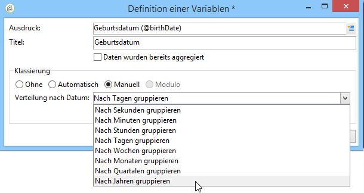

# Analyse-Assistenten (deskriptiv) verwenden{#using-the-descriptive-analysis-wizard}

Um einen deskriptiven Analysebericht zu erstellen, befolgen Sie die Schritte des dedizierten Assistenten. Seine Konfiguration hängt von den zu analysierenden Daten sowie der gewünschten Darstellung ab.

## Daten in der Datenbank analysieren {#analyzing-data-in-the-database}

Der Deskriptive-Analyse-Assistent kann über das Menü **[!UICONTROL Werkzeuge > Deskriptive Analyse]** gestartet werden: In diesem Fall bezieht sich die Analyse standardmäßig auf die Empfängertabelle (**nms:recipient**). Die Gesamtheit der Daten in Adobe Campaign dient als Basis.

Wenn Sie eine andere Tabelle analysieren möchten, klicken Sie auf den Link **Erweiterte Parameter...****[!UICONTROL ... im ersten Schritt des Assistenten und wählen Sie die Ihrer Konfiguration entsprechende Tabelle aus, in unserem Beispiel]** nms:visitor **:**

Wenn die Statistiken sich nur auf einen Teil Ihrer Daten beziehen sollen, können Sie wie in unten stehender Abbildung durch Klick auf den Link **[!UICONTROL Erweiterte Parameter...]** Datenfilter definieren:

Die Analyse bezieht sich nur auf Empfänger der Datenbank, die mindestens 16 Jahre alt sind und in Berlin wohnen.

## Datensatz analysieren {#analyzing-a-set-of-data}

Der Assistent der deskriptiven Analyse kann in verschiedenen anderen Kontexten verwendet werden, z. B. bezogen auf Listen, Workflow-Transitionen, Sendungen oder auf eine Auswahl an Empfängern.

Er ist über diverse Knoten des Navigationsbaums zugänglich, die auf die Empfängertabelle zeigen.

Dort kann er über einen Rechtsklick auf die jeweilige Auswahl gestartet werden. In diesem Fall werden nur die Daten der Auswahl analysiert.

* Um eine Gruppe von **Empfängern** zu analysieren, markieren Sie diese und öffnen Sie per Rechtsklick das Kontextmenü. Wählen Sie **[!UICONTROL Aktionen > Analysieren...]** wie im oben stehenden Beispiel. Wenn auf die Empfängerliste ein Filter angewendet wurde, wird nur der gefilterte Inhalt analysiert.

   Mit der Tastenkombination STRG+A können alle Empfänger des Ordners oder des aktuellen Filters ausgewählt werden. Hierbei werden auch die nicht auf dem Bildschirm sichtbaren Empfänger ausgewählt.

   Der Abschnitt [Qualitative Datenanalyse](../../reporting/using/use-cases.md#qualitative-data-analysis) enthält ein Beispiel einer deskriptiven Analyse der Empfänger.

* Platzieren Sie im Kontext eines **Workflows** den Cursor auf eine Transition, die auf die Empfängertabelle zeigt, klicken Sie mit der rechten Maustaste und wählen Sie **[!UICONTROL Zielgruppe analysieren]** aus. Weitere Informationen hierzu finden Sie im Beispiel unter [Analyse der Zielgruppe einer Workflow-Transition](../../reporting/using/use-cases.md#analyzing-a-transition-target-in-a-workflow).
* Um **Listen** zu analysieren, wählen Sie eine oder mehrere aus und befolgen Sie die gleiche Vorgehensweise wie bei der Empfängeranalyse.
* Im Kontext eines **Versands** können Sie die Zielgruppen einer oder mehrerer Sendungen analysieren, indem Sie die jeweiligen Sendungen markieren und dann per Rechtsklick **[!UICONTROL Aktionen > Analysieren...]** im Kontextmenü auswählen, wie im folgenden Beispiel:

   

   Beispiele für deskriptive Analysen für Sendungen finden Sie unter [Populationen analysieren](../../reporting/using/use-cases.md#analyzing-a-population) und unter [Analyse der Empfänger-Trackinglogs](../../reporting/using/use-cases.md#analyzing-recipient-tracking-logs).

## Vorlage &quot;Qualitative Verteilung&quot; konfigurieren {#configuring-the-qualitative-distribution-template}

Die Vorlage **[!UICONTROL Qualitative Verteilung]** ermöglicht Statistiken über alle Datentypen (Firmenname, E-Mail-Domain etc.).

Die Konfigurationsoptionen, die für einen Bericht verfügbar sind, der über die Vorlage für die **[!UICONTROL Qualitative Verteilung]** erstellt wird, werden unter [Datenanzeige in der Tabelle](#displaying-data-in-the-table) beschrieben. Ein vollständiges Beispiel wird in [Populationen analysieren](../../reporting/using/use-cases.md#analyzing-a-population) beschrieben.

Folgende Optionen stehen, abhängig von den gewählten Parametern, bei Nutzung der qualitativen Datenanalyse zur Verfügung:

### Daten klassieren {#data-binning}

Die ausgewählten Variablen können klassiert, d. h. nach bestimmten Kriterien in Klassen eingeteilt werden.

>[!NOTE]
>
>Wenn das Feld, auf das sich die Berechnungen beziehen, mittels eines Aggregats berechnet wird, kreuzen Sie die Option **[!UICONTROL Daten wurden bereits aggregiert]** an, um die Leistungsfähigkeit des Systems zu verbessern.

Die vorgeschlagenen Optionen können abhängig vom Inhalt dieses Felds variieren:

* **[!UICONTROL Ohne]**: Alle für die Variable verfügbaren Werte werden ohne Klassierung angezeigt.

   >[!CAUTION]
   >
   >Diese Option sollte mit Vorsicht angewandt werden, da sie Leistung und Lesbarkeit des Berichts stark beeinträchtigen kann.

* **[!UICONTROL Automatisch]**: Die n am meisten vertretenen Werte werden angezeigt. Sie werden automatisch berechnet und bilden in Abhängigkeit von der angegebenen Klassenanzahl einen bestimmten Prozentsatz der gewünschten Variablen ab. Wenn es sich um numerische Werte handelt, verteilt Adobe Campaign die Daten automatisch in n Klassen.
* **[!UICONTROL Manuell]**: Diese Option funktioniert wie die Option **[!UICONTROL Automatisch]**, mit dem Unterschied, dass die Werte benutzerdefiniert werden können. Klicken Sie hierzu auf die rechts von der Wertetabelle gelegene Schaltfläche **[!UICONTROL Hinzufügen]**.

   Die Werte können vor der Benutzerdefinierung automatisch von Adobe Campaign initialisiert werden: Geben Sie hierzu die Anzahl an zu erzeugenden Klassen an und klicken Sie auf den Link **[!UICONTROL Initialiseren mit]**, wie im nachstehenden Beispiel:

   

   Passen Sie anschließend den Inhalt nach Bedarf an:

   

   Je nach gewünschtem Präzisionsniveau können die Felder, die die Daten enthalten, nach Stunde, Tag, Monat, Jahr etc. gruppiert werden.

   

* **[!UICONTROL Modulo]**: Erstellt bei numerischen Variablen Wertegruppen mit einem Intervall, dessen Größe im gleichnamigen Feld bezeichnet wird. Ein Modulo mit einem Wert von 10 erlaubt beispielsweise die Erstellung eines Intervalls von 10.

   

   Im unten stehenden Beispiel wird die Verteilung der Empfänger nach Altersgruppen dargestellt.

   

### Datenanzeige in der Tabelle {#displaying-data-in-the-table}

Über die Symbolleiste kann die Anzeige der Variablen in der Tabelle angepasst werden: Spalten löschen, Daten in Zeilen statt in Spalten anzeigen, Reihenfolge der Daten ändern, Werteberechnung einsehen oder ändern.

Im oberen Bereich des Fensters wird die Anzeige konfiguriert.

Sie können den Namen der Statistiken und Zwischensummen anzeigen oder ausblenden und die Orientierung der Statistiken wählen. Weitere Informationen finden Sie unter [Anzeigeparameter des Analyseberichts](../../reporting/using/processing-a-report.md#analysis-report-display-settings).

### Datenanzeige in der Grafik {#displaying-data-in-the-chart}

Im ersten Schritt des Analyse-Assistenten können Sie angeben, die Daten nur in grafischer Form und nicht in tabellarischer anzeigen zu lassen. In diesem Fall werden die Variablen im Zuge der Grafikkonfiguration ausgewählt. Wählen Sie zunächst die Anzahl der anzuzeigenden Variablen sowie die betroffenen Datenbankfelder aus.

Geben Sie dann den gewünschten Grafiktyp an.

>[!NOTE]
>
>Sie können die Variablen sowohl in grafischer als auch in tabellarischer Form anzeigen lassen. Geben Sie in diesem Fall die Variablen im Fenster **[!UICONTROL Tabellenkonfiguration]** an. Klicken Sie dann auf **[!UICONTROL Weiter]** und wählen Sie den gewünschten Grafiktyp im Grafikkonfigurations-Fenster aus. In der Tabelle definierte Unterdimensionen werden nicht in der Grafik angezeigt.

Klicken Sie auf den Link **[!UICONTROL Grafikparameter...]**, um die Eigenschaften der Grafik zu ändern.

Die zur Verfügung stehenden Optionen hängen vom gewählten Grafiktyp ab. Mehr Informationen erhalten Sie auf [dieser Seite](../../reporting/using/creating-a-chart.md#chart-types-and-variants).

### Statistikberechnung {#statistics-calculation}

Mithilfe des Analyse-Assistenten können unterschiedliche Statistiktypen berechnet werden. Standardmäßig ist eine einfache Zählung konfiguriert.

Klicken Sie auf die Schaltfläche **[!UICONTROL Hinzufügen]**, um eine neue Statistik zu erstellen.

Folgende Funktionen stehen zur Auswahl:

* **[!UICONTROL Einfache Zählung]**: zählt alle Werte ungleich null des zu aggregierenden Felds, auch doppelte Werte (des aggregierten Felds);
* **[!UICONTROL Durchschnitt]**: berechnet den Durchschnitt der Werte eines numerischen Felds;
* **[!UICONTROL Minimum]**: berechnet das Minimum der Werte eines numerischen Felds;
* **[!UICONTROL Maximum]**: berechnet das Maximum der Werte eines numerischen Felds;
* **[!UICONTROL Summe]**: berechnet die Summe der Werte eines numerischen Felds;
* **[!UICONTROL Standardabweichung]**: berechnet die Streuung der zurückgegebenen Werte um den Durchschnitt;
* **[!UICONTROL Verteilung in Prozent in Zeilen]**: berechnet das Verhältnis zwischen Spalten- und Zeilenwert (nur für Tabellen verfügbar);
* **[!UICONTROL Verteilung in Prozent in Spalten]** berechnet das Verhältnis zwischen Zeilen- und Spaltenwert (nur für Tabellen verfügbar);
* **[!UICONTROL Verteilung in Prozent über die Gesamtheit]**: berechnet den von den Werten betroffenen Anteil der Gesamtheit der Empfänger;

   

* **[!UICONTROL Berechnetes Feld]**: ermöglicht die Erstellung einer benutzerdefinierten Funktion (nur für Tabellen verfügbar). Im Feld **[!UICONTROL Benutzerfunktion]** wird die auf die Daten anzuwendende Berechnung angegeben.

   Beispiel zur Berechnung des durchschnittlichen Einkaufsbetrags pro Kunde, nach Land und Herkunft:

   

   Um den oben stehenden Bericht zu realisieren, muss zunächst ein berechnetes Feld erstellt werden, in dem der durchschnittliche Einkaufsbetrag pro Kunde gespeichert wird.

   Gehen Sie dazu wie folgt vor:

   1. Berechnen Sie die Summe der Einkäufe.

      

   1. Diese Statistik soll nicht in der Tabelle angezeigt werden. Deaktivieren Sie also die Option **[!UICONTROL In der Tabelle anzeigen]** im Tab **[!UICONTROL Erweitert]**.

      

   1. Erstellen Sie eine neue Statistik vom Typ **[!UICONTROL Berechnetes Feld]** und erfassen Sie die folgende Formel im Feld **[!UICONTROL Benutzerfunktion]**: **@Einkäufe/@count**.

      

### Anzeige des Berichts {#displaying-the-report}

Im letzten Schritt des Assistenten wird der Bericht angezeigt, d. h. die zuvor konfigurierte Tabelle und/oder Grafik.

Wenn der Bericht eine Tabelle enthält, ist die Ergebniszelle der Berechnung eingefärbt. Die Intensität der Farbe ist umso stärker, je höher das Ergebnis ausfällt.

Die Darstellung der Ergebnisse kann angepasst werden. Klicken Sie hierzu mit der rechten Maustaste auf die betroffene Variable und wählen Sie den gewünschten Eintrag im Kontextmenü aus.

Wenn der Bericht eine Grafik enthält, können die angezeigten Informationen mithilfe der Legendentitel gefiltert werden: Klicken Sie auf einen Titel, um die Anzeige der entsprechenden Daten zu deaktivieren. Bei erneutem Klick wird die Anzeige wieder aktiviert.

## Vorlage &quot;Quantitative Verteilung&quot; konfigurieren {#configuring-the-quantitative-distribution-template}

Um eine deskriptive Analyse eigenständig zu verwalten, kreuzen Sie die Option **Neue deskriptive Analyse basierend auf einer Vorlage** an, sofern sie nicht bereits standardmäßig ausgewählt ist.

Die Vorlage **[!UICONTROL Quantitative Verteilung]** ermöglicht Statistiken über Daten, die gemessen oder gezählt werden können (Rechnungsbetrag, Alter der Empfänger etc.).

Die Konfiguration von auf einer **[!UICONTROL quantitativen Verteilung]** basierenden Berichten wird in einem Umsetzungsbeispiel [Quantitative Datenanalyse](../../reporting/using/use-cases.md#quantitative-data-analysis) beschrieben.

Bei der Nutzung der quantitativen Datenanalyse stehen verschiedene Funktionen zur Verfügung, die im folgenden Beispiel beschrieben werden.

Zunächst muss eine Variable ausgewählt werden, auf die sich die Berechnungen beziehen:

Adobe Campaign bietet standardmäßig eine Reihe von Statistiken zur Analyse der ausgewählten Daten. Sie können die Liste bei Bedarf bearbeiten und Statistiken hinzufügen, verändern oder löschen.

Folgende Funktionen stehen zur Auswahl:

* **[!UICONTROL Einfache Zählung]**: zählt alle Werte ungleich null des zu aggregierenden Felds, auch doppelte Werte (des aggregierten Felds);
* **[!UICONTROL Durchschnitt]**: berechnet den Durchschnitt der Werte eines numerischen Felds;
* **[!UICONTROL Minimum]**: berechnet das Minimum der Werte eines numerischen Felds;
* **[!UICONTROL Maximum]**: berechnet das Maximum der Werte eines numerischen Felds;
* **[!UICONTROL Summe]**: berechnet die Summe der Werte eines numerischen Felds;
* **[!UICONTROL Standardabweichung]**: berechnet die Streuung der zurückgegebenen Werte um den Durchschnitt;
* **[!UICONTROL Anzahl fehlender Werte]**: berechnet die Anzahl der numerischen Felder, die keinen definierten Wert haben;
* **[!UICONTROL Dezil-Verteilung]**: verteilt die zurückgegebenen Werte eines numerischen Felds in 10 umfangsgleiche Teile;
* **[!UICONTROL Benutzerdefinierte Verteilung]**: verteilt die zurückgegebenen Werte entsprechend den vom Benutzer definierten Schwellen.

   Über die Schaltfläche **[!UICONTROL Detail]** kann eine Statistik geöffnet und bei Bedarf ihre Anzeige oder Berechnung angepasst werden:

   

   Die letzte Etappe des Assistenten zeigt den quantitativen Analysebericht an.

   

   Informationen zum Ändern des Berichts finden Sie unter [Berichtbearbeitung](../../reporting/using/processing-a-report.md).

