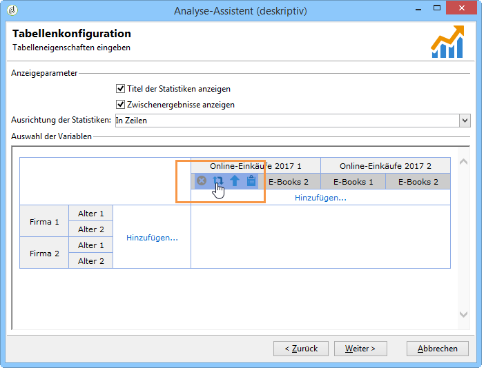

# Analyse-Assistenten (deskriptiv) verwenden{#using-the-descriptive-analysis-wizard}

Um einen deskriptiven Analysebericht zu erstellen, befolgen Sie die Schritte des dedizierten Assistenten. Seine Konfiguration hängt von den zu analysierenden Daten sowie der gewünschten Darstellung ab.

## Daten in der Datenbank analysieren {#analyzing-data-in-the-database}

Der Assistent für beschreibende Analysen kann über das **[!UICONTROL Tools > Descriptive analysis]** Menü gestartet werden: in diesem Fall betrifft die Analyse standardmäßig Empfänger (**nms:empfänger**). Sie gilt für alle Daten in der Adobe Campaign-Datenbank.

To analyze a table other than the standard recipients one (**nms:recipient**), click the **[!UICONTROL Advanced settings...]** link in the last stage of the wizard and select the table that matches your settings, in this case **cus:individual**:

If you want to produce statistics on part of the data, you can define a filter: to do this, click the **[!UICONTROL Advanced settings...]** link and define the filter to apply, as shown below:

Die Analyse bezieht sich nur auf Empfänger der Datenbank, die mindestens 16 Jahre alt sind und in Berlin wohnen.

## Datensatz analysieren {#analyzing-a-set-of-data}

Der Assistent der deskriptiven Analyse kann in verschiedenen anderen Kontexten verwendet werden, z. B. bezogen auf Listen, Workflow-Transitionen, Sendungen oder auf eine Auswahl an Empfängern.

Er ist über diverse Knoten des Navigationsbaums zugänglich, die auf die Empfängertabelle zeigen.

Dort kann er über einen Rechtsklick auf die jeweilige Auswahl gestartet werden. In diesem Fall werden nur die Daten der Auswahl analysiert.

* Wählen Sie für eine Gruppe von **Empfängern** die zu analysierenden Empfänger aus, klicken Sie mit der rechten Maustaste und wählen Sie **[!UICONTROL Actions > Explore...]**, wie oben gezeigt. Wenn ein Filter auf die Empfängerliste angewendet wird, wird nur der Inhalt analysiert.

   Mit der Tastenkombination STRG+A können alle Empfänger des Ordners oder des aktuellen Filters ausgewählt werden. Hierbei werden auch die nicht auf dem Bildschirm sichtbaren Empfänger ausgewählt.

   For an example of the descriptive analysis of recipients, refer to: [Qualitative data analysis](../../reporting/using/use-cases.md#qualitative-data-analysis).

* Platzieren Sie im Kontext eines **Workflows** den Cursor auf einem Übergang, der auf die Empfängertabelle zeigt, klicken Sie mit der rechten Maustaste und wählen Sie **[!UICONTROL Analyze target]**. Weitere Informationen dazu finden Sie im Beispiel zur [Analyse eines Übergangsstils in einem Workflow](../../reporting/using/use-cases.md#analyzing-a-transition-target-in-a-workflow).
* Um **Listen** zu analysieren, wählen Sie eine oder mehrere aus und befolgen Sie die gleiche Vorgehensweise wie bei der Empfängeranalyse.
* In the context of a **delivery**, select the deliveries whose target you want to analyze, right-click and select **[!UICONTROL Actions > Explore the target]**, as shown below:

   

   Beispiele für beschreibende Analysen für Lieferungen finden Sie hier: Population [analysieren](../../reporting/using/use-cases.md#analyzing-a-population) und hier: [Analysieren von Empfängerverfolgungsprotokollen](../../reporting/using/use-cases.md#analyzing-recipient-tracking-logs).

## Vorlage &quot;Qualitative Verteilung&quot; konfigurieren {#configuring-the-qualitative-distribution-template}

The **[!UICONTROL Qualitative distribution]** template lets you create statistics on all types of data (e.g. company name, email domain).

Die für einen Bericht verfügbaren Konfigurationsoptionen, der über die **[!UICONTROL Qualitative distribution]** Vorlage erstellt wurde, sind unter Daten [anzeigen in der Tabelle](#displaying-data-in-the-table)ausführlich beschrieben. Ein vollständiges Beispiel ist in [Analysieren einer Population](../../reporting/using/use-cases.md#analyzing-a-population)ausführlich beschrieben.

Folgende Optionen stehen, abhängig von den gewählten Parametern, bei Nutzung der qualitativen Datenanalyse zur Verfügung:

### Daten klassieren {#data-binning}

Die ausgewählten Variablen können klassiert, d. h. nach bestimmten Kriterien in Klassen eingeteilt werden.

>[!NOTE]
>
>When the field concerned by the calculation is computed using an aggregate, check **[!UICONTROL The data is already aggregated]** to improve performances.

Die vorgeschlagenen Optionen können abhängig vom Inhalt dieses Felds variieren:

* **[!UICONTROL None]** : Mit dieser Option können Sie alle für die Variable verfügbaren Werte anzeigen, ohne sie zu binden.

   >[!CAUTION]
   >
   >Diese Option sollte mit Vorsicht angewandt werden, da sie Leistung und Lesbarkeit des Berichts stark beeinträchtigen kann.

* **[!UICONTROL Auto]** : Mit dieser Option können Sie die am häufigsten dargestellten Werte anzeigen. Sie werden automatisch berechnet und stellen jeweils einen Prozentsatz der Variablen im Vergleich zur Anzahl der Ablagen dar. Für numerische Werte generiert Adobe Campaign automatisch n Klassen, in die die Daten sortiert werden.
* **[!UICONTROL Manual]** : Diese Option funktioniert wie die **[!UICONTROL Auto]** Option, allerdings können Sie diese Werte manuell einstellen. Klicken Sie dazu auf die **[!UICONTROL Add]** Schaltfläche rechts neben der Werttabelle.

   Values can be initialized automatically by Adobe Campaign before personalization: to do this, enter the number of bins you want to generate and click the **[!UICONTROL Initialize with]** link, as shown below:

   

   Passen Sie anschließend den Inhalt nach Bedarf an:

   

   Je nach gewünschtem Präzisionsniveau können die Felder, die die Daten enthalten, nach Stunde, Tag, Monat, Jahr etc. gruppiert werden.

   

* **[!UICONTROL Modulo]** : können Sie bei numerischen Werten Gruppen von Werten erstellen. Beispielsweise können Sie mit einem Modul mit dem Wert 10 ein Intervall von Werten erstellen, die sich um zehn ändern.

   

   Im unten stehenden Beispiel wird die Verteilung der Empfänger nach Altersgruppen dargestellt.

   

### Datenanzeige in der Tabelle {#displaying-data-in-the-table}

Über die Symbolleiste kann die Anzeige der Variablen in der Tabelle angepasst werden: Spalten löschen, Daten in Zeilen statt in Spalten anzeigen, Reihenfolge der Daten ändern, Werteberechnung einsehen oder ändern.

Im oberen Bereich des Fensters wird die Anzeige konfiguriert.

Sie können den Namen der Statistik und die Zwischensummen ein- oder ausblenden und die Ausrichtung der Statistik auswählen. Weitere Informationen finden Sie unter Anzeigeeinstellungen für [Analyseberichte](../../reporting/using/processing-a-report.md#analysis-report-display-settings).

### Datenanzeige in der Grafik {#displaying-data-in-the-chart}

Im ersten Schritt des Analyse-Assistenten können Sie angeben, die Daten nur in grafischer Form und nicht in tabellarischer anzeigen zu lassen. In diesem Fall werden die Variablen im Zuge der Grafikkonfiguration ausgewählt. Wählen Sie zunächst die Anzahl der anzuzeigenden Variablen sowie die betroffenen Datenbankfelder aus.

Geben Sie dann den gewünschten Grafiktyp an.

>[!NOTE]
>
>Sie können die Variablen gleichzeitig in einem Diagramm und einer Tabelle anzeigen. Geben Sie dazu die Variablen in das **[!UICONTROL Table configuration]** Fenster ein. Klicken Sie auf **[!UICONTROL Next]** und wählen Sie im Diagrammkonfigurationsfenster den Diagrammtyp aus. Wenn in der Tabelle Unterdimensionen definiert sind, werden sie nicht im Diagramm angezeigt.

Click the **[!UICONTROL Variants]** link to modify the chart properties.

Die zur Verfügung stehenden Optionen hängen vom gewählten Grafiktyp ab. Mehr Informationen erhalten Sie auf [dieser Seite](../../reporting/using/creating-a-chart.md#chart-types-and-variants).

### Statistikberechnung {#statistics-calculation}

Mithilfe des Analyse-Assistenten können unterschiedliche Statistiktypen berechnet werden. Standardmäßig ist eine einfache Zählung konfiguriert.

Click **[!UICONTROL Add]** to create a new statistic.

Folgende Funktionen stehen zur Auswahl:

* **[!UICONTROL Count]** zur Zählung aller nicht null-Werte des zu aggregierenden Felds, einschließlich doppelter Werte (des aggregierten Felds),
* **[!UICONTROL Average]** zur Berechnung des Durchschnitts der Werte in einem numerischen Feld,
* **[!UICONTROL Minimum]**: berechnet das Minimum der Werte eines numerischen Felds;
* **[!UICONTROL Maximum]**: berechnet das Maximum der Werte eines numerischen Felds;
* **[!UICONTROL Sum]** zur Berechnung der Summe der Werte in einem numerischen Feld,
* **[!UICONTROL Standard deviation]** zur Berechnung der Streuung der zurückgegebenen Werte um den Durchschnitt,
* **[!UICONTROL Row percentage distribution]** das Verhältnis des Werts in einer Spalte und des Werts in einer Zeile zu berechnen (nur für Tabellen verfügbar),
* **[!UICONTROL Column percentage distribution]** zur Berechnung des Verhältnisses des Werts in einer Zeile zum Wert in einer Spalte (nur für Tabellen verfügbar),
* **[!UICONTROL Total percentage distribution]** die Verteilung der von den Werten betroffenen Empfänger zu berechnen,

   

* **[!UICONTROL Calculated field]** , um einen personalisierten Operator zu erstellen (nur für Tabellen verfügbar). Im **[!UICONTROL User function]** Feld können Sie die Berechnung eingeben, die auf die Daten angewendet werden soll.

   Beispiel zur Berechnung des durchschnittlichen Einkaufsbetrags pro Kunde, nach Land und Herkunft:

   

   Um den oben stehenden Bericht zu realisieren, muss zunächst ein berechnetes Feld erstellt werden, in dem der durchschnittliche Einkaufsbetrag pro Kunde gespeichert wird.

   Gehen Sie dazu wie folgt vor:

   1. Berechnen Sie die Summe der Einkäufe.

      

   1. Diese Statistik wird nicht in der Tabelle angezeigt. Sie müssen die **[!UICONTROL Display in the table]** Option der **[!UICONTROL Advanced]** Registerkarte deaktivieren.

      

   1. Create a new **[!UICONTROL Calculated field]** type statistic and enter the following formula in the **[!UICONTROL User function]** field: **@purchases/@count**.

      

### Anzeige des Berichts {#displaying-the-report}

Im letzten Schritt des Assistenten wird der Bericht angezeigt, d. h. die zuvor konfigurierte Tabelle und/oder Grafik.

Wenn der Bericht eine Tabelle enthält, ist die Ergebniszelle der Berechnung eingefärbt. Die Intensität der Farbe ist umso stärker, je höher das Ergebnis ausfällt.

Die Darstellung der Ergebnisse kann angepasst werden. Klicken Sie hierzu mit der rechten Maustaste auf die betroffene Variable und wählen Sie den gewünschten Eintrag im Kontextmenü aus.

Wenn der Bericht eine Grafik enthält, können die angezeigten Informationen mithilfe der Legendentitel gefiltert werden: Klicken Sie auf einen Titel, um die Anzeige der entsprechenden Daten zu deaktivieren. Bei erneutem Klick wird die Anzeige wieder aktiviert.

## Vorlage &quot;Quantitative Verteilung&quot; konfigurieren {#configuring-the-quantitative-distribution-template}

Um eine deskriptive Analyse eigenständig zu verwalten, kreuzen Sie die Option **Neue deskriptive Analyse basierend auf einer Vorlage** an, sofern sie nicht bereits standardmäßig ausgewählt ist.

The **[!UICONTROL Quantitative distribution]** template that lets you generate statistics on data which can be measured or counted (e.g. invoice amount, age of recipients).

The configuration mode of an analysis report created via the **[!UICONTROL Quantitative distribution]** template is detailed in an implementation example [Quantitative data analysis](../../reporting/using/use-cases.md#quantitative-data-analysis).

Bei der Nutzung der quantitativen Datenanalyse stehen verschiedene Funktionen zur Verfügung, die im folgenden Beispiel beschrieben werden.

Zunächst muss eine Variable ausgewählt werden, auf die sich die Berechnungen beziehen:

Adobe Campaign bietet standardmäßig eine Reihe von Statistiken zur Analyse der ausgewählten Daten. Sie können die Liste bei Bedarf bearbeiten und Statistiken hinzufügen, verändern oder löschen.

Folgende Funktionen stehen zur Auswahl:

* **[!UICONTROL Count]** zur Zählung aller nicht null-Werte des zu aggregierenden Felds, einschließlich doppelter Werte (des aggregierten Felds),
* **[!UICONTROL Average]** zur Berechnung des Durchschnitts der Werte in einem numerischen Feld,
* **[!UICONTROL Minimum]**: berechnet das Minimum der Werte eines numerischen Felds;
* **[!UICONTROL Maximum]**: berechnet das Maximum der Werte eines numerischen Felds;
* **[!UICONTROL Sum]** zur Berechnung der Summe der Werte in einem numerischen Feld,
* **[!UICONTROL Standard deviation]** zur Berechnung, wie die zurückgegebenen Werte um den Durchschnitt verteilt werden.
* **[!UICONTROL Number of missing values]** , um die Anzahl der numerischen Felder ohne definierte Werte zu berechnen.
* **[!UICONTROL Decile distribution]** , um die zurückgegebenen Werte so zu verteilen, dass jeder 1/10 der Werte in einem numerischen Feld entspricht.
* **[!UICONTROL Custom distribution]** zum Verteilen der zurückgegebenen Werte basierend auf benutzerdefinierten Schwellenwerten.

   The **[!UICONTROL Detail...]** button lets you edit a statistic and, if needed, personalize its calculation or its display:

   

   Die letzte Etappe des Assistenten zeigt den quantitativen Analysebericht an.

   

   Informationen zum Ändern des Berichts finden Sie unter [Verarbeiten eines Berichts](../../reporting/using/processing-a-report.md).

