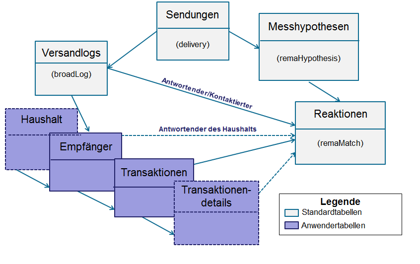
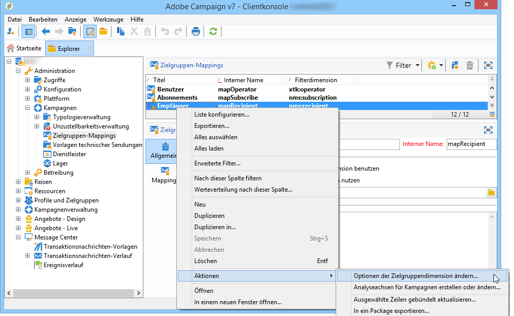
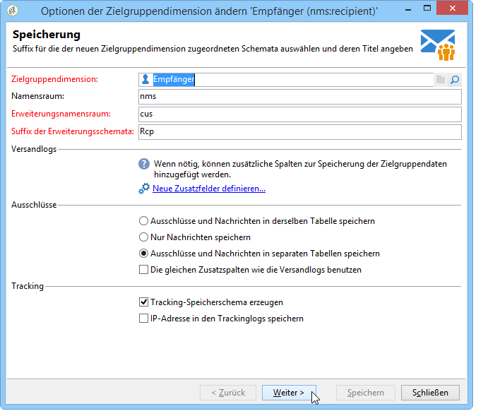
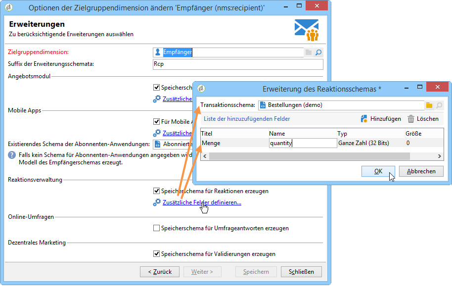

# Campaign Response Manager konfigurieren{#configuration}


Dieser Abschnitt richtet sich an Personen, die für die Konfiguration der Reaktionsverwaltung zuständig sind. Sie setzt ein gewisses Maß an Wissen über die Erweiterung von Schemata, die Definition von Workflows und die SQL-Programmierung voraus.

Auf diese Weise können Sie verstehen, wie Sie das Standarddatenmodell an die spezifische Natur einer Transaktionstabelle außerhalb von Adobe Campaign mit der Individuentabelle anpassen. Diese Individuentabelle kann mit der Individuentabelle in Adobe Campaign oder mit einer anderen Tabelle übereinstimmen

Die Messhypothese wird durch den Vorgangsprozess-Workflow ( **[!UICONTROL operationMgt]** ) gestartet. Jede Hypothese stellt einen separaten Prozess dar, der asynchron mit einem Ausführungsstatus ausgeführt wird (bearbeitet, ausstehend, beendet, fehlgeschlagen usw.) und wird von einer Planung gesteuert, die Prioritätsbeschränkungen, die Begrenzung der Anzahl der gleichzeitigen Prozesse, die Seite mit geringer Aktivität und die automatische Ausführung mit Häufigkeit verwaltet.

## Schemata konfigurieren {#configuring-schemas}

>[!CAUTION]
>
>Ändern Sie nicht die integrierten Schemata der Anwendung, sondern verwenden Sie den Schemaerweiterungs-Mechanismus. Andernfalls werden geänderte Schemata bei zukünftigen Aktualisierungen der Anwendung nicht aktualisiert. Dies kann bei der Verwendung von Adobe Campaign zu Funktionsstörungen führen.

Vor dem Einsatz des Reaktionsmoduls ist eine Anwendungsintegration erforderlich, um die verschiedenen zu messenden Tabellen (Transaktionen, Transaktionendetails) und ihre Beziehung mit Sendungen, Angeboten und Individuen zu definieren.

### Standardschemata {#standard-schemas}

Das vorkonfigurierte Schema **[!UICONTROL nms:remaMatch]** enthält die Reaktionslog-Tabelle, d. h. die Beziehung zwischen Personen, Hypothese und Transaktionstabelle. Dieses Schema wird als Vererbungsschema für die endgültige Zieltabelle der Reaktionslogs verwendet.

Das **[!UICONTROL nms:remaMatchRcp]**-Schema wird standardmäßig bereitgestellt und enthält die Speicherung von Reaktionslogs für Adobe Campaign-Empfänger ( **[!UICONTROL nms:recipient]** ). Damit sie verwendet werden kann, muss sie erweitert werden, um einer Transaktionstabelle (mit Käufen usw.) zugeordnet zu werden.

### Transaktionstabellen und -details {#transaction-tables-and-transaction-details}

Die Transaktionstabelle muss über eine direkte Relation mit den Individuen verfügen.

Sie können auch eine Tabelle mit Transaktionsdetails hinzufügen. Dies steht in keinem direkten Zusammenhang mit Einzelpersonen.

Wenn wir z.B. einen Wareneingang nehmen, ist eine Transaktionstabelle mit einem Kontakt (Wareneingangstabelle) verknüpft und eine Wareneingangspositionstabelle nur mit der Wareneingangstabelle (Detailtabelle). Anschließend können Sie die Hypothese direkt auf der Ebene konfigurieren, auf der die Zahlungsposition mit der Zahlungstabelle verknüpft ist.

>[!NOTE]
>
>Wenn Sie die Wareneingangskennung beibehalten möchten, die das erwartete Verhalten in den Hypothesen beschreibt, können Sie die Tabellenvorlage nms:remaMatchRcp erweitern, um ihr die Kennung hinzuzufügen (in diesem Fall ist keine ROI-Berechnung mit diesen Feldern verknüpft).

Es wird zudem dringend empfohlen, ein Ereignisdatum hinzuzufügen.

Das folgende Schema stellt die Relationen der unterschiedlichen Tabellen nach erfolgter Konfiguration dar:



### Reaktionsverwaltung und Empfänger {#response-management-with-adobe-campaign-recipients}

In diesem Beispiel wird unter Verwendung der in Adobe Campaign integrierten Empfängertabelle (nms) eine Tabelle mit Käufen in **[!UICONTROL Reaktionsverwaltungsmodul:recipient]**.

Die Tabelle mit Antwortprotokollen bei einem **[!UICONTROL nms:remaMatchRcp]**-Empfänger wird erweitert, um einen Link zum Kauftabellen-Schema hinzuzufügen. Im folgenden Beispiel wird die Kauftabelle als &quot;**&quot;:purchase**.

1. Gehen Sie im Adobe Campaign-Explorer in den Knoten **[!UICONTROL Administration]** > **[!UICONTROL Kampagnen]** > **[!UICONTROL Zielgruppen-Mappings]**.
1. Machen Sie einen Rechtsklick auf **Empfänger** und wählen Sie **[!UICONTROL Aktionen]** und **[!UICONTROL Optionen der Zielgruppendimension ändern...]** aus.

   

1. Passen Sie gegebenenfalls in dem sich öffnenden Fenster den **[!UICONTROL Erweiterungs-Namespace]** an und klicken Sie auf **[!UICONTROL Weiter]**.

   

1. Stellen Sie sicher, dass in der Kategorie **[!UICONTROL Reaktionsverwaltung]** die Option **[!UICONTROL Speicherschema für Reaktionen erzeugen]** aktiviert ist.

   Klicken Sie dann auf **[!UICONTROL Zusätzliche Felder definieren…]**, um die zugehörigen Transaktionstabellen auszuwählen und die gewünschten Felder zur Erweiterung des nms:remaMatchRcp-Schemas hinzuzufügen.

   

Folgendes Schema wird daraufhin erstellt:

```
<srcSchema _cs="Reactions (Recipients) (cus)" entitySchema="xtk:srcSchema" extendedSchema="nms:remaMatchRcp" 
img="nms:remaMatch.png" implements="xtk:persist" label="Reactions (Recipients)" mappingType="sql"
name="remaMatchRcp" namespace="cus">  
 <element label="Reactions (Recipients)" name="remaMatchRcp">    
  <key internal="true" name="match">      
   <keyfield xlink="hypothesis"/>      
   <keyfield xlink="broadLog"/>      
   <keyfield xlink="proposition"/>    
  </key>    
  <attribute label="Quantity" name="quantity" type="long"/>    
  <element name="purchase" target="demo:purchase" type="link"/>    
  <element name="hypothesis" revLabel="Reactions (Recipients)" revLink="remaMatchRcp"/>    
  <element applicableIf="HasPackage('nms:coreInteraction')" label="Proposition" name="proposition" target="nms:propositionRcp" type="link"/>   
  <element desc="Message (Delivery log)" label="Message" name="broadLog" target="nms:broadLogRcp" type="link"/>    
  <element label="Respondent" name="responder" target="nms:recipient" type="link"/>  
 </element>  
 <createdBy _cs="Administrator (admin)"/>  
 <modifiedBy _cs="Administrator (admin)"/>
</srcSchema>
```

### Reaktionsverwaltung mit einer benutzerdefinierten Empfängertabelle {#response-management-with-a-personalized-recipient-table}

In diesem Beispiel wird unter Verwendung einer Individuentabelle, also nicht der Adobe Campaign-Empfängertabelle, eine Tabelle mit Kaufdaten in die Reaktionsverwaltung integriert.

* Erstellen Sie ein neues Reaktionslog-Schema, das vom **[!UICONTROL nms:remaMatch]**-Schema abgeleitet ist.

  Da sich die Individuentabelle von der Empfängertabelle in Adobe Campaign unterscheidet, muss ein neues Schema der Antwortprotokolle basierend auf dem Schema **[!UICONTROL nms:remaMatch]** erstellt werden. Anschließend müssen die Relationen zu den Versandlogs und der die Bestelldaten enthaltenden Transaktionstabelle hinzugefügt werden.

  Im folgenden Beispiel verwenden wir das Schema **demo:broadLogPers** und die Transaktionstabelle **demo:purchase**:

  ```
  <srcSchema desc="Linking of a recipient transaction to a hypothesis"    
  img="nms:remaMatch.png" label="Responses on persons" labelSingular="Responses on a person" name="remaMatchPers" namespace="nms">
    <element name="remaMatchPers" template="nms:remaMatch">
      <key internal="true" name="match">
        <keyfield xlink="hypothesis"/>
       <keyfield xlink="purchase"/>
      </key>
  
      <element name="hypothesis" revLabel="Response logs for persons" revLink="remaMatchPers"/>
      <element applicableIf="HasPackage('nms:interaction')" label="Proposition" name="proposition"
               target="demo:propositionPers" type="link"/>
      <element label="Delivery log" name="broadLog" target="demo:broadLogPers" type="link"/>
    </element>
  </srcSchema>
  ```

* Ändern Sie das Hypothesenformular im **[!UICONTROL nms:remaHypothesis]**-Schema.

  Standardmäßig ist die Liste der Antwortprotokolle in den Empfängerprotokollen sichtbar. Sie müssen daher das Hypothesenformular ändern, um die im vorherigen Schritt erstellten neuen Antwortprotokolle anzeigen zu können.

  Beispiel:

  ```
   <container type="visibleGroup" visibleIf="[context/@remaMatchStorage]= 'demo:remaMatchPers'">
                <input hideEditButtons="true" img="nms:remaMatch.png" nolabel="true" refresh="true"
                 toolbarCaption="Responses generated by the hypothesis" type="linklist"
                 xpath="remaMatchPers">
            <input xpath="[.]"/>
            <input xpath="@controlGroup"/>
          </input>
     </container> 
  ```

## Indikatoren verwalten {#managing-indicators}

Das Modul Antwort-Manager enthält eine Liste vordefinierter Indikatoren. Sie können jedoch weitere personalisierte Messindikatoren hinzufügen.

Erweitern Sie hierzu die Hypothesentabelle, indem Sie zwei Felder für jeden neuen Indikator hinzufügen:

* das erste für die Zielpopulation,
* das zweite für die Kontrollgruppe.

Beispiel:

```
<srcSchema entitySchema="xtk:srcSchema" extendedSchema="nms:remaHypothesis" label="Measurement hypothesis" 
md5="1D4DED54FF8EC2432AED6736EDE6F547" name="remaHypothesis" namespace="demo" xtkschema="xtk:srcSchema">  
    <element name="remaHypothesis">    
        <element name="indicators">      
            <!-- Quantity -->      
            <attribute label="Total contacted" name="contactReactedTotalQuantity" type="long"/>
            <attribute label="Total number of people in the control group" name="proofReactedTotalquantity" type="long"/> 
        </element> 
    </element>
</srcSchema>
```
