# Erstellen von Hypothesen{#creating-hypotheses}

Es gibt folgende Möglichkeiten, Hypothesen einem Angebot oder einem Kampagnenversand zuzuordnen:

* über den Ordner **[!UICONTROL Messhypothesen]**: Erstellen Sie basierend auf einer Vorlage eine neue Hypothese und ordnen Sie sie einem bestehenden Versand zu;
* über den Tab **[!UICONTROL Bearbeiten]** > **[!UICONTROL Messung]** einer Kampagne;
* über die Option **[!UICONTROL Messung]** eines von einer Kampagne aus erstellten Versands.

Die Berechnung von Hypothesen erfolgt erst, wenn die entsprechende Marketing-Kampagne gestartet wurde und die Empfänger den Versand erhalten haben. Wenn die Hypothese einen Angebotsvorschlag betrifft, muss dieser bereits präsentiert worden und immer noch aktiv sein. Angebots- und Versandhypothesen werden über den Ordner **[!UICONTROL Messhypothesen]** erstellt und basieren auf einer Hypothesenvorlage. Sie haben des Weiteren die Möglichkeit, eine Hypothese direkt in einem Versand oder einer Kampagne zu referenzieren, bevor die Kampagne gestartet wird. In diesem Fall werden die Hypothesen automatisch nach dem Start der Marketing-Kampagne unter Berücksichtigung der Ausführungsparameter berechnet. [Weitere Informationen](hypothesis-templates.md#hypothesis-template-execution-settings)   

## Erstellen einer Hypothese direkt in einem Versand {#creating-a-hypothesis-on-the-fly-on-a-delivery}

Um eine Hypothese für einen bestehenden Versand zu erstellen, gehen Sie wie folgt vor:

>[!NOTE]
>
>Dieser Vorgang kann nur für Sendungen durchgeführt werden, die sich in Bearbeitung befinden.

1. Positionieren Sie sich im Knoten **[!UICONTROL Kampagnenverwaltung > Messhypothesen]** im Adobe-Campaign-Navigationsbaum.
1. Klicken Sie auf die Schaltlfäche **[!UICONTROL Neu]** oder machen Sie einen Rechtsklick in der Liste der Hypothesen und wählen Sie im Kontextmenü **[!UICONTROL Neu]** aus.

   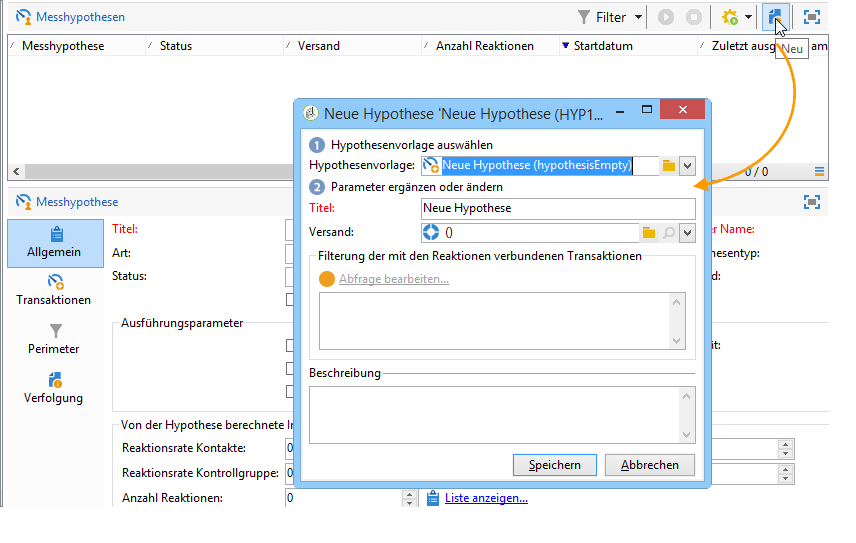

1. Wählen Sie im Hypothesenfenster eine zuvor erstellte Vorlage aus. [Weitere Informationen](hypothesis-templates.md)   

   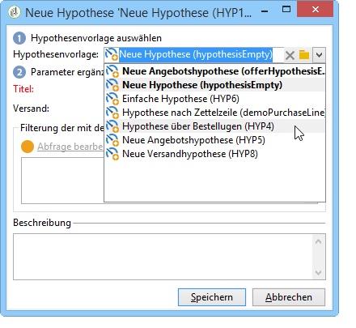

   Der in der ausgewählten Vorlage festgelegte Hypothesenkontext wird im Fenster angezeigt.

   >[!NOTE]
   >
   >Auch die in dieser Etappe nicht sichtbaren Parameter, die in der Vorlage bestimmt wurden, werden von der Hypothese übernommen.

   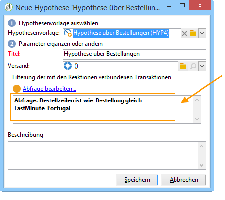

1. Wählen Sie den Versand aus, dem die Hypothese hinzugefügt werden soll.

   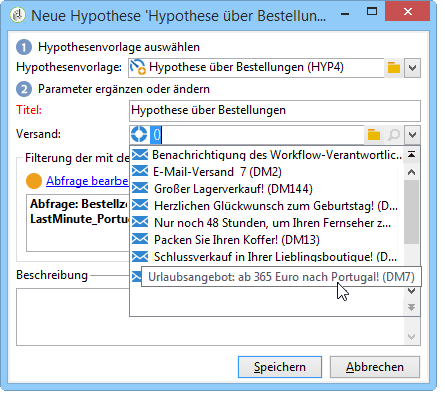

1. Sie können Ihre Hypothese personalisieren, indem Sie die Tabs **[!UICONTROL Allgemein]**, **[!UICONTROL Transaktionen]** und **[!UICONTROL Perimeter]** bearbeiten. [Weitere Informationen](hypothesis-templates.md#creating-a-hypothesis-model)   
1. Klicken Sie auf **[!UICONTROL Starten]**, um die Hypothesen auszuführen.

   Daraufhin wird automatisch ein Workflow erzeugt, der die Berechnung der Hypothese durchführt. Sein Titel wird ebenfalls automatisch bestimmt, entsprechend der Konfiguration der Hypothese.

   >[!CAUTION]
   >
   >Wenn Sie die Option **[!UICONTROL Ausführungs-Workflow beibehalten]** aktiviert haben, können Sie auf den Workflow zugreifen.\
   >Die Option sollte jedoch nur Debugging-Zwecken bei fehlerhaften Hypothesenausführungen aktiviert werden. Automatisch generierte Workflows werden im Ordner **[!UICONTROL Administration]** > **[!UICONTROL Betreibung]** > **[!UICONTROL Automatisch erstellte Objekte]** > **[!UICONTROL Kampagnen-Workflows]** des Adobe-Campaign-Explorers gespeichert.
   > 
   >Automatisch generierte Workflows sollten zudem nicht verändert werden. Jede dennoch vorgenommene Änderung wird nur für nachfolgende Berechnungen berücksichtigt.
   >
   >Denken Sie daran, den Workflow nach seiner Ausführung zu löschen, wenn Sie diese Option aktiviert haben.

   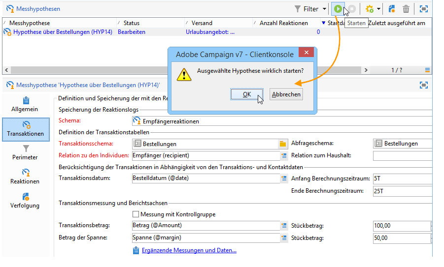

   Nach Abschluss der Berechnung werden die Messindikatoren automatisch aktualisiert.

   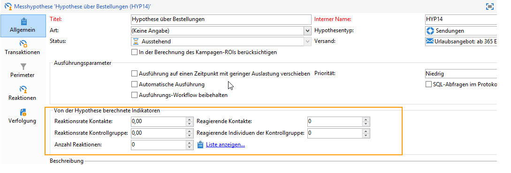

1. Ändern Sie bei Bedarf die Parameter und starten Sie die Hypothese erneut.

## Referenzieren einer Hypothese im Versand einer Kampagne {#referencing-a-hypothesis-in-a-campaign-delivery}

Sie haben die Möglichkeit, eine Hypothese in einer Marketing-Kampagne zu referenzieren, bevor diese gestartet wird. Die Hypothese wird in diesem Fall entsprechend den in der Hypothesenvorlage festgelegten Ausführungsparametern automatisch nach dem Versand gestartet. Um eine Hypothese in einem Versand zu erstellen, gehen Sie wie folgt vor:

1. Erstellen Sie je nach Bedarf eine oder mehrere Vorlagen vom Typ **[!UICONTROL Versand]** nach der in [diesem Abschnitt](hypothesis-templates.md#creating-a-hypothesis-model) beschriebenen Vorgehensweise.
1. Erstellen Sie Ihre Marketing-Kampagne und die entsprechenden Zielgruppen-Workflows.
1. Klicken Sie im Versandfenster auf das Symbol **[!UICONTROL Versandmessung]**.
1. Wählen Sie die Hypothesenvorlage aus. Die in der Vorlage konfigurierte Abfrage wird im Hypothesenfenster angezeigt.

   Die Hypothese wird automatisch entsprechend den in der Vorlage konfigurierten Daten berechnet, sobald die Kampagne abgeschlossen ist. [Weitere Informationen](hypothesis-templates.md#hypothesis-template-execution-settings)   

   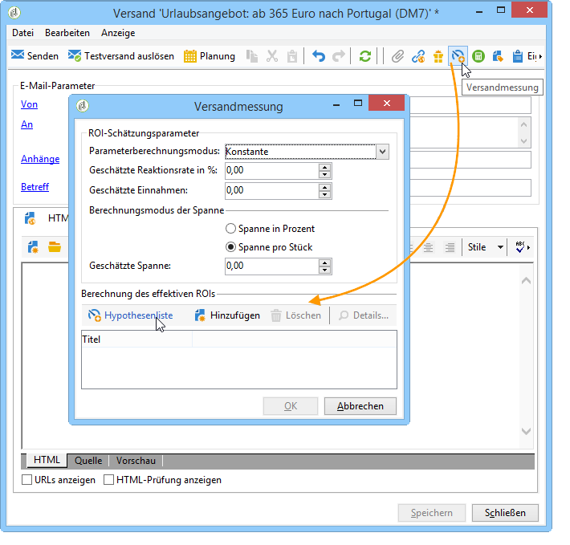

## Hinzufügen einer Standardhypothese zu Sendungen einer Kampagne {#adding-a-default-hypothesis-to-deliveries-for-a-campaign}

Sie haben die Möglichkeit, eine Hypothese auf Kampagnenebene zu referenzieren. Die Hypothese wird in diesem Fall allen in der jeweiligen Kampagne enthaltenen Sendungen zugeordnet. Gehen Sie hierzu wie folgt vor:

1. Klicken Sie auf den Tab **[!UICONTROL Bearbeiten]** der Kampagne.
1. Gehen Sie im Messungsbereich in den Tab **[!UICONTROL Standardhypothesen]**.

   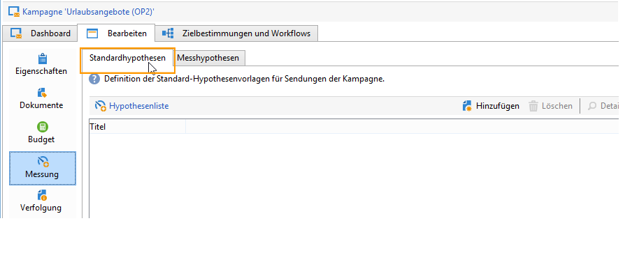

1. Klicken Sie auf **[!UICONTROL Hinzufügen]** und wählen Sie eine Hypothesenvorlage aus.

   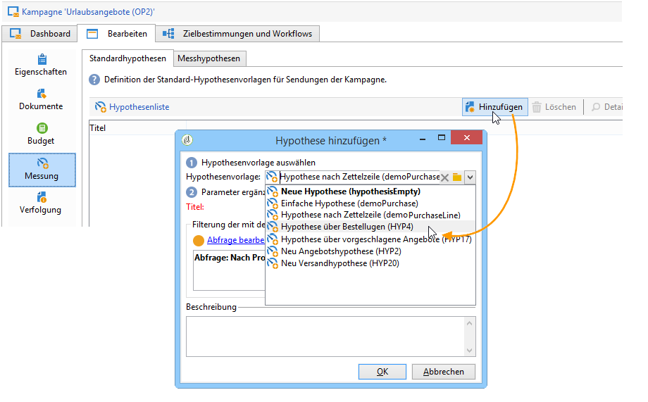

   Eine auf dieser Vorlage basierende Hypothese wird von nun an standardmäßig in jedem neuen Versand der Kampagne referenziert.

   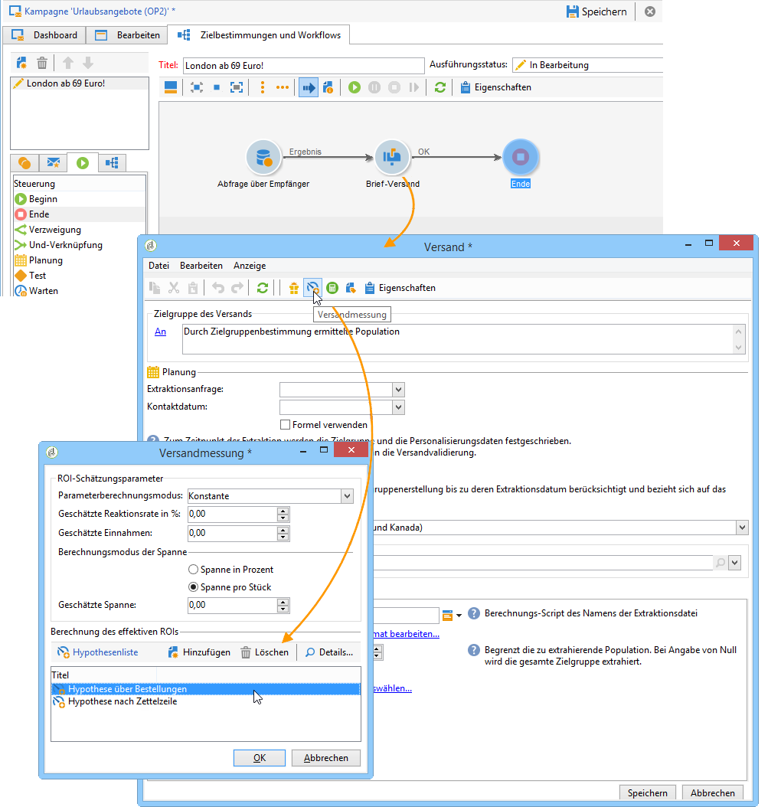

Sie können die Ergebnisse der Berechnung in den Registerkarten **[!UICONTROL Allgemein]** und **[!UICONTROL Reaktionen]** der Hypothese einsehen. [Weitere Informationen](hypothesis-tracking.md)   

Weitere Informationen finden Sie in [diesem Beispiel](#example--creating-a-hypothesis-linked-to-a-delivery).

## Erstellen einer Angebotshypothese {#creating-a-hypothesis-on-an-offer}

Angebotshypothesen werden auf ähnliche Weise erstellt wie solche, die direkt in einem Versand erstellt werden. Angebotshypothesen können ausgeführt werden, solange das zugehörige Angebot aktiv ist. Der Berechnungszeitraum basiert auf dem Datum des Angebotsvorschlags. Wenn die Hypothese es ermöglicht, einem Kauf einen Empfänger zuzuordnen, kann der Status des Angebotsvorschlags, der wahrscheinlich akzeptiert wird, automatisch geändert werden. [Weitere Informationen](hypothesis-templates.md#transactions)   

1. Erstellen Sie wie in [diesem Abschnitt](hypothesis-templates.md#creating-a-hypothesis-model) beschrieben eine oder mehrere Vorlagen vom Typ **[!UICONTROL Angebot]**.
1. Gehen Sie in den Knoten **[!UICONTROL Kampagnenverwaltung > Messhypothesen]**.
1. Erstellen Sie eine Hypothese vom Typ **[!UICONTROL Angebote]**, indem Sie die zuvor erstellte Vorlage auswählen.

   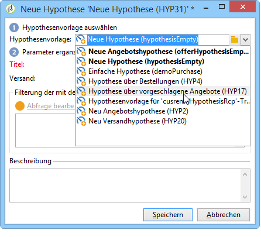

   Die in der Vorlage erstellte Abfrage erscheint im Fenster.

   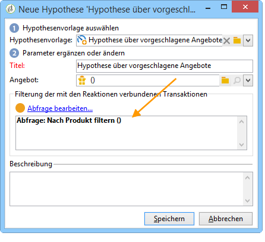

1. Wählen Sie ein Angebot aus, auf das sich die Hypothese beziehen soll.

   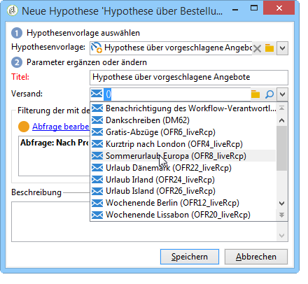

1. Schränken Sie die Abfrage bei Bedarf ein.
1. Klicken Sie auf **[!UICONTROL Starten]**, um die Hypothese auszuführen.
1. Die Ergebnisse der Hypothese können in ihren Tabs **[!UICONTROL Allgemein]** und **[!UICONTROL Reaktionen]** eingesehen werden. [Weitere Informationen](hypothesis-tracking.md)   

   Ausgeführte Hypothesen werden im Tab **[!UICONTROL Messung]** des jeweiligen Angebots referenziert.

   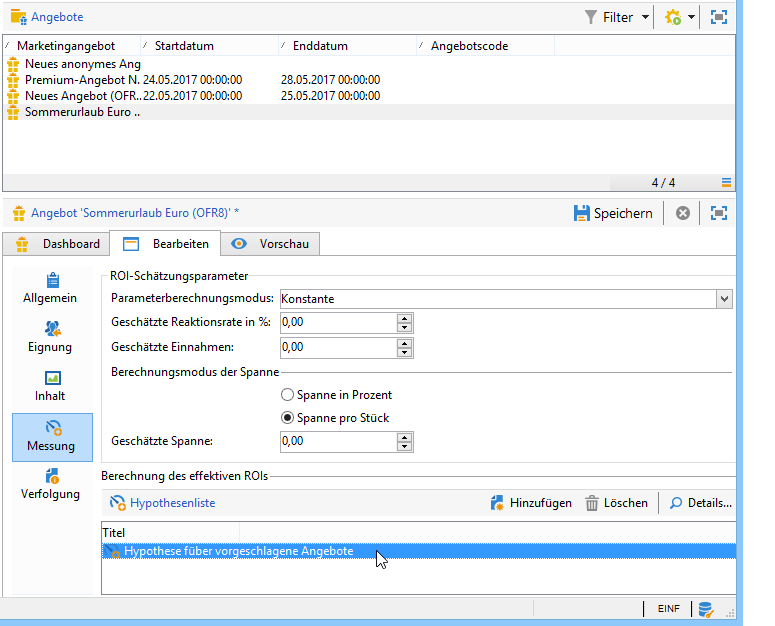

   Wenn die Option **[!UICONTROL Vorschlagsstatus aktualisieren]** in der Hypothesenvorlage aktiviert wurde, wird der Status des Angebotsvorschlags automatisch geändert und informiert über die Auswirkungen der Kampagnen (siehe diesbezüglich [Transaktionen](hypothesis-templates.md#transactions)).

## Beispiel: Erstellen einer einem Versand zugeordneten Hypothese {#example--creating-a-hypothesis-linked-to-a-delivery}

In diesem Beispiel wird eine mit einem Versand verknüpfte Hypothese erstellt. Diese Hypothese basiert auf dem zuvor erstellten Modell. [Weitere Informationen](hypothesis-templates.md#example--creating-a-hypothesis-template-on-a-delivery)   

Anschließend präzisieren wir die vom Modell geerbte Abfrage, um eine Hypothese zu einem bestimmten Artikel in der Bestelltabelle zu erstellen.

1. Erstellen Sie eine Kampagne und einen Versand. [Weitere Informationen](../../campaign/using/setting-up-marketing-campaigns.md#creating-a-campaign)   

   In vorliegenden Beispiel handelt es sich um einen Briefpost-Versand.

1. Konfigurieren Sie eine Kontrolladresse: Die zuvor erstellte Hypothesenvorlage wurde so konfiguriert, dass eine Kontrollgruppe in den Reaktionsergebnissen berücksichtigt wird.

   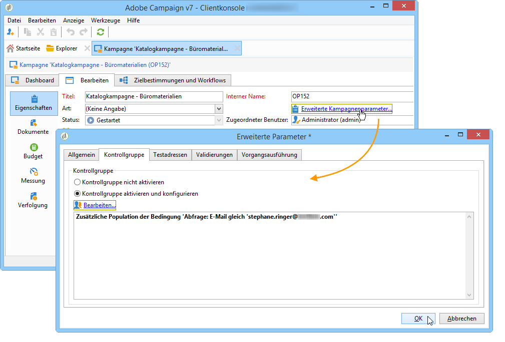

   >[!NOTE]
   >
   >Weiterführende Informationen hierzu finden Sie in [diesem Abschnitt](../../campaign/using/marketing-campaign-deliveries.md#defining-a-control-group).

1. Öffnen Sie den zuvor erstellten Versand Ihrer Kampagne, klicken Sie auf das Symbol **[!UICONTROL Versandmessung]** und anschließend auf **[!UICONTROL Hinzufügen]****[!UICONTROL .]**

   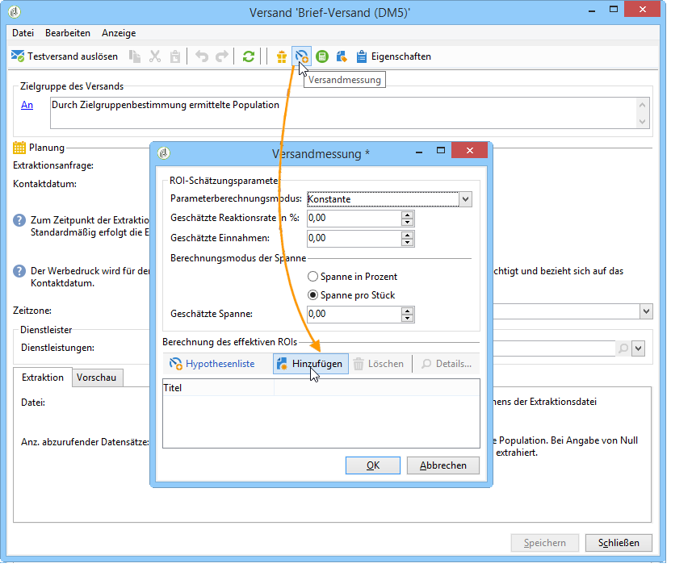

1. Wählen Sie die zuvor erstellte Hypothesenvorlage mithilfe der Dropdown-Liste aus.

   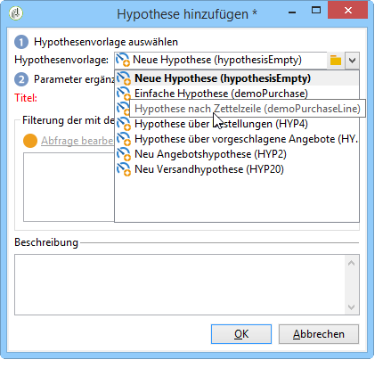

   Die in der Vorlage erstellte Abfrage wird angezeigt.

   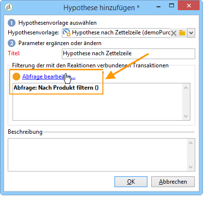

1. Klicken Sie auf **[!UICONTROL Abfrage bearbeiten]** und schränken Sie unter Angabe des Produkts, auf das sich die Hypothese beziehen soll, die Abfrage ein.

   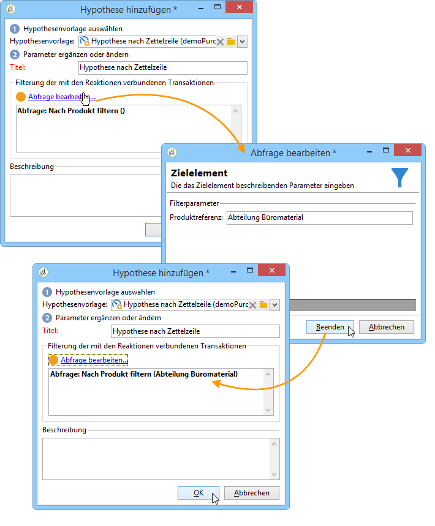

   Über den Tab **[!UICONTROL Bearbeiten > Messung > Messhypothesen]** der Kampagne können Sie sicherstellen, dass die Hypothese dem Versand zugeordnet wurde.****

   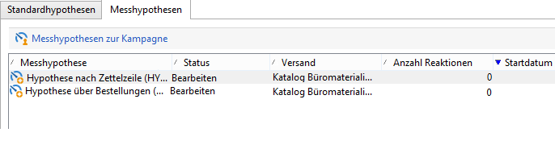

1. Starten Sie Ihren Zielgruppen-Workflow und führen Sie die erforderlichen Prüfungen durch, bis die Kampagne abgeschlossen ist. [Weitere Informationen](../../campaign/using/marketing-campaign-deliveries.md#starting-a-delivery)   

   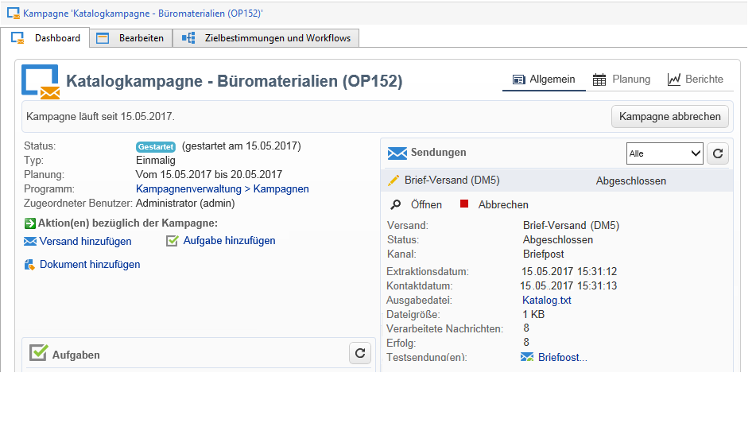

1. Gehen Sie zum Knoten **[!UICONTROL Kampagnenverwaltung > Messhypothesen]** des Adobe Campaign-Navigationsbaums, um die von der Hypothese berechneten Indikatoren zu überprüfen.

   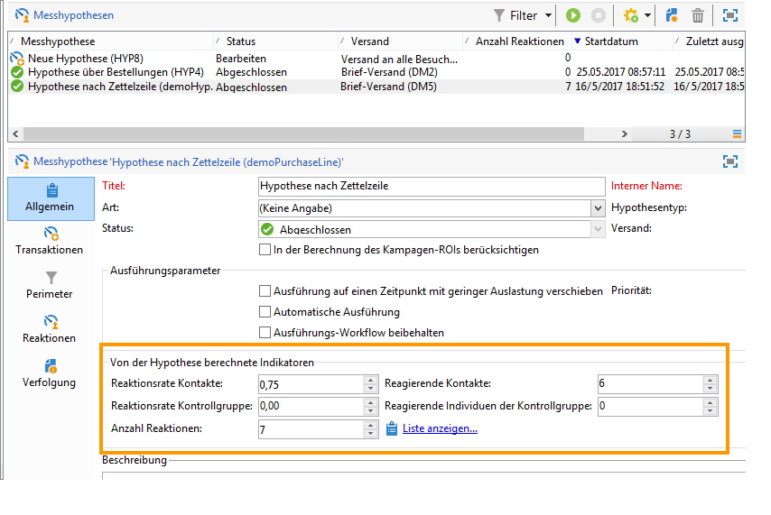
