# Hypothesenvorlagen{#hypothesis-templates}

## Hypothesenvorlage erstellen {#creating-a-hypothesis-model}

Die Konfiguration einer Hypothesenvorlage ermöglicht die Bestimmung des Kontexts, in dem die Reaktionen auf eine Sendung oder ein Angebot gemessen werden. An dieser Stelle werden zudem die unterschiedlichen für die Messung notwendigen Tabellen verzeichnet, darunter diejenigen, die die Beziehungen zwischen Individuen, Hypothesen und Transaktionstabelle definieren.

Folgen Sie den nachstehenden Etappen, um eine Hypothesenvorlage zu erstellen:

1. Rufen Sie im Adobe-Campaign-Explorer den Verzeichnisknoten **[!UICONTROL Ressourcen > Vorlagen > Hypothesenvorlagen]** auf.

   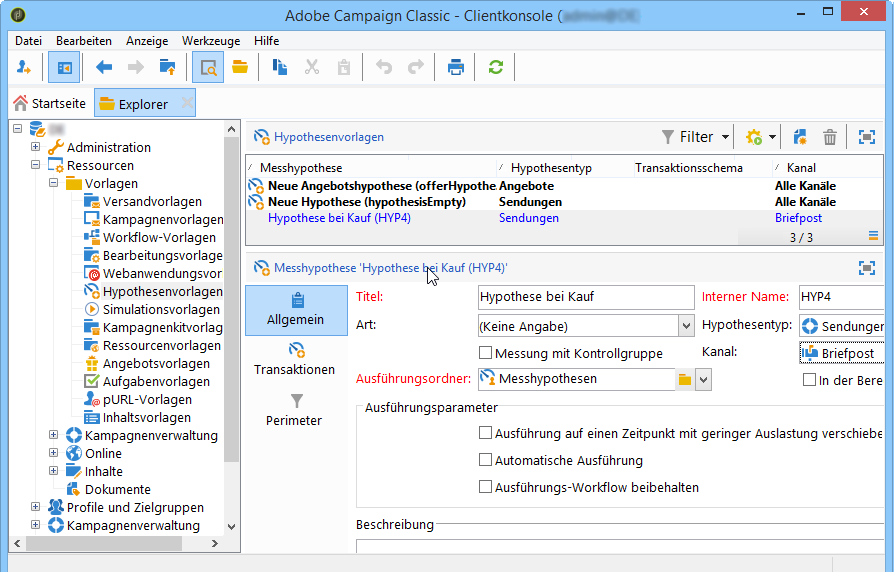

1. Klicken Sie auf die Schaltfläche **[!UICONTROL Neu]** oder machen Sie einen Rechtsklick in die Liste der Vorlagen und wählen Sie im Kontextmenü **[!UICONTROL Neu]** aus.
1. Geben Sie den Titel der Hypothese ein.
1. Wählen Sie im Feld **[!UICONTROL Hypothesentyp]** aus, ob die Vorlage für Hypothesen über Angebote oder Sendungen bestimmt ist.
1. Geben Sie für Vorlagen vom Typ **[!UICONTROL Versand]** an, ob die Messungen mit oder ohne Kontrollgruppe durchgeführt werden sollen. [Weitere Informationen](#properties-of-a-hypothesis-template)   
1. Für eine Vorlage vom Typ **[!UICONTROL Versand]** können Sie mithilfe der Dropdown-Liste **[!UICONTROL Kanal]** einen bestimmten Kanal wählen oder die Vorlage auf alle in Adobe Campaign verfügbaren Kanäle anwenden. [Weitere Informationen](#properties-of-a-hypothesis-template)   
1. Wählen Sie den **[!UICONTROL Ausführungsordner]**, in dem Sie die basierend auf der Vorlage aufgestellten Hypothesen erstellen und automatisch ausführen möchten.
1. Wählen Sie die Ausführungseinstellungen aus. [Weitere Informationen](#hypothesis-template-execution-settings)   
1. Geben Sie den Berechnungszeitraum der Hypothese an. [Weitere Informationen](#hypothesis-template-execution-settings)   

   >[!CAUTION]
   >
   >Der Zeitraum wird ausgehend vom Kontaktdatum bestimmt.

1. Geben Sie im Tab **[!UICONTROL Transaktionen]** die Tabellen und Felder an, die für die Hypothesenberechnung erforderlich sind. [Weitere Informationen](#transactions)   
1. Wenn Ihre Vorlage für Hypothesen vom Typ **[!UICONTROL Angebote]** konfiguriert ist, können Sie die Option **[!UICONTROL Vorschlagsstatus aktualisieren]** aktivieren: Wählen Sie in diesem Fall den Vorschlagsstatus aus, den Sie verändern möchten.
1. Geben Sie den Umfang der Hypothesenanwendung an. [Weitere Informationen](#hypothesis-perimeter)   
1. Verwenden Sie bei Bedarf ein Skript, um die Filterung abzuschließen. [Weitere Informationen](#hypothesis-perimeter)   

### Eigenschaften einer Hypothesenvorlage {#properties-of-a-hypothesis-template}

Im Tab **[!UICONTROL Allgemein]** der Vorlage werden die allgemeinen Optionen der Vorlage festgelegt. Es sind folgende Felder verfügbar:

* **[!UICONTROL Hypothesentyp]**: Wählen Sie hier aus, ob die Vorlage für Hypothesen über Sendungen oder über Angebote bestimmt ist.

   Sie können auch eine Hypothese erstellen, die sich sowohl auf Sendungen als auch auf Angebote bezieht.

   >[!NOTE]
   >
   >Wenn die Vorlage sich auf Angebote bezieht, wird die Option **[!UICONTROL Vorschlagsstatus aktualisieren]** im Tab **[!UICONTROL Transaktionen]** verfügbar.

* **[!UICONTROL Messung mit Kontrollgruppe]**: Aktivieren Sie diese Option, wenn eine Kontrollgruppe für den jeweiligen Versand oder die jeweilige Kampagne erstellt wurde und diese in den Messindikatoren berücksichtigt werden soll. Die Kontrollgruppe erhält keine Sendungen: Sie dient der Messung der Auswirkung dieser durch den Vergleich mit dem Verhalten der Zielgruppe, die die Sendungen erhält.

   >[!NOTE]
   >
   >Wenn die Konfiguration der Vorlage eine Kontrollgruppe vorsieht, jedoch keine in dem Versand bestimmt ist, auf den sich die Hypothesen beziehen, werden die Ergebnisse nur auf Grundlage der Zielgruppen-Empfänger berechnet.

   Die Bestimmung und Konfiguration von Kontrollgruppen werden in [diesem Abschnitt](../../campaign/using/marketing-campaign-deliveries.md#defining-a-control-group) beschrieben.

* **[!UICONTROL Kanal]**: Sie können einen spezifischen Kanal bestimmen oder die Hypothesenvorlage für alle Kanäle der Adobe Campaign-Konsole verfügbar machen, indem Sie **[!UICONTROL Alle Kanäle]** in der entsprechenden Dropdown-Liste auswählen. Wenn Sie die Vorlage für einen bestimmten Kanal konfigurieren, können die Sendungen bei der Hypothesenerstellung automatisch nach Kanal gefiltert werden. [Weitere Informationen](creating-hypotheses.md)   

   

* **[!UICONTROL Ausführungsordner]**: Legen Sie hier den Ordner fest, in dem die Hypothese erstellt und ausgeführt werden soll.
* **[!UICONTROL In der Berechnung des Kampagnen-ROIs berücksichtigen]**: Diese Option ermöglicht es, das Ergebnis der Hypothese in der Berechnung des ROIs der verbundenen Kampagne zu berücksichtigen (im Fall eines Kampagnenversands).

### Ausführungsparameter einer Hypothesenvorlage {#hypothesis-template-execution-settings}

Im Tab **[!UICONTROL Allgemein]** der Vorlage können zudem die Ausführungsparameter der Hypothese festgelegt werden. Folgende Optionen sind verfügbar:

* **[!UICONTROL Ausführung auf einen Zeitpunkt mit geringer Auslastung verschieben]**: Diese Option dient der Leistungsoptimierung von Adobe Campaign. Bei Aktivierung der Option verschiebt der Workflow der Kampagnenvorgänge den Start der Hypothesenberechnung auf einen Zeitraum mit schwacher Aktivität.

   

* **[!UICONTROL Priorität]**: Im Falle simultaner Ausführungen kann mithilfe der Prioritätseinteilung die Reihenfolge der Hypothesenberechnungen gestaffelt werden.

   

* **[!UICONTROL Automatische Ausführung]**: Mit dieser Option kann bei Bedarf eine erneute Berechnung der Hypothese geplant werden (z. B. wenn eine regelmäßige Aktualisierung der Indikatoren bis zum Ende eines Versands gewünscht ist).

   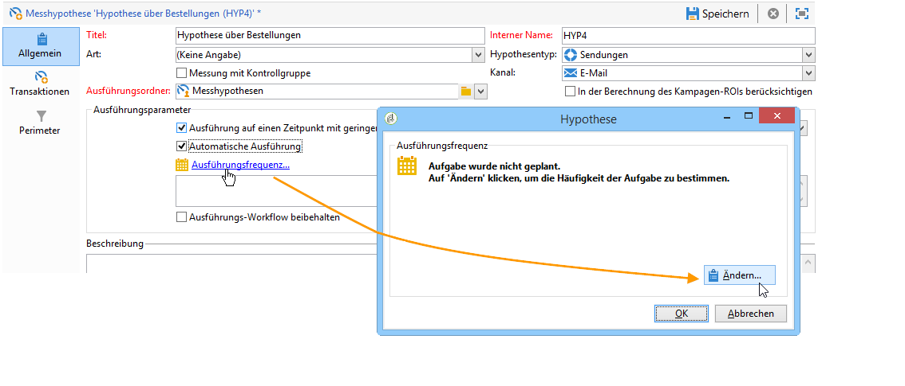

   Um die Häufigkeit der Aktualisierung zu bestimmen, gehen Sie wie folgt vor:

   1. Klicken Sie auf den Link **[!UICONTROL Ausführungsfrequenz...]** und anschließend auf die Schaltfläche **[!UICONTROL Ändern]**.

      

   1. Konfigurieren Sie den Häufigkeitstyp, die jeweiligen Ereignisse und den Gültigkeitszeitraum der Ereignisse.

      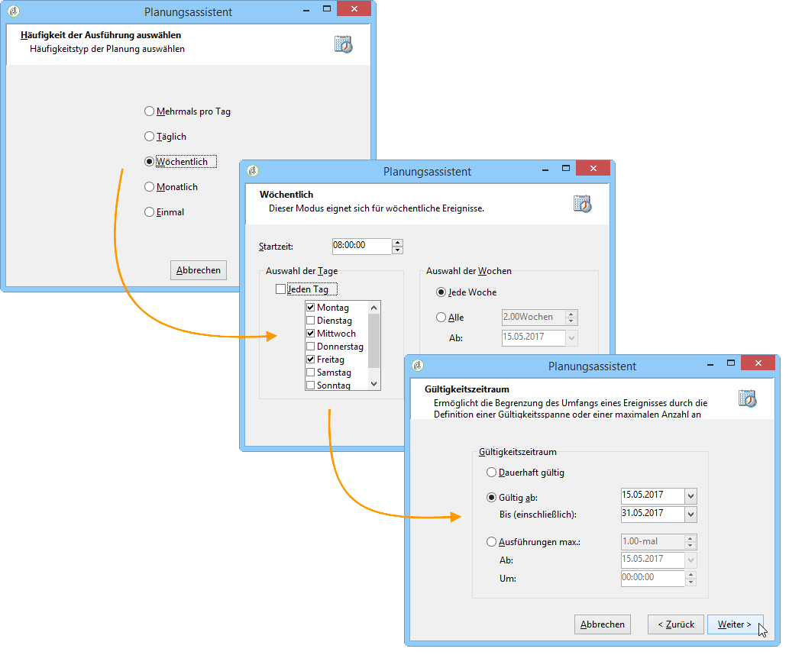

   1. Klicken Sie zur Bestätigung Ihrer Eingaben auf **[!UICONTROL Beenden]**.

      

* **[!UICONTROL SQL-Abfragen im Protokoll speichern]**: Diese Funktion sollte erfahrenen Benutzern vorbehalten bleiben. Sie fügt der Verfolgung der Messhypothesen einen Tab hinzu, in dem SQL-Abfragen angezeigt werden. Dies ermöglicht es, mögliche Fehlfunktionen ausfindig zu machen, wenn eine Simulation mit Fehlern beendet wird.
* **[!UICONTROL Ausführungs-Workflow beibehalten]**: Diese Option ermöglicht es, den beim Start der Hypothesenberechnung automatisch erzeugten Workflow beizubehalten. In Hypothesen, die basierend auf einer Vorlage mit dieser Option erstellt werden, besteht zur Beobachtung des Ablaufs Zugriff auf den Workflow.

   >[!CAUTION]
   >
   >Diese Option sollte nur zu Debugging-Zwecken bei fehlerhaften Hypothesenausführungen aktiviert werden.\
   >Automatisch generierte Workflows sollten zudem nicht verändert werden. Jede dennoch vorgenommene Änderung wird nur für nachfolgende Berechnungen berücksichtigt.\
   >Denken Sie daran, den Workflow nach seiner Ausführung zu löschen, wenn Sie diese Option aktiviert haben.

### Transactions {#transactions}

Dieser Tab enthält Felder und Tabellen, mithilfe derer Sie den Verlauf der Empfängerreaktionen bei Transaktionen speichern können. Weiterführende Informationen zu den für die Reaktionsverwaltung verwendeten Tabellen finden Sie in diesem [Abschnitt](../../configuration/using/about-schema-reference.md).

* **[!UICONTROL Schema (Speicherung des Reaktionslogs)]**: Geben Sie die Tabelle der Empfängerreaktionen an. Die standardmäßige Adobe-Campaign-Tabelle hierfür ist **NmsRemaMatchRcp**.
* **[!UICONTROL Transaktionsschema]**: Wählen Sie die Tabelle aus, auf die sich die Hypothesen beziehen sollen (also die die Bestellungen enthaltende Transaktionstabelle).
* **[!UICONTROL Abfrageschema]**: Wählen Sie Kriterien zur Filterung der Hypothese aus.
* **[!UICONTROL Relation zu den Individuen]**: Geben Sie die Relation zwischen den Individuen und der als Transaktionschema ausgewählten Tabelle an.
* **[!UICONTROL Relation zum Haushalt]**: Wählen Sie die Relation mit dem Haushalt im Transaktionsschema aus, wenn Sie alle Mitglieder eines Haushalts in Ihre Hypothese integrieren möchten. Dieses Feld ist optional.
* **[!UICONTROL Transaktionsdatum]**: Dieses Feld ist optional. Seine Nutzung wird jedoch empfohlen, da es die Begrenzung des Perimeters der Hypothesenberechnung ermöglicht.
* **[!UICONTROL Zeitraum der Hypothesenberechnung]**: Sie können Anfang und Ende des Zeitraums konfigurieren, während dem die Hypothesen ausgeführt und die Bestellzeilen abgerufen werden.

   Wenn eine Hypothese einem Versand zugeordnet wird, wird die Messung automatisch einige Tage nach dem Kontaktdatum (im Fall eines Briefpost-Versands) oder nach dem Versanddatum (im Fall eines E-Mail- oder SMS-Versands) ausgelöst.

   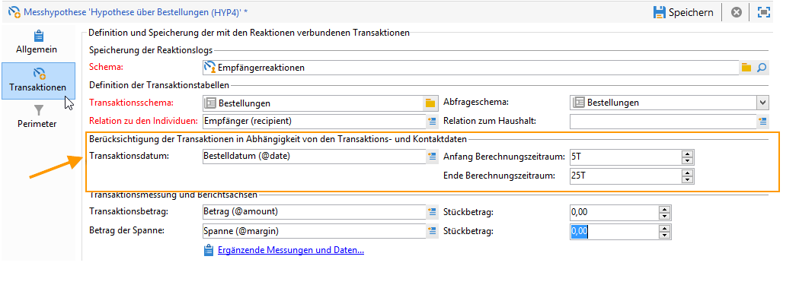

   Wenn die Hypothese im laufenden Betrieb gestartet wurde, haben Sie die Möglichkeit, eine sofortige Auslösung zu forcieren. Andernfalls wird sie automatisch entsprechend dem konfigurierten Ende der Berechnung ausgelöst, das vom Erstellungsdatum der Hypothese abhängig ist. [Weitere Informationen](creating-hypotheses.md#creating-a-hypothesis-on-the-fly-on-a-delivery).

* **[!UICONTROL Transaktionsbetrag/Betrag der Spanne]**: Diese Felder sind optional. Sie ermöglichen die automatische Berechnung der Umsatzindikatoren. [Weitere Informationen](hypothesis-tracking.md#indicators)   
* **[!UICONTROL Stückbetrag]**: Dieses Feld ermöglicht die Festsetzung eines Betrags für die Berechnung des Umsatzes. [Weitere Informationen](hypothesis-tracking.md#indicators)   

   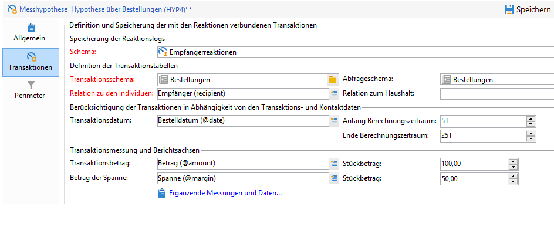

* **[!UICONTROL Ergänzende Messungen und Daten]**: In diesem Feld werden zusätzliche Messungen und Berichtsachsen basierend auf den Feldern der unterschiedlichen Tabellen bestimmt.
* **[!UICONTROL Vorschlagsstatus aktualisieren]**: Diese Option ermöglicht die Änderung eines Vorschlagsstatus, wenn ein Angebotsempfänger von der Hypothese identifiziert wurde.

   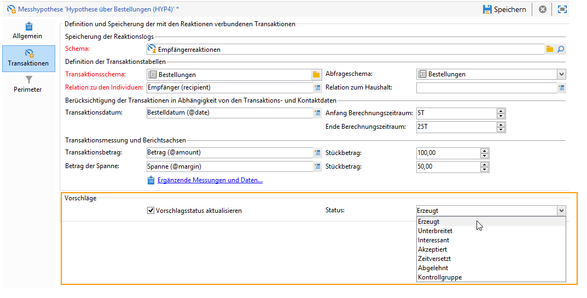

### Perimeter {#hypothesis-perimeter}

Nachdem die Transkationstabelle sowie die von der Hypothese betroffenen Felder definiert wurden, können Sie den Perimeter Ihrer Hypothese weiter einschränken, indem Sie die betreffenden Transaktionen und Sendungen mithilfe von Filtern angeben. Sie haben auch die Möglichkeit, ein JavaScript zu verwenden, um ein in der Transaktionstabelle referenziertes Produkt, für das Sie eine Hypothese erstellen möchten, explizit anzugeben.

* **Filterung der Transaktionen**: Im Tab **[!UICONTROL Umfang]** können Sie Filter für die Hypothese konfigurieren. Gehen Sie dazu wie folgt vor:

   1. Klicken Sie auf den Link **[!UICONTROL Abfrage bearbeiten...]**.

      

   1. Bestimmen Sie die gewünschten Filterkriterien.

      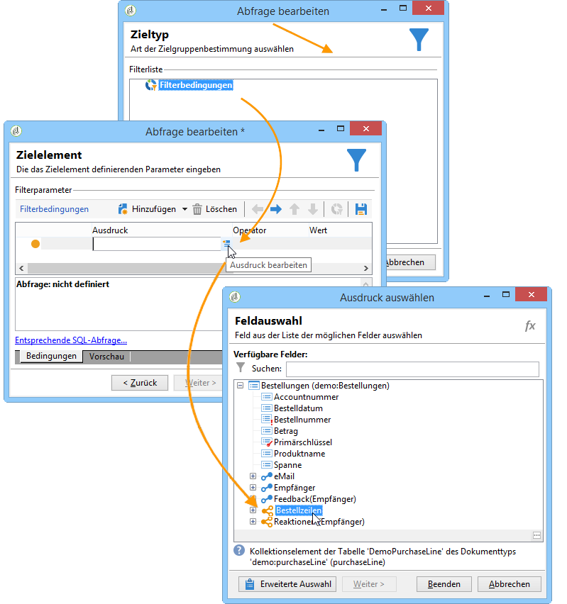

   1. Wählen Sie die Transaktion aus, auf die die Hypothese sich beziehen soll.

      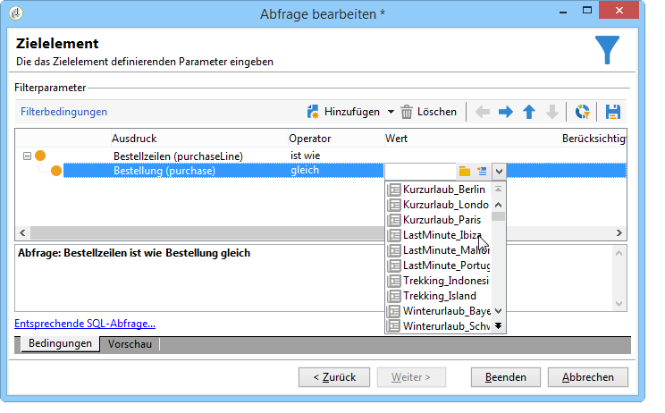

* **Empfängerfilter**: Im Tab **[!UICONTROL Perimeter]** können Sie Ihre Hypothese auf jegliche, in Zusammenhang mit einer Nachricht stehende Information beschränken (Versand, Empfänger, E-Mail-Adresse, Dienst etc.). Gehen Sie hierzu wie folgt vor:

   1. Klicken Sie auf den Link **[!UICONTROL Filter hinzufügen]** und anschließend auf **[!UICONTROL Abfrage bearbeiten]**.

      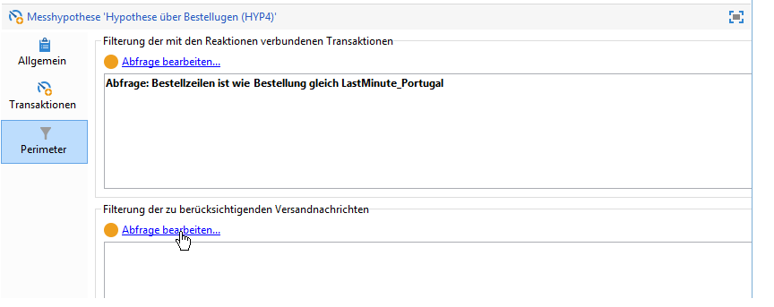

   1. Bestimmen Sie die gewünschten Filterkriterien.

      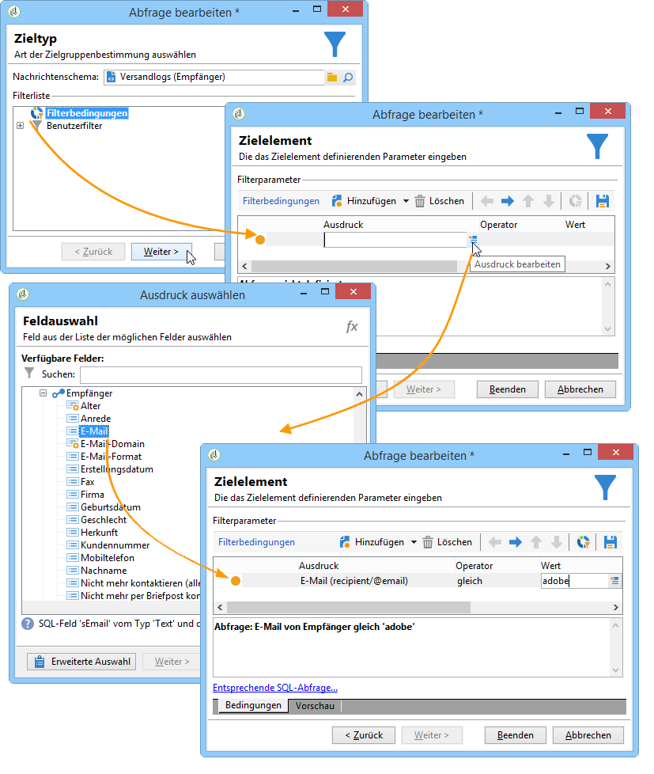

   1. Klicken Sie auf **[!UICONTROL Beenden]**, um Ihre Abfrage zu speichern.

      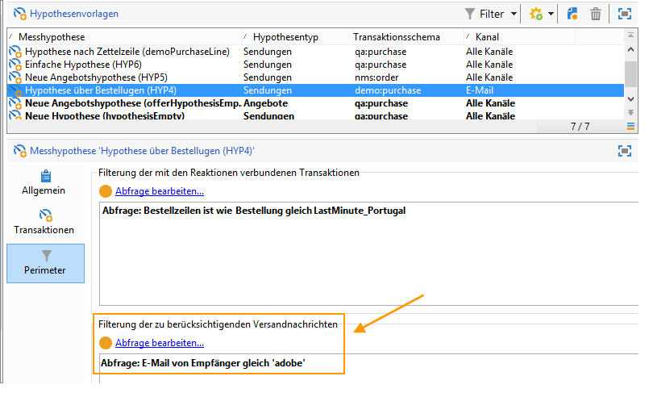

* **Script**: Mithilfe eines JavaScripts besteht die Möglichkeit, die Parameter der Hypothese bei ihrer Ausführung dynamisch zu überschreiben.

   Klicken Sie hierzu auf den Link **[!UICONTROL Erweiterte Parameter...]** und erfassen Sie das Script Ihrer Wahl.

   >[!NOTE]
   >
   >Diese Option sollte erfahrenen Benutzern vorbehalten bleiben.

   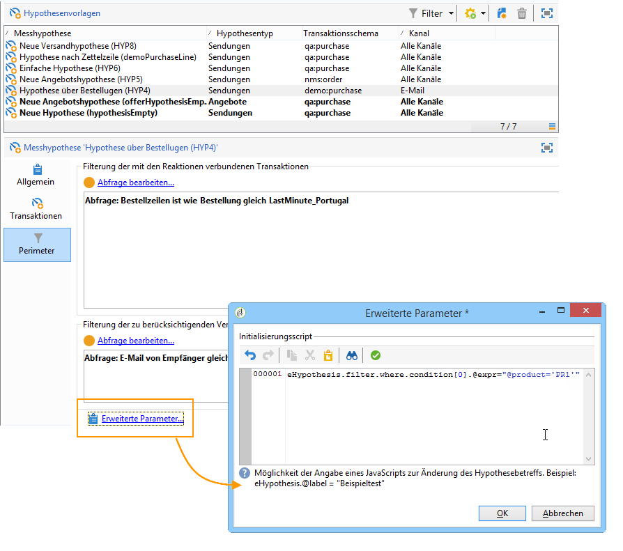

## Beispiel: Erstellen einer Hypothesenvorlage für einen Versand {#example--creating-a-hypothesis-template-on-a-delivery}

Im folgenden Beispiel wird eine Hypothesenvorlage für einen Briefpost-Versand erstellt. Die Transaktionstabelle (**Bestellungen** in unserem Beispiel), auf welcher die Hypothesen basieren, enthält Bestellzeilen, denen Produkte zugeordnet sind. Die Vorlage wird so konfiguriert, dass die Hypothesen sich auf eben diese Produkte bezieht.

1. Positionieren Sie sich im Knoten **[!UICONTROL Ressourcen > Vorlagen > Hypothesenvorlagen]** des Adobe-Campaign-Explorers.
1. Klicken Sie auf **[!UICONTROL Neu]**, um eine Vorlage zu erstellen.

   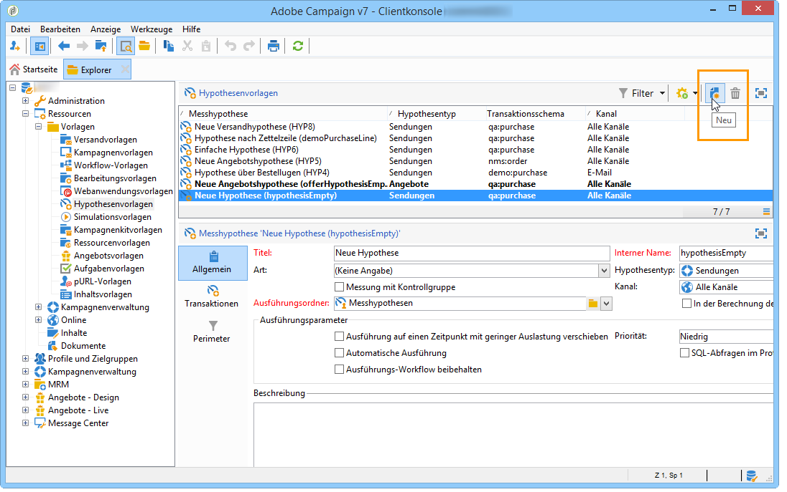

1. Ändern Sie den Titel der Vorlage.

   

1. Wählen Sie den Hypothesentyp **[!UICONTROL Sendungen]**.
1. Geben Sie an, dass der Versand eine Kontrollgruppe enthalten kann, indem Sie das entsprechende Feld ankreuzen.
1. Wählen Sie den Kanal **[!UICONTROL Briefpost]**.

   >[!NOTE]
   >
   >Da die Vorlage briefversandspezifisch ist, können die basierend auf dieser Vorlage erstellten Hypothesen keinen Sendungen zugeordnet werden, die andere Kanäle nutzen.

1. Geben Sie im Tab **[!UICONTROL Transaktionen]** die Empfängerreaktionen-Tabelle an.

   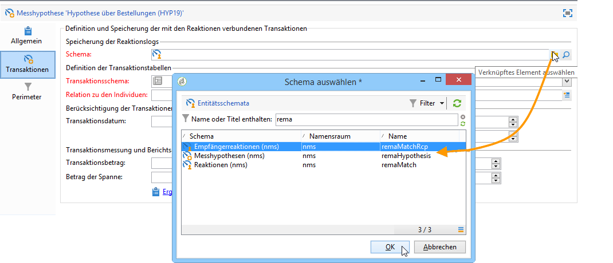

1. Wählen Sie im Feld **[!UICONTROL Transaktionsschema]** Ihre die Bestellung enthaltende Transaktionstabelle aus.

   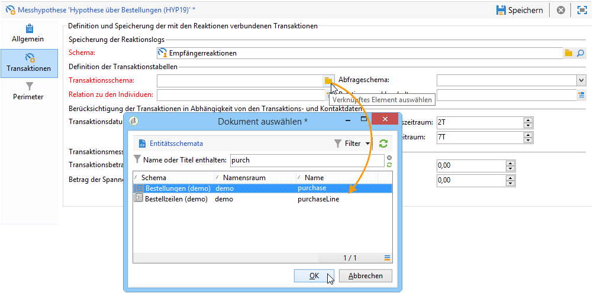

1. Wählen Sie im Feld **[!UICONTROL Abfrageschema]** Bestellzeilen aus.

   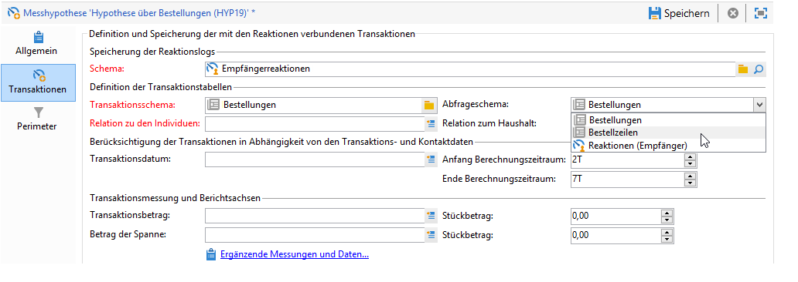

1. Wählen Sie die Empfänger aus, die mit der Tabelle der Bestellungen in Relation stehen.

   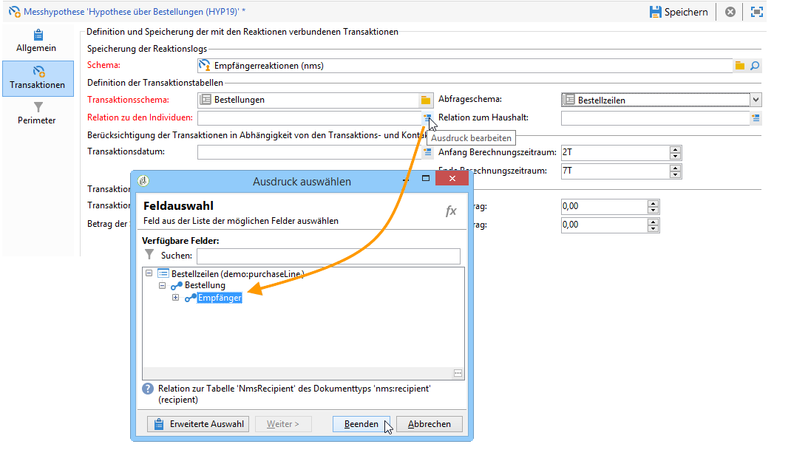

1. Wählen Sie das dem Bestelldatum entsprechende Feld aus, um die Hypothesen zeitlich zu beschränken.

   Diese Etappe ist nicht zwingend erforderlich, sie wird jedoch empfohlen.

   

1. Konfigurieren Sie einen Berechnungszeitraum zwischen 5 und 25 Tagen.

   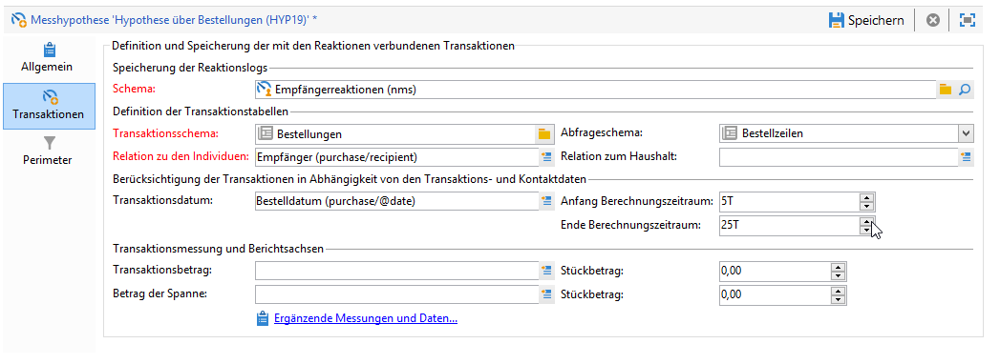

1. Klicken Sie im Tab **[!UICONTROL Perimeter]** auf **[!UICONTROL Abfrage bearbeiten]**, um einen Hypothesenfilter zu erstellen.

   

   Die auf diese Weise erstellte Vorlage ermöglicht es Ihnen, Hypothesen für in Ihrer Bestellungen-Tabelle enthaltene Produkte zu erstellen.

1. Klicken Sie auf **[!UICONTROL Speichern]**, um die Erstellung der Vorlage zu beenden.
