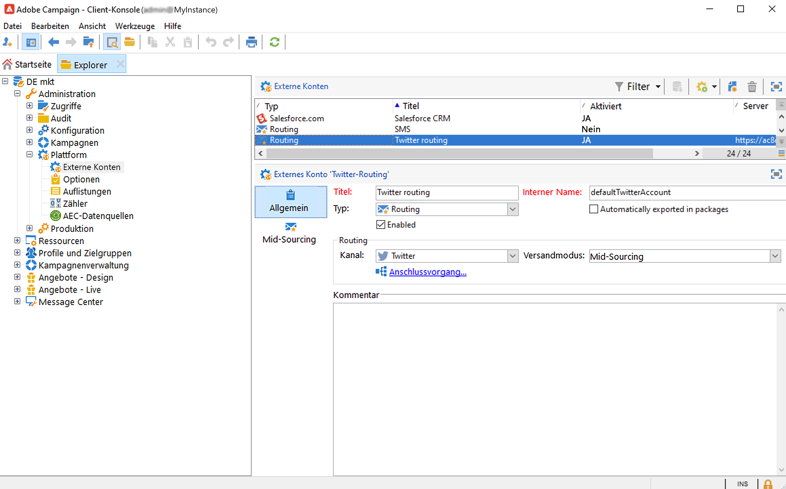

# Über Social-Media-Marketing{#about-social-marketing}

Mit der Anwendung **Soziale Netzwerke verwalten** (Social Marketing) können Sie über Twitter mit Ihrer Kundschaft und Interessenten interagieren.

Erfahren Sie wichtige Schritte zur Integration von Campaign und Twitter in der [Dokumentation zu Campaign v8](https://experienceleague.adobe.com/docs/campaign/campaign-v8/connect/fda.html?lang=de){target="_blank"}.

Als On-Premise- oder Hybrid-Kunde muss Ihr externes Twitter-Konto konfiguriert und aktiviert sein. Bei Hybridkonfigurationen muss die Registerkarte **Mid-Sourcing** auch mit einer aktiven Verbindung zur Mid-Sourcing-Plattform eingerichtet werden.

