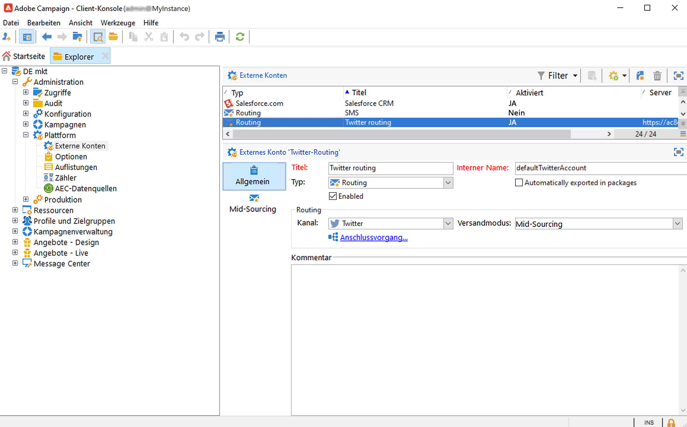

# Über Social-Media-Marketing{#about-social-marketing}

Mit der Anwendung **Social Marketing** zur Verwaltung sozialer Netzwerke können Sie über Facebook und X (früher bekannt als Twitter) mit der Kundschaft sowie interessierten Personen interagieren.

Wichtige Schritte zur Integration von Campaign und X finden Sie in der [Dokumentation zu Campaign v8](https://experienceleague.adobe.com/docs/campaign/campaign-v8/connect/fda.html?lang=de){target="_blank"}.

Wenn Sie On-Premise- oder Hybrid-Kundin oder -Kunde sind, muss Ihr externes X-Konto konfiguriert und aktiviert sein. Bei Hybridkonfigurationen muss die Registerkarte **Mid-Sourcing** auch mit einer aktiven Verbindung zur Mid-Sourcing-Plattform eingerichtet werden.

