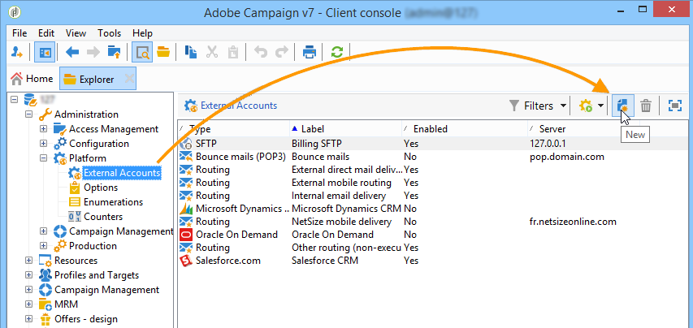
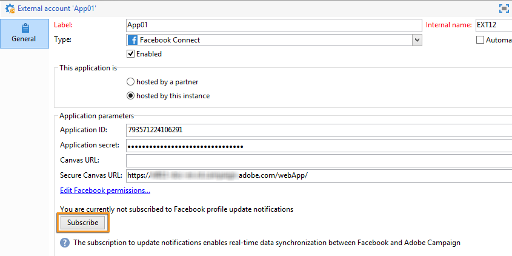

# Erstellen einer Facebook-Anwendung {#creating-a-facebook-application}

Dank Webanwendungen können Sie mit Social Marketing personalisierte Inhalte in Ihren Facebook-Anwendungen anzeigen. Dadurch wird es einfacher, über dieses soziale Netzwerk potenzielle Kunden zu gewinnen. Weitere Beispiele für Facebook-Webanwendungen finden Sie unter [Beispiele für Facebook-Anwendungen](../../social/using/examples-of-facebook-apps.md).

>[!NOTE]
>
>Es ist auch möglich, Adobe Campaign in eine von einem Partner entwickelte Facebook-Anwendung zu integrieren. In diesem Fall müssen Sie die Adobe Campaign-Webanwendung nicht verwenden, um Facebook-Profile zu gewinnen. Weitere Informationen finden Sie unter [Externe Konten konfigurieren](#configuring-external-accounts).

Befolgen Sie zur Konfiguration die nachstehenden Etappen:

1. Erstellen Sie eine oder mehrere Facebook-Anwendungen. Weitere Informationen hierzu finden Sie unter [Erstellen einer Facebook-Anwendung](../../social/using/publishing-on-facebook-walls.md#creating-a-facebook-application).
1. Geben Sie die Links für die **[!UICONTROL Nutzungsbedingungen]** und **[!UICONTROL Datenschutzbestimmungen]** ein, die auf dem Facebook-Bildschirm für Berechtigungsanfragen angezeigt werden sollen. Weitere Informationen finden Sie unter [Links für Nutzungsbedingungen und Datenschutzbestimmungen eingeben](#entering-the-terms-of-service-and-privacy-policy-links).
1. Erstellen Sie für jede Facebook-Anwendung ein externes **[!UICONTROL Facebook Connect]**-Konto. Weitere Informationen finden Sie unter [Externe Konten konfigurieren](#configuring-external-accounts).
1. Erstellen Sie für jede Facebook-Anwendung in Adobe Campaign eine Webanwendung vom Typ „Facebook“. Weitere Informationen hierzu finden Sie unter [Webanwendungen vom Typ „Facebook“ erstellen](#creating-a-facebook-type-web-application).
1. Konfigurieren Sie Ihre Facebook-Anwendungen so, dass sie als Tabs auf Ihrer Facebook-Seite angezeigt werden. Weitere Informationen finden Sie unter [Facebook-Tabs konfigurieren](#configuring-facebook-tabs).

## Externe Konten konfigurieren {#configuring-external-accounts}

Für jede Facebook-Anwendung müssen Sie ein externes **[!UICONTROL Facebook Connect]**-Konto erstellen.

Dieser Schritt erfordert Zugriff auf Ihre Adobe Campaign-Konsole und einen Internet-Browser, der beim Facebook-Konto angemeldet ist, das Sie für die Seitenverwaltung verwenden:

* **Facebook**: Wählen Sie die zuvor erstellte Anwendung ([https://developers.facebook.com/apps](https://developers.facebook.com/apps)) aus und klicken Sie auf den Tab **[!UICONTROL Einstellungen]** > **[!UICONTROL Einfach]**.

   

   >[!NOTE]
   >
   >Wenn der Abschnitt **[!UICONTROL Facebook-Web-Spiele]** nicht angezeigt wird, klicken Sie auf die Schaltfläche **[!UICONTROL Plattform hinzufügen]** unten auf der Seite und wählen Sie **[!UICONTROL Facebook-Web-Spiele]** aus.

* **Adobe Campaign**: Wechseln Sie zum Knoten **[!UICONTROL Administration > Plattform > Externe Konten]** und klicken Sie auf **[!UICONTROL Neu]**.

   

1. Geben Sie einen Titel und einen internen Namen ein und wählen Sie den Typ **[!UICONTROL Facebook Connect]** aus.

   

1. Wählen Sie einen Hosting-Modus für die Anwendung aus: **[!UICONTROL Bei einem Partner gehostet]** oder **[!UICONTROL Auf dieser Instanz gehostet]**.

   

   **Bei einem Partner gehostete Anwendung**

   Es ist möglich, Adobe Campaign in eine von einem Partner entwickelte Facebook-Anwendung zu integrieren. In diesem Fall müssen Sie die Adobe Campaign-Webanwendungen nicht verwenden, um Facebook-Profile zu gewinnen. Wenn der Facebook-Benutzer die Anwendung installiert, wird ein Schlüssel (Zugriffstoken) generiert. Der Partner leitet dieses Zugriffstoken an Adobe Campaign weiter, indem er einen Web-Dienst aufruft. Adobe Campaign verwendet dieses Token dann, um sich bei der Facebook-Datenbank anzumelden und die vom Benutzer über die Anwendung freigegebenen Daten zu erfassen.

   >[!NOTE]
   >
   >Die Parameter des Web-Diensts sind in der WSDL-Datei im Folgenden aufgeführt: **`https://<Instance name>/nl/jsp/schemawsdl.jsp?schema=nms:visitor`**

   Um die Drittanbieteranwendung in Adobe Campaign zu integrieren, müssen Sie den Inhalt der Facebook-Felder **[!UICONTROL App-ID]** und **[!UICONTROL App-Geheimnis]** kopieren und in die Felder **[!UICONTROL Anwendungs-ID]** und **[!UICONTROL Anwendungsgeheimnis]** der Konsole einfügen.

   

   **Auf dieser Instanz gehostete Anwendung**

   Wenn Sie die Anwendung auf dieser Instanz hosten möchten (wenn Sie keine Drittanbieter-Anwendung haben), müssen Sie die Adobe Campaign-Webanwendungen verwenden, um Facebook-Profile zu gewinnen. Weitere Informationen hierzu finden Sie unter [Beispiele für Facebook-Anwendungen](../../social/using/examples-of-facebook-apps.md).

   Kopieren Sie in der Adobe Campaign-Konsole die im Feld **[!UICONTROL Sichere Canvas-URL]** enthaltene Adresse und fügen Sie sie in das Feld **[!UICONTROL Facebook-Web-Spiele (https)]** in Facebook (im Abschnitt **[!UICONTROL Facebook-Web-Spiele]**) ein.

   

   >[!IMPORTANT]
   >
   >Sie dürfen unter keinen Umständen die unsichere URL verwenden.

   Kopieren Sie auf Facebook den Inhalt der Felder **[!UICONTROL App-ID]** und **[!UICONTROL App-Geheimnisr]** und fügen Sie ihn in die Felder **[!UICONTROL Anwendungs-ID]** und **[!UICONTROL Anwendungsgeheimnis]** in der Konsole ein.

   

1. Klicken Sie auf Facebook unten auf der Seite auf die Schaltfläche **[!UICONTROL Änderungen speichern]**.
1. Klicken Sie in der Adobe Campaign-Konsole auf die Schaltfläche **[!UICONTROL Abonnieren]**, damit Adobe Campaign die Daten jedes Mal, wenn ein Fan über diese Anwendung eincheckt, in Echtzeit abrufen kann. Weitere Informationen hierzu finden Sie unter [Beispiele für Facebook-Anwendungen](../../social/using/examples-of-facebook-apps.md).

   

## Links für Nutzungsbedingungen und Datenschutzbestimmungen eingeben {#entering-the-terms-of-service-and-privacy-policy-links}

Es wird empfohlen, die Links für die **[!UICONTROL Nutzungsbedingungen]** und **[!UICONTROL Datenschutzbestimmungen]** hinzuzufügen, die auf dem Facebook-Bildschirm für Berechtigungsanfragen angezeigt werden sollen.

Die Konfiguration stellt sich wie folgt dar:

1. Geben Sie folgende Adresse ein: [https://developers.facebook.com/apps](https://developers.facebook.com/apps) und wählen Sie dann die Facebook-Anwendung aus.
1. Wählen Sie den Tab **[!UICONTROL Einstellungen > Einfach]** aus und geben Sie die **[!UICONTROL Datenschutzbestimmungen-URL]** und die **[!UICONTROL Nutzungsbedingungen-URL]** ein.

   

## Webanwendungen vom Typ „Facebook“ erstellen {#creating-a-facebook-type-web-application}

Mit der Facebook-Anwendung von Adobe Campaign können Sie personalisierte Inhalte in Ihrer Facebook-Anwendung anzeigen. Für jede Facebook-Anwendung müssen Sie eine Webanwendung in Adobe Campaign erstellen. Erstellen einer Facebook-Webanwendung:

1. Wechseln Sie zur Rubrik **[!UICONTROL Soziale Netzwerke]**, klicken Sie auf den Link **[!UICONTROL Anwendungen]** und dann auf die Schaltfläche **[!UICONTROL Erstellen]**.

   

1. Wählen Sie eine Facebook-Webanwendungsvorlage aus der Liste aus und geben Sie den Titel ein.

   

   >[!NOTE]
   >
   >Standardmäßig stehen vier Facebook-Webanwendungsvorlagen zur Verfügung:
   >
   >* **[!UICONTROL Neue Facebook-Anwendung]**: Wählen Sie diese Vorlage, wenn Sie mit einer leeren Anwendung beginnen möchten.
   >* **[!UICONTROL Vorausgefülltes Formular]**: Facebook-Anwendung mit einem Formular und einer Schaltfläche „Facebook-Anmeldung“, mit der Benutzer die Felder des Formulars automatisch mit den Daten aus ihrem Profil ausfüllen können. Auf diese Weise können die Benutzer das Formular schneller ausfüllen und Marken bessere Informationen erhalten.
   >* **[!UICONTROL Preisausschreiben „Canvas-Seite“]**: Facebook-Anwendung, die auf dem gesamten Bildschirm angezeigt wird, um eine bessere visuelle Darstellung für die Benutzer zu gewährleisten.
   >* **[!UICONTROL Preisausschreiben „Tab-Seite“]**: Facebook-Anwendung vollständig in den Tabs der Markenseite integriert.

1. Geben Sie im Feld **[!UICONTROL Anwendung]** das externe Konto ein, das mit der Facebook-Anwendung verknüpft ist. Weitere Informationen finden Sie unter [Externe Konten konfigurieren](#configuring-external-accounts).

   

1. Wählen Sie den Tab **[!UICONTROL Bearbeiten]** aus und bearbeiten Sie dann die Webanwendung. Weitere Informationen hierzu finden Sie unter [Beispiele für Facebook-Anwendungen](../../social/using/examples-of-facebook-apps.md).

   

1. Nachdem die Webanwendung abgeschlossen ist, wählen Sie den Tab **[!UICONTROL Dashboard]** aus und klicken Sie dann auf **[!UICONTROL Publizieren]**, um online zu publizieren.

   

## Facebook-Tabs konfigurieren {#configuring-facebook-tabs}

Sie können Ihre Facebook-Anwendungen so konfigurieren, dass sie als Tabs auf Ihrer Facebook-Seite angezeigt werden. Gehen Sie hierzu wie folgt vor:

1. Wählen Sie die Facebook-Anwendung ([https://developers.facebook.com/apps](https://developers.facebook.com/apps)) aus und klicken Sie auf den Tab **[!UICONTROL Einstellungen > Einfach]**.

   

1. Klicken Sie unten auf der Seite auf die Schaltfläche **[!UICONTROL Plattform hinzufügen]** und wählen Sie **[!UICONTROL Seite-Tab]** aus.

   

1. Geben Sie im Feld **[!UICONTROL Name des Seite-Tabs]** des **[!UICONTROL Seite-Tabs]** den Titel so ein, wie er auf der Facebook-Seite angezeigt werden soll.

   

1. Geben Sie im Feld **[!UICONTROL Sichere Seiten-Tab-URL]** die öffentliche URL der Webanwendung ein, auf die über den Tab **[!UICONTROL Dashboard]** der Webanwendung zugegriffen werden kann. Weitere Informationen zum Erstellen von Webanwendungen vom Typ „Facebook“ finden Sie unter [Webanwendungen vom Typ „Facebook“ erstellen](#creating-a-facebook-type-web-application).

   

1. Klicken Sie im **[!UICONTROL Dashboard]** der Webanwendung auf den Link **[!UICONTROL Seitentab hinzufügen]**.

   

1. Wählen Sie die Facebook-Seite aus, der Sie den Tab hinzufügen möchten, und klicken Sie auf **[!UICONTROL Seitentab hinzufügen]**.

   

