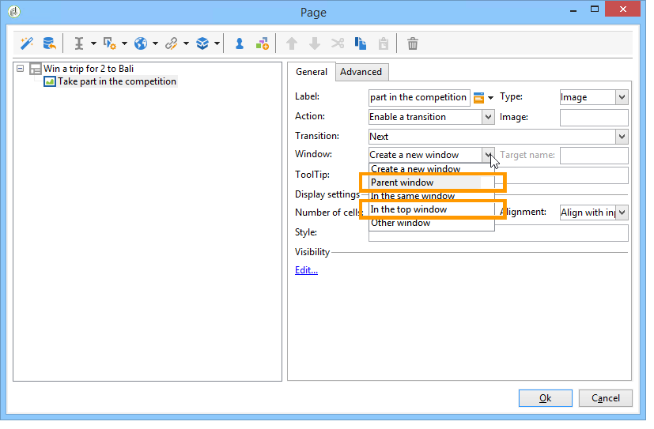
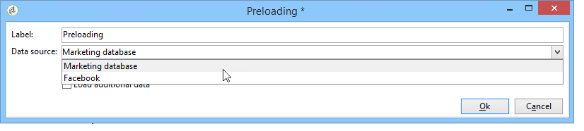

# Beispiele für Facebook-Anwendungen{#examples-of-facebook-apps}

Wenn ein Benutzer auf den Tab einer Facebook-Anwendung klickt, wird diese in einem 810 Pixel breiten Bereich angezeigt. Adobe Campaign verwendet eine Webanwendung vom Typ „Facebook“, mit der Sie die in der Facebook-Anwendung angezeigten Inhalte definieren und personalisieren können. Auf diese Weise wird das Akquirieren von Profilen erleichtert.

>[!NOTE]
>
>Es ist auch möglich, Adobe Campaign in eine von einem Partner entwickelte Facebook-Anwendung zu integrieren. In diesem Fall müssen Sie die Adobe Campaign-Webanwendung nicht verwenden, um Facebook-Profile zu gewinnen. Weitere Informationen finden Sie unter [Externe Konten konfigurieren](../../social/using/creating-a-facebook-application.md#configuring-external-accounts).

>[!IMPORTANT]
>
>Befolgen Sie die Konfigurationsschritte, die unter [Erstellen einer Facebook-Anwendung](../../social/using/creating-a-facebook-application.md) beschrieben sind.

>[!NOTE]
>
>In diesem Abschnitt werden die Elemente beschrieben, die mit Webanwendungen vom Typ „Facebook“ verknüpft sind. Alle Elemente, die für standardmäßige Webanwendungen freigegeben sind, werden in [diesem Abschnitt](../../web/using/about-web-applications.md) ausführlich beschrieben.

Die hier aufgeführten Beispiele für Webanwendungen vom Typ „Facebook“ sind:

* Erstellen einer Facebook-Anwendung in 7 Schritten. Siehe [Kurzanleitung: Erstellen einer Facebook-Anwendung in 7 Schritten](#quick-start--creating-a-facebook-application-in-7-steps).
* Weiterleiten von Einstellungen an eine Facebook-Anwendung. Weiterführende Informationen finden Sie unter [Weiterleiten von Einstellungen an eine Facebook-Anwendung](#how-to-forward-settings-to-a-facebook-application-).
* Erfassen von Fan-Daten. Weiterführende Informationen finden Sie unter [Erfassen von Fan-Daten](#how-to-acquire-fan-data-).

>[!IMPORTANT]
>
>Diese einfachen Anwendungsfälle dienen als Beispiele für die Veranschaulichung der Funktionen von Webanwendungen des Typs „Facebook“.

## Empfehlungen    {#recommendations}

Die folgenden Einschränkungen gelten direkt für Facebook:

* Sie müssen alle Webanwendungen in HTTPS erstellen.
* Eine über einen Tab angezeigte Facebook-Anwendung hat eine Breite von 810 Pixel.

## Kurzanleitung: Erstellen einer Facebook-Anwendung in 7 Schritten {#quick-start--creating-a-facebook-application-in-7-steps}

In diesem Beispiel wird schrittweise beschrieben, wie Sie eine mit Adobe Campaign erstellte Anwendung in Facebook anzeigen. In diesem Fall möchten wir eine Anwendung erstellen, mit der Sie die **Willkommensnachricht** anzeigen können, wenn der Benutzer auf den Tab „Anwendung“ (**App01**) klickt.

Gehen Sie wie folgt vor, um die Anwendung zu erstellen:

1. Erstellen Sie eine Anwendung in Facebook ( [https://developers.facebook.com/apps](https://developers.facebook.com/apps)). Weitere Informationen hierzu finden Sie unter [Erstellen einer Facebook-Anwendung](../../social/using/publishing-on-facebook-walls.md#creating-a-facebook-application).

   

1. Erstellen Sie ein externes Konto vom Typ **[!UICONTROL Facebook Connect]** und geben Sie die Parameter der Facebook-Anwendung ein. Weitere Informationen finden Sie unter [Externe Konten konfigurieren](../../social/using/creating-a-facebook-application.md#configuring-external-accounts).

   

1. Geben Sie die Links für die **[!UICONTROL Nutzungsbedingungen]** und die **[!UICONTROL Datenschutzrichtlinie]** ein, die im Bildschirm für Facebook-Genehmigungen angezeigt werden sollen. Weitere Informationen finden Sie unter [Links für Nutzungsbedingungen und Datenschutzbestimmungen eingeben](../../social/using/creating-a-facebook-application.md#entering-the-terms-of-service-and-privacy-policy-links).

   

1. Erstellen Sie in Adobe Campaign eine Webanwendung vom Typ „Facebook“. Weitere Informationen hierzu finden Sie unter [Webanwendungen vom Typ „Facebook“ erstellen](../../social/using/creating-a-facebook-application.md#creating-a-facebook-type-web-application).

   

1. Bearbeiten Sie Ihre Webanwendung. In diesem Beispiel haben wir eine Aktivität vom Typ **[!UICONTROL Seite]** hinzugefügt und einen Titel dafür definiert.

   

1. Stellen Sie Ihre Anwendung bereit.

   

1. Konfigurieren Sie Ihre Facebook-Anwendung so, dass sie als Tab auf Ihrer Facebook-Seite angezeigt wird. Weitere Informationen finden Sie unter [Facebook-Tabs konfigurieren](../../social/using/creating-a-facebook-application.md#configuring-facebook-tabs).

   

Überprüfen Sie, ob der Tab von Anwendung **App01** auf Ihrer Facebook-Seite angezeigt wird. Wenn Sie darauf klicken, sollte eine **Willkommensnachricht** angezeigt werden.

## Wie lassen sich Einstellungen an eine Facebook-Anwendung weiterleiten? {#how-to-forward-settings-to-a-facebook-application-}

>[!IMPORTANT]
>
>Befolgen Sie die Konfigurationsschritte, die unter [Facebook-Anwendung erstellen](../../social/using/creating-a-facebook-application.md) beschrieben sind.

In Beispiel 1 haben wir die Anzeige der Facebook-Seite entsprechend dem Wert im Feld **[!UICONTROL Fan der Seite]** personalisiert. Es ist auch möglich, das Feld **[!UICONTROL Anwendungseinstellungen]** zu verarbeiten. Mit diesem Feld können Sie über Facebook Daten wiederherstellen, die in einem Link enthalten sind, der von Adobe Campaign generiert wurde.

Betrachten wir als Beispiel ein Unternehmen, das entscheidet, eine E-Mail-Kampagne zu versenden. Beim Versand verweist ein Link auf die Facebook-Anwendung. Dieser Link wird durch den Parameter **[!UICONTROL app_data]** am Ende der URL personalisiert. Der Wert dieses Parameters könnte eine Kennzahl sein, die Kundenrelevanz widerspiegelt. In unserem Beispiel sind die Werte des Parameters **[!UICONTROL app_data]** **[!UICONTROL groß]** (bedeutender Kunde) und **[!UICONTROL klein]** (weniger bedeutender Kunde).

Nach der Personalisierung sieht die URL wie folgt aus:

* `http://<path of the Facebook application>&app_data=big` (bei einem bedeutenden Kunden)
* `http://<path of the Facebook application>&app_data=small` (bei einem weniger bedeutenden Kunden)

Unter den anonymen Daten, die von Facebook an Adobe Campaign weitergeleitet werden, wird der Wert des Felds **[!UICONTROL Anwendungsparameter]** erfasst, sodass Adobe Campaign die Anwendungsanzeige anhand dieses Parameters personalisieren kann.

Wenn der Benutzer ein bedeutender Kunde ist (der Wert des Parameters **[!UICONTROL app_data]** ist **[!UICONTROL groß]**), wird folgendes Bild angezeigt:

Wenn der Benutzer ein weniger bedeutender Kunde ist (der Wert des Parameters **[!UICONTROL app_data]** ist **[!UICONTROL klein]**), wird folgendes Bild angezeigt:

Für dieses Anwendungsbeispiel haben wir eine Webanwendung erstellt, die folgende Elemente enthält:

* eine **[!UICONTROL Test]**-Aktivität, die auf dem Feld **[!UICONTROL Anwendungsparameter]** basiert.
* zwei Seiten, die die Bilder enthalten, die je nach dem Wert des Felds **[!UICONTROL Anwendungsparameter]** angezeigt werden.

## Wie lassen sich Fan-Daten erfassen? {#how-to-acquire-fan-data-}

>[!IMPORTANT]
>
>Befolgen Sie die Konfigurationsschritte, die unter [Facebook-Anwendung erstellen](../../social/using/creating-a-facebook-application.md) beschrieben sind.

Dieses Beispiel zeigt Ihnen, wie Sie mit Facebook-Benutzern in Kontakt treten und ihnen das Teilen ihrer Profildaten anbieten können. Nehmen wir als Beispiel ein Unternehmen, das potenzielle Kunden akquirieren möchte und auf seiner Facebook-Seite einen Wettbewerb organisiert, um sie anzulocken.

Wenn ein Benutzer auf den Tab **[!UICONTROL App03]** klickt, wird er gefragt, ob er an dem Wettbewerb teilnehmen möchte.

Wenn er sich entscheidet, an dem Wettbewerb teilzunehmen, bieten wir ihm an, seine Profildaten zu teilen.

Wenn er sich damit einverstanden erklärt, seine Daten anzugeben, wird der folgende Bildschirm angezeigt.

Für diesen Anwendungsfall haben wir eine Webanwendung erstellt, die folgende Elemente enthält:

* die Aktivität **[!UICONTROL Test]**
* drei Seiten
* die Aktivität **[!UICONTROL Zugriffskontrolle]**
* die Aktivität **[!UICONTROL Vorausfüllen]**
* die Aktivität **[!UICONTROL Speichern]**
* Die Aktivität **[!UICONTROL Ende]**

### Testaktivität {#test-activity}

Die Aktivität **[!UICONTROL Test]** basiert auf dem Feld **[!UICONTROL Kennung]** und **[!UICONTROL Anwendungsparameter]**.

Sie besteht aus drei Verzweigungen:

* **[!UICONTROL Kennung (UID) ist leer]**: Die Kennung wird nur dann von Facebook weitergeleitet, wenn der Benutzer dem Teilen seiner Daten bereits zugestimmt hat. In der ersten Aktivität vom Typ **[!UICONTROL Test]** können Sie den Wettbewerb nur jenen Benutzern zugänglich machen, die noch nicht teilgenommen haben, d. h. Benutzern mit einer leeren Kennung.
* **[!UICONTROL Anwendungsparameter gleich &#39;Danke&#39;]**: Um einen mit Facebook verknüpften Anzeigefehler zu umgehen, verweist die Endseite der Webanwendung auf die URL der Facebook-Anwendung, der der Parameter **[!UICONTROL app_data]** mit dem Wert **[!UICONTROL Danke]** hinzugefügt wird (weitere Informationen finden Sie unter [Aktivität beenden](#end-activity)). Mit der zweiten Verzweigung können Sie ermitteln, ob der Benutzer aus der Aktivität **[!UICONTROL Ende]** der ersten Verzweigung kommt (und gerade in den Wettbewerb eingestiegen ist), um eine Dankesnachricht anzuzeigen. Weitere Informationen zur Verwendung zusätzlicher URL-Parameter finden Sie unter [Weiterleiten von Einstellungen an eine Facebook-Anwendung](#how-to-forward-settings-to-a-facebook-application-).
* **[!UICONTROL Standardverzweigung]**: Wenn der Benutzer bereits zu einem früheren Zeitpunkt (Anwendungsparameter unterscheidet sich von **[!UICONTROL Danke]**) am Wettbewerb teilgenommen hat (Kennung bereits eingegeben), wird eine Seite angezeigt, auf der erklärt wird, dass der Benutzer bereits teilgenommen hat.

### Wettbewerbsseite {#competition-page}

Um den mit Facebook verknüpften Anzeigefehler zu umgehen, müssen Sie auch **[!UICONTROL Elternfenster]** oder **[!UICONTROL Im vordersten Fenster]** im Feld **[!UICONTROL Fenster]** der Wettbewerbsseite auswählen.

### Aktivität „Zugriffskontrolle“ {#access-control-activity}

Mit der Aktivität **[!UICONTROL Zugriffskontrolle]** können Sie die Seite mit Anfragen für Facebook-Genehmigungen anzeigen, wenn der Benutzer am Wettbewerb teilnimmt. Wenn der Benutzer zustimmt, seine Informationen zu teilen, werden diese beim Vorausfüllen wiederhergestellt. Weitere Informationen hierzu finden Sie unter [Aktivität „Vorausfüllen“](#pre-loading-activity).

Wenn Sie zuvor beim Erstellen der Webanwendung das externe Konto angegeben haben (siehe [Webanwendung vom Typ „Facebook“ erstellen](../../social/using/creating-a-facebook-application.md#creating-a-facebook-type-web-application)), müssen Sie die Aktivität nicht bearbeiten. Wenn nicht, wechseln Sie zum Feld **[!UICONTROL Anwendung]** und wählen Sie das externe Konto aus, das mit der Facebook-Anwendung verknüpft ist.

### Aktivität „Vorausfüllen“ {#pre-loading-activity}

Wählen Sie die Datenquelle aus, die zum Vorausfüllen verwendet werden soll:

* **[!UICONTROL Marketing-Datenbank]**: Mit dieser Option können Sie Daten über die Adobe Campaign-Datenbank im Vorab ausfüllen.
* **[!UICONTROL Facebook]**: Mit dieser Option können Sie Daten über Facebook im Voraus ausfüllen.

**Marketing-Datenbank**

Mit dieser Option können Sie die Daten eines Profils wiederherstellen, das in der Besuchertabelle vorhanden ist. Die Verifizierung wird anhand der externen Facebook-Kennung vorgenommen, die beim Klicken des Benutzers auf den Tab „Facebook-Anwendung“ wiederhergestellt wurde. Wenn Sie nach der Aktivität **[!UICONTROL Vorausfüllen]** ein Formular hinzufügen, werden die Felder, die Daten in der Datenbank enthalten, vorab ausgefüllt.

>[!NOTE]
>
>Weitere Informationen zum Vorausfüllen von Daten über die Adobe Campaign-Datenbank finden Sie in [diesem Abschnitt](../../web/using/publishing-a-web-form.md#pre-loading-the-form-data).

**Facebook**

Mit dieser Option können Sie die Facebook-Profildaten definieren, die erfasst werden sollen (darunter jene, die der Benutzer freiwillig geteilt hat), um sie zu speichern.

Mit der Option **[!UICONTROL Datenbankinformationen]** können Sie die folgenden Daten erfassen:

* **[!UICONTROL Externe Kennung]**: Nutzerkennung
* **[!UICONTROL Geschlecht]**: Geschlecht des Benutzers
* **[!UICONTROL Verifiziert]**: Feld, das angibt, ob der Benutzer über ein verifiziertes Facebook-Konto verfügt
* **[!UICONTROL Vollständiger Name]**: vollständiger Name des Benutzers
* **[!UICONTROL Vorname]**: Vorname des Benutzers
* **[!UICONTROL Nachname]**: Nachname des Benutzers
* **[!UICONTROL Sprache]**: Sprache des Benutzers

Sie können auch das Profilfoto, die Liste der Freunde, die E-Mail-Adresse, das Geburtsdatum, Interessen und Standort erfassen lassen, wenn die entsprechenden Kästchen markiert werden.

Bevor Sie auf **[!UICONTROL OK]** klicken, aktivieren Sie die Option **[!UICONTROL Ich versichere, die Facebook-Nutzungsbedingungen zu respektieren]**.

>[!NOTE]
>
>Wenn Sie eines oder mehrere Kästchen im Bereich **[!UICONTROL Private Informationen]** aktivieren, wird im Bildschirm für Facebook-Genehmigungsanfragen automatisch die Zugriffsanfrage für diese Daten angezeigt.
>
>Damit Sie die ausgewählten Informationen erfassen können, muss der Benutzer der Freigabe zustimmen.
>
>Wenn Sie beide Arten des Vorausfüllens (über Adobe Campaign und Facebook) verwenden möchten, fügen Sie nacheinander zwei Kästchen zum Vorausfüllen hinzu.

### Aktivität „Speichern“ {#save-activity}

Mit der Aktivität **[!UICONTROL Speichern]** können Sie die in den vorherigen Etappen erfassten Informationen in der Besuchertabelle speichern.

Wenn das Profil bereits in der Besuchertabelle vorhanden ist, werden ihre Daten mit den neu erfassten Daten aktualisiert.

Wenn das Profil nicht in der Datenbank vorhanden ist und die E-Mail-Adresse des Facebook-Benutzers erfasst wurde, wird in der Besuchertabelle ein Besucher erstellt.

1. Wählen Sie im Feld **[!UICONTROL Ordner der Besuchererstellung]** den Ordner aus, in dem das Profil erstellt werden soll. Bei einer Webanwendung vom Typ „Facebook“ lautet der standardmäßige Erstellungsordner **[!UICONTROL Besucher]**.
1. Wählen Sie im Feld **[!UICONTROL Abstimmmodus]** den zu verwendenden Abstimmmodus aus:

   * **[!UICONTROL Automatisch]**: Die Abstimmung erfolgt auf Basis von E-Mail-Adresse, Nachname, Vorname und Geburtsdatum.
   * **[!UICONTROL Manuell]**: Wählen Sie einen oder mehrere Abstimmschlüssel aus.
   * **[!UICONTROL Keine]**: Es wird keine Abstimmung vorgenommen.

1. Wählen Sie im Feld **[!UICONTROL Mapping]** das Schema aus, für das Sie die Abstimmung vornehmen möchten.

   >[!IMPORTANT]
   >
   >Vergewissern Sie sich, dass die Felder des Tabs **[!UICONTROL Soziale Netzwerke]** im Versand-Mapping richtig eingegeben wurden. Versand-Mappings lassen sich über den Knoten **[!UICONTROL Administration > Kampagnen > Zielgruppen-Mappings]** aufrufen.

1. Sie können einen Suchordner für die Abstimmung und einen Erstellungsordner für neue Profile auswählen. Wenn die Felder leer sind, werden Profile im Standardordner des Mapping-Schemas gesucht und erstellt.

### Aktivität „Ende“ {#end-activity}

Um den mit Facebook verknüpften Anzeigefehler zu umgehen, müssen Sie das Kästchen **[!UICONTROL Externe URL nutzen]** markieren und die URL der Facebook-Anwendung eingeben, gefolgt vom Parameter **[!UICONTROL app_data]** und einem Wert. Dieser Wert wird in der Aktivität **[!UICONTROL Test]** verwendet, um zu ermitteln, ob der Benutzer gerade erst in den Wettbewerb eingestiegen ist, und um gegebenenfalls eine Dankesnachricht anzuzeigen. Weitere Informationen finden Sie unter [Test-Aktivität](#test-activity).

In unserem Beispiel lautet der verwendete Wert **Danke**.

### Detailbildschirm eines Besuchers {#details-screen-of-a-visitor}

Genau wie bei Twitter-Followern (siehe [Grundprinzip](../../social/using/publishing-on-twitter.md#operating-principle)) werden wiederhergestellte Facebook-Profile in der Besuchertabelle gespeichert. Um die Liste der Besucher anzuzeigen, gehen Sie zum Knoten **[!UICONTROL Profile und Zielgruppen > Besucher]**.

Jeder Interessent aus Facebook, der zustimmt, seine Profildaten zu teilen, wird der Besucherliste hinzugefügt. Wenn das Kästchen **[!UICONTROL Freunde]** in der Aktivität **[!UICONTROL Vorausfüllen]** markiert ist (siehe [Aktivität „Vorausfüllen“](#pre-loading-activity)), werden Freunde ebenfalls hinzugefügt.

Im Abschnitt **[!UICONTROL Zusammenfassung]** des Besucherdetailfensters gibt es zwei mögliche Statusangaben für den Indikator **[!UICONTROL Neuer Kontakt]**:

Wenn ein grünes Häkchen angezeigt wird, bedeutet dies, dass für den Besucher keine Übereinstimmungen mit Empfängern gefunden wurden. In diesem Fall wird in der Liste der Empfänger ein neues Profil erstellt.

Ein rotes Kreuz bedeutet, dass für den Besucher eine Übereinstimmung mit einem Empfänger gefunden wurde. Sie können rechts neben dem Feld **[!UICONTROL Empfänger]** auf die Lupe klicken, um den entsprechenden Empfänger anzuzeigen.

Rufen Sie das Detailfenster eines Empfängers auf, um den entsprechenden Besucher anzuzeigen (falls zutreffend). Wählen Sie den Tab **[!UICONTROL Sonstige]** und doppelklicken Sie dann im Abschnitt **[!UICONTROL Web-Identitäten]** auf den Namen des Besuchers.

Der Bildschirm **[!UICONTROL Aktivitäten]** auf der Detailseite des Besuchers enthält die folgenden Informationen:

* Fan-Aktivitäten vom Typ „Open Graph“: wiedergegebene Musik, angesehene Videos, gelesene Artikel sowie Ableitung der installierten Anwendungen (Deezer, Spotify, Dailymotion, Yahoo News usw.)

   

* „Likes“ und Kommentare, die der Fan nach Sendungen von Adobe Campaign hinzugefügt hat
* Seiten, die der Fan gerne hat 
* Check-ins durch den Fan

   

   >[!NOTE]
   >
   >Damit Adobe Campaign die Check-ins eines Fans erfassen kann, müssen Sie im Dienstkonfigurationsbereich auf die Schaltfläche **[!UICONTROL Anmelden]** klicken. Weitere Informationen finden Sie unter [Externe Konten konfigurieren](../../social/using/creating-a-facebook-application.md#configuring-external-accounts).

## Vorausfüllen der Felder eines Formulars mithilfe von Facebook-Profildaten {#how-to-pre-load-the-fields-of-a-form-using-facebook-profile-data}

Mit der **[!UICONTROL Social Marketing]**-Anwendung können Sie einem Formular auch eine Schaltfläche hinzufügen, die dem Vorausfüllen von Feldern mit Facebook-Profildaten dient. Diese Option, die in allen Webanwendungsvorlagen verfügbar ist (Aktivitäten vom Typ **[!UICONTROL Seite]**), wird in [diesem Abschnitt](../../web/using/static-elements-in-a-web-form.md#inserting-html-content) ausführlich beschrieben.

>[!NOTE]
>
>Bevor Sie diese Funktion verwenden, müssen Sie eine Facebook-Anwendung und ein externes **[!UICONTROL Facebook Connect]**-Konto erstellen. Weitere Informationen finden Sie unter [Externe Konten konfigurieren](../../social/using/creating-a-facebook-application.md#configuring-external-accounts).

