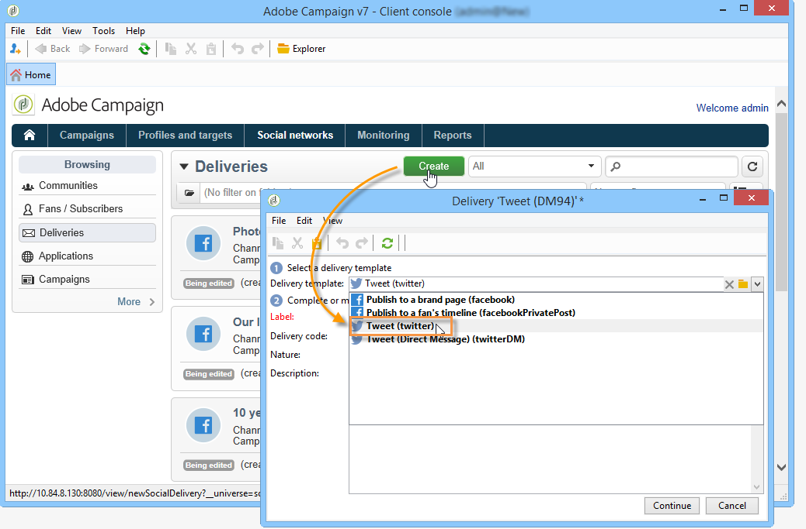

# Auf Twitter publizieren{#publishing-on-twitter}

## In Ihren Twitter-Konten publizieren {#publishing-on-your-twitter-accounts}

Nach Abschluss der Konfiguration können Sie mit Social Marketing Tweets an Ihre Twitter-Konten senden.

### Einschränkungen {#limitations}

Die folgenden Einschränkungen sind Beschränkungen, die Twitter-inhärent sind.

* Nachrichten dürfen nicht länger als 140 Zeichen sein.
* HTML-Format wird nicht unterstützt.

### Versand erstellen {#creating-the-delivery}

Erstellen Sie einen neuen Versand anhand der **[!UICONTROL Tweet (Twitter)]**-Versandvorlage.

### Hauptzielgruppe auswählen {#selecting-the-main-target}

Wählen Sie die Konten aus, an die Sie Tweets senden möchten.

1. Wählen Sie den Link **[!UICONTROL An]** aus.

   

1. Klicken Sie auf die Schaltfläche **[!UICONTROL Hinzufügen]**.

   

1. Wählen Sie **[!UICONTROL Twitter-Konto]** aus.

   

1. Wählen Sie im Feld **[!UICONTROL Ordner]** den Dienstordner aus, der das Twitter-Konto enthält. Wählen Sie dann das Twitter-Konto aus, an das Sie Ihren Tweet senden möchten.

   

### Testversand-Zielgruppe auswählen {#selecting-the-target-of-the-proof}

Über den Tab **[!UICONTROL Testversand-Zielgruppe]** können Sie das Twitter-Konto festlegen, das Sie vor dem endgültigen Versand für Testsendungen verwenden möchten. Wir empfehlen Ihnen daher, ein privates Twitter-Konto nur für Testsendungen zu erstellen. Weitere Informationen zum Erstellen eines privaten Twitter-Kontos finden Sie unter [Testkonto in Twitter erstellen](../../social/using/configuring-publishing-on-twitter.md#creating-a-test-account-on-twitter). Die Schritte zur Auswahl der Testversand-Zielgruppe entsprechen denen zur Auswahl der Hauptzielgruppe. Siehe [Testkonto in Twitter erstellen](../../social/using/configuring-publishing-on-twitter.md#creating-a-test-account-on-twitter).

>[!NOTE]
>
>Wenn Sie dasselbe Twitter-Konto für alle Sendungen verwenden, können Sie die Testversand-Zielgruppe in der Versandvorlage **[!UICONTROL Tweet]** speichern, auf die über den Knoten **[!UICONTROL Ressourcen > Vorlagen > Versandvorlagen]** zugegriffen werden kann. Die Testversand-Zielgruppe wird dann standardmäßig bei jedem neuen Versand eingegeben.

### Nachrichteninhalt festlegen {#defining-the-message-content}

Geben Sie den Inhalt Ihres Tweets im Tab **[!UICONTROL Inhalt]** ein.

### Vorschau anzeigen {#viewing-the-preview}

Im Tab **[!UICONTROL Vorschau]** können Sie das Rendering des Tweets anzeigen.

1. Klicken Sie auf den **[!UICONTROL Vorschau]**-Tab.
1. Klicken Sie auf das Dropdown-Menü **[!UICONTROL Personalisierung testen]** und wählen Sie **[!UICONTROL Dienst]** aus.
1. Wählen Sie im Feld **[!UICONTROL Ordner]** den Dienstordner aus, der Ihr Twitter-Konto enthält.
1. Wählen Sie das Twitter-Konto aus, mit dem Sie die Vorschau testen möchten.

>[!NOTE]
>
>Die Vorschau unterscheidet sich möglicherweise geringfügig vom endgültigen Tweet. Es wird dringend empfohlen, vor dem endgültigen Versand einen Testversand abzuschicken, um ein genaues Rendering des Tweet anzuzeigen. Siehe [Testversand durchführen](#sending-the-proof).

### Tracking-Konfiguration {#configuring-tracking}

Tracking kann in den Versandberichten und im Tab **[!UICONTROL Bearbeiten > Tracking]** des Versands und des Dienstes eingesehen werden.

Die Tracking-Konfiguration ist dieselbe wie bei einem E-Mail-Versand. Weiterführende Informationen hierzu finden Sie in [diesem Abschnitt](../../delivery/using/monitoring-a-delivery.md).

>[!NOTE]
>
>In der Versandvorlage **[!UICONTROL Tweet]** ist Tracking standardmäßig aktiviert.

>[!IMPORTANT]
>
>Wir können nicht zwischen Robotern, die Tweets analysieren, und Benutzern, die tatsächlich klicken, unterscheiden.

### Testversand durchführen {#sending-the-proof}

Es wird dringend empfohlen, vor dem endgültigen Versand einen Testversand Ihrer Publikation durchzuführen, um das genaue Rendering der Publikation einer privaten Twitter-Testseite anzuzeigen. Weitere Informationen zum Erstellen eines privaten Twitter-Kontos finden Sie unter [Testkonto in Twitter erstellen](../../social/using/configuring-publishing-on-twitter.md#creating-a-test-account-on-twitter). Die Schritte zur Auswahl der Zielgruppe für den Testversand werden unter [Testversand-Zielgruppe auswählen](#selecting-the-target-of-the-proof) beschrieben.

Der Testversand ist mit dem E-Mail-Versand identisch. Siehe [diesen Abschnitt](../../delivery/using/steps-validating-the-delivery.md#sending-a-proof).

### Nachricht senden {#sending-the-message}

1. Nachdem der Inhalt validiert wurde, klicken Sie auf die Schaltfläche **[!UICONTROL Senden]**.
1. Wählen Sie **[!UICONTROL Sendungen schnellstmöglich abschicken]** aus und klicken Sie auf die Schaltfläche **[!UICONTROL Analysieren]**.

   >[!NOTE]
   >
   >Mit der Option **[!UICONTROL Versand terminieren]** können Sie den Versand auf einen späteren Zeitpunkt verschieben.

   

1. Überprüfen Sie nach Abschluss der Analyse das Ergebnis.
1. Klicken Sie auf **[!UICONTROL Absendung bestätigen]** und dann auf **[!UICONTROL Ja]**.

## Direktnachrichten an Abonnenten senden {#sending-direct-messages-to-subscribers}

### Grundprinzip {#operating-principle}

Der Workflow **[!UICONTROL Twitter-Konten synchronisieren]** (siehe [Twitter-Konten synchronisieren](../../social/using/configuring-publishing-on-twitter.md#synchronizing-twitter-accounts)) stellt die Liste der Twitter-Abonnenten wieder her, damit Sie ihnen Direktnachrichten senden können. Die wiederhergestellten Follower werden in einer spezifischen Tabelle gespeichert: der Besuchertabelle. Um die Liste der Twitter-Follower anzuzeigen, gehen Sie zum Knoten **[!UICONTROL Profile und Zielgruppen > Besucher]**.

>[!IMPORTANT]
>
>Damit der Workflow die Liste der Twitter-Follower wiederherstellen kann, muss das Feld **[!UICONTROL Twitter-Konten synchronisieren]** im Bildschirm „Bearbeiten“ des mit dem Konto verknüpften Dienstes aktiviert sein. Weitere Informationen hierzu finden Sie unter [Schreibzugriff an Adobe Campaign delegieren](../../social/using/configuring-publishing-on-twitter.md#delegating-write-access-to-adobe-campaign).

Für jeden Follower stellt Adobe Campaign die folgenden Informationen wieder her:

* **[!UICONTROL Ursprung]**: Name des sozialen Netzwerks (in diesem Fall **Twitter**)
* **[!UICONTROL Externe Kennung]**: Benutzerkennung
* **[!UICONTROL Benutzername]**: Kontoname des Benutzers
* **[!UICONTROL Vollständiger Name]**: Name des Benutzers
* **[!UICONTROL Sprache]**: Benutzersprache
* **[!UICONTROL Anzahl Freunde]**: Anzahl der Follower
* **[!UICONTROL Zeitzone]**: Zeitzone des Benutzers
* **[!UICONTROL Bestätigt]**: Dieses Feld gibt an, ob der Benutzer über ein bestätigtes Twitter-Konto verfügt

### Einschränkungen {#limitations-1}

Die folgenden Einschränkungen sind Beschränkungen, die Twitter-inhärent sind.

* Nachrichten dürfen nicht länger als 140 Zeichen sein.
* HTML wird nicht unterstützt.
* Sie können nicht mehr als 250 Direktnachrichten pro Tag senden. Um eine Überschreitung dieses Schwellenwerts zu vermeiden, können Sie in mehreren Schüben senden. Sendungen in Schüben werden wie E-Mail-Sendungen konfiguriert. Weiterführende Informationen hierzu finden Sie in [diesem Abschnitt](../../delivery/using/steps-sending-the-delivery.md#sending-using-multiple-waves).

### Versand erstellen {#creating-the-delivery-}

Erstellen Sie einen neuen Versand anhand der **[!UICONTROL Twittern (Direct Message)]**-Versandvorlage.

### Hauptzielgruppe auswählen {#selecting-the-main-target-1}

Wählen Sie die Follower aus, an die Sie Ihre Direktnachricht senden möchten.

1. Wählen Sie den Link **[!UICONTROL An]** aus.

   

1. Klicken Sie auf die Schaltfläche **[!UICONTROL Hinzufügen]**.

   

1. Wählen Sie einen Typ der Zielgruppenbestimmung aus.

   

   * Wählen Sie **[!UICONTROL Twitter-Abonnenten]** aus, um eine Direktnachricht an alle Follower des Kontos zu senden.

      >[!IMPORTANT]
      >
      >Sie können nicht mehr als 250 Nachrichten pro Tag senden. Wenn Ihr Twitter-Konto mehr als 250 Follower hat, empfehlen wir dringend das Sendungen in Schüben. Dies umfasst den gleichen Prozess wie E-Mail-Sendungen. Siehe [diesen Abschnitt](../../delivery/using/steps-sending-the-delivery.md#sending-using-multiple-waves).

   * Wählen Sie **[!UICONTROL Filterbedingungen]** aus, um eine Abfrage zu definieren und deren Ergebnis anzuzeigen. Diese Option ist dieselbe wie bei E-Mail-Sendungen. Weitere Informationen finden Sie in [diesem Abschnitt](../../platform/using/defining-filter-conditions.md).

      

### Testversand-Zielgruppe auswählen {#selecting-the-target-of-the-proof-1}

Über den Tab **[!UICONTROL Testversand-Zielgruppe]** können Sie den Follower für den Testversand Ihrer Direktnachricht auswählen. Der Auswahlprozess entspricht dem für die Hauptzielgruppe. Siehe [Hauptzielgruppe auswählen](#selecting-the-main-target).

>[!NOTE]
>
>Wenn Sie alle Ihre Testsendungen für Direktnachrichten an denselben Twitter-Follower senden möchten, können Sie die Testversand-Zielgruppe in der Versandvorlage für **[!UICONTROL Twittern (Direct Message)]** speichern, die über den Knoten **[!UICONTROL Ressourcen > Vorlagen > Versandvorlagen]** aufgerufen wird. Die Testversand-Zielgruppe wird dann standardmäßig bei jedem neuen Versand eingegeben.

### Nachrichteninhalt festlegen {#defining-message-content-}

Geben Sie den Inhalt des Tweets im Tab **[!UICONTROL Inhalt]** ein.

Personalisierungsfelder können auf dieselbe Weise wie für E-Mail-Sendungen verwendet werden, um beispielsweise den Namen des Followers im Nachrichtentext hinzuzufügen. Die Inhaltspersonalisierung wird im Detail in [diesem Abschnitt](../../delivery/using/about-personalization.md) beschrieben.

Die folgenden Schritte sind identisch mit dem Senden eines Tweets an ein Twitter-Konto. Siehe [In Ihren Twitter-Konten publizieren](#publishing-on-your-twitter-accounts).
