# Umfrage entwerfen{#building-a-survey}

## Neue Umfrage erstellen {#creating-a-new-survey}

In diesem Abschnitt werden die Erstellung eines Formulars vom Typ **Umfrage** in Adobe Campaign sowie die verfügbaren Optionen und Konfigurationen beschrieben. Mit Adobe Campaign können Sie diese Umfrage Benutzern zur Verfügung stellen sowie Antworten erfassen und in der Datenbank archivieren.

Der Zugriff auf Webformulare erfolgt über die **[!UICONTROL Ressourcen > Online > Webanwendungen]** Knoten des Baums. Um eine Umfrage zu erstellen, klicken Sie auf die **[!UICONTROL Neu]** oberhalb der Liste der Anwendungen oder klicken Sie mit der rechten Maustaste auf die Liste und wählen Sie **[!UICONTROL Neu]**.

Wählen Sie die Umfragenvorlage (standardmäßig **[!UICONTROL newSurvey]**) aus.

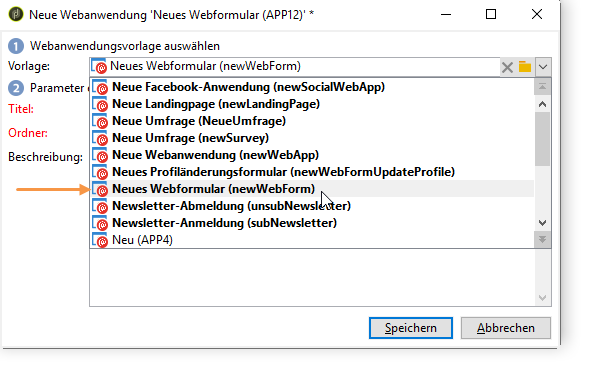

Die Seiten des Formulars werden mit einem speziellen Editor erstellt, der die Definition und Konfiguration von (Text-) Eingabefeldern, Auswahlfeldern (Listen, Checkboxes usw.) und statischen Elementen (Bildern, HTML-Inhalten usw.) ermöglicht. Diese Elemente können in &quot;Containern&quot; zusammengefasst und nach Bedarf angeordnet werden. [Weitere Informationen](#adding-questions).

>[!NOTE]
>
>Weiterführende Informationen zur Definition von Inhalten und zur Erstellung von Bildschirm-Layouts für ein Web-Formular finden Sie in [diesem Dokument](../../web/using/about-web-forms.md).

## Felder hinzufügen {#adding-fields}

Die Felder in einem Formular ermöglichen es Benutzern, Informationen einzugeben und Optionen auszuwählen. Sie werden für jede Formularseite über die erste Schaltfläche in der Symbolleiste mit der **[!UICONTROL Mithilfe des Assistenten hinzufügen]** Menü.

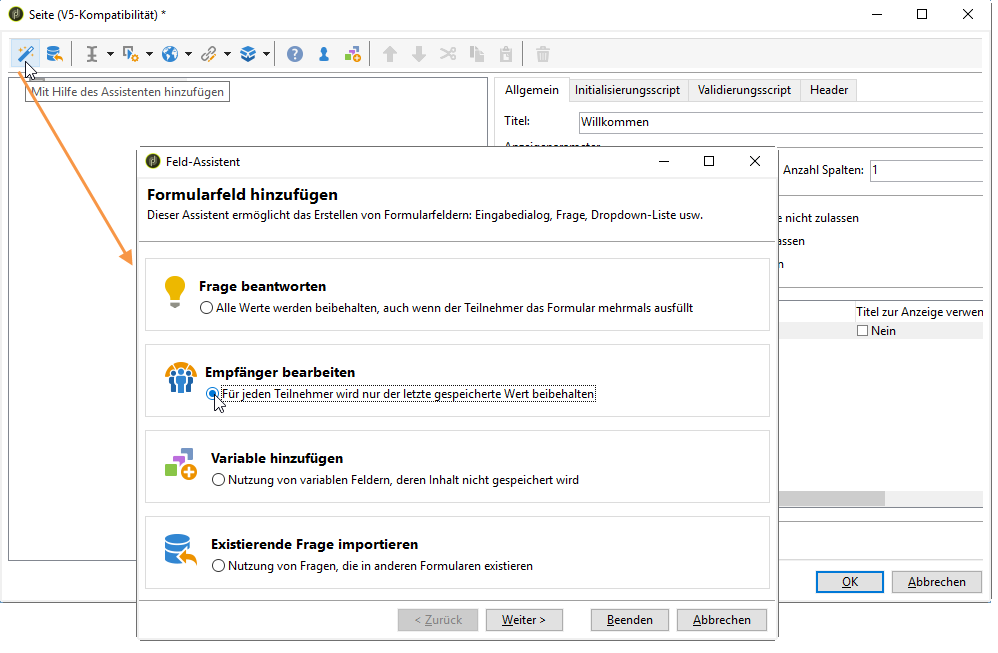

>[!NOTE]
>
>Sie können ein Eingabefeld auch mit einem Rechtsklick einfügen. Standardmäßig wird das Eingabefeld am Ende des ausgewählten Baums eingefügt. Sie können es dann mit den Pfeilen in der Symbolleiste verschieben.

### Typen von Feldern {#types-of-fields}

Beim Hinzufügen eines Felds zu einer Umfrage müssen Sie den Typ des Felds auswählen. Die folgenden Optionen sind verfügbar:

1. **[!UICONTROL Eine Frage beantworten]**: Mit dieser Option können Sie ein neues Feld zum Speichern von Antworten deklarieren (auch &quot;archiviertes Feld&quot;genannt). In diesem Fall werden alle erfassten Werte gespeichert, auch wenn ein Teilnehmer das Formular mehrmals ausfüllt. Dieser Speichermodus ist nur verfügbar in **Umfragen**. [Weitere Informationen](../../surveys/using/managing-answers.md#storing-collected-answers).
1. **[!UICONTROL Empfänger bearbeiten]**: Mit dieser Option können Sie ein Feld in der Datenbank auswählen. In diesem Fall werden die Antworten des Besuchers in diesem Feld gespeichert. Für jeden Besucher wird nur der jeweils letzte Wert gespeichert und zu den Profildaten hinzugefügt.
1. **[!UICONTROL Variable hinzufügen]**: Mit dieser Option können Sie die Umfrage so einrichten, dass die Informationen nicht in der Datenbank gespeichert werden. Die lokalen Variablen können entweder in vorgelagerten Schritten festgelegt oder direkt bei der Erstellung des Felds hinzugefügt werden.
1. **[!UICONTROL Existierende Frage importieren]**: Mit dieser Option können Sie bereits vorhandene, in anderen Umfragen erstellte Fragen importieren.

   >[!NOTE]
   >
   >Speichermodi und Feldimporte werden in [diesem Abschnitt](../../surveys/using/managing-answers.md#storing-collected-answers) beschrieben.

Die Art des hinzuzufügenden Felds (Dropdown-Liste, Textfeld, Kontrollkästchen usw.) hängt vom ausgewählten Speichermodus ab. Sie können sie mithilfe des **[!UICONTROL Typ]** des **[!UICONTROL Allgemein]** angezeigt, achten Sie jedoch darauf, dass sie mit dem Datentyp konsistent bleiben.

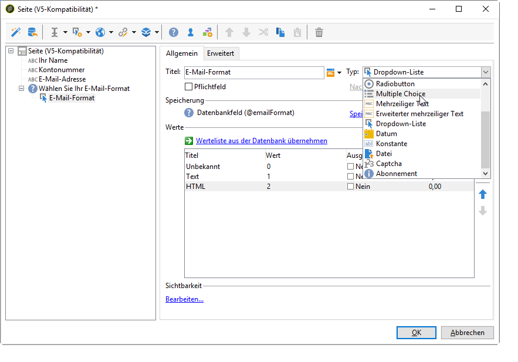

Die unterschiedlichen Typen verfügbarer Felder werden in [diesem Abschnitt](../../web/using/about-web-forms.md) beschrieben.

## Elemente einer Umfrage {#survey-specific-elements}

Online-Umfragen basieren auf den Funktionen von Web-Anwendungen. Im Folgenden werden die umfragespezifischen Funktionen beschrieben.

### Multiple Choice {#multiple-choice}

Für **[!UICONTROL Multiple Choice]** Steuerelemente vom Typ können Sie eine Mindest- und Höchstanzahl von Auswahlmöglichkeiten definieren. Beispielsweise können Sie mit dieser Option die Auswahl auf mindestens **2** -Werte und höchstens **4** Werte aus den verfügbaren Optionen:

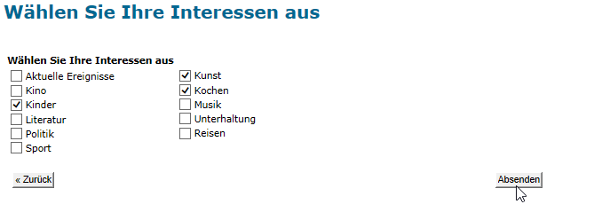

Wenn die Anzahl der ausgewählten Optionen zu groß oder zu klein ist, wird eine entsprechende Nachricht angezeigt.

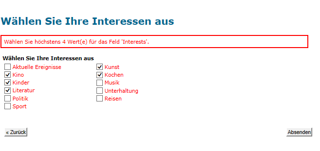

>[!NOTE]
>
>In diesem Fall werden die Optionen mithilfe von Checkboxes ausgewählt. Wenn nur eine Option möglich ist, wird ein Radiobutton verwendet.

Die entsprechende Konfiguration sieht folgendermaßen aus:

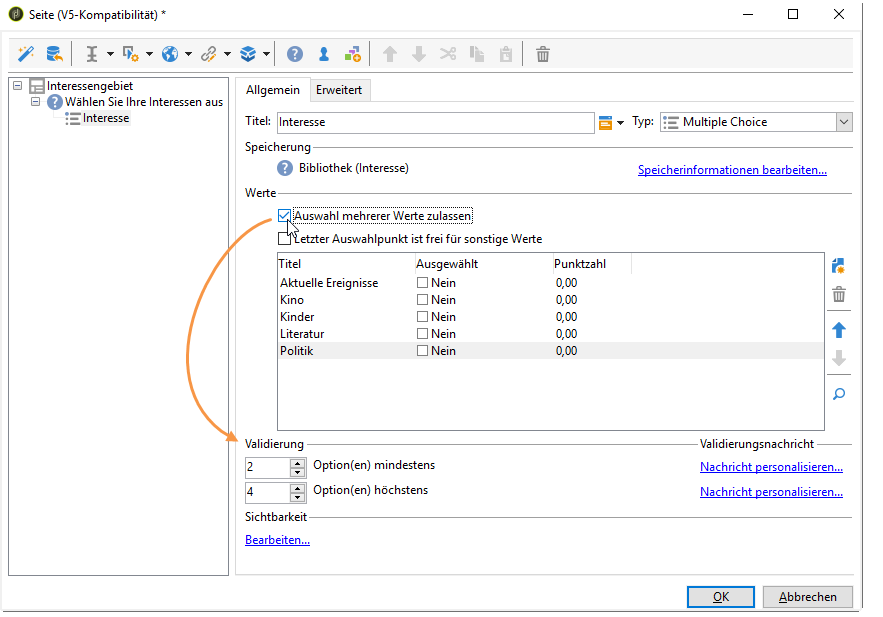

Zusätzlich muss der Speicherort für dieses Eingabefeld ein **archiviertes Feld** vom Typ **[!UICONTROL Mehrfachwerte]** sein:

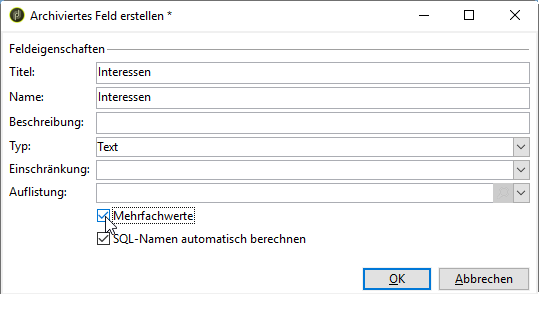

>[!CAUTION]
>
>* Diese Funktion ist nur für Formulare vom Typ **Umfrage** verfügbar.
>* Diese Option ist nicht mit der Anzeige zufälliger Fragen kompatibel. [Weitere Informationen](#adding-questions).

### Fragen hinzufügen {#adding-questions}

Es gibt zwei Typen von Containern: Standard und Frage. Standard-Container werden zur Konfiguration des Seiten-Layouts und zur bedingten Anzeige auf einer Seite verwendet. [Weitere Informationen](../../web/using/about-web-forms.md).

Mit einem **Frage**-Container können Sie eine Frage zur Seite hinzufügen und die möglichen Antworten darunter in der Hierarchie einfügen. Benutzerantworten zu Fragen, die in diesem Containertyp abgelegt werden, können in Berichten analysiert werden.

>[!CAUTION]
>
>Fügen Sie niemals einen **Frage-** Container unterhalb eines anderen **Frage**-Containers in der Hierarchie ein.

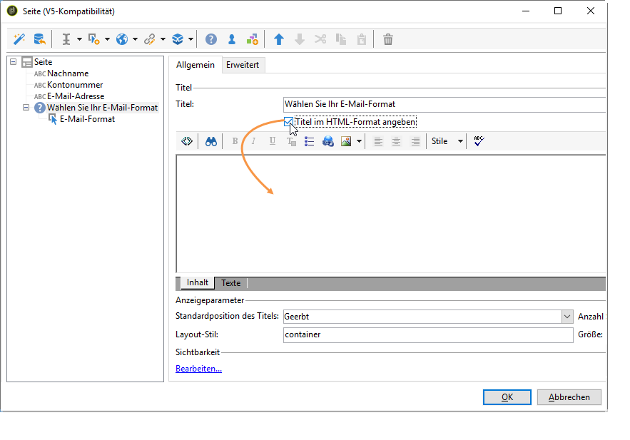

Der Titel der Frage wird im Titelfeld eingetragen. In diesem Fall wird der Stil des Formularstils angewendet. Wählen Sie die **[!UICONTROL Titel im HTML-Format eingeben]** zur Personalisierung. Dadurch erhalten Sie Zugriff auf den HTML-Editor.

>[!NOTE]
>
>Weiterführende Informationen zur Verwendung des HTML-Editors finden Sie in [diesem Dokument](../../web/using/about-web-forms.md).

Beispiel:

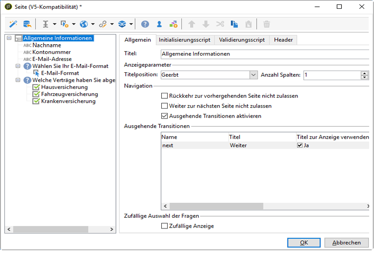

Im obigen Beispiel wird das Rendering wie folgt ausgeführt:

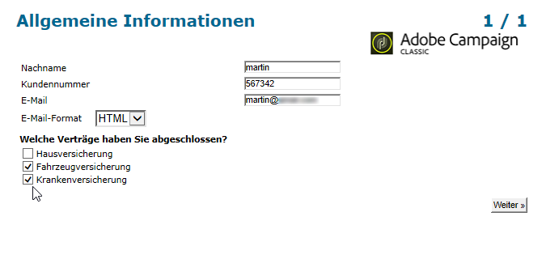

>[!NOTE]
>
>Jede Frage hat einen Container vom Typ **Frage**.

Sie können die zufällige Anzeige von Fragen durch Adobe Campaign aktivieren. Danach können Sie im Feld am unteren Rand des Konfigurationsfensters angeben, wie viele Fragen auf der Seite angezeigt werden sollen.

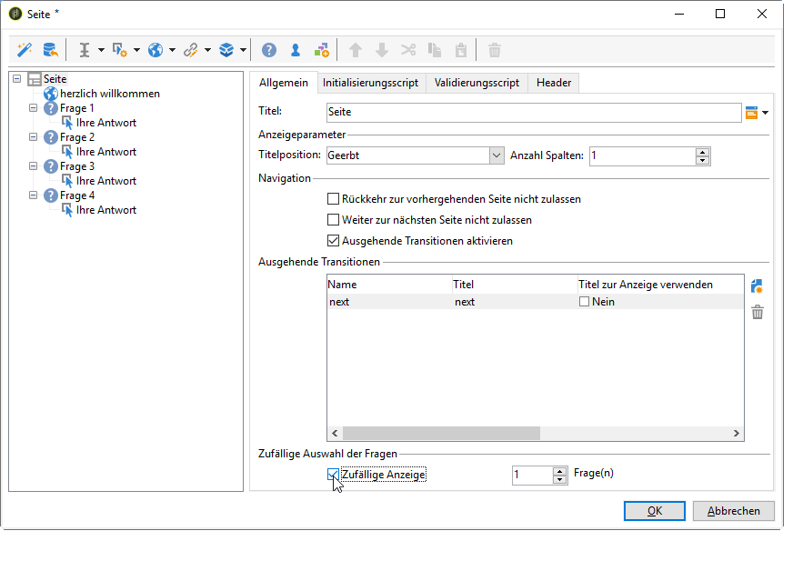

Die Grafik stellt sich folgendermaßen dar:

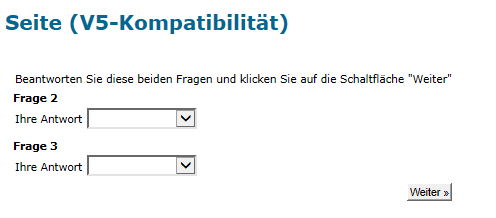

Wenn die Seite aktualisiert wird, ändert sich die Anzeige der Fragen.

>[!CAUTION]
>
>Achten Sie bei der zufälligen Anzeige von Fragen darauf (die Option **[!UICONTROL Zufällige Anzeige]** ist auf der Seite aktiviert), dass Sie keine Multiple-Choice-Fragen verwenden, für die mindestens eine Auswahl zwingend erforderlich ist.
