# Umfrage entwerfen{#building-a-survey}

## Neue Umfrage erstellen {#creating-a-new-survey}

In diesem Kapitel wird das Entwerfen eines Formulars des Typs **Umfrage** mit Adobe Campaign sowie die verfügbaren Optionen und Konfigurationen beschrieben. Mit Adobe Campaign können Sie diese Umfrage Benutzenden zur Verfügung stellen und Antworten in der Datenbank sammeln und archivieren.

Der Zugriff auf Webformulare erfolgt über den Knoten **[!UICONTROL Ressourcen > Online > Webanwendungen]** des Baums. Wählen Sie zur Erstellung einer neuen Umfrage oberhalb der Liste der Anwendungen die Schaltfläche **[!UICONTROL Neu]** aus oder rechtsklicken Sie auf die Liste und wählen Sie **[!UICONTROL Neu]** aus.

Wählen Sie die Umfragenvorlage (standardmäßig **[!UICONTROL newSurvey]**) aus.

Die Seiten des Formulars werden mit einem speziellen Editor erstellt, der die Definition und Konfiguration von Eingabefeldern (Text), Auswahlfeldern (Listen, Kontrollkästchen usw.) und statischen Elementen (Bildern, HTML-Inhalten usw.) ermöglicht. Sie können in „Containern“ gesammelt und nach Bedarf angelegt werden. [Weitere Informationen](#adding-questions).

>[!NOTE]
>
>Weiterführende Informationen zur Definition von Inhalten und zur Erstellung von Bildschirm-Layouts für ein Web-Formular finden Sie in [diesem Dokument](../../web/using/about-web-forms.md).

## Felder hinzufügen {#adding-fields}

Über Formularfelder können Benutzer Informationen eingeben und Optionen auswählen. Diese Felder werden für jede Formularseite mit der ersten Schaltfläche der Symbolleiste im Menü **[!UICONTROL Mithilfe des Assistenten hinzufügen]** erstellt.

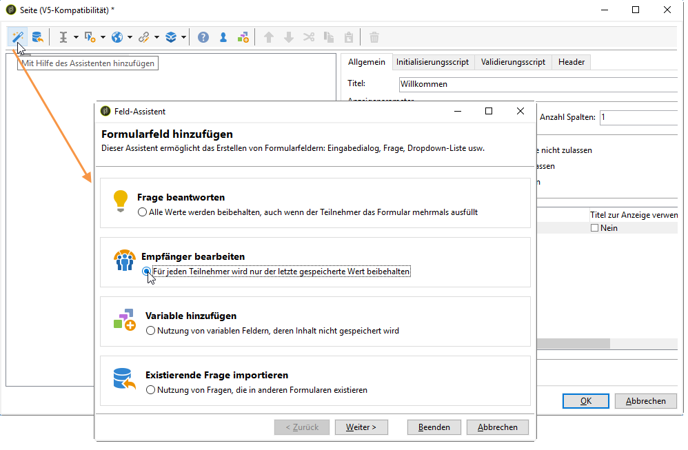

>[!NOTE]
>
>Sie können ein Eingabefeld auch über einen Rechtsklick einfügen. Standardmäßig wird das Feld am Ende der ausgewählten Struktur eingefügt. Verwenden Sie die Pfeile in der Symbolleiste, um es zu verschieben.

### Typen von Feldern {#types-of-fields}

Wenn Sie einer Umfrage ein Feld hinzufügen, müssen Sie den Typ auswählen.Folgende Optionen stehen zur Verfügung:

1. **[!UICONTROL Frage beantworten]**: Mit dieser Option können Sie ein neues Feld zum Speichern von Antworten festlegen („Archiviertes Feld“ genannt). In diesem Fall werden alle erfassten Werte gespeichert, auch wenn eine Teilnehmerin bzw. ein Teilnehmer ein Formular mehr als einmal ausfüllt. Dieser Speichermodus ist nur in **Fragebögen** verfügbar. [Weitere Informationen](../../surveys/using/managing-answers.md#storing-collected-answers).
1. **[!UICONTROL Empfänger bearbeiten]**: Mit dieser Option können Sie ein Feld in der Datenbank auswählen. In diesem Fall werden die Benutzerantworten in diesem Feld gespeichert. Für jede Teilnehmerin bzw. jeden Teilnehmer wird nur der letzte Wert gespeichert und den Profildaten hinzugefügt.
1. **[!UICONTROL Variable hinzufügen]**: Mit dieser Option können Sie einrichten, dass Informationen nicht in der Datenbank gespeichert werden. Lokale Variablen können zuvor deklariert werden. Sie können sie auch direkt beim Erstellen des Felds hinzufügen.
1. **[!UICONTROL Existierende Frage importieren]**: Mit dieser Option können Sie bereits vorhandene, in anderen Umfragen erstellte Fragen importieren.

   >[!NOTE]
   >
   >Speichermodi und Feldimporte werden in [diesem Abschnitt](../../surveys/using/managing-answers.md#storing-collected-answers) beschrieben.

Die Art des hinzuzufügenden Felds (Dropdown-Liste, Textfeld, Kontrollkästchen usw.) hängt vom ausgewählten Speichermodus ab. Der Feldtyp kann im Feld **[!UICONTROL Typ]** auf der Registerkarte **[!UICONTROL Allgemein]** geändert werden. Achten Sie dabei aber darauf, dass der Feldtyp zum Datentyp passt.

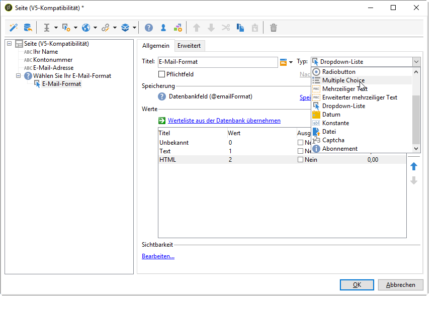

Die unterschiedlichen Typen verfügbarer Felder werden in [diesem Abschnitt](../../web/using/about-web-forms.md) beschrieben.

## Elemente einer Umfrage {#survey-specific-elements}

Online-Umfragen basieren auf den Funktionen von Web-Anwendungen. Im Folgenden werden die umfragespezifischen Funktionen beschrieben.

### Multiple Choice {#multiple-choice}

Für Steuerelemente des Typs **[!UICONTROL Multiple Choice]** können Sie eine Mindest- und Höchstanzahl von Auswahlmöglichkeiten definieren. Beispielsweise können Sie mit dieser Option die Auswahl auf mindestens **2** Werte und höchstens **4** Werte aus den verfügbaren Optionen erzwingen:

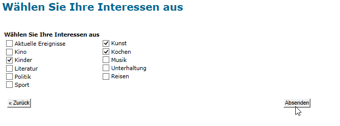

Wenn die Anzahl der ausgewählten Optionen zu groß oder zu klein ist, wird eine entsprechende Nachricht angezeigt.

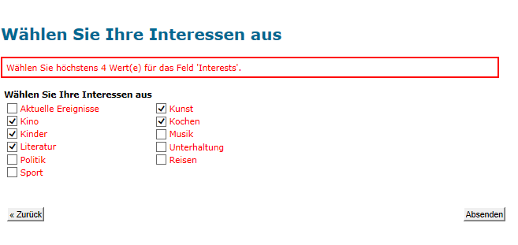

>[!NOTE]
>
>In diesem Fall werden die Optionen mithilfe von Kontrollkästchen ausgewählt. Wenn nur eine Option möglich ist, werden Optionsfelder verwendet.

Die entsprechende Konfiguration sieht folgendermaßen aus:

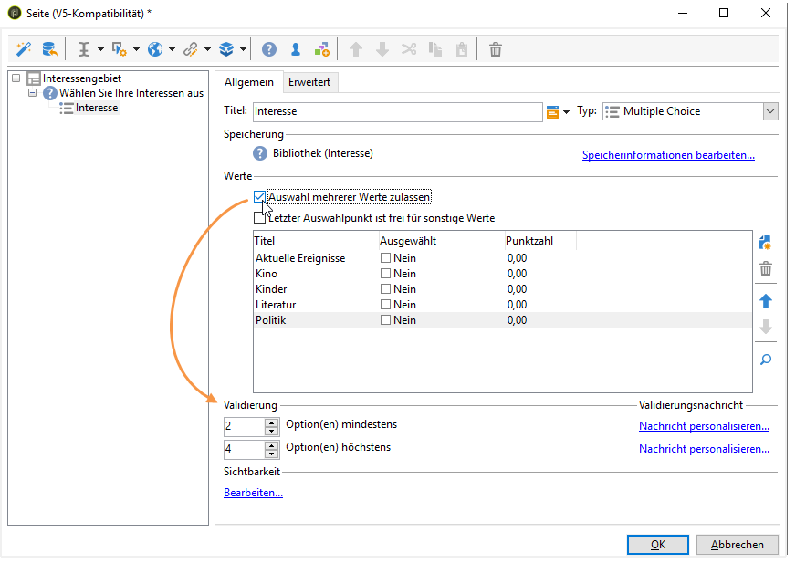

Zusätzlich muss der Speicherort für dieses Eingabefeld ein **archiviertes Feld** vom Typ **[!UICONTROL Mehrfachwerte]** sein:

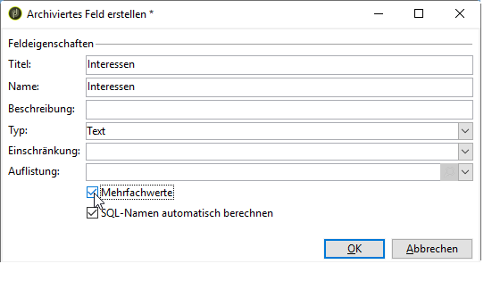

>[!CAUTION]
>
>* Diese Funktion ist nur für Formulare vom Typ **Umfrage** verfügbar.
>* Diese Option ist nicht mit der Anzeige zufälliger Fragen kompatibel. [Weitere Informationen](#adding-questions).

### Fragen hinzufügen {#adding-questions}

Es gibt zwei Container-Typen: Standard und Frage. Container des Typs „Standard“ werden zum Konfigurieren des Seiten-Layouts und zur bedingten Anzeige auf einer Seite verwendet. [Weitere Informationen](../../web/using/about-web-forms.md).

Verwenden Sie einen Container des Typs **Frage**, um der Seite eine Frage hinzuzufügen und die möglichen Antworten nachfolgend in der Hierarchie einzufügen. Benutzerantworten auf Fragen, die in diesem Container-Typ platziert werden, können in Berichten analysiert werden.

>[!CAUTION]
>
>Fügen Sie niemals einen **Frage-** Container unterhalb eines anderen **Frage**-Containers in der Hierarchie ein.

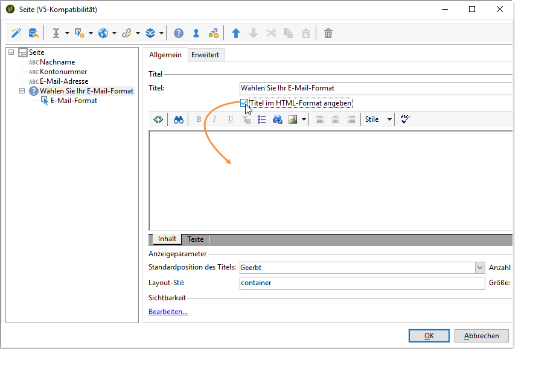

Der Titel der Frage wird im Titelfeld eingegeben. In diesem Fall wird der Stil des Stylesheets des Formulars angewendet. Wählen Sie die Option **[!UICONTROL Titel im HTML-Format angeben]** aus, um die Frage zu personalisieren. Dadurch erhalten Sie Zugriff auf den HTML-Editor.

>[!NOTE]
>
>Weiterführende Informationen zur Verwendung des HTML-Editors finden Sie in [diesem Dokument](../../web/using/about-web-forms.md).

Beispiel:

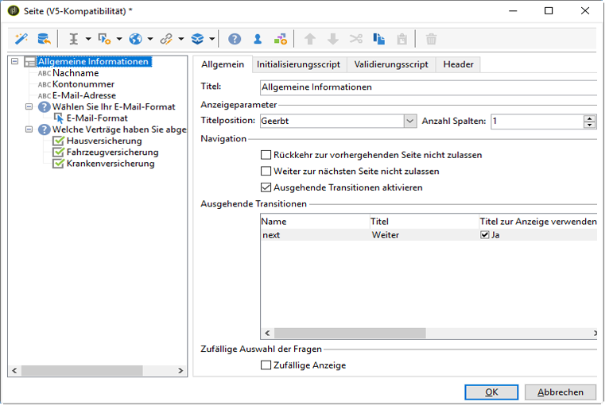

Im obigen Beispiel wird das Rendering wie folgt ausgeführt:

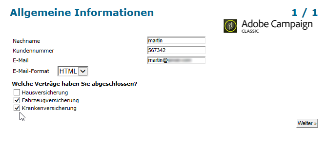

>[!NOTE]
>
>Jede Frage hat einen Container vom Typ **Frage**.

Sie können die Zufallsziehung von Fragen durch Adobe Campaign aktivieren. Dabei können Sie im Feld unten im Konfigurationsfenster die auf der Seite anzuzeigende Anzahl an Fragen angeben.

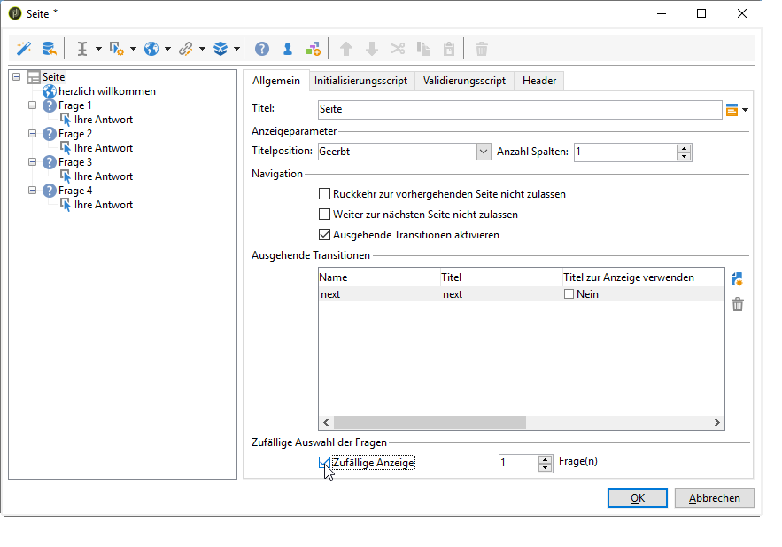

Die Grafik stellt sich folgendermaßen dar:

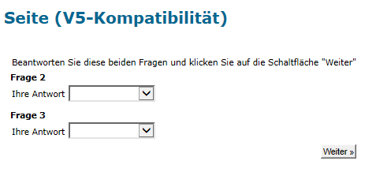

Wenn die Seite aktualisiert wird, ändert sich die Anzeige der Fragen.

>[!CAUTION]
>
>Achten Sie bei der zufälligen Anzeige von Fragen darauf (die Option **[!UICONTROL Zufällige Anzeige]** ist auf der Seite aktiviert), dass Sie keine Multiple-Choice-Fragen verwenden, für die mindestens eine Auswahl zwingend erforderlich ist.
