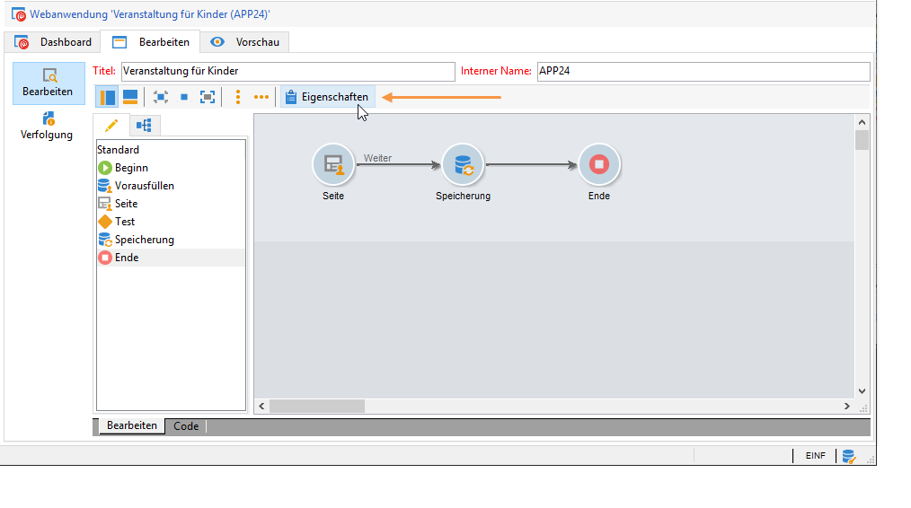

# Online-Umfragen konfigurieren{#configuring-surveys}

## Eigenschaften der Umfrage {#survey-properties}

Online-Umfragen können vollständig konfiguriert und auf Ihre Anforderungen angepasst werden. Geben Sie dazu im Eigenschaftenfenster die entsprechenden Parameter ein.

Die verfügbaren Parameter werden in [diesem Dokument](../../web/using/defining-web-forms-properties.md) erläutert.

## Speicherung der Umfragedaten {#survey-data-storage}

Standardmäßig werden die Felder des Webformulars in der Empfängertabelle gespeichert. Um eine andere Tabelle zu verwenden, wählen Sie sie im Feld **[!UICONTROL Dokumenttyp]** aus. Mit dem **[!UICONTROL Zoom]**-Symbol können Sie den Inhalt der ausgewählten Tabelle anzeigen.

Die nicht in den Feldern (sondern in lokalen Variablen) gespeicherten Umfrageantworten werden in der Tabelle **Umfrageantworten** gespeichert. Sie können das verwendete Schema im Feld **[!UICONTROL Bibliothek]** ändern. Dieses Feld steht nur für **Umfragen** zur Verfügung.
