# Erfasste Daten veröffentlichen, tracken und verwenden{#publish-track-and-use-collected-data}


Nachdem das Formular erstellt, konfiguriert und veröffentlicht wurde, können Sie den Link mit Ihrer Zielgruppe teilen und die Antworten tracken.

>[!NOTE]
>
>Der Lebenszyklus einer Umfrage in Adobe Campaign sowie ihre Veröffentlichungs- und Versandmodi sind ähnlich jenen von Webformularen: Diese werden in [diesem Abschnitt](../../web/using/about-web-forms.md) beschrieben.

## Umfrage-Dashboard {#survey-dashboard}

Jede Umfrage verfügt über ein eigenes Dashboard, über das Sie den Status, die Beschreibung, die öffentliche URL und den Zeitplan für die Verfügbarkeit aufrufen können. Außerdem können Sie die verfügbaren Berichte anzeigen. [Weitere Informationen](#reports-on-surveys).

Die öffentliche URL der Umfrage wird im Dashboard angezeigt:

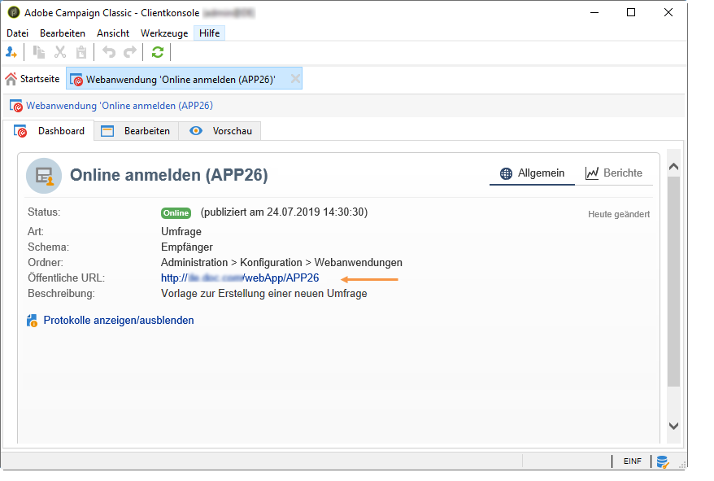

## Antworten tracken {#response-tracking}

Sie können die Antworten auf die Umfrage in Logs und Berichten verfolgen.

### Umfrage-Logs {#survey-logs}

Für jede durchgeführte Umfrage können Sie die Antworten auf der Registerkarte **[!UICONTROL Protokolle]** verfolgen. Auf dieser Registerkarte wird die Liste der Benutzer angezeigt, die die Umfrage abgeschlossen haben, sowie deren Herkunft:

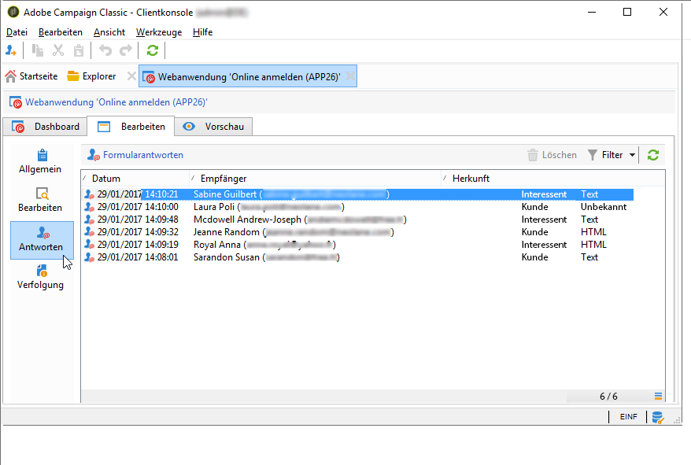

Doppelklicken Sie auf eine Zeile, um das Umfrageformular so anzuzeigen, wie es von der Auskunftsperson ausgefüllt wurde. Sie können die Umfrage vollständig durchsuchen und auf alle Antworten zugreifen. Diese können in eine externe Datei exportiert werden. Weitere Informationen finden Sie unter [Antworten exportieren](#exporting-answers).

Die Herkunft wird in der Umfrage-URL durch Hinzufügen folgender Buchstaben gekennzeichnet:

```
?origin=xxx
```

Während die Umfrage bearbeitet wird, enthält ihre URL den Parameter **[!UICONTROL __uuid]**, was darauf hinweist, dass sie sich in einer Testphase befindet und noch nicht online ist. Wenn Sie über diese URL auf die Umfrage zugreifen, werden die erstellten Datensätze bei der Verfolgung (in Berichten) nicht berücksichtigt. Für die Herkunft wird der Wert **[!UICONTROL Adobe Campaign]** übernommen.

Weiterführende Informationen zu URL-Parametern finden Sie auf [dieser Seite](../../web/using/defining-web-forms-properties.md#form-url-parameters).

### Berichte zu Umfragen {#reports-on-surveys}

Über die Registerkarte Dashboard können Sie auf Umfrageberichte zugreifen. Klicken Sie auf einen Berichtsnamen, um ihn anzuzeigen.

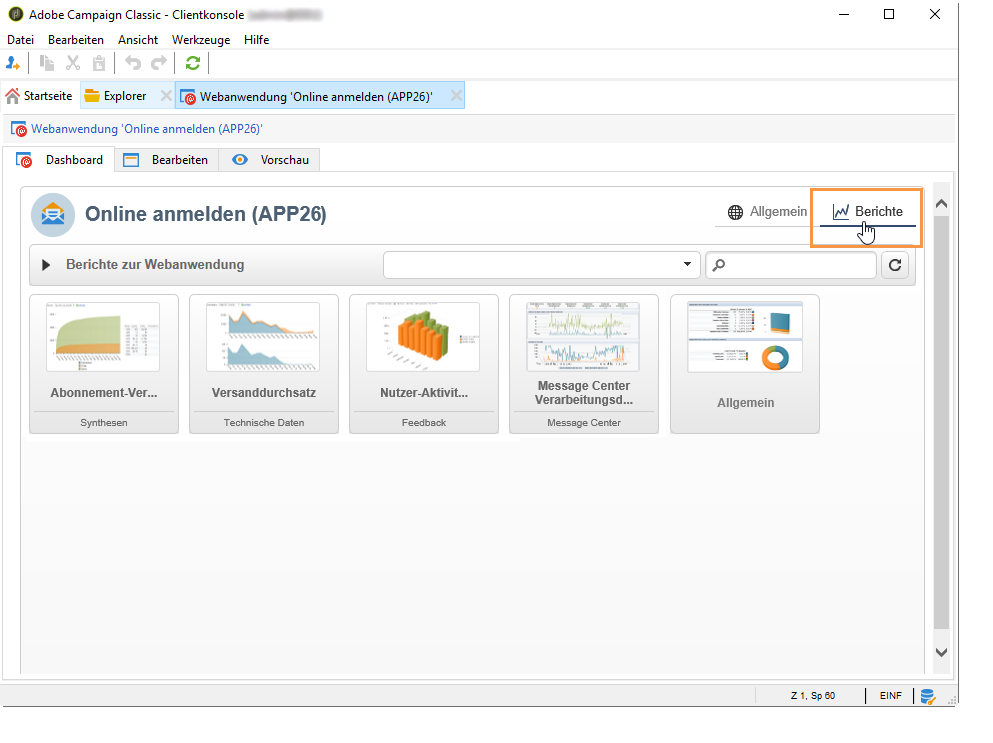

Im Bericht **[!UICONTROL Dokumentation]** wird die Struktur der Umfrage dargestellt.

Im Tab **[!UICONTROL Berichte]** sind zwei weitere Berichte zu Webumfragen verfügbar: **[!UICONTROL Allgemein]** und **[!UICONTROL Aufschlüsselung der Antworten]**.

* Allgemein

  Dieser Bericht enthält allgemeine Informationen zur Umfrage: die Veränderung der Anzahl der Antworten im Zeitverlauf und die Verteilung nach Herkunft und Sprache.

  Beispiel für einen allgemeinen Bericht:

  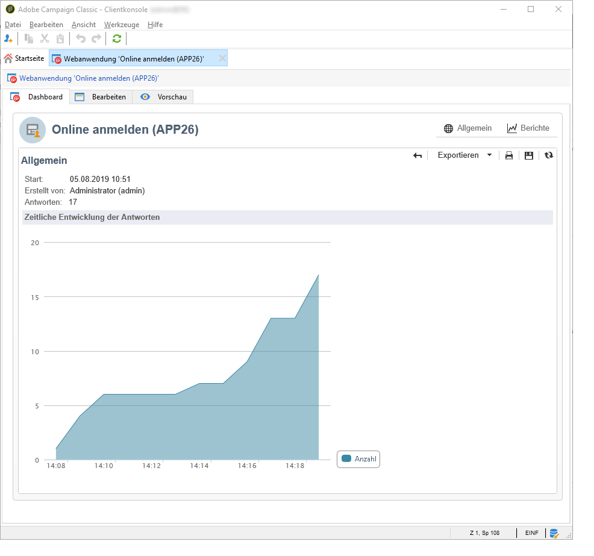

* Aufschlüsselung der Antworten

  Dieser Bericht zeigt die Antwortenaufschlüsselung für jede Frage. Diese Aufschlüsselung ist nur für Antworten auf Felder verfügbar, die in Containern vom Typ **[!UICONTROL Frage]** gespeichert sind. Sie gilt nur für Auswahldialoge (beispielsweise keine Aufschlüsselung für Textfelder).

  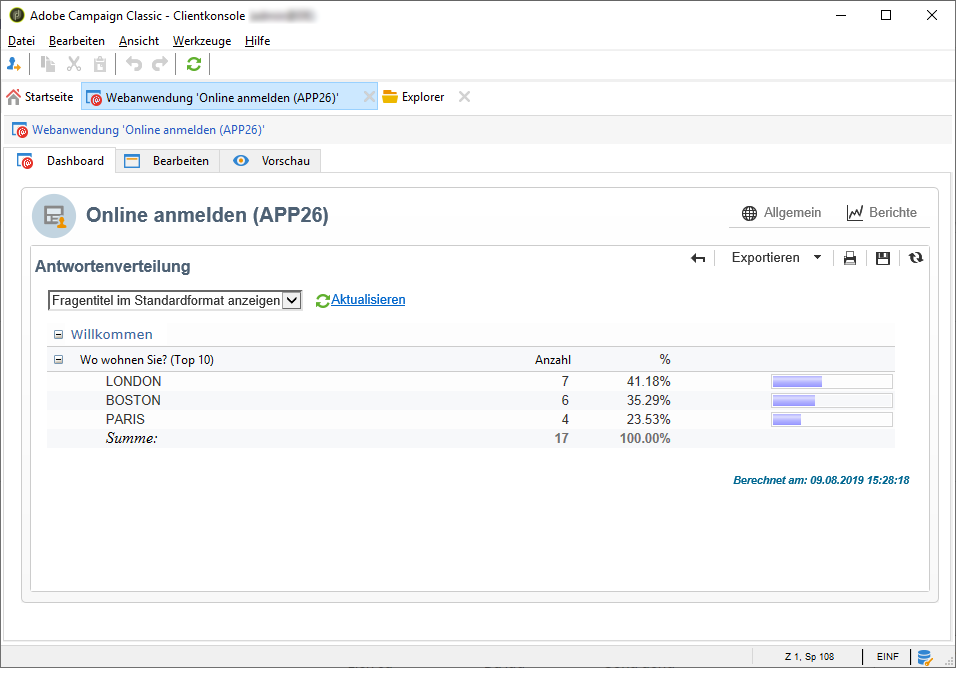

## Antworten exportieren {#exporting-answers}

Antworten auf eine Umfrage können in einer externen Datei exportiert und später verarbeitet werden. Dazu gibt es zwei Möglichkeiten:

1. Berichtsdaten exportieren

   Um Berichtsdaten zu exportieren, wählen Sie die Schaltfläche **[!UICONTROL Exportieren]** und danach das Exportformat aus.

   Weiterführende Informationen zum Exportieren von Berichtdaten finden Sie in [diesem Abschnitt](../../reporting/using/about-reports-creation-in-campaign.md).

1. Antworten exportieren

   Um Antworten zu exportieren, wählen Sie in der Umfrage die Registerkarte **[!UICONTROL Antworten]** aus und rechtsklicken Sie darauf. Wählen Sie dann **[!UICONTROL Exportieren...]** aus.

   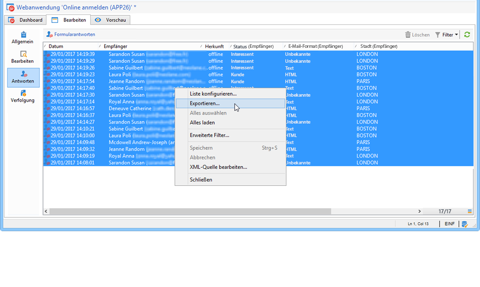

   Geben Sie anschließend die Informationen ein, die Sie exportieren möchten, sowie die Speicherdatei.

   Sie können den Inhalt und das Format der Ausgabedatei im Export-Assistenten konfigurieren.

   Sie können beispielsweise:

   * Spalten zur Ausgabedatei hinzufügen und Informationen über den Empfänger abrufen (die in der Datenbank gespeichert sind);
   * die exportierte Datei formatieren;
   * das Codierungsformat für die Daten in der Datei auswählen.

   Wenn die zu exportierende Umfrage mehrere Felder mit **[!UICONTROL mehrzeiligem Text]** oder **[!UICONTROL HTML-Text]** enthält, muss sie im **[!UICONTROL XML]**-Format exportiert werden. Wählen Sie dazu dieses Format aus der Dropdown-Liste im Feld **[!UICONTROL Ausgabeformat]** wie unten dargestellt aus:

   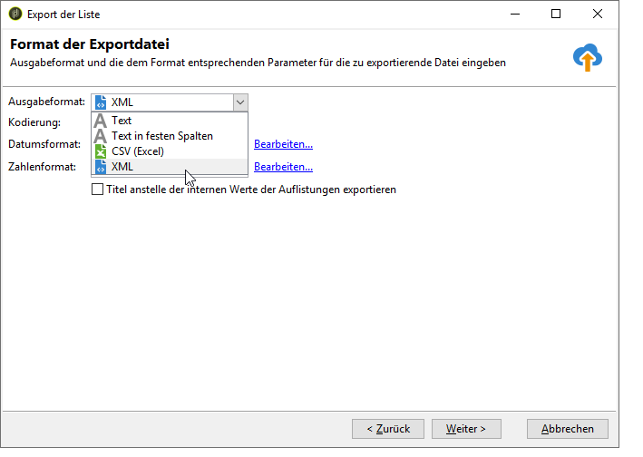

   Klicken Sie auf **[!UICONTROL Starten]**, um mit dem Export zu beginnen.

   >[!NOTE]
   >
   >Der Datenexport und die Konfigurationsschritte werden in [diesem Abschnitt](../../platform/using/about-generic-imports-exports.md) beschrieben.

## Die erfassten Daten nutzen {#using-the-collected-data}

Die durch Online-Umfragen gesammelten Daten können im Rahmen eines Zielgruppen-Workflows abgerufen werden. Verwenden Sie zu diesem Zweck die Box **[!UICONTROL Umfrageantworten]**.

Im folgenden Beispiel möchten wir ein Web-Angebot speziell für die fünf Empfangenden mit mindestens zwei Kindern und den höchsten Werten bei einer Online-Umfrage erstellen. Die Antworten auf diese Umfrage lauten:

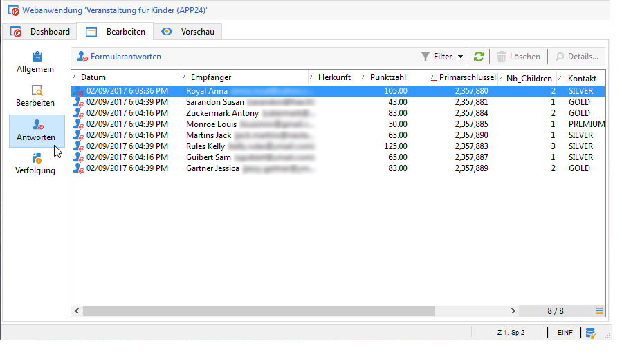

Im Zielgruppen-Workflow werden die **[!UICONTROL Umfrageantworten]** folgendermaßen konfiguriert:

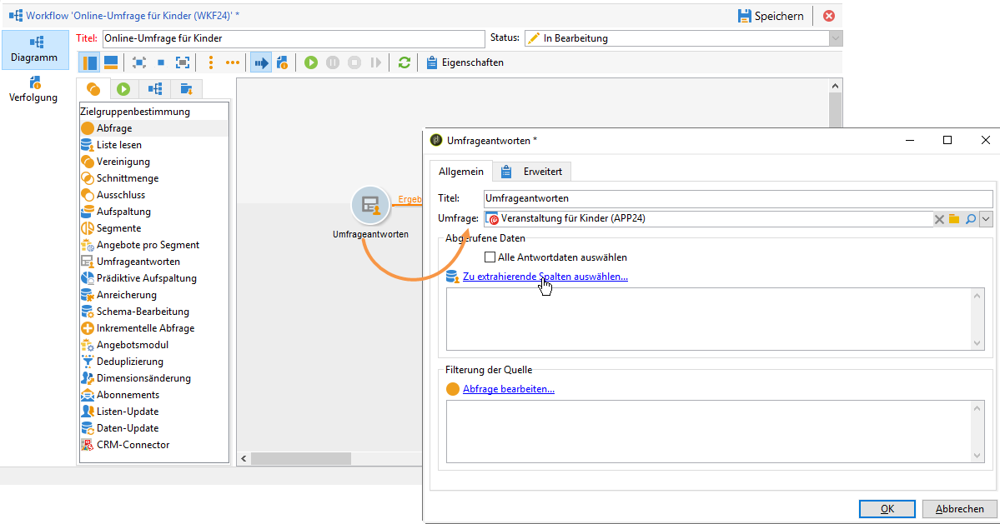

Wählen Sie zunächst die betreffende Umfrage und dann im mittleren Bereich des Fensters die zu extrahierenden Daten aus. In diesem Fall müssen wir mindestens die Score-Spalte extrahieren, da sie in der Split-Box verwendet wird, um die fünf höchsten Score-Werte abzurufen.

Geben Sie die Filterbedingungen für Antworten ein, indem Sie den Link **[!UICONTROL Abfrage bearbeiten...]** auswählen.

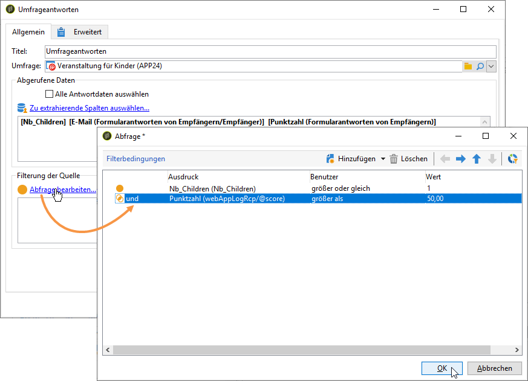

Zielgruppenbestimmungs-Workflow starten Die Abfrage ruft 8 Empfänger ab.

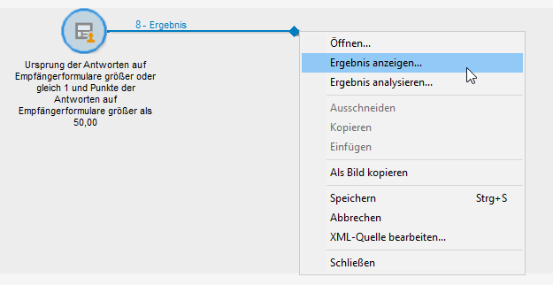

Um sie anzuzeigen, rechtsklicken Sie auf die ausgehende Transition der Sammlungsbox.

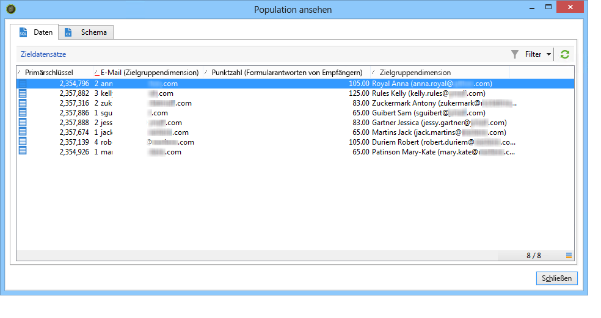

Platzieren Sie dann eine Aufspaltungsbox in den Workflow, um die fünf Empfänger mit den meisten Punkten abzurufen.

Bearbeiten Sie die Aufspaltungsbox, um sie zu konfigurieren:

* Wählen Sie zunächst im Tab **[!UICONTROL Allgemein]** das entsprechende Schema aus und konfigurieren Sie dann die Untereinheit:

  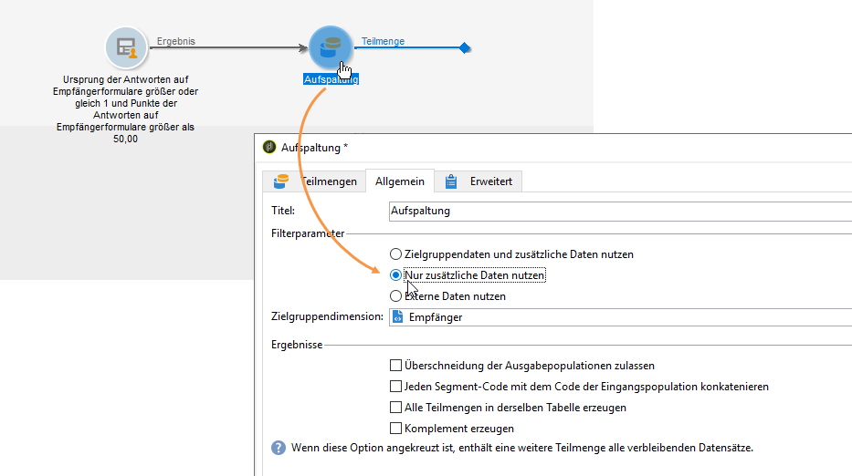

* Gehen Sie zum Tab **[!UICONTROL Teilmengen]** und wählen Sie die Option **[!UICONTROL Anzahl von Datensätzen begrenzen]** und danach den Link **[!UICONTROL Bearbeiten...]** aus.

  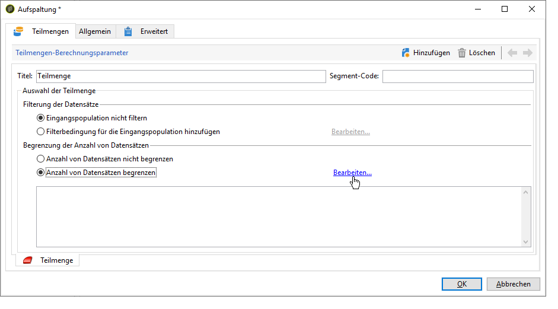

* Wählen Sie die Option **[!UICONTROL Die ersten aus einer Sortierung hervorgehenden Elemente beibehalten]** und dann die Spalte, nach der sortiert werden soll, aus. Aktivieren Sie die Option **[!UICONTROL Absteigende Sortierung]**.

  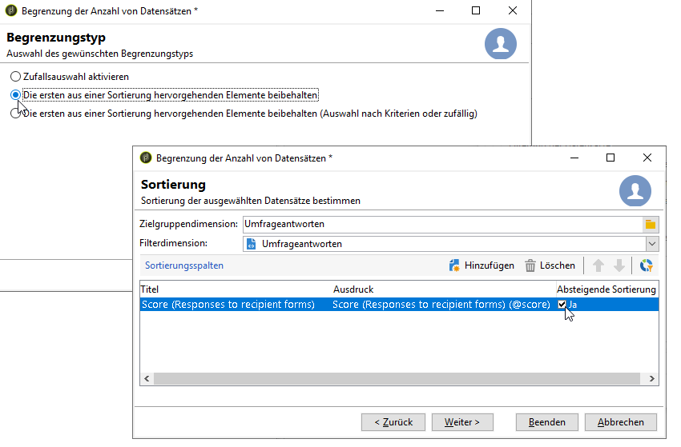

* Wählen Sie die Schaltfläche **[!UICONTROL Weiter]** aus und beschränken Sie die Anzahl der Datensätze auf fünf.

  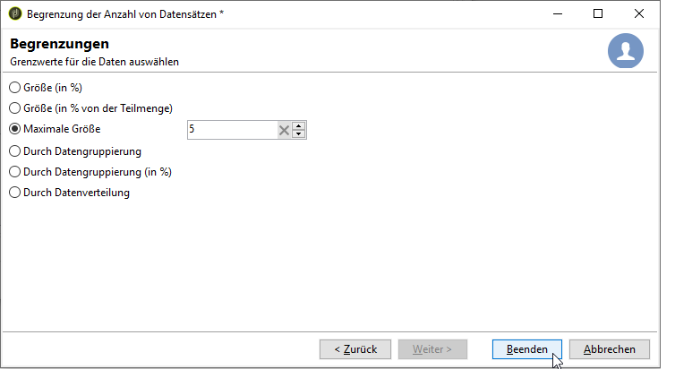

* Wählen Sie **[!UICONTROL Beenden]** aus und starten Sie dann den Workflow neu, um die Zielgruppenbestimmung zu validieren.

## Daten vereinheitlichen {#standardizing-data}

Es ist möglich, in Adobe Campaign Standardisierungsprozesse für Daten einzurichten, die mithilfe von Aliassen erfasst werden. Auf diese Weise können Sie die in der Datenbank gespeicherten Daten standardisieren. Definieren Sie dazu Aliase in den Auflistungen, die die relevanten Informationen enthalten. Weitere Informationen zum **Arbeiten mit Aufzählungen** finden Sie in der [Dokumentation zu Adobe Campaign v8 (Konsole)](https://experienceleague.adobe.com/de/docs/campaign/campaign-v8/config/settings/enumerations){target=_blank}.