# Erfasste Daten veröffentlichen, tracken und verwenden{#publish-track-and-use-collected-data}


Nachdem das Formular erstellt, konfiguriert und veröffentlicht wurde, können Sie den Link mit Ihrer Zielgruppe teilen und die Antworten tracken.

>[!NOTE]
>
>Der Lebenszyklus einer Umfrage in Adobe Campaign sowie ihre Veröffentlichungs- und Versandmodi sind ähnlich jenen von Webformularen: Diese werden in [diesem Abschnitt](../../web/using/about-web-forms.md) beschrieben.

## Umfrage-Dashboard {#survey-dashboard}

Jede Umfrage besitzt ihr eigenes Dashboard, über das Sie den Status, die Beschreibung, die öffentliche URL und die zeitliche Verfügbarkeit aufrufen können. Zusätzlich können Sie die verfügbaren Berichte einsehen. [Weitere Informationen](#reports-on-surveys).

Die öffentliche URL der Umfrage wird im Dashboard angezeigt:


## Antworten tracken {#response-tracking}

Sie können die Antworten auf die Umfrage in Logs und Berichten verfolgen.

### Umfrage-Logs {#survey-logs}

Sie können die Antworten aller bereitgestellten Umfragen im Tab **[!UICONTROL Logs]** verfolgen. In diesem Tab wird die Liste der Teilnehmer an der Umfrage sowie ihre Herkunft angezeigt:

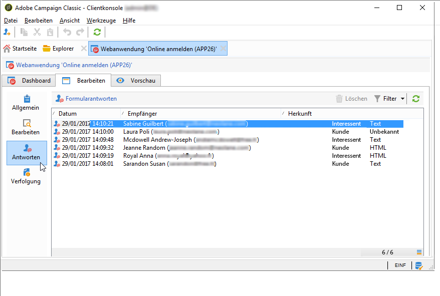

Durch Doppelklick auf eine Zeile öffnet sich das vom reagierenden Kontakt ausgefüllte Umfrageformular. Sie können die gesamte Umfrage durchsuchen, auf die vollständigen Antworten zugreifen und diese in eine externe Datei exportieren. Weitere Informationen finden Sie unter [Antworten exportieren](#exporting-answers).

Die Herkunft wird in der Umfrage-URL durch Hinzufügen folgender Buchstaben gekennzeichnet:

```
?origin=xxx
```

Während der Bearbeitung der Umfrage enthält die URL den Parameter **[!UICONTROL __uuid]**, der darauf hinweist, dass sich die Umfrage in einer Testphase befindet und noch nicht online ist. Wenn Sie auf die Umfrage über diese URL zugreifen, werden die erzeugten Einträge beim Tracking (in Berichten) nicht berücksichtigt. Für die Herkunft wird der Wert **[!UICONTROL Adobe Campaign]** übernommen.

Weiterführende Informationen zu URL-Parametern finden Sie auf [dieser Seite](../../web/using/defining-web-forms-properties.md#form-url-parameters).

### Berichte zu Umfragen {#reports-on-surveys}

Der Zugriff auf Umfrageberichte erfolgt über das Dashboard-Tab. Klicken Sie einfach auf einen Namen, um den entsprechenden Bericht anzuzeigen.

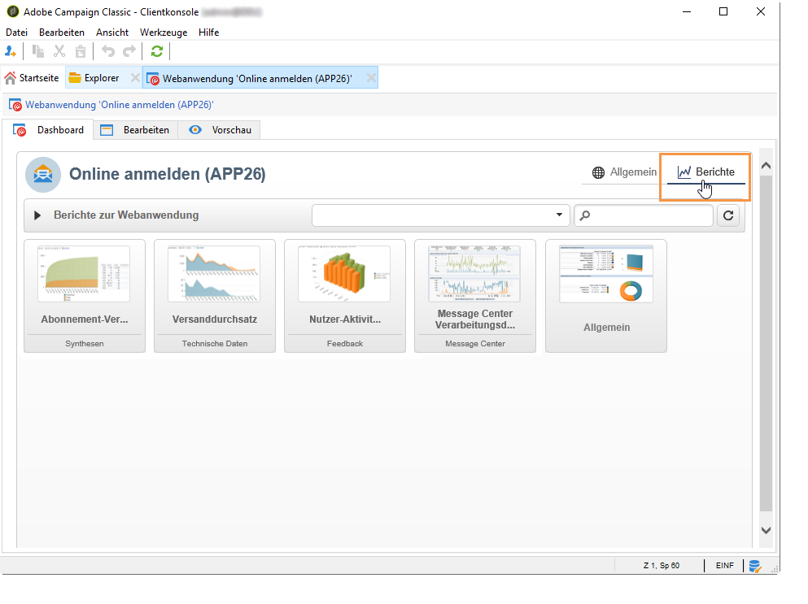

Im Bericht **[!UICONTROL Dokumentation]** wird die Struktur der Umfrage dargestellt.

Im Tab **[!UICONTROL Berichte]** sind zwei weitere Berichte zu Webumfragen verfügbar: **[!UICONTROL Allgemein]** und **[!UICONTROL Antwortenverteilung]**.

* Allgemein

  Dieser Bericht enthält allgemeine Informationen zur Umfrage: die Veränderung der Anzahl der Antworten im Zeitverlauf und die Verteilung nach Herkunft und Sprache.

  Beispiel für einen allgemeinen Bericht:

  

* Antwortenverteilung

  Dieser Bericht zeigt die Antwortenverteilung für jede Frage. Diese Verteilung ist nur für Antworten auf Felder verfügbar, die in Containern vom Typ **[!UICONTROL Frage]** gespeichert sind. Sie gilt nur für Auswahldialoge (beispielsweise keine Aufschlüsselung für Textfelder).

  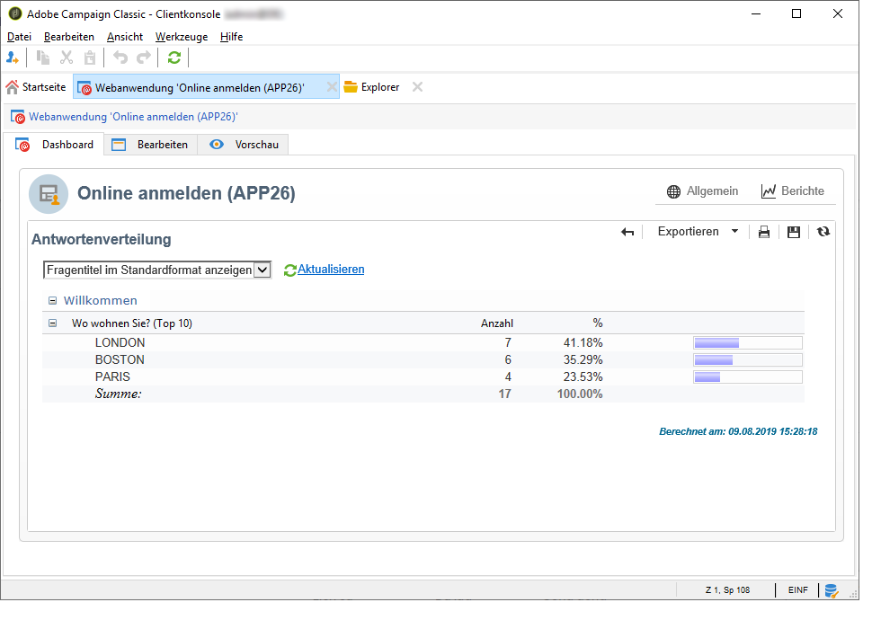

## Antworten exportieren {#exporting-answers}

Antworten auf Umfragen können zur späteren Verarbeitung in eine externe Datei exportiert werden. Dazu gibt es zwei Möglichkeiten:

1. Berichtsdaten exportieren

   Um Berichtsdaten zu exportieren, wählen Sie die Schaltfläche **[!UICONTROL Exportieren]** und danach das Exportformat aus.

   Weiterführende Informationen zum Exportieren von Berichtdaten finden Sie in [diesem Abschnitt](../../reporting/using/about-reports-creation-in-campaign.md).

1. Antworten exportieren

   Um Antworten zu exportieren, wählen Sie in der Umfrage die Registerkarte **[!UICONTROL Antworten]** aus und rechtsklicken Sie darauf. Wählen Sie dann **[!UICONTROL Exportieren...]** aus.

   

   Geben Sie anschließend die Informationen ein, die Sie exportieren möchten, sowie die Speicherdatei.

   Sie können den Inhalt und das Format der Ausgabedatei im Export-Assistenten konfigurieren.

   Sie können beispielsweise:

   * Spalten zur Ausgabedatei hinzufügen und Informationen über den Empfänger abrufen (die in der Datenbank gespeichert sind);
   * die exportierte Datei formatieren;
   * das Codierungsformat für die Daten in der Datei auswählen.

   Wenn die zu exportierende Umfrage mehrere Felder mit **[!UICONTROL mehrzeiligem Text]** oder **[!UICONTROL HTML-Text]** enthält, muss sie im **[!UICONTROL XML]**-Format exportiert werden. Wählen Sie dazu dieses Format aus der Dropdown-Liste im Feld **[!UICONTROL Ausgabeformat]** wie unten dargestellt aus:

   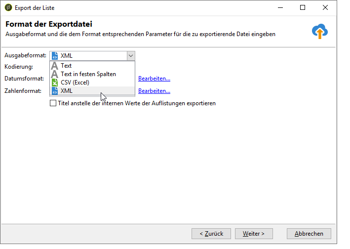

   Klicken Sie auf **[!UICONTROL Starten]**, um mit dem Export zu beginnen.

   >[!NOTE]
   >
   >Der Datenexport und die Konfigurationsschritte werden in [diesem Abschnitt](../../platform/using/about-generic-imports-exports.md) beschrieben.

## Die erfassten Daten nutzen {#using-the-collected-data}

Die durch Online-Umfragen gesammelten Daten können im Rahmen eines Zielgruppen-Workflows abgerufen werden. Verwenden Sie zu diesem Zweck die Box **[!UICONTROL Umfrageantworten]**.

Im folgenden Beispiel soll den fünf Empfängern, die bei einer Online-Umfrage die höchste Punktzahl hatten und mindestens zwei Kinder haben, ein Webangebot gemacht werden. Die Antworten auf die Umfrage lauteten:


Im Zielgruppen-Workflow werden die **[!UICONTROL Umfrageantworten]** folgendermaßen konfiguriert:

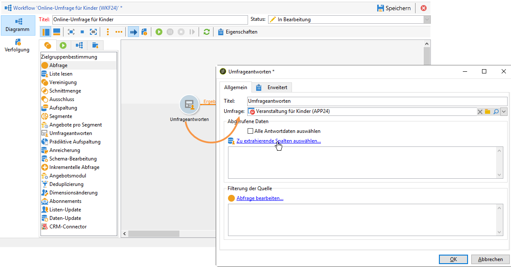

Wählen Sie zuerst die entsprechende Umfrage und dann in der Mitte des Fensters die zu extrahierenden Daten aus. In diesem Fall muss zumindest die Punktzahl-Spalte extrahiert werden, da sie in der Aufspaltungsbox zum Abrufen der fünf höchsten Punkte verwendet wird.

Geben Sie die Filterbedingungen für Antworten ein, indem Sie den Link **[!UICONTROL Abfrage bearbeiten...]** auswählen.

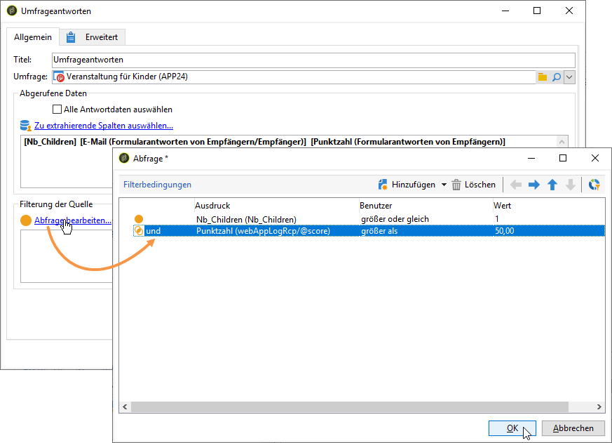

Starten Sie den Zielgruppen-Workflow. Bei der Abfrage werden acht Empfänger abgerufen.

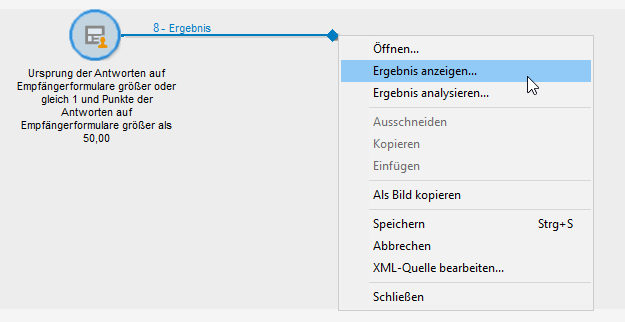

Um sie anzuzeigen, rechtsklicken Sie auf die ausgehende Transition der Sammlungsbox.


Platzieren Sie dann eine Aufspaltungsbox in den Workflow, um die fünf Empfänger mit den meisten Punkten abzurufen.

Bearbeiten Sie die Aufspaltungsbox, um sie zu konfigurieren:

* Wählen Sie zunächst im Tab **[!UICONTROL Allgemein]** das entsprechende Schema aus und konfigurieren Sie dann die Untereinheit:

  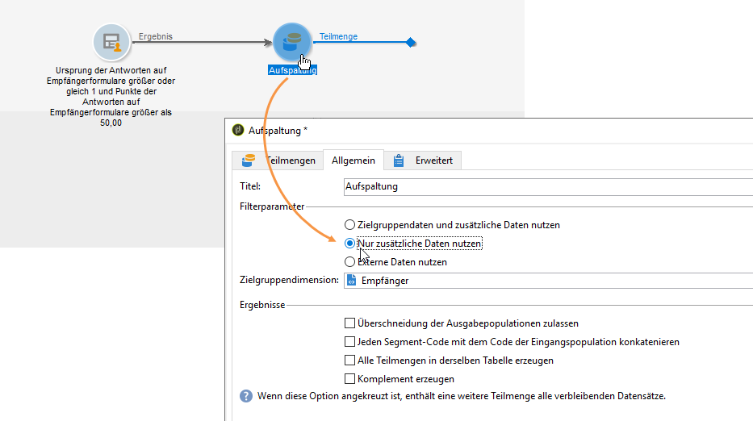

* Gehen Sie zum Tab **[!UICONTROL Teilmengen]** und wählen Sie die Option **[!UICONTROL Anzahl von Datensätzen begrenzen]** und danach den Link **[!UICONTROL Bearbeiten...]** aus.

  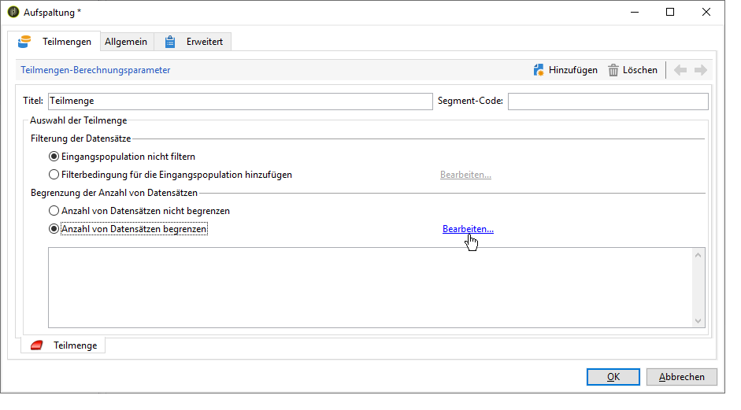

* Wählen Sie die Option **[!UICONTROL Die ersten aus einer Sortierung hervorgehenden Elemente beibehalten]** und dann die Spalte, nach der sortiert werden soll, aus. Aktivieren Sie die Option **[!UICONTROL Absteigende Sortierung]**.

  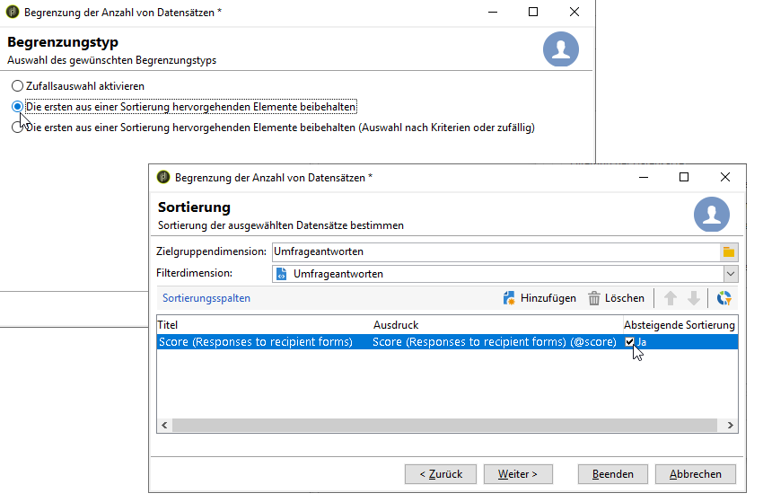

* Wählen Sie die Schaltfläche **[!UICONTROL Weiter]** aus und beschränken Sie die Anzahl der Datensätze auf fünf.

  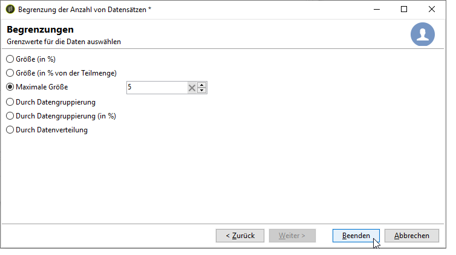

* Wählen Sie **[!UICONTROL Beenden]** aus und starten Sie dann den Workflow neu, um die Zielgruppe zu validieren.

## Daten vereinheitlichen {#standardizing-data}

Sie können in Adobe Campaign für gesammelte Daten Vereinheitlichungsprozesse mithilfe von Alias einrichten. Damit können Sie die in der Datenbank gespeicherten Daten vereinheitlichen. Definieren Sie dazu Alias in den Auflistungen, die die entsprechenden Informationen enthalten. [Weitere Informationen](../../platform/using/managing-enumerations.md#about-enumerations)
